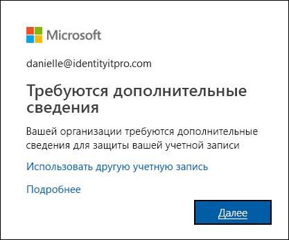

# Обзор настройки методов двухфакторной проверки подлинности

Итак, ваша организация включила двухфакторную проверку подлинности, и теперь для входа в рабочую или учебную учетную запись нужно использовать одновременно имя пользователя, пароль, мобильное устройство или телефон. Дополнительная проверка обеспечивает более высокий уровень защиты, чем просто пароль, так как опирается на две формы проверки подлинности: то, что вы знаете, и то, что у вас есть. Двухфакторная проверка помогает предотвратить входы злоумышленников от вашего имени. Даже если они получат ваш пароль, им потребуется еще и ваше мобильное устройство.

>[!Important]
>Эти материалы предназначены для пользователей. Администраторы могут найти дополнительные сведения о том, как настроить и контролировать среду Azure Active Directory (Azure AD), в [документации по Azure Active Directory](https://docs.microsoft.com/azure/active-directory).

## Кто решает, будете ли вы использовать эту функцию

В зависимости от типа учетной записи решение о необходимости использования двухфакторной проверки подлинности может принять организация или вы сами.

- **Рабочую или учебную учетную запись.** Если вы используете рабочую или учебную учетную запись (например, alain@contoso.com), организация должна решить, нужно ли вам проходить двухфакторную проверку подлинности наряду с конкретными методами проверки. Если решение об использовании этой функции принято на уровне организации, у вас нет возможности индивидуально отключить ее.

- **Личная учетная запись Майкрософт.** Вы можете настроить двухфакторную проверку подлинности для личных учетных записей Майкрософт (например, alain@outlook.com). Если у вас возникли проблемы с двухфакторной проверкой подлинности и личной учетной записью Майкрософт, воспользуйтесь статьей [Включение или отключение двухфакторной проверки для учетной записи Майкрософт](https://support.microsoft.com/help/4028586/microsoft-account-turning-two-step-verification-on-or-off). В этом сценарии вы сами решили использовать эту функцию, и можете включать и выключать ее в любой момент.

## Доступ к странице "Дополнительная проверка безопасности"

Когда организация включит и настроит двухфакторную проверку подлинности, вы получите извещение о необходимости предоставить дополнительную информацию для защиты учетной записи.

### Доступ к странице "Дополнительная проверка безопасности"

1. Щелкните **Далее** в приглашении **Требуются дополнительные сведения**

    Откроется страница **Дополнительная проверка безопасности**.

2. На странице **Дополнительная проверка безопасности** нужно выбрать метод двухфакторной проверки подлинности, который вы будете использовать для подтверждения своей личности при входе в рабочую или учебную учетную запись. Можно выбрать:

    | Способ связи | ОПИСАНИЕ |
    | --- | --- |
    | Мобильное приложение | <ul><li>**Получение уведомлений для проверки подлинности.** При выборе этого способа в приложение для проверки подлинности на смартфоне или планшете будет отправляться push-уведомление. Нужно просмотреть уведомление и подтвердить намерение войти в свою учетную запись, нажав в приложении кнопку **Проверить подлинность**. В вашей организации или учебном заведении может быть предусмотрен ввод ПИН-кода для проверки подлинности.</li><li>**Использование кода проверки.** В этом режиме приложение для проверки подлинности создает код проверки, который обновляется каждые 30 секунд. Введите самый свежий код проверки в интерфейсе входа. Приложение Microsoft Authenticator доступно для [Android](https://go.microsoft.com/fwlink/?linkid=866594) и [iOS](https://go.microsoft.com/fwlink/?linkid=866594).</li></ul> |
    | Телефон для аутентификации. | <ul><li>При выборе способа **Звонок по телефону** будет выполняться автоматический голосовой вызов по указанному номеру телефона. Для прохождения аутентификации нужно ответить на вызов и нажать кнопку "решетка" (#) на клавиатуре телефона.</li><li>При выборе способа **SMS-сообщение** на телефон будет отправляться текстовое сообщение с кодом проверки. Следуя указаниям в SMS-сообщении, нужно отправить ответ на это SMS-сообщение или ввести указанный код проверки в интерфейсе входа.</li></ul> |
    | Рабочий телефон | По указанному номеру телефона осуществляется автоматический голосовой вызов. Для прохождения аутентификации нужно ответить на вызов и нажать кнопку "решетка" (#) на клавиатуре телефона. |

## Дополнительная информация

Открыв страницу **Дополнительная проверка безопасности**, выберите и настройте метод двухфакторной проверки подлинности.

- [Set up a mobile device as your two-factor verification method](multi-factor-authentication-setup-phone-number.md) (Настройка мобильного устройства в качестве метода проверки)

- [Set up an office phone as your two-factor verification method](multi-factor-authentication-setup-office-phone.md) (Настройка офисного телефона в качестве метода проверки)

- [Set up an authenticator app as your two-factor verification method](multi-factor-authentication-setup-auth-app.md) (Настройка приложения Authenticator в качестве метода проверки)

## Связанные ресурсы

- [Управление параметрами метода двухфакторной проверки подлинности](multi-factor-authentication-end-user-manage-settings.md)

- [Управление паролями приложений](multi-factor-authentication-end-user-app-passwords.md)

- [Варианты входа с помощью Многофакторной идентификации Azure](multi-factor-authentication-end-user-signin.md)

- [Устранение распространенных проблем с двухфакторной проверкой подлинности](multi-factor-authentication-end-user-troubleshoot.md) 
