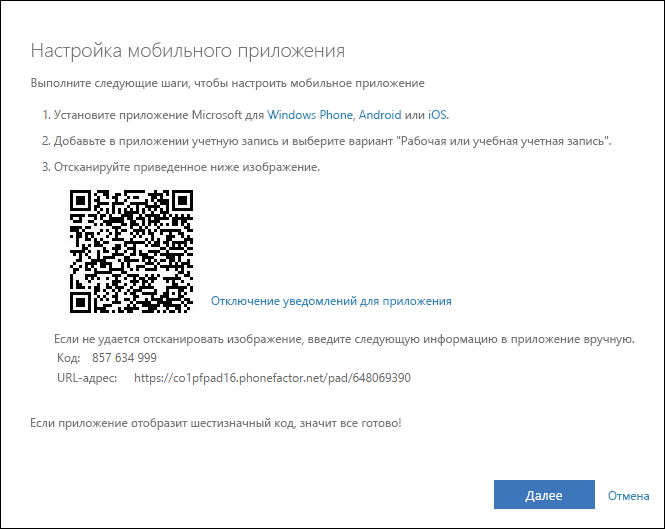
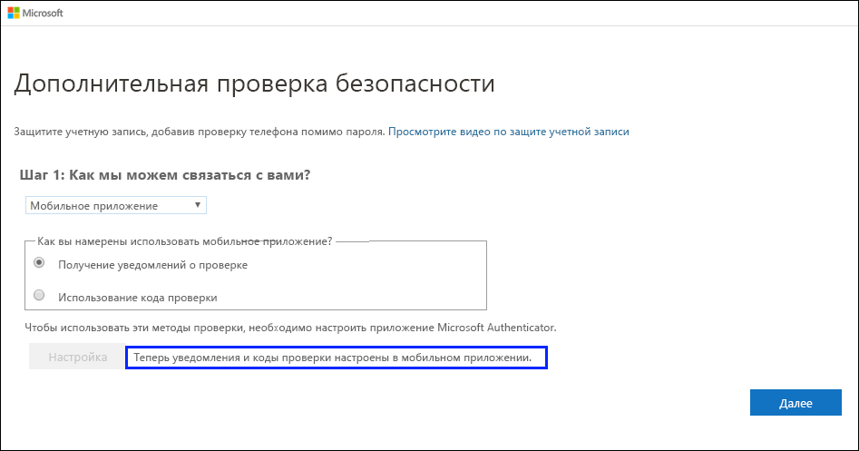
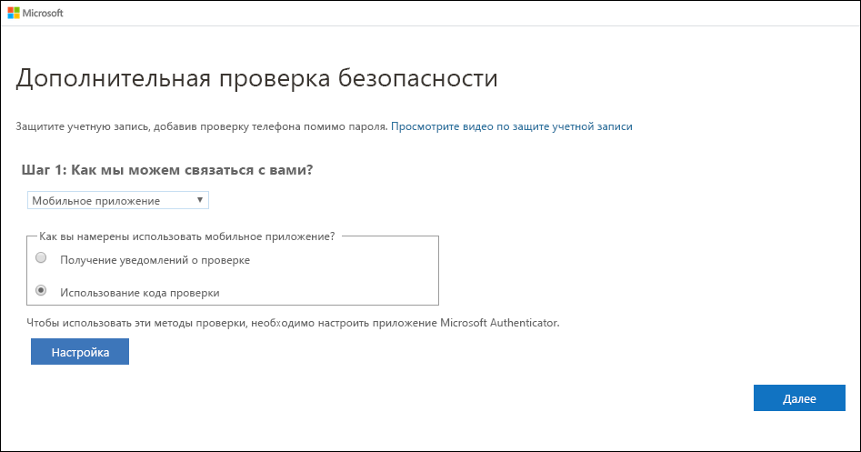
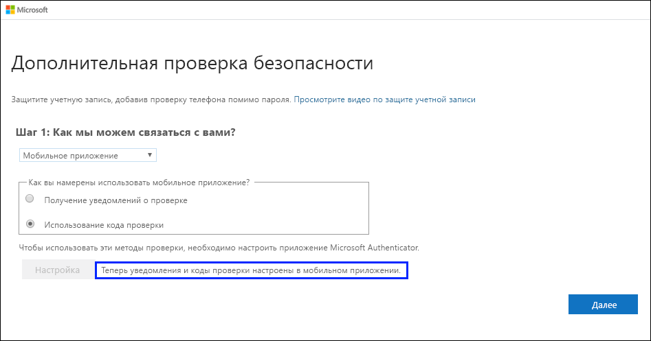
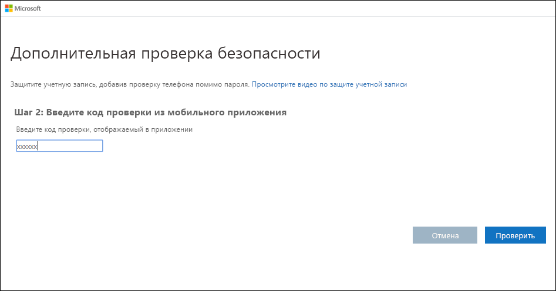

# Настройка приложения Microsoft Authenticator в качестве метода двухфакторной проверки подлинности

Вы можете настроить приложение Authenticator для отправки уведомлений на мобильное устройство или кода проверки в качестве метода проверки безопасности. Если приложение Microsoft Authenticator не требуется использовать, вы можете выбрать другое приложение во время настройки. Однако в рамках этой статьи используется приложение Microsoft Authenticator.

>[!Important]
>Но для добавления такой учетной записи необходимо скачать и установить приложение Microsoft Authenticator. Если вы еще не сделали этого, выполните шаги, описанные в статье [Начало работы с приложением Microsoft Authenticator](user-help-auth-app-download-install.md).

>[!Note]
> Если параметр "Мобильное приложение" неактивен, возможно, ваша организация не позволяет использовать это приложение для проверки подлинности. Если это так, вам нужно выбрать другой метод или обратиться за помощью к администратору.

## Настройка приложения Microsoft Authenticator для отправки уведомлений

1. На странице **Дополнительная проверка безопасности** выберите **Мобильное приложение** в области **Шаг 1. Как с вами связаться?** .

2. Выберите **Получить уведомления для проверки** в области **Как вы хотите использовать мобильное приложение?** , а затем нажмите кнопку **Настроить**.

    

    Появится страница **Настроить мобильное приложение**.

    

3. Откройте приложение Microsoft Authenticator, выберите **Добавить учетную запись** в меню значка **Customize and control** (Настройка и управление) в правом верхнем углу, а затем выберите **Рабочая или учебная учетная запись**.

    >[!Note]
    >Если вы настраиваете приложение Microsoft Authenticator впервые, вы можете получить запрос на разрешение приложению получить доступ к камере (iOS) или разрешить приложению делать снимки и записывать видео (Android). Необходимо выбрать параметр **Разрешить**, чтобы приложение Authenticator могло получить доступ к камере для получения изображения QR-кода на следующем шаге. Если вы не разрешите использование камеры, вы все равно сможете настроить Приложение Authenticator, однако вам нужно будет добавить информацию о коде вручную. Сведения о том, как добавить код вручную, см. в разделе [Добавление учетной записи в приложение вручную](user-help-auth-app-add-account-manual.md).

4. С помощью камеры телефона отсканируйте QR-код с экрана компьютера в разделе **Настроить мобильное приложение**, а затем выберите **Далее**.

5. На странице **Дополнительная проверка безопасности** на компьютере убедитесь, что вы получили сообщение о том, что конфигурация прошла успешно, а затем нажмите кнопку **Далее**.

    

    Приложение Authenticator отправляет уведомление на ваше мобильное устройство в качестве теста.

6. На мобильном устройстве выберите **Утвердить**.

7. На компьютере добавьте номер мобильного телефона в области **Шаг 3. Если вы потеряли доступ к мобильному приложению**, а затем нажмите кнопку **Далее**.

    Мы настоятельно рекомендуем добавить номер мобильного телефона в качестве запасного варианта, если вы не сможете получить доступ или использовать мобильное приложение по какой-либо причине.

8. В области **Шаг 4. Продолжайте использовать имеющиеся приложения** скопируйте предоставленный пароль приложения и сохраните его в безопасном месте.

    

    >[!Note]
    >Сведения о том, как использовать пароль приложения с более старыми приложениями, см. в статье [Управление паролями приложения для двухфакторной проверки подлинности](multi-factor-authentication-end-user-app-passwords.md). Пароли приложений требуются только в том случае, если вы продолжаете использовать старые приложения, которые не поддерживают двухфакторную проверку подлинности.

9. Нажмите кнопку **Готово**.

## Настройка приложения Microsoft Authenticator для использования кодов проверки

1. На странице **Дополнительная проверка безопасности** выберите **Мобильное приложение** в области **Шаг 1. Как с вами связаться?** .

2. Выберите **Использовать код проверки** в области **Как вы хотите использовать мобильное приложение?** , а затем нажмите кнопку **Настроить**.

    

    Появится страница **Настроить мобильное приложение**.

    

3. Откройте приложение Microsoft Authenticator, выберите **Добавить учетную запись** в меню значка **Customize and control** (Настройка и управление) в правом верхнем углу, а затем выберите **Рабочая или учебная учетная запись**.

    >[!Note]
    >Если вы настраиваете приложение Microsoft Authenticator впервые, вы можете получить запрос на разрешение приложению получить доступ к камере (iOS) или разрешить приложению делать снимки и записывать видео (Android). Необходимо выбрать параметр **Разрешить**, чтобы приложение Authenticator могло получить доступ к камере для получения изображения QR-кода на следующем шаге. Если вы не разрешите использование камеры, вы все равно сможете настроить Приложение Authenticator, однако вам нужно будет добавить информацию о коде вручную. Сведения о том, как добавить код вручную, см. в разделе [Добавление учетной записи в приложение вручную](user-help-auth-app-add-account-manual.md).

4. С помощью камеры телефона отсканируйте QR-код с экрана компьютера в разделе **Настроить мобильное приложение**, а затем выберите **Далее**.

5. На странице **Дополнительная проверка безопасности** на компьютере убедитесь, что вы получили сообщение о том, что конфигурация прошла успешно, а затем нажмите кнопку **Далее**.

    

    Приложение Authenticator запросит код проверки в качестве теста.

6. В приложении Microsoft Authenticator прокрутите вниз до рабочей или учебной учетной записи, скопируйте и вставьте шестизначный код из приложения в поле компьютера **Шаг 2. Введите код проверки из мобильного приложения**, а затем нажмите кнопку **Подтвердить**.

    

7. На компьютере добавьте номер мобильного телефона в области **Шаг 3. Если вы потеряли доступ к мобильному приложению**, а затем нажмите кнопку **Далее**.

    Мы настоятельно рекомендуем добавить номер мобильного телефона в качестве запасного варианта, если вы не сможете получить доступ или использовать мобильное приложение по какой-либо причине.

8. В области **Шаг 4. Продолжайте использовать имеющиеся приложения** скопируйте предоставленный пароль приложения и сохраните его в безопасном месте.

    

    >[!Note]
    >Сведения о том, как использовать пароль приложения с более старыми приложениями, см. в статье [Управление паролями приложения для двухфакторной проверки подлинности](multi-factor-authentication-end-user-app-passwords.md). Пароли приложений требуются только в том случае, если вы продолжаете использовать старые приложения, которые не поддерживают двухфакторную проверку подлинности.

9. Нажмите кнопку **Готово**.

## Дополнительная информация

После настройки метода двухфакторной проверки подлинности можно добавить дополнительные методы, управлять параметрами и паролями приложений, входить в систему или получить справку по некоторым распространенным проблемам, связанным с двухфакторной проверкой подлинности.

- [Управление параметрами метода двухфакторной проверки подлинности](multi-factor-authentication-end-user-manage-settings.md)

- [Управление паролями приложений](multi-factor-authentication-end-user-app-passwords.md)

- [Варианты входа с помощью Многофакторной идентификации Azure](multi-factor-authentication-end-user-signin.md)

- [Получить справку о двухфакторной проверке](multi-factor-authentication-end-user-troubleshoot.md)
