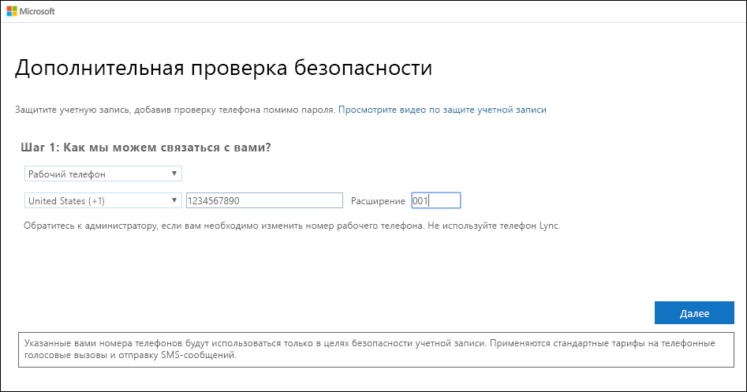
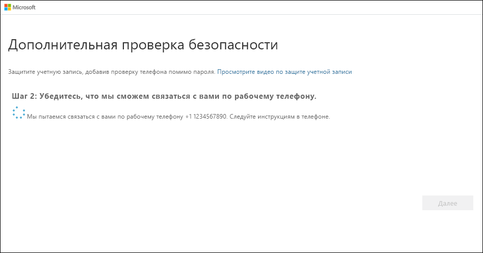

# Настройка рабочего телефона в качестве метода двухфакторной проверки подлинности

Вы можете настроить рабочий телефон для использования в качестве метода двухфакторной проверки подлинности.

>[!Note]
> Если параметр "Рабочий телефон" неактивен, возможно, ваша организация не позволяет использовать номер рабочего телефона для проверки. Если это так, вам нужно выбрать другой метод или обратиться за помощью к администратору.

## Настройка номера рабочего телефона в качестве метода проверки подлинности

1. На странице **Дополнительная проверка безопасности** выберите **Рабочий телефон** в области **Шаг 1. Как с вами связаться?** , выберите страну или регион в раскрывающемся списке, введите номер рабочего телефона, а затем введите дополнительный код (при наличии).

    

2. Вы получите телефонный звонок от корпорации Майкрософт. Вам нужно будет подтвердить свою личность с помощью знака решетки (#) на рабочем телефоне.

    

3. В области **Шаг 3. Продолжайте использовать имеющиеся приложения** скопируйте предоставленный пароль приложения и сохраните его в безопасном месте.

    

    >[!Note]
    >Сведения о том, как использовать пароль приложения с более старыми приложениями, см. в статье [Управление паролями приложения для двухфакторной проверки подлинности](multi-factor-authentication-end-user-app-passwords.md). Пароли приложений требуются только в том случае, если вы продолжаете использовать старые приложения, которые не поддерживают двухфакторную проверку подлинности.

4. Нажмите кнопку **Готово**.

## Дальнейшие действия

После настройки метода двухфакторной проверки подлинности можно добавить дополнительные методы, управлять параметрами и паролями приложений, входить в систему или получить справку по некоторым распространенным проблемам, связанным с двухфакторной проверкой подлинности.

- [Управление параметрами метода двухфакторной проверки подлинности](multi-factor-authentication-end-user-manage-settings.md)

- [Управление паролями приложений](multi-factor-authentication-end-user-app-passwords.md)

- [Варианты входа с помощью Многофакторной идентификации Azure](multi-factor-authentication-end-user-signin.md)

- [Устранение распространенных проблем с двухфакторной проверкой подлинности](multi-factor-authentication-end-user-troubleshoot.md)
