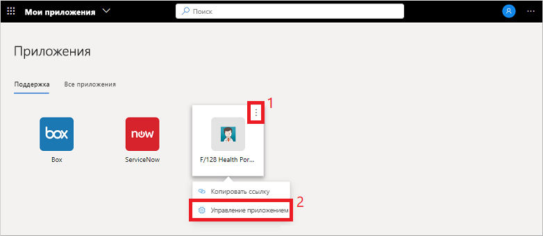
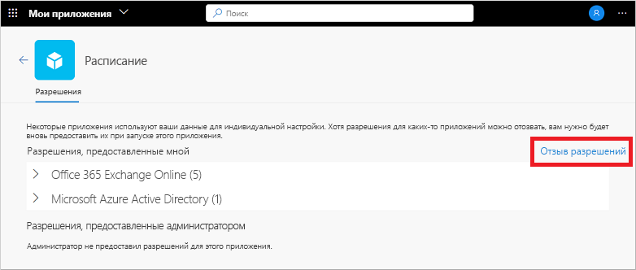

# Изменение или отмена разрешений приложения на портале "Мои приложения"

При использовании приложений организации на портале **Мои приложения** вы часто предоставляете разрешения и сохраняете информацию об учетной записи. Чтобы обеспечить безопасность данных, может потребоваться проверить и отозвать определенные разрешения или удалить сохраненные учетные данные. Удаление разрешений или учетных записей может привести к нарушению работы некоторых функций приложений. Если после удаления разрешений или учетных записей возникли проблемы, обратитесь в службу поддержки своей организации за дополнительной помощью.

[!INCLUDE [preview-notice](../../../includes/active-directory-end-user-my-apps-and-workspaces.md)]

>[!Important]
>Эти материалы предназначены для пользователей. Администраторы могут найти дополнительные сведения о настройке облачных приложений и управлении ими в [документации по управлению приложениями](../manage-apps/access-panel-collections.md).

## Управление разрешениями приложения

Чтобы просмотреть разрешения, предоставленные вами или администратором, наведите указатель мыши на приложение на портале **Мои приложения**, выберите **…** , а затем выберите **Управление приложением**.

В верхней части окна "Разрешения" отображается информация о том, какие разрешения предоставили вы лично. К примерам разрешений приложений относятся возможности доступа к календарю, контактам или камере.

Вы можете отменить любые предоставленные вами разрешения, выбрав **Отзыв разрешений**, однако удаление разрешения может нарушить функциональные возможности некоторых приложений. Если после удаления разрешений или учетных записей возникли проблемы, обратитесь в службу поддержки своей организации за дополнительной помощью.

В нижней части окна "Разрешения" показаны разрешения, которые администратор предоставил от вашего имени. Этот раздел не отображается при отсутствии разрешений, предоставленных с согласия администратора. Вы не можете отменить эти разрешения, так как они были предоставлены администратором и часто требуются для политики организации.

## Дальнейшие действия

После управления разрешениями приложений и сохраненными учетными записями на портале **Мои приложения** можно сделать следующее.

- упорядочить свои приложения по различным категориям, созданным и предоставленным вашей организацией. См. дополнительные сведения о [получении доступа к коллекциям и их использовании на портале "Мои приложения"](my-applications-portal-workspaces.md).

## Связанные статьи

- [Обновление данных профиля и учетной записи](my-account-portal-overview.md). Инструкции по обновлению личных сведений, отображаемых на портале **Мой профиль**.

- [Управление организациями](my-account-portal-organizations-page.md). Инструкции по тому, как просматривать сведения об организациях на странице **Организации** на портале **Мой профиль** и управлять ими.

- [Управление подключенными устройствами](my-account-portal-devices-page.md). Инструкции по тому, как управлять своими подключенными устройствами с помощью рабочей или учебной учетной записи на странице **Устройства** портала **Мой профиль**.