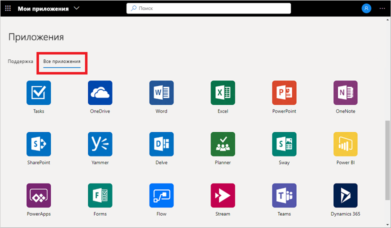
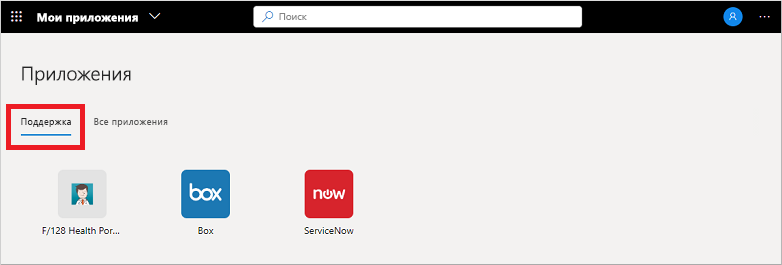

# Обращение к рабочим областям и их использование на портале "Мои приложения" (предварительная версия)

Рабочие области — это различные представления приложений, отображаемые на портале **Мои приложения** (предварительная версия). Например, приложения могут быть сгруппированы в рабочие области по функциям отделов или ролям пользователей. Если вы не видите доступных рабочих областей или категорий, это означает, что администратор их не настроил или не предоставил вам доступ. Обратитесь в службу технической поддержки своей организации, чтобы получить дополнительную помощь или разрешения на просмотр общих рабочих областей.

[!INCLUDE [preview-notice](../../../includes/active-directory-end-user-my-apps-and-workspaces.md)]

>[!Important]
>Эти материалы предназначены для пользователей. Администраторы могут найти дополнительные сведения о настройке облачных приложений и управлении ими в [документации по управлению приложениями](https://docs.microsoft.com/azure/active-directory/manage-apps/access-panel-workspaces).

## Обращение к приложениям с помощью рабочих областей

Список рабочих областей на портале **Мои приложения** по умолчанию содержит рабочую область **Все приложения**, включающую в себя все приложения, к которым у вас есть доступ.

Любая другая рабочая область в этом списке была создана администратором и предоставлена вам. Можно выбрать одну из этих рабочих областей, чтобы просмотреть более узкий набор приложений. Ниже приведен пример рабочей области *Support*.

При выборе и просмотре рабочей области отображаются только приложения по умолчанию, к которым у вас есть доступ.

## Дополнительная информация

После упорядочивания приложений по различным категориям на портале **Мои приложения** можно:

- проверить, обновить или отменить разрешения, предоставленные приложениям. Дополнительные сведения см. в разделе [Изменение или отмена разрешений приложения на портале "Мои приложения" (предварительная версия)](my-applications-portal-permissions-saved-accounts.md).

## Связанные статьи

- [Обновление данных профиля и учетной записи](my-account-portal-overview.md). Инструкции по тому, как обновить личные сведения, отображаемые на портале **Мой профиль** (предварительная версия).

- [Управление организациями](my-account-portal-organizations-page.md). Инструкции по тому, как просматривать сведения об организациях на странице **Организации** на портале **Мой профиль** и управлять ими.

- [Управление подключенными устройствами](my-account-portal-devices-page.md). Инструкции по тому, как управлять своими подключенными устройствами с помощью рабочей или учебной учетной записи на странице **Устройства** портала **Мой профиль**.