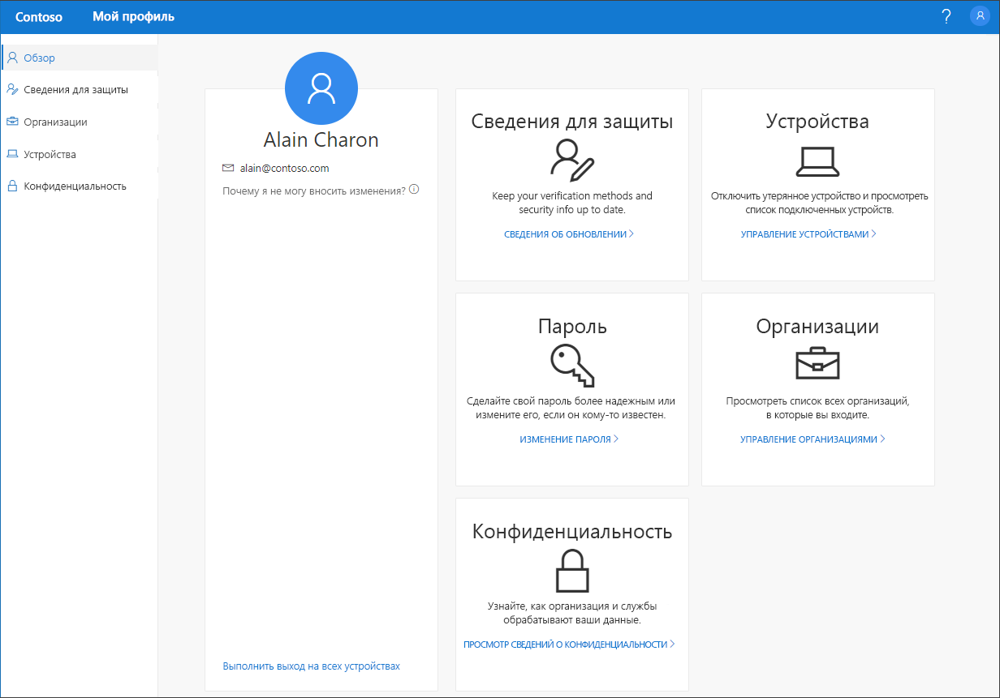

# Общие сведения о предварительной версии портала "Мой профиль"

[!INCLUDE [preview-notice](../../../includes/active-directory-end-user-preview-notice-myprofile.md)]

С помощью предварительной версии портала **Мой профиль** вы можете управлять рабочей или учебной учетной записью, чтобы выполнять такие задачи:

- Ввод сведений для защиты, используемых при двухфакторной проверки подлинности и сбросе пароля, и управление ими.

- Управление подключенными устройствами и организациями.

- Просмотр сведений о том, как организация использует ваши данные.

>[!Important]
>Эти материалы предназначены для пользователей. Администраторы могут найти дополнительные сведения о том, как настроить и контролировать среду Azure Active Directory (Azure AD), в [документации по Azure Active Directory](https://docs.microsoft.com/azure/active-directory).

## Доступ к порталу "Мой профиль"
Вы можете перейти на портал **Мой профиль** по ссылке https://myprofile.microsoft.com. Для этого используйте текущую версию любого из следующих браузеров:

- Chrome
- Microsoft Edge
- Safari
- Firefox
- Internet Explorer 11;

    

## В этом разделе
Дополнительные сведения о портале **Мой профиль** и его страницах см. в следующих статьях.

|Статья |ОПИСАНИЕ |
|------|------------|
|[Управление сведениями для защиты (предварительная версия)](user-help-security-info-overview.md)|В этой статье описывается, как указать сведения для защиты и управлять ими.|
|[Управление организациями](myprofile-portal-organizations-page.md)|В этой статье описывается управление организациями, подключенными к вашей рабочей или учебной учетной записи.|
|[Управление подключенными устройствами](myprofile-portal-devices-page.md)| В этой статье описывается управление устройствами, подключенными к вашей рабочей или учебной учетной записи.|
|[Просмотр сведений, связанных с конфиденциальностью](myprofile-portal-privacy-page.md)|В этой статье описывается, как посмотреть, что ваша организация делает с вашими данными.|