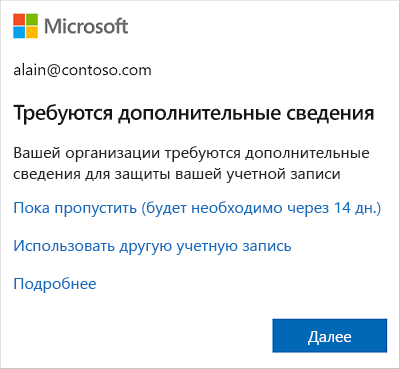
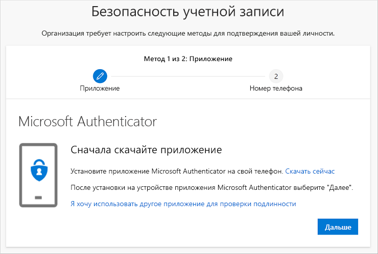
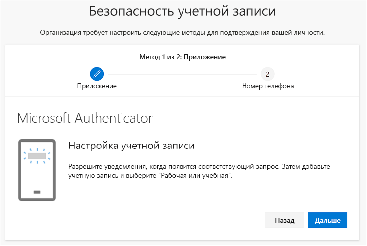
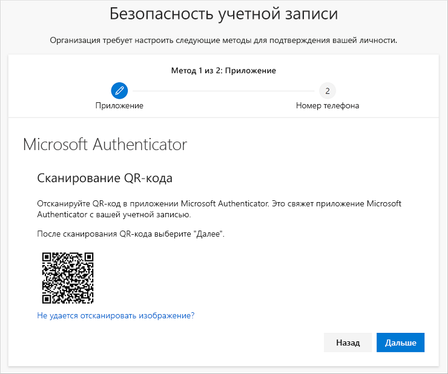
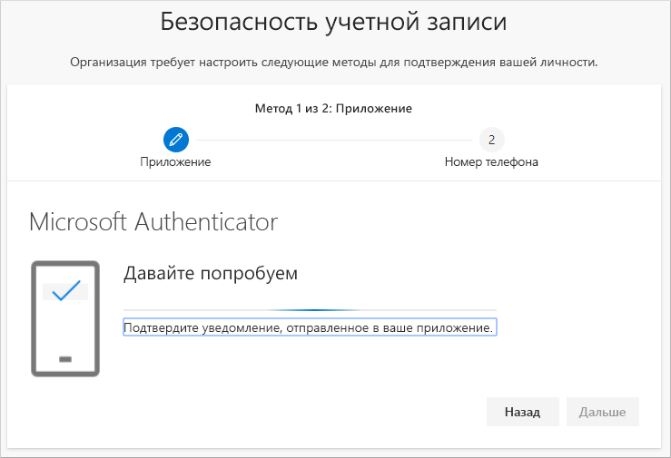
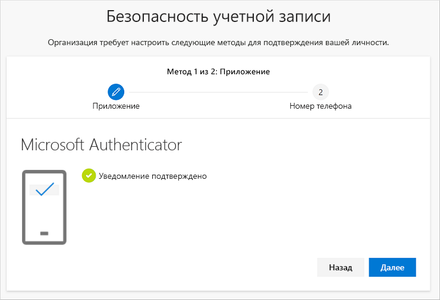
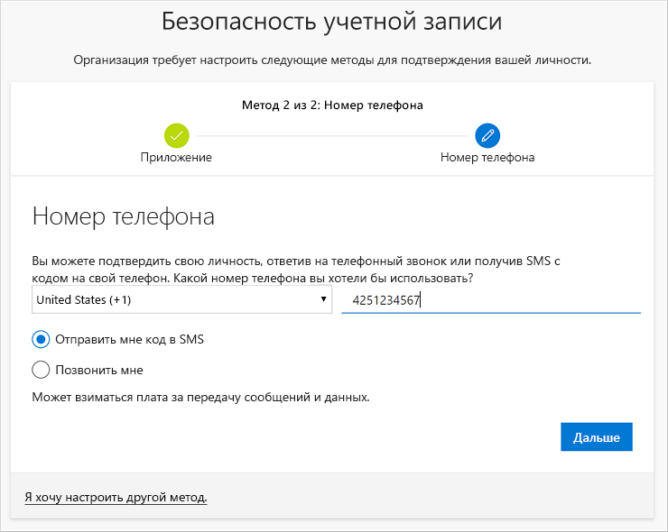
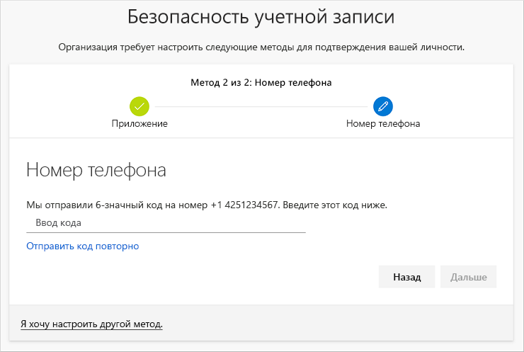
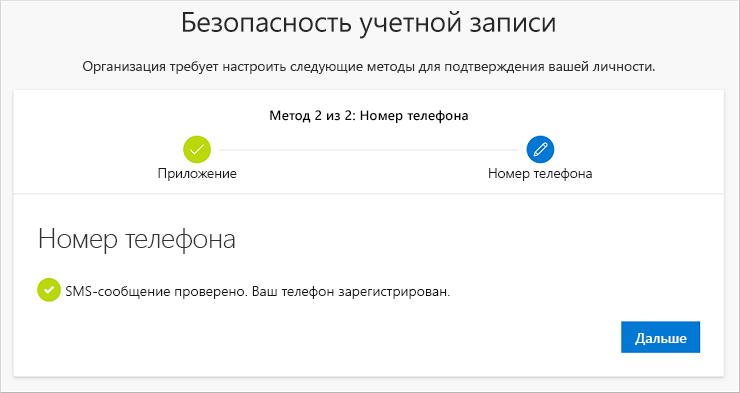
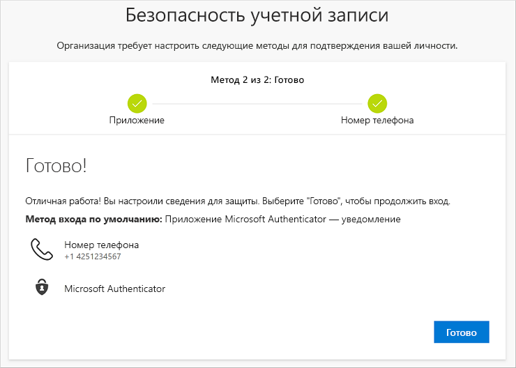

# Настройка сведений для защиты (предварительная версия) в приглашении на странице входа
Вы можете выполнить следующие действия при получении приглашения настроить сведения для защиты сразу после входа в рабочую или учебную учетную запись.

Это приглашение появится, только если вы еще не настроили сведения для защиты, требуемые вашей организации. Если вы настроили сведения для защиты, но хотите внести изменения, то можете выполнить действия, описанные в различных руководствах, основанных на методах. Дополнительные сведения см. в статье о [добавлении или обновлении сведений для защиты](security-info-add-update-methods-overview.md).

[!INCLUDE [preview-notice](../../../includes/active-directory-end-user-preview-notice-security-info.md)]

## Вход в рабочую или учебную учетную запись
После входа в рабочую или учебную учетную запись до получения к ней доступа вы увидите приглашение предоставить дополнительную информацию.

## Настройка сведений для защиты с помощью мастера
Выполните следующие действия, чтобы настроить сведения для защиты для рабочей или учебной учетной записи в приглашении.

>[!Important]
>Это только пример процесса. В зависимости от требований организации администратор может настроить различные методы проверки, которые необходимо настроить в ходе этого процесса. В этом примере нам требуются два метода: приложение Microsoft Authenticator и номер мобильного телефона для проверочных звонков или текстовых сообщений.

1. После нажатия в приглашении кнопки **Далее** появится **мастер безопасности учетной записи** с первым методом, который администратор и организация требуют настроить. В этом примере это приложение Microsoft Authenticator.

   > [!Note]
   > Если вы хотите использовать приложение для проверки подлинности, отличное от Microsoft Authenticator, щелкните ссылку **I want to use a different authenticator app** (Я хочу использовать другое приложение для проверки подлинности).
   > 
   > Если ваша организация позволяет выбрать другой метод помимо приложения для проверки подлинности, можете перейти по ссылке **I want to set up a different method link** (Я хочу установить другой метод).

    

2. Выберите **Скачать**, чтобы скачать и установить приложение Microsoft Authenticator на своем мобильном устройстве, а затем щелкните **Далее**. Дополнительные сведения о том, как скачать и установить приложение, см. в статье [Скачивание и установка приложения Microsoft Authenticator](user-help-auth-app-download-install.md).

    

3. Оставайтесь на странице **Настройка учетной записи**, пока устанавливаете приложение Microsoft Authenticator на своем мобильном устройстве.

4. Откройте приложение Microsoft Authenticator, разрешите уведомления (если предложено), выберите **Добавить учетную запись** в меню значка **Customize and control** (Настройка и управление) в правом верхнем углу, а затем выберите **Рабочая или учебная учетная запись**.

5. Вернитесь к странице **Настройка учетной записи** на компьютере, а затем нажмите кнопку **Далее**.

    Откроется страница **Сканирование QR-кода**.

    

6. Отсканируйте предоставленный код с помощью параметра для считывания QR-кодов приложения Microsoft Authenticator, которое появилось на вашем мобильном устройстве после создания рабочей или учебной учетной записи на шаге 5.

    Приложение для проверки подлинности должно успешно добавить вашу рабочую или учебную учетную запись, не требуя никакой дополнительной информации от вас. Однако, если средство считывания QR-кодов не может считать код, щелкните ссылку **Can't scan the QR code** (Невозможно сканировать QR-код) и вручную введите код и URL-адрес в приложение Microsoft Authenticator. Дополнительные сведения о ручном вводе кода см. в статье [Добавление учетной записи в приложение вручную](user-help-auth-app-add-account-manual.md).

7. Щелкните **Далее** на странице **Сканирование QR-кода** на своем компьютере.

    Уведомление отправляется в приложение Microsoft Authenticator на вашем мобильном устройстве, чтобы проверить вашу учетную запись.

    

8. Подтвердите уведомление в приложении Microsoft Authenticator, а затем щелкните **Далее**.

    .

    Сведения для защиты обновляются таким образом, чтобы при использовании двухфакторной проверки подлинности или сброса пароля проверка по умолчанию выполнялась с помощью приложения Microsoft Authenticator.

9. На странице настройки **Телефон** выберите способ проверки подлинности — текстовое сообщение или телефонный звонок, а затем щелкните **Далее**. В этом примере используются текстовые сообщения, поэтому нужно ввести номер телефона для устройств, которые могут принимать текстовые сообщения.

    

    Текстовое сообщение отправляется на ваш номер телефона. Если вы предпочитаете использовать телефонный звонок, процесс остается идентичным, но вместо текстового сообщения вы получите телефонный звонок, в котором будут содержаться инструкции.

10. Введите код, указанный в текстовом сообщении, отправленном на ваше мобильное устройство, а затем выберите **Далее**.

    

11. Просмотрите уведомление о выполнении, а затем щелкните **Готово**.

    

    Сведения для защиты обновятся, чтобы при двухфакторной проверке подлинности или сбросе пароля проверка выполнялась с помощью текстовых сообщений в качестве метода восстановления.

12. Просмотрите страницу **успешного выполнения**, чтобы убедиться, что вы успешно настроили приложение Microsoft Authenticator и метод проверки подлинности с помощью телефона (текстовое сообщение или телефонный звонок) для своих сведений для защиты, а затем щелкните **Готово**.

    

## Дополнительная информация

- Чтобы изменить, удалить или обновить методы по умолчанию сведений для защиты, ознакомьтесь со статями.

    - [Настройка использования приложения проверки подлинности в сведениях для защиты (предварительная версия)](security-info-setup-auth-app.md).

    - [Настройка использования обмена текстовыми сообщениями в сведениях для защиты (предварительная версия)](security-info-setup-text-msg.md).

    - [Настройка использования звонков в сведениях для защиты (предварительная версия)](security-info-setup-phone-number.md).

    - [Настройка сведений для защиты для использования электронной почты (предварительная версия)](security-info-setup-email.md).

    - [Настройка сведений для защиты для использования предварительно заданных контрольных вопросов (предварительная версия)](security-info-setup-questions.md).

- Дополнительную информацию о входе с помощью указанных методов см. в статье [Вход с помощью двухфакторной проверки подлинности или сведений для защиты](user-help-sign-in.md).

- Если вы забыли свой пароль, сбросьте его на [портале сброса пароля](https://passwordreset.microsoftonline.com/) или выполните действия, описанные в статье о [сбросе пароля рабочей или учебной учетной записи](user-help-reset-password.md).

- Советы по устранению неполадок и справку по проблемам со входом в систему см. в статье [Не удается войти в учетную запись Майкрософт](https://support.microsoft.com/help/12429/microsoft-account-sign-in-cant).