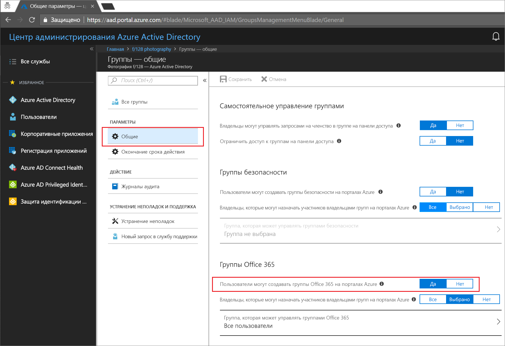
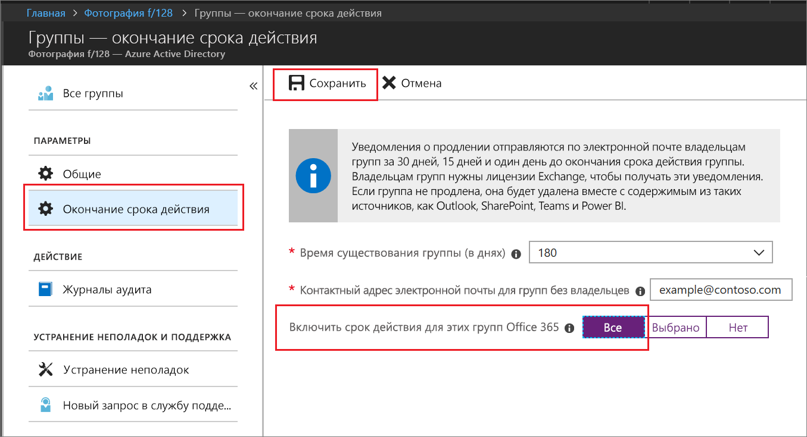

# Краткое руководство. Задание срока действия групп Office 365 в Azure Active Directory

В этом кратком руководстве описано, как задать политику срока действия групп Office 365. Если у пользователя есть возможность настройки собственных групп, количество неиспользуемых групп увеличивается. Первый способ управления неиспользуемыми группами — задание срока действия этих групп, чтобы сократить обслуживание при их удалении вручную.

Политика срока действия простая:

- Группы с действиями пользователей автоматически обновляются по истечении срока действия
- Владельцы группы получают уведомления, чтобы обновить группу с истекающим сроком действия
- Группа, которая не была обновлена, удаляется.
- Владелец группы или администратор Azure AD может восстановить удаленную группу Office 365 в течение 30 дней

> [!NOTE]
> Теперь группы используют средства искусственного интеллекта Azure AD для автоматического продления в зависимости от того, использовались ли они в последнее время. Это решение об обновлении основано на активности пользователя в группах служб Office 365, таких как Outlook, SharePoint, Teams, Yammer и другие.

Если у вас еще нет подписки Azure, [создайте бесплатную учетную запись Azure](https://azure.microsoft.com/free/), прежде чем начинать работу.

## Предварительные требования

 Роль с минимальными привилегиями, требуемыми для настройки времени окончания срока действия группы, — это администратор пользователей в организации.

## Включение создания пользователя для групп

1. Войдите на [портал Azure](https://portal.azure.com) с помощью учетной записи администратора пользователей.

2. Нажмите кнопку **Группы**, а затем выберите раздел **Общие**.
  
   

3. Задайте для параметра **Пользователи могут создавать группы Office 365** значение **Да**.

4. Когда все будет готово, нажмите кнопку **Сохранить** для сохранения параметров групп.

## Настройка срока действия группы

1. Чтобы открыть параметры срока действия, войдите на [портал Azure](https://portal.azure.com) и щелкните следующие элементы: **Azure Active Directory** > **Группы** > **Окончание срока действия**.
  
   

2. Установите интервал срока действия. Выберите заранее установленное значение или введите пользовательское значение больше 31 дня. 

3. Если у группы нет владельца, укажите адрес электронной почты, на который необходимо отправлять уведомления об истечении срока действия.

4. При работе с этим кратким руководством для параметра **Включить срок действия для этих групп Office 365** нужно нажать кнопку **Все**.

5. Когда все будет готово, нажмите кнопку **Сохранить** для сохранения срока действия.

Вот и все! При работе с этим кратким руководством вы успешно задали политику срока действия выбранных групп Office 365.

## Очистка ресурсов

### Удаление политики срока действия

1. Убедитесь, что вы вошли на [портал Azure](https://portal.azure.com) с помощью учетной записи глобального администратора клиента.
2. Выберите **Azure Active Directory** > **Группы** > **Окончание срока действия**.
3. Нажмите кнопку **Отсутствует** для функции **Включить срок действия для этих групп Office 365**.

### Отключение возможности для создания групп пользователями

1. Выберите **Azure Active Directory** > **Группы** > **Общие**. 
2. Нажмите кнопку **Нет** для параметра **Пользователи могут создавать группы Office 365 на порталах Azure**.

## Дополнительная информация

См. подробнее об окончании срока действия, включая инструкции для PowerShell и технические ограничения:

> [!div class="nextstepaction"]
> [Политика истечения срока действия PowerShell](groups-lifecycle.md)
