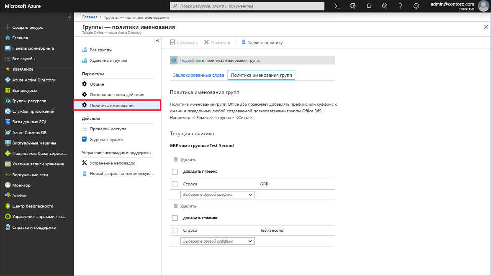

# Краткое руководство. Политика именования для групп в Azure Active Directory

В рамках этого краткого руководства вы настроите политику именования в клиенте Azure Active Directory (Azure AD) для созданных пользователем групп Office 365, чтобы отсортировать группы клиента и найти их. Например, политику именования можно использовать, чтобы:

* Указать функцию группы, членство, географический регион или создателя группы.
* Помочь классифицировать группы в адресной книге.
* Запретить использование конкретных слов в именах и псевдонимах групп.

Если у вас еще нет подписки Azure, [создайте бесплатную учетную запись Azure](https://azure.microsoft.com/free/), прежде чем начинать работу.

## Настройка политики именования групп для клиента с помощью портала Azure

1. Войдите в [Центр администрирования Azure AD](https://aad.portal.azure.com) с учетной записью администратора пользователей.
1. Чтобы открыть страницу политики именования, выберите **Группы**, а затем — **Политика именования**.

    

### Просмотр или изменение политики добавления префикса или суффикса

1. На странице **Политика именования** выберите **Политика именования групп**.
1. Текущие политики изменения префикса или суффикса можно просматривать и изменять по отдельности, выбрав атрибуты или строки, которые необходимо применить в рамках политики именования.
1. Чтобы удалить префикс или суффикс из списка, выберите его, а затем нажмите **Удалить**. При этом можно удалить несколько элементов одновременно.
1. Выберите **Сохранить**, чтобы внесенные в политику изменения вступили в силу.

### Просмотр и изменение настраиваемых запрещенных слов

1. На странице **Политика именования** выберите **Заблокированные слова**.

    

1. Для просмотра или изменения текущего списка настраиваемых запрещенных слов выберите **Загрузить**.
1. Передайте новый список настраиваемых запрещенных слов, щелкнув значок файла.
1. Выберите **Сохранить**, чтобы внесенные в политику изменения вступили в силу.

Вот и все. Вы настроили политику именования и добавили настраиваемые запрещенные слова.

## Очистка ресурсов

### Удаление политики именования с помощью портала Azure

1. На странице **Политика именования** выберите **Удалить политику**.
1. После подтверждения удаления, политика именования, в том числе все политики добавления префикса или суффикса и настраиваемые запрещенные слова, будут удалены.

## Дополнительная информация

Из этого краткого руководства вы узнали, как настроить политику именования для организации Azure AD с помощью портала Azure.

Перейдите к следующей статье, чтобы просмотреть дополнительные сведения, в том числе о командлетах PowerShell для политики именования, технических ограничениях, добавлении списка настраиваемых запрещенных слов или работе пользователя в приложениях Office 365 см.
> [!div class="nextstepaction"]
> [PowerShell для политики именования](groups-naming-policy.md)