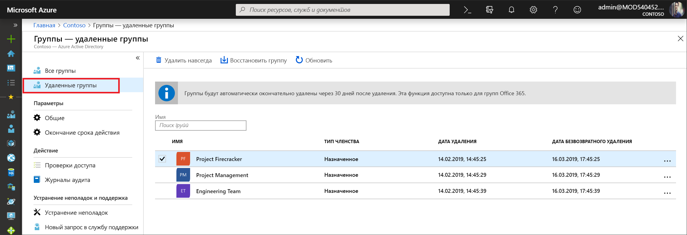

# <a name="restore-a-deleted-office-365-group-in-azure-active-directory"></a>Восстановление удаленной группы Office 365 в Azure Active Directory

Когда вы удаляете группу Office 365 в Azure Active Directory (Azure AD), эта группа в течение 30 дней с момента удаления сохраняется, но не отображается. Это сделано для того, чтобы группу и ее содержимое можно было при необходимости восстановить. Эта функция действует в Azure AD исключительно для групп Office 365. Она недоступна для групп безопасности или групп рассылки. Учтите, что 30-дневный период восстановления группы не настраивается.

> [!NOTE]
> Не используйте `Remove-MsolGroup`, иначе группа будет удалена без возможности восстановления. Для удаления группы Office 365 всегда используйте `Remove-AzureADMSGroup`.

Для восстановления группы нужны разрешения любого из следующих видов.

Роль | Разрешения
--------- | ---------
Глобальный администратор, администратор групп, партнер с поддержкой уровня 2, администратор службы Intune | Восстановление любой удаленной группы Office 365
Администратор пользователей, партнер с поддержкой уровня 1 | Восстановление любой удаленной группы Office 365, кроме тех, которым назначена роль администратора компании
Пользователь | Восстановление любой удаленной группы Office 365, которая принадлежала пользователю

## <a name="view-and-manage-the-deleted-office-365-groups-that-are-available-to-restore"></a>Просмотр и администрирование удаленных групп Office 365, которые можно восстановить

1. Войдите в [Центр администрирования Azure AD](https://aad.portal.azure.com) с учетной записью администратора пользователей.

2. Выберите **Группы** и **Удаленные группы**, чтобы просмотреть удаленные группы, доступные для восстановления.

    

3. В колонке **Удаленные группы** можно сделать следующее:

   - Восстановить удаленную группу и ее содержимое, выбрав **Восстановить группу**.
   - Окончательно удалить группу, выбрав **Удалить навсегда**. Чтобы окончательно удалить группу, вам потребуются права администратора.

## <a name="view-the-deleted-office-365-groups-that-are-available-to-restore-using-powershell"></a>Просмотр удаленных групп Office 365, которые можно восстановить, с помощью PowerShell

Следующие командлеты можно использовать для просмотра удаленных групп, чтобы убедиться, что нужные группы еще не удалены окончательно. Эти командлеты являются частью [модуля Azure AD PowerShell](https://www.powershellgallery.com/packages/AzureAD/). Дополнительные сведения об этом модуле можно найти в статье [Azure Active Directory PowerShell Version 2](/powershell/azure/install-adv2?view=azureadps-2.0) (Модуль PowerShell версии 2 для Azure Active Directory).

1.  Запустите следующий командлет, чтобы отобразить в клиенте все удаленные группы Office 365, которые доступны для восстановления.
   

    ```powershell
    Get-AzureADMSDeletedGroup
    ```

2.  Если вам известен идентификатор объекта для конкретной группы (его можно получить из командлета, описанного в шаге 1), вы можете с выполнить следующий командлет, чтобы убедиться, что эта группа еще не удалена без возможности восстановления.

    ```
    Get-AzureADMSDeletedGroup –Id <objectId>
    ```

## <a name="how-to-restore-your-deleted-office-365-group-using-powershell"></a>Восстановление удаленной группы Office 365 с помощью PowerShell

Когда вы убедитесь, что группа еще доступна для восстановления, вы можете восстановить эту удаленную группу, выполнив одно из следующих действий. Если группа содержит документы, узлы SP или другие постоянные объекты, полное восстановление группы и ее содержимого может занять до 24 часов.

1. Запустите следующий командлет, чтобы восстановить группу и ее содержимое.
 

   ```
    Restore-AzureADMSDeletedDirectoryObject –Id <objectId>
    ``` 

2. Кроме того, следующий командлет позволяет окончательно удалить группу без возможности восстановления.
    

    ```
    Remove-AzureADMSDeletedDirectoryObject –Id <objectId>
    ```

## <a name="how-do-you-know-this-worked"></a>Как убедиться, что действие выполнено?

Чтобы убедиться, что группа Office 365 успешно восстановлена, запустите командлет `Get-AzureADGroup –ObjectId <objectId>` для отображения сведений о группе. После выполнения запроса на восстановление происходят следующие изменения.

- Группа появится в Exchange на панели навигации слева.
- В планировщике отобразится план для этой группы.
- Станут доступны все сайты SharePoint и их содержимое.
- Группа станет доступна из любой конечной точки Exchange и из других рабочих нагрузок Office 365, которые поддерживают группы Office 365.

## <a name="next-steps"></a>Дополнительная информация

В следующих статьях содержатся дополнительные сведения о группах Azure Active Directory.

* [Просмотр существующих групп](../fundamentals/active-directory-groups-view-azure-portal.md)
* [Управление параметрами группы](../fundamentals/active-directory-groups-settings-azure-portal.md)
* [Управление участниками группы](../fundamentals/active-directory-groups-members-azure-portal.md)
* [Управление членством в группе](../fundamentals/active-directory-groups-membership-azure-portal.md)
* [Управление динамическими правилами для пользователей в группе](groups-dynamic-membership.md)
