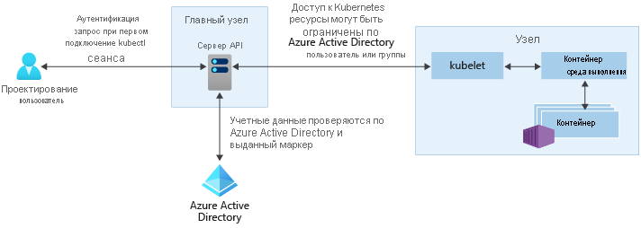

# Возможности контроля доступа и идентификации в Службе Azure Kubernetes (AKS)

Существуют различные способы аутентификации доступа к кластерам Kubernetes и их защиты. Используя управление доступом на основе ролей (RBAC), вы можете предоставить пользователям или группам доступ только к ресурсам, которые им необходимы. С помощью Службы Kubernetes Azure (AKS) можно дополнительно улучшить структуру безопасности и разрешений, используя Azure Active Directory. Эти подходы помогают защитить рабочие нагрузки приложений и данные клиентов.

В этой статье рассматриваются основные понятия, которые помогут настроить аутентификацию и назначить разрешения в AKS:

- [учетные записи службы Kubernetes (AKS)](#kubernetes-service-accounts);
- [интеграция Azure Active Directory](#azure-active-directory-integration);
- [управление доступом на основе ролей (RBAC)](#role-based-access-controls-rbac);
- [элементы Role и ClusterRole](#roles-and-clusterroles);
- [элементы RoleBinding и ClusterRoleBinding](#rolebindings-and-clusterrolebindings).

## Учетные записи службы Kubernetes

Одним из основных типов пользователя в Kubernetes является *учетная запись службы*. Учетная запись службы существует в API Kubernetes. Этот же API используется для управлению ею. Учетные данные для учетных записей службы хранятся в виде секретов Kubernetes, что позволяет использовать их авторизованным элементам pod для взаимодействия с сервером API. Большинство запросов к API содержат маркер аутентификации для учетной записи службы или обычной учетной записи пользователя.

Обычные учетные записи пользователя обеспечивают более традиционный доступ администраторов или разработчиков, а не только служб и процессов. Kubernetes, сам не предоставляет решение управления удостоверениями, в которой хранятся учетные записи обычных пользователей и пароли. Подобные внешние решения по управлению удостоверениями могут интегрироваться в Kubernetes. Для кластеров AKS таким интегрированным решением по управлению удостоверениями является Azure Active Directory.

Дополнительные сведения о параметрах идентификаторов в Kubernetes, см. в разделе [проверки подлинности Kubernetes][kubernetes-authentication].

## Интеграция Azure Active Directory

Безопасность кластеров AKS можно повысить благодаря интеграции Azure Active Directory (AD). Azure AD — это мультитенантный облачный каталог и служба управления удостоверениями, созданные после десятилетий разработки корпоративных решений по управлению удостоверениями. В этом решении объединены базовые службы каталогов, функции управления доступом к приложениям и защита идентификации. С помощью Azure AD можно интегрировать локальные удостоверения в кластеры AKS, чтобы обеспечить централизованную защиту учетных записей и управление ими.

При использовании кластеров Azure AKS, интегрированных с Azure AD, можно предоставить пользователям или группам доступ к ресурсам Kubernetes, размещенным в определенном пространстве имен или кластере. Для получения `kubectl` контекст конфигурации, которые пользователь может запустить [az aks get-credentials][az-aks-get-credentials] команды. Когда после этого пользователь будет взаимодействовать с кластером AKS с помощью `kubectl`, ему будет предложено войти с учетными данными Azure AD. Такой подход обеспечивает единый источник для управления учетными записями пользователя и хранения паролей. Пользователь имеет доступ только к ресурсам, определенным администратором кластера.

Для аутентификации Azure AD в кластерах AKS используется OpenID Connect — уровень идентификации, созданный на основе протокола OAuth 2.0. Протокол OAuth 2.0 определяет механизмы получения и использования маркеров доступа для обращения к защищенным ресурсам. OpenID Connect реализует функции аутентификации в качестве расширения процесса авторизации OAuth 2.0. Дополнительные сведения об OpenID Connect, см. в разделе [Open ID Connect документации][openid-connect]. To verify the authentication tokens obtained from Azure AD through OpenID Connect, AKS clusters use Kubernetes Webhook Token Authentication. For more information, see the [Webhook Token Authentication documentation][webhook-token-docs].

## Управление доступом на основе ролей (RBAC)

Чтобы обеспечить детализированную фильтрацию действий, которые могут выполнять пользователи, Kubernetes применяет управление доступом на основе ролей (RBAC). Этот механизм управления позволяет назначить пользователям или группам пользователей разрешение на выполнение каких-либо действий. Это может быть создание или изменение ресурсов, просмотр журналов выполнения рабочих нагрузок приложений и т. п. Эти разрешения могут охватывать отдельное пространство имен или весь кластер AKS. Благодаря управлению доступом на основе ролей Kubernetes можно создать *роли*, чтобы определить разрешения, и затем назначить эти роли пользователям с помощью *привязок ролей*.

Дополнительные сведения см. в разделе [авторизации с помощью RBAC][kubernetes-rbac].

### Управление доступом на основе ролей (RBAC) Azure
Еще одним механизмом для управления доступом к ресурсам является управление доступом на основе ролей Azure. Управление доступом на основе ролей Kubernetes предназначено для работы с ресурсами в кластере AKS, а управление доступом на основе ролей Azure — для работы с ресурсами в подписке Azure. С помощью управления доступом на основе ролей Azure можно создать *определение роли*, описывающее предоставляемые разрешения. Затем пользователю или группе назначается это определение роли для какой-либо *области*. Это может быть отдельный ресурс, группа ресурсов или подписка.

Дополнительные сведения см. в разделе [Какова Azure RBAC?][azure-rbac]

## Элементы Role и ClusterRole

Прежде чем назначить пользователям разрешения с помощью управления доступом на основе ролей Kubernetes, необходимо определить эти разрешения как элемент *Role*. Роли Kubernetes *предоставляют* разрешения. Понятие *запрещения* разрешения отсутствует.

Роли используются для предоставления разрешений в пространстве имен. Если вам нужно предоставить разрешения для доступа во всем кластере или для доступа к кластерным ресурсам за пределами данного пространства имен, вместо этого можно использовать элементы *ClusterRole*.

Элемент ClusterRole действует аналогичным образом, предоставляя разрешения для ресурсов, но его можно применить к ресурсам в пределах всего кластера, не в определенном пространстве имен.

## Элементы RoleBinding и ClusterRoleBinding

После определения ролей, предоставляющих разрешения для ресурсов, можно назначить эти разрешения RBAC Kubernetes с помощью элемента *RoleBinding*. Если кластер AKS интегрирован с Azure Active Directory, привязки определяют способ предоставления пользователям Azure AD разрешений для выполнения действий в кластере.

Привязки роли используются для назначения ролей для определенного пространства имен. Такой подход позволяет логически разделить отдельный кластер AKS, предоставив пользователям доступ только к ресурсам приложений в назначенных им пространствах имен. Если вам нужно привязать роли для доступа во всем кластере или для доступа к кластерным ресурсам за пределами данного пространства имен, вместо этого можно использовать элементы *ClusterRoleBinding*.

Элемент ClusterRoleBinding действует аналогичным образом, привязывая роли к пользователям, но его можно применить к ресурсам в пределах всего кластера, а не в определенном пространстве имен. Такой подход позволяет предоставить администраторам или инженерам службы поддержки доступ ко всем ресурсам в кластере AKS.

## Следующие шаги

Чтобы приступить к работе с Azure AD и Kubernetes RBAC см. в разделе [интегрировать Azure Active Directory с AKS][aks-aad].

Связанные практические рекомендации, см. в разделе [советы и рекомендации для проверки подлинности и авторизации в AKS][operator-best-practices-identity].

Дополнительные сведения о ключевых концепциях Kubernetes и AKS вы получите в следующих статьях:

- [Kubernetes / AKS clusters и рабочих нагрузок][aks-concepts-clusters-workloads]
- [Kubernetes / AKS безопасности][aks-concepts-security]
- [Kubernetes / AKS виртуальных сетей][aks-concepts-network]
- [Kubernetes / AKS хранилища][aks-concepts-storage]
- [Kubernetes / масштабирование AKS][aks-concepts-scale]

<!-- LINKS - External -->
[kubernetes-authentication]: https://kubernetes.io/docs/reference/access-authn-authz/authentication
[webhook-token-docs]: https://kubernetes.io/docs/reference/access-authn-authz/authentication/#webhook-token-authentication
[kubernetes-rbac]: https://kubernetes.io/docs/reference/access-authn-authz/rbac/

<!-- LINKS - Internal -->
[openid-connect]: ../active-directory/develop/v1-protocols-openid-connect-code.md
[az-aks-get-credentials]: /cli/azure/aks#az-aks-get-credentials
[azure-rbac]: ../role-based-access-control/overview.md
[aks-aad]: azure-ad-integration-cli.md
[aks-concepts-clusters-workloads]: concepts-clusters-workloads.md
[aks-concepts-security]: concepts-security.md
[aks-concepts-scale]: concepts-scale.md
[aks-concepts-storage]: concepts-storage.md
[aks-concepts-network]: concepts-network.md
[operator-best-practices-identity]: operator-best-practices-identity.md
