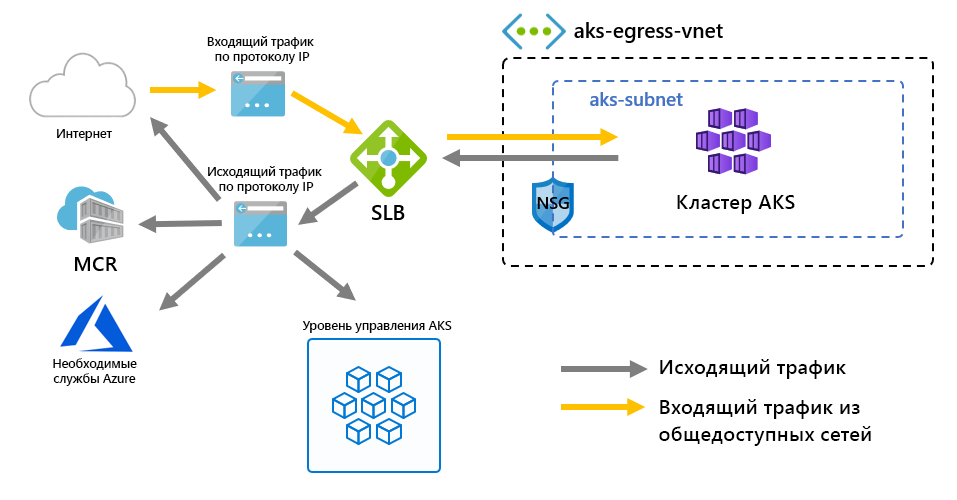

# <a name="customize-cluster-egress-with-a-user-defined-route-preview"></a>Настройка кластера с помощью маршрута, определяемого пользователем (Предварительный просмотр)

Выход из кластера AKS можно настроить в соответствии с конкретными сценариями. По умолчанию AKS будет предоставлять стандартный баланс нагрузки SKU для настройки и использования для выхода. Однако настройка по умолчанию может не соответствовать требованиям всех сценариев, если публичные ИС запрещены или для вывода требуется дополнительный переход.

В этой статье рассматривается, как настроить маршрут выход кластера для поддержки пользовательских сетевых сценариев, таких как те, которые не разбирают общедоступные IP-диски и требуют, чтобы кластер сидел за сетевым виртуальным прибором (NVA).

> [!IMPORTANT]
> Функции предварительного просмотра AKS являются самообслуживанием и предлагаются на основе выбора. Предварительные просмотры *предоставляются как есть* и *по мере возможности* и исключаются из соглашения об уровне обслуживания (SLA) и ограниченной гарантии. Предварительные просмотры AKS частично покрываются поддержкой клиентов на *основе наилучших усилий.* Таким образом, функции не предназначены для использования в производстве. Для получения дополнительной информации смотрите следующие статьи поддержки:
>
> * [Политики поддержки AKS](support-policies.md)
> * [Часто задаваемые вопросы о поддержке Azure](faq.md)

## <a name="prerequisites"></a>Предварительные требования
* Версия Azure CLI 2.0.81 или больше
* Версия расширения Azure CLI Preview 0.4.28 или больше
* Версия API `2020-01-01` или больше

## <a name="install-the-latest-azure-cli-aks-preview-extension"></a>Установите последнее расширение Azure CLI AKS Preview
Чтобы установить исходящий тип кластера, требуется версия расширения azure CLI AKS Preview 0.4.18 или позже. Установите расширение Azure CLI AKS Preview с помощью команды расширения az, а затем проверьте все доступные обновления, используя следующую команду обновления расширения az:

```azure-cli
# Install the aks-preview extension
az extension add --name aks-preview

# Update the extension to make sure you have the latest version installed
az extension update --name aks-preview
```

## <a name="limitations"></a>Ограничения
* Во время `outboundType` предварительного просмотра, может быть определена только во время создания кластера и не может быть обновлена после этого.
* Во время `outboundType` предварительного просмотра кластеры AKS должны использовать Azure CNI. Kubenet настраивается, использование требует ручных совмещений таблицы маршрутов с подсетью AKS.
* `outboundType` Настройка требует кластеров `vm-set-type` AKS с и `VirtualMachineScaleSets` `load-balancer-sku` `Standard`.
* Для `outboundType` установки `UDR` значения требуется определенный пользователем маршрут с допустимым исходящим подключением для кластера.
* Установка `outboundType` значения `UDR` подразумевает, что IP-код входа, направляемый на грузобаланс, может **не совпадать с** адресом исходящего назначения кластера.

## <a name="overview-of-outbound-types-in-aks"></a>Обзор исходящих типов в AKS

Кластер AKS можно настроить с `outboundType` уникальным балансируем нагрузки типа или пользовательской конечной конечной.

> [!IMPORTANT]
> Исходящие типы влияют только на трафик выхода кластера. Дополнительную информацию можно узнать для [настройки контроллеров всколых.](ingress-basic.md)

### <a name="outbound-type-of-loadbalancer"></a>Исходящий тип нагрузкиБалансер

Если `loadBalancer` установлен, AKS завершает следующую настройку автоматически. Балансилер нагрузки используется для выталкивания через AKS назначенный общедоступный IP. Исходящий тип `loadBalancer` поддерживает kubernetes `loadBalancer`услугтипа, которые ожидают выхода из балансиваля нагрузки, созданного поставщиком ресурсов AKS.

Следующая настройка выполняется AKS.
   * Для выделения кластера предусмотрен общедоступный IP-адрес.
   * Общедоступный IP-адрес присваивается ресурсу балансироворовык нагрузки.
   * Пулы бэкэнда для балансопарка нагрузки настраиваются для узлов агента в кластере.

Ниже приведена топология сети, развернутая в кластерах AKS по умолчанию, в которой используется `outboundType` `loadBalancer`.



### <a name="outbound-type-of-userdefinedrouting"></a>Исходящий тип пользовательОопределяется

> [!NOTE]
> Использование исходящего типа является передовым сетевым сценарием и требует надлежащей конфигурации сети.

Если `userDefinedRouting` установлен, AKS не будет автоматически настраивать пути выход. Следующие, как ожидается, будет сделано **пользователем**.

Кластер должен быть развернут в существующую виртуальную сеть с настроенной подсетью. Действительный маршрут, определяемый пользователем (UDR), должен существовать в подсети с исходящим подключением.

Поставщик ресурсов AKS развернет стандартный балансосмюлер нагрузки (SLB). Балансилер нагрузки не настроен с любыми правилами и [не взимает плату до тех пор, пока не будет установлено правило.](https://azure.microsoft.com/pricing/details/load-balancer/) AKS **не** будет автоматически предоставлять публичный IP-адрес для фронтэнда SLB. AKS **не** будет автоматически настраивать пул бэкэнда балансов ы нагрузки.

## <a name="deploy-a-cluster-with-outbound-type-of-udr-and-azure-firewall"></a>Развертывание кластера с исходящим типом UDR и брандмауэра Azure

Чтобы проиллюстрировать применение кластера с исходящим типом с помощью маршрута, определяемого пользователем, кластер можно настроить в виртуальной сети с помощью брандмауэра Azure Firewall.


* Ingress вынужден проходить через брандмауэры
   * Изолированная подсеть содержит внутренний баланселизатор нагрузки для реаутирования в узлы агента
   * Узлы агента изолированы в специальной подсети
* Исходящие запросы начинаются от узлов агента к внутреннему IP-адресаAzре с помощью пользовательского маршрута
   * Запросы узлов агентов AKS следуют UDR, который был размещен на подсети кластера AKS был развернут в.
   * Azure Firewall выходит из виртуальной сети из общедоступного IP-приличия
   * Доступ к плоскости управления AKS защищен NSG, который позволил БРАНДмауэру IP-адрес
   * Доступ к общедоступному интернету или другим службам Azure поступает на IP-адрес брандмауэра frontend

### <a name="set-configuration-via-environment-variables"></a>Установка конфигурации с помощью переменных среды

Определите набор переменных среды, которые будут использоваться в создании ресурсов.

```bash
PREFIX="contosofin"
RG="${PREFIX}-rg"
LOC="eastus"
NAME="${PREFIX}outboundudr"
AKS_NAME="${PREFIX}aks"
VNET_NAME="${PREFIX}vnet"
AKSSUBNET_NAME="${PREFIX}akssubnet"
SVCSUBNET_NAME="${PREFIX}svcsubnet"
# DO NOT CHANGE FWSUBNET_NAME - This is currently a requirement for Azure Firewall.
FWSUBNET_NAME="AzureFirewallSubnet"
FWNAME="${PREFIX}fw"
FWPUBLICIP_NAME="${PREFIX}fwpublicip"
FWIPCONFIG_NAME="${PREFIX}fwconfig"
FWROUTE_TABLE_NAME="${PREFIX}fwrt"
FWROUTE_NAME="${PREFIX}fwrn"
FWROUTE_NAME_INTERNET="${PREFIX}fwinternet"
DEVSUBNET_NAME="${PREFIX}dev"
```

Далее установите идя подписки.

```azure-cli
# Get ARM Access Token and Subscription ID - This will be used for AuthN later.

ACCESS_TOKEN=$(az account get-access-token -o tsv --query 'accessToken')

# NOTE: Update Subscription Name
# Set Default Azure Subscription to be Used via Subscription ID

az account set -s <SUBSCRIPTION_ID_GOES_HERE>

# NOTE: Update Subscription Name for setting SUBID

SUBID=$(az account show -s '<SUBSCRIPTION_NAME_GOES_HERE>' -o tsv --query 'id')
```

## <a name="create-a-virtual-network-with-multiple-subnets"></a>Создание виртуальной сети с несколькими подсетями

Обеспечение виртуальной сети с тремя отдельными подсетями, одна для кластера, одна для брандмауэра и одна для входа в службу.


Создайте группу ресурсов для хранения всех ресурсов.

```azure-cli
# Create Resource Group

az group create --name $RG --location $LOC
```

Создайте две виртуальные сети для размещения кластера AKS и брандмауэра Azure Firewall. Каждый из них будет иметь свою собственную подсеть. Начнем с сети AKS.

```
# Dedicated virtual network with AKS subnet

az network vnet create \
    --resource-group $RG \
    --name $VNET_NAME \
    --address-prefixes 100.64.0.0/16 \
    --subnet-name $AKSSUBNET_NAME \
    --subnet-prefix 100.64.1.0/24

# Dedicated subnet for K8s services

az network vnet subnet create \
    --resource-group $RG \
    --vnet-name $VNET_NAME \
    --name $SVCSUBNET_NAME \
    --address-prefix 100.64.2.0/24

# Dedicated subnet for Azure Firewall (Firewall name cannot be changed)

az network vnet subnet create \
    --resource-group $RG \
    --vnet-name $VNET_NAME \
    --name $FWSUBNET_NAME \
    --address-prefix 100.64.3.0/24
```

## <a name="create-and-setup-an-azure-firewall-with-a-udr"></a>Создание и настройка брандмауэра Azure с UDR

Необходимо настроить входящие и исходящие правила Azure Firewall. Основная цель брандмауэра заключается в том, чтобы дать организациям возможность устанавливать гранулированный вход и выходить из кластера AKS и выходить из нее.


Создайте стандартный общедоступный IP-ресурс SKU, который будет использоваться в качестве фронтового адреса Azure Firewall.

```azure-cli
az network public-ip create -g $RG -n $FWPUBLICIP_NAME -l $LOC --sku "Standard"
```

Зарегистрируйте расширение предварительного просмотра для создания брандмауэра Azure Firewall.
```azure-cli
# Install Azure Firewall preview CLI extension

az extension add --name azure-firewall

# Deploy Azure Firewall

az network firewall create -g $RG -n $FWNAME -l $LOC
```

IP-адрес, созданный ранее, теперь может быть приписан фронту брандмауэра.
> [!NOTE]
> Настройка общедоступного IP-адреса в Брандмауэре Azure может занять несколько минут.
> 
> Если ошибки неоднократно появляются в приведенной ниже команде, удалите существующий брандмауэр и общедоступный IP-адрес и одновременно разобьем через портал public IP и Azure Firewall.

```azure-cli
# Configure Firewall IP Config

az network firewall ip-config create -g $RG -f $FWNAME -n $FWIPCONFIG_NAME --public-ip-address $FWPUBLICIP_NAME --vnet-name $VNET_NAME
```

Когда предыдущая команда удалось, сохранить брандмауэр передний IP-адрес для конфигурации позже.

```bash
# Capture Firewall IP Address for Later Use

FWPUBLIC_IP=$(az network public-ip show -g $RG -n $FWPUBLICIP_NAME --query "ipAddress" -o tsv)
FWPRIVATE_IP=$(az network firewall show -g $RG -n $FWNAME --query "ipConfigurations[0].privateIpAddress" -o tsv)
```

### <a name="create-a-udr-with-a-hop-to-azure-firewall"></a>Создание UDR с переходом на брандмауэр Azure

Azure автоматически направляет трафик между подсетями Azure, виртуальными и локальными сетями. Если нужно изменить какой-либо из стандартных маршрутов Azure, это можно сделать с помощью создания таблицы маршрутов.

Создайте пустую таблицу маршрутов, которая будет связана с данной подсетью. Таблица маршрутов определит следующий переход как брандмауэр Azure, созданный выше. С каждой подсетью может быть связана одна таблица маршрутов (или ноль).

```azure-cli
# Create UDR and add a route for Azure Firewall

az network route-table create -g $RG --name $FWROUTE_TABLE_NAME
az network route-table route create -g $RG --name $FWROUTE_NAME --route-table-name $FWROUTE_TABLE_NAME --address-prefix 0.0.0.0/0 --next-hop-type VirtualAppliance --next-hop-ip-address $FWPRIVATE_IP --subscription $SUBID
az network route-table route create -g $RG --name $FWROUTE_NAME_INTERNET --route-table-name $FWROUTE_TABLE_NAME --address-prefix $FWPUBLIC_IP/32 --next-hop-type Internet
```

Просмотрите [документацию виртуальной таблицы сетевого маршрута](../virtual-network/virtual-networks-udr-overview.md#user-defined) о том, как можно переопределить маршруты системы azure по умолчанию или добавить дополнительные маршруты в таблицу маршрутов подсети.

## <a name="adding-network-firewall-rules"></a>Добавление правил сетевого брандмауэра

> [!WARNING]
> Ниже приводится один пример добавления правила брандмауэра. Все конечные точки награжда, определенные в [требуемых конечных точках найма,](egress.md) должны быть включены правилами брандмауэра приложений для функционирования кластеров AKS. Без включения этих конечных точек кластер не может работать.

Ниже приведен пример правила сети и приложения. Мы добавляем сетевое правило, которое позволяет любой протокол, исходный адрес, адрес назначения и порты назначения. Мы также добавляем правило приложения для **некоторых** конечных точек, требуемых AKS.

В производственном сценарии необходимо включить доступ только к требуемым конечным точкам для приложения и тем, которые определены в [AKS, требуемых выходом.](egress.md)

```
# Add Network FW Rules

az network firewall network-rule create -g $RG -f $FWNAME --collection-name 'aksfwnr' -n 'netrules' --protocols 'Any' --source-addresses '*' --destination-addresses '*' --destination-ports '*' --action allow --priority 100

# Add Application FW Rules
# IMPORTANT: Add AKS required egress endpoints

az network firewall application-rule create -g $RG -f $FWNAME \
    --collection-name 'AKS_Global_Required' \
    --action allow \
    --priority 100 \
    -n 'required' \
    --source-addresses '*' \
    --protocols 'http=80' 'https=443' \
    --target-fqdns \
        'aksrepos.azurecr.io' \
        '*blob.core.windows.net' \
        'mcr.microsoft.com' \
        '*cdn.mscr.io' \
        '*.data.mcr.microsoft.com' \
        'management.azure.com' \
        'login.microsoftonline.com' \
        'ntp.ubuntu.com' \
        'packages.microsoft.com' \
        'acs-mirror.azureedge.net'
```

Ознакомиться с [документацией Azure Firewall](https://docs.microsoft.com/azure/firewall/overview) можно узнать больше об службе Брандмауэра Azure.

## <a name="associate-the-route-table-to-aks"></a>Связать таблицу маршрутов с AKS

Чтобы связать кластер с брандмауэром, выделенная подсеть для подсети кластера должна ссылаться на таблицу маршрутов, созданную выше. Объединение может быть сделано путем выдачи команды виртуальной сети, держащей как кластер, так и брандмауэр для обновления таблицы маршрутов подсети кластера.

```azure-cli
# Associate route table with next hop to Firewall to the AKS subnet

az network vnet subnet update -g $RG --vnet-name $VNET_NAME --name $AKSSUBNET_NAME --route-table $FWROUTE_TABLE_NAME
```

## <a name="deploy-aks-with-outbound-type-of-udr-to-the-existing-network"></a>Развертывание AKS с исходящим типом UDR в существующую сеть

Теперь кластер AKS может быть развернут в существующую виртуальную настройку сети. Для установки исходящего типа кластера для определяемой пользователем реукторы необходимо предоставить akS существующую подсеть.


### <a name="create-a-service-principal-with-access-to-provision-inside-the-existing-virtual-network"></a>Создание директора службы с доступом к обеспечению внутри существующей виртуальной сети

Директор службы используется AKS для создания кластерных ресурсов. Основной сервис, пройденый во время создания, используется для создания базовых ресурсов AKS, таких как VMs, Хранение и балансеры нагрузки, используемые AKS. Если будет выдано слишком мало разрешений, он не сможет предоставить кластер AKS.

```azure-cli
# Create SP and Assign Permission to Virtual Network

az ad sp create-for-rbac -n "${PREFIX}sp" --skip-assignment
```

Теперь `APPID` замените и `PASSWORD` ниже с основным аппидой службы и основным паролем службы, автоматически генерируемым предыдущим выходом команды. Мы будем ссылаться на идентификатор ресурсов VNET, чтобы предоставить разрешения директору службы, чтобы AKS мог развертывать ресурсы в него.

```azure-cli
APPID="<SERVICE_PRINCIPAL_APPID_GOES_HERE>"
PASSWORD="<SERVICEPRINCIPAL_PASSWORD_GOES_HERE>"
VNETID=$(az network vnet show -g $RG --name $VNET_NAME --query id -o tsv)

# Assign SP Permission to VNET

az role assignment create --assignee $APPID --scope $VNETID --role Contributor

# View Role Assignment
az role assignment list --assignee $APPID --all -o table
```

### <a name="deploy-aks"></a>Развертывание AKS

Наконец, кластер AKS может быть развернут в существующую подсеть, которая была выделена для кластера. Целевая подсеть, в которая будет развернута, определяется с переменной среды. `$SUBNETID` Мы не определили `$SUBNETID` переменную в предыдущих шагах. Чтобы установить значение идентификатора подсетевого, можно использовать следующую команду:

```azurecli
SUBNETID="/subscriptions/$SUBID/resourceGroups/$RG/providers/Microsoft.Network/virtualNetworks/$VNET_NAME/subnets/$AKSSUBNET_NAME"
```

Мы определим исходящий тип, чтобы следовать UDR, который существует в подсети, что позволяет AKS пропустить настройку и подготовку IP для балансировщика нагрузки, которая теперь может быть строго внутренней.

Функция AKS для [авторизованных IP-диапазонов сервера API](api-server-authorized-ip-ranges.md) может быть добавлена, чтобы ограничить доступ сервера API только к общедоступной конечной точке брандмауэра. Авторизованная функция диапазонов IP обозначается на диаграмме как NSG, которая должна быть передана для доступа к плоскости управления. При включении авторизованной функции диапазона IP для ограничения доступа к серверу API инструменты разработчика должны использовать прыжок из виртуальной сети брандмауэра или вы должны добавить все конечные точки разработчика в авторизованный диапазон IP.

> [!TIP]
> Дополнительные функции могут быть добавлены к развертыванию кластера, например (Частный кластер). При использовании авторизованных диапазонов IP-класса внутри кластерной сети потребуется переходная коробка для доступа к серверу API.

```azure-cli
az aks create -g $RG -n $AKS_NAME -l $LOC \
  --node-count 3 \
  --network-plugin azure --generate-ssh-keys \
  --service-cidr 192.168.0.0/16 \
  --dns-service-ip 192.168.0.10 \
  --docker-bridge-address 172.22.0.1/29 \
  --vnet-subnet-id $SUBNETID \
  --service-principal $APPID \
  --client-secret $PASSWORD \
  --load-balancer-sku standard \
  --outbound-type userDefinedRouting \
  --api-server-authorized-ip-ranges $FWPUBLIC_IP
  ```

### <a name="enable-developer-access-to-the-api-server"></a>Включить разработчику доступ к серверу API

В связи с настройкой авторизованных диапазонов IP для кластера, необходимо добавить разработчика, инструментирующего IP-адреса, в список кластеров AKS утвержденных диапазонов IP для доступа к серверу API. Другим вариантом является настройка jumpbox с необходимым инструментарием внутри отдельной подсети в виртуальной сети Firewall.

Добавить еще один IP-адрес в утвержденные диапазоны со следующей командой

```bash
# Retrieve your IP address
CURRENT_IP=$(dig @resolver1.opendns.com ANY myip.opendns.com +short)

# Add to AKS approved list
az aks update -g $RG -n $AKS_NAME --api-server-authorized-ip-ranges $CURRENT_IP/32

```

 Используйте команду [az aks get-credentials][az-aks-get-credentials] для настройки `kubectl` для подключения к недавно созданному кластеру Kubernetes. 

 ```azure-cli
 az aks get-credentials -g $RG -n $AKS_NAME
 ```

### <a name="setup-the-internal-load-balancer"></a>Настройка внутреннего баланса нагрузки

AKS развернула балансомер нагрузки с кластером, который может быть настроен как [внутренний балансер нагрузки.](internal-lb.md)

Для создания внутреннего баланса нагрузки создайте манифест службы с именем internal-lb.yaml с типом обслуживания LoadBalancer и анзуротной нагрузкой-баланс-внутренней аннотацией, как показано в следующем примере:

```yaml
apiVersion: v1
kind: Service
metadata:
  name: internal-app
  annotations:
    service.beta.kubernetes.io/azure-load-balancer-internal: "true"
    service.beta.kubernetes.io/azure-load-balancer-internal-subnet: "contosofinsvcsubnet"
spec:
  type: LoadBalancer
  ports:
  - port: 80
  selector:
    app: internal-app
```

Развертывание внутреннего балансивизатора нагрузки с помощью kubectl применить и указать название yAML манифест:

```bash
kubectl apply -f internal-lb.yaml
```

## <a name="deploy-a-kubernetes-service"></a>Развертывание службы Kubernetes

Поскольку тип исходящего кластера устанавливается как UDR, связывая узлы агента как пул бэкэнда для балансировщика нагрузки не завершается автоматически AKS во время создания кластера. Однако объединение бэкэнда обрабатывается поставщиком облачных услуг Kubernetes Azure при развертывании службы Kubernetes.

Развертывание приложения для голосования Azure, копируя yaml `example.yaml`ниже в файл с именем .

```yaml
apiVersion: apps/v1
kind: Deployment
metadata:
  name: azure-vote-back
spec:
  replicas: 1
  selector:
    matchLabels:
      app: azure-vote-back
  template:
    metadata:
      labels:
        app: azure-vote-back
    spec:
      nodeSelector:
        "beta.kubernetes.io/os": linux
      containers:
      - name: azure-vote-back
        image: redis
        resources:
          requests:
            cpu: 100m
            memory: 128Mi
          limits:
            cpu: 250m
            memory: 256Mi
        ports:
        - containerPort: 6379
          name: redis
---
apiVersion: v1
kind: Service
metadata:
  name: azure-vote-back
spec:
  ports:
  - port: 6379
  selector:
    app: azure-vote-back
---
apiVersion: apps/v1
kind: Deployment
metadata:
  name: azure-vote-front
spec:
  replicas: 1
  selector:
    matchLabels:
      app: azure-vote-front
  template:
    metadata:
      labels:
        app: azure-vote-front
    spec:
      nodeSelector:
        "beta.kubernetes.io/os": linux
      containers:
      - name: azure-vote-front
        image: microsoft/azure-vote-front:v1
        resources:
          requests:
            cpu: 100m
            memory: 128Mi
          limits:
            cpu: 250m
            memory: 256Mi
        ports:
        - containerPort: 80
        env:
        - name: REDIS
          value: "azure-vote-back"
---
apiVersion: v1
kind: Service
metadata:
  name: azure-vote-front
  annotations:
    service.beta.kubernetes.io/azure-load-balancer-internal: "true"
    service.beta.kubernetes.io/azure-load-balancer-internal-subnet: "contosofinsvcsubnet"
spec:
  type: LoadBalancer
  ports:
  - port: 80
  selector:
    app: azure-vote-front
```

Развертывание службы путем запуска:

```bash
kubectl apply -f example.yaml
```

## <a name="add-a-dnat-rule-to-azure-firewall"></a>Добавление правила DNAT в брандмауэр Azure

Чтобы настроить входящее подключение, правило DNAT должно быть записано в брандмауэр Azure Firewall. Для проверки подключения к нашему кластеру определено правило для публичного IP-адреса брандмауэра для маршрута к внутреннему IP-адресу внутренней службы.

Адрес назначения может быть настроен так как доступ к нему является портом на брандмауэре. Переведенный адрес должен быть IP-адресом внутреннего баланса нагрузки. Переведенный порт должен быть открытым портом для вашего сервиса Kubernetes.

Вам нужно будет указать внутренний IP-адрес, назначенный балансеру нагрузки, созданный службой Kubernetes. Извините адрес, запустив:

```bash
kubectl get services
```

Необходимый IP-адрес будет указан в колонке EXTERNAL-IP, аналогично следующему.

```bash
NAME               TYPE           CLUSTER-IP       EXTERNAL-IP   PORT(S)        AGE
azure-vote-back    ClusterIP      192.168.92.209   <none>        6379/TCP       23m
azure-vote-front   LoadBalancer   192.168.19.183   100.64.2.5    80:32106/TCP   23m
kubernetes         ClusterIP      192.168.0.1      <none>        443/TCP        4d3h
```

```azure-cli
az network firewall nat-rule create --collection-name exampleset --destination-addresses $FWPUBLIC_IP --destination-ports 80 --firewall-name $FWNAME --name inboundrule --protocols Any --resource-group $RG --source-addresses '*' --translated-port 80 --action Dnat --priority 100 --translated-address <INSERT IP OF K8s SERVICE>
```

## <a name="clean-up-resources"></a>Очистка ресурсов

> [!NOTE]
> При удалении внутренней службы Kubernetes, если балансооператор внутренней нагрузки больше не используется какой-либо службой, поставщик облачных услуг Azure удалит баланселизатор внутренней нагрузки. При следующем развертывании службы балансизатор нагрузки будет развернут, если не будет найдено ни одного из них с запрошенной конфигурацией.

Чтобы очистить ресурсы Azure, удалите группу ресурсов AKS.

```azure-cli
az group delete -g $RG
```

## <a name="validate-connectivity"></a>Проверка подключения

Перейдите на IP-адрес Frontend Firewall в браузере для проверки подключения.

Вы должны увидеть изображение приложения для голосования Azure.

## <a name="next-steps"></a>Дальнейшие действия

Смотрите [обзор сети UDR Azure](https://docs.microsoft.com/azure/virtual-network/virtual-networks-udr-overview).

[Узнайте, как создать, изменить или удалить таблицу маршрутов.](https://docs.microsoft.com/azure/virtual-network/manage-route-table)

<!-- LINKS - internal -->
[az-aks-get-credentials]: /cli/azure/aks?view=azure-cli-latest#az-aks-get-credentials
