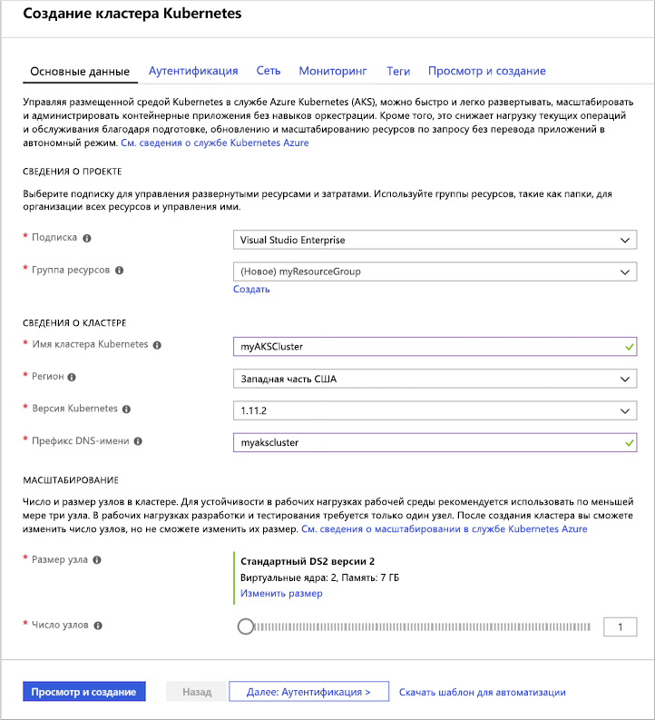
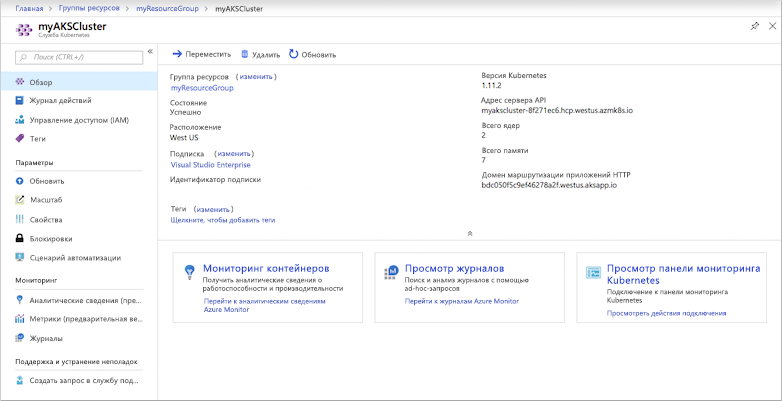
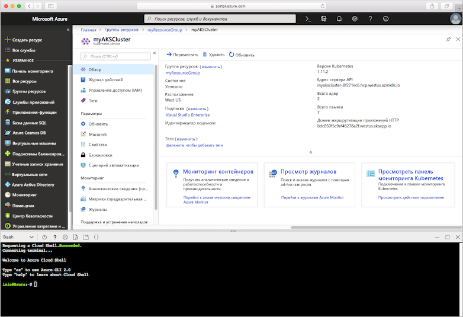
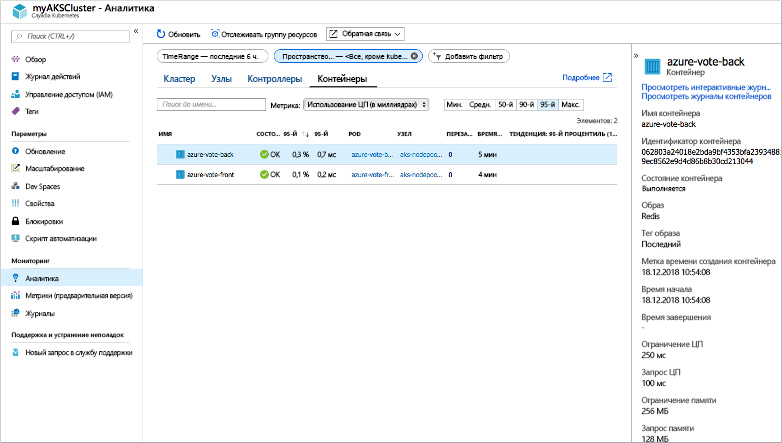
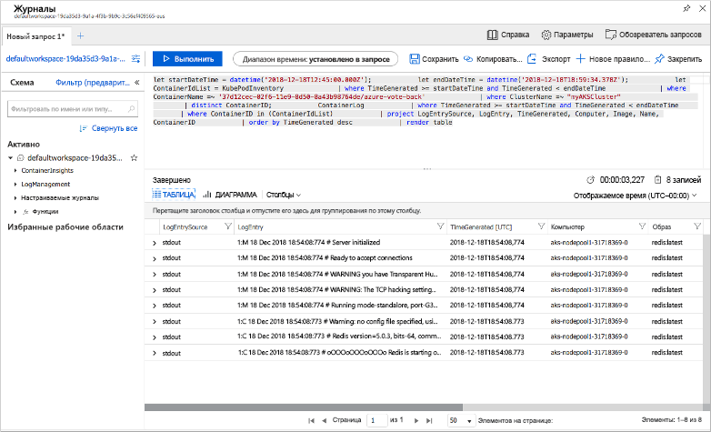

# <a name="quickstart-deploy-an-azure-kubernetes-service-aks-cluster-using-the-azure-portal"></a>Краткое руководство. Развертывание кластера Службы Azure Kubernetes (AKS) с помощью портала Azure

Служба Azure Kubernetes (AKS) — это управляемая служба Kubernetes, которая позволяет быстро развертывать кластеры и управлять ими. В этом кратком руководстве вы развернете кластер AKS с помощью портала Azure. Затем в кластере будет запущено многоконтейнерное приложение, которое включает в себя веб-интерфейс и экземпляр Redis. Затем вы узнаете, как отслеживать работоспособность кластера и модулей pod, на которых выполняется ваше приложение.


В этом руководстве предполагается, что у вас есть некоторое представление о функциях Kubernetes. Дополнительные сведения см. в статье [Ключевые концепции Kubernetes для службы Azure Kubernetes (AKS)][kubernetes-concepts].

Если у вас еще нет подписки Azure, [создайте бесплатную учетную запись Azure](https://azure.microsoft.com/free/?WT.mc_id=A261C142F), прежде чем начинать работу.

## <a name="sign-in-to-azure"></a>Вход в Azure

Войдите на портал Azure по адресу https://portal.azure.com.

## <a name="create-an-aks-cluster"></a>Создание кластера AKS

В верхнем левом углу портала Azure выберите **+ Создать ресурс** > **Служба Kubernetes**.

Чтобы создать кластеры AKS, выполните следующие действия.

1. **Основные**. Настройте следующие параметры.
   - *Сведения о проекте.* Выберите подписку Azure, а затем выберите или создайте группу ресурсов Azure, например *myResourceGroup*. Введите **Имя кластера Kubernetes**, например *myAKSCluster*.
   - *Сведения о кластере*. Выберите регион, версию Kubernetes и префикс DNS-имени для кластера AKS.
   - *Масштаб*. Выберите размер виртуальной машины для узлов AKS. Размер виртуальной машины **невозможно** изменить после развертывания кластера с AKS.
       - Выберите количество узлов для развертывания в кластере. В этом кратком руководстве задайте параметру **Число узлов** значение *1*. Количество узлов **можно** изменить после развертывания кластера.
    
     

     По завершении выберите **Next: Authentication** (Далее: аутентификация).

1. **Аутентификация:** Настройте следующие параметры:
   - Создайте новую субъект-службу или *настройте* для использования существующую. При использовании существующего имени субъекта-службы необходимо указать для него идентификатор клиента и секрет.
   - Включите параметр для элементов управления доступом на основе ролей (RBAC) Kubernetes. Эти элементы управления предоставляют более точный контроль над доступом к ресурсам Kubernetes, развернутых в кластере AKS.

     *Базовые* сетевые подключения используются по умолчанию, и включена служба Azure Monitor для контейнеров. Выберите **Review + create** (Просмотр и создание), а затем щелкните **Создать**.

Для создания кластера AKS и его подготовки к использованию потребуется несколько минут. После завершения просмотрите группу ресурсов кластера AKS, например *myResourceGroup*, и выберите ресурс AKS, например *myAKSCluster*. Отображается панель мониторинга кластера AKS, как показано на снимке экрана ниже.



## <a name="connect-to-the-cluster"></a>Подключение к кластеру

Управлять кластером Kubernetes можно при помощи [kubectl][kubectl], клиента командной строки Kubernetes. Клиент `kubectl` предварительно установлен в Azure Cloud Shell.

Откройте Cloud Shell с помощью кнопки в правом верхнем углу портала Azure.



Чтобы настроить подключение `kubectl` к кластеру Kubernetes, выполните команду [az aks get-credentials][az-aks-get-credentials]. Эта команда скачивает учетные данные и настраивает интерфейс командной строки Kubernetes для их использования. В следующем примере возвращаются учетные данные для имени кластера *myAKSCluster* в группе ресурсов *myResourceGroup*.

```azurecli-interactive
az aks get-credentials --resource-group myResourceGroup --name myAKSCluster
```

Проверьте подключение к кластеру, выполнив команду [kubectl get][kubectl-get], чтобы просмотреть список узлов кластера.

```azurecli-interactive
kubectl get nodes
```

В следующем примере показан единый узел, созданный на предыдущих шагах. Убедитесь, что узел находится в состоянии *Ready* (Готово):

```
NAME                       STATUS    ROLES     AGE       VERSION
aks-agentpool-14693408-0   Ready     agent     15m       v1.11.5
```

## <a name="run-the-application"></a>Выполнение приложения

Файл манифеста Kubernetes определяет требуемое состояние для кластера, включая образы контейнеров, которые нужно запустить. В этом кратком руководстве манифест используется для создания всех объектов, необходимых для запуска приложения Azure для голосования. Этот манифест включает в себя два [развертывания Kubernetes][kubernetes-deployment]. Одно используется для примера приложений Azure для голосования на Python, а другое — для экземпляра Redis. Создаются две [службы Kubernetes][kubernetes-service], внутренняя и внешняя. Внутренняя служба используется для экземпляра Redis, а внешняя — для доступа к приложению Azure для голосования через Интернет.

> [!TIP]
> В этом кратком руководстве вы вручную создадите и развернете манифесты приложений в кластере AKS. В сценариях, более приближенных к реальному использованию, можно использовать [Azure Dev Spaces][azure-dev-spaces] для быстрого итерационного выполнения кода и его отладки непосредственно в кластере AKS. Служба Dev Spaces позволяет использовать различные платформы ОС и среды разработки и работать совместно с другими членами команды.

Создайте файл `azure-vote.yaml` и скопируйте в него следующее определение YAML. В Azure Cloud Shell создайте этот файл с помощью `vi` или `Nano`, как в обычной виртуальной или физической системе.

```yaml
apiVersion: apps/v1
kind: Deployment
metadata:
  name: azure-vote-back
spec:
  replicas: 1
  selector:
    matchLabels:
      app: azure-vote-back
  template:
    metadata:
      labels:
        app: azure-vote-back
    spec:
      nodeSelector:
        "beta.kubernetes.io/os": linux
      containers:
      - name: azure-vote-back
        image: redis
        resources:
          requests:
            cpu: 100m
            memory: 128Mi
          limits:
            cpu: 250m
            memory: 256Mi
        ports:
        - containerPort: 6379
          name: redis
---
apiVersion: v1
kind: Service
metadata:
  name: azure-vote-back
spec:
  ports:
  - port: 6379
  selector:
    app: azure-vote-back
---
apiVersion: apps/v1
kind: Deployment
metadata:
  name: azure-vote-front
spec:
  replicas: 1
  selector:
    matchLabels:
      app: azure-vote-front
  template:
    metadata:
      labels:
        app: azure-vote-front
    spec:
      nodeSelector:
        "beta.kubernetes.io/os": linux
      containers:
      - name: azure-vote-front
        image: microsoft/azure-vote-front:v1
        resources:
          requests:
            cpu: 100m
            memory: 128Mi
          limits:
            cpu: 250m
            memory: 256Mi
        ports:
        - containerPort: 80
        env:
        - name: REDIS
          value: "azure-vote-back"
---
apiVersion: v1
kind: Service
metadata:
  name: azure-vote-front
spec:
  type: LoadBalancer
  ports:
  - port: 80
  selector:
    app: azure-vote-front
```

Разверните приложение с помощью команды [kubectl apply][kubectl-apply] и укажите имя манифеста YAML:

```azurecli-interactive
kubectl apply -f azure-vote.yaml
```

В следующем примере выходных данных показано, что развертывания и службы успешно созданы.

```
deployment "azure-vote-back" created
service "azure-vote-back" created
deployment "azure-vote-front" created
service "azure-vote-front" created
```

## <a name="test-the-application"></a>Тестирование приложения

При запуске приложения Служба Kubernetes предоставляет внешний интерфейс приложения в Интернете. Процесс создания может занять несколько минут.

Чтобы отслеживать ход выполнения, используйте команду [kubectl get service][kubectl-get] с аргументом `--watch`.

```azurecli-interactive
kubectl get service azure-vote-front --watch
```

Изначально для параметра *EXTERNAL-IP* (Внешний IP-адрес) службы *azure-vote-front* отображается состояние *pending* (ожидание).

```
NAME               TYPE           CLUSTER-IP   EXTERNAL-IP   PORT(S)        AGE
azure-vote-front   LoadBalancer   10.0.37.27   <pending>     80:30572/TCP   6s
```

Когда значение *EXTERNAL-IP* изменится с состояния *pending* на фактический общедоступный IP-адрес, используйте команду `CTRL-C`, чтобы остановить процесс отслеживания `kubectl`. В следующем примере выходных данных показан общедоступный IP-адрес, присвоенный службе.

```
azure-vote-front   LoadBalancer   10.0.37.27   52.179.23.131   80:30572/TCP   2m
```

Чтобы увидеть приложение для голосования Azure в действии, откройте в веб-браузере внешний IP-адрес вашей службы.


## <a name="monitor-health-and-logs"></a>Мониторинг работоспособности и журналов

При создании кластера была включена Azure Monitor для контейнеров. Эта функция мониторинга предоставляет метрики работоспособности кластера AKS и модулей, запущенных в кластере.

Он может потребоваться несколько минут, чтобы эти данные отобразились на портале Azure. Чтобы просмотреть текущее состояние, время непрерывной работы и использование ресурсов для модулей pod Azure для голосования, перейдите обратно к ресурсу AKS на портале Azure, например *myAKSCluster*. Сведения о состоянии работоспособности можно получить следующим образом:

1. В разделе **Отслеживание** в левой части окна выберите **Аналитика**.
1. В верхней части выберите **+Добавить фильтр**.
1. Выберите *Пространство имен* как свойство, а затем — элемент *\<All but kube-system\>* (Все, кроме kube-system).
1. Выберите **Контейнеры** для просмотра.

Отобразятся представления контейнеров *azure-vote-back* и *azure-vote-front*, как показано ниже:



Чтобы просмотреть журналы для модуля pod `azure-vote-front`, щелкните ссылку **Просмотреть журналы контейнера** в правой части списка контейнеров. Эти журналы содержат потоки *stdout* и *stderr* из контейнера.



## <a name="delete-cluster"></a>Удаление кластера

Если кластер больше не нужен, просто удалите кластерный ресурс. После этого будут удалены все связанные ресурсы. Для этого на портале Azure можно нажать кнопку **Удалить** на панели мониторинга AKS. Можно также выполнить команду [az group delete][az-aks-delete] в Cloud Shell.

```azurecli-interactive
az aks delete --resource-group myResourceGroup --name myAKSCluster --no-wait
```

> [!NOTE]
> Когда вы удаляете кластер, субъект-служба Azure Active Directory, используемый в кластере AKS, не удаляется. Инструкции по удалению субъекта-службы см. в разделе [Дополнительные замечания][sp-delete].

## <a name="get-the-code"></a>Получение кода

В этом кратком руководстве для создания развертывания Kubernetes используются предварительно созданные образы контейнеров. Связанный с приложением код, файл Dockerfile и файл манифеста Kubernetes доступны на сайте GitHub.

[https://github.com/Azure-Samples/azure-voting-app-redis][azure-vote-app]

## <a name="next-steps"></a>Дополнительная информация

С помощью этого краткого руководства мы развернули кластер Kubernetes, а затем развернули в нем многоконтейнерное приложение.

Дополнительные сведения о AKS и инструкции по созданию полного кода для примера развертывания см. в руководстве по кластерам Kubernetes.

> [!div class="nextstepaction"]
> [Руководство по AKS][aks-tutorial]

<!-- LINKS - external -->
[azure-vote-app]: https://github.com/Azure-Samples/azure-voting-app-redis.git
[kubectl]: https://kubernetes.io/docs/user-guide/kubectl/
[kubectl-apply]: https://kubernetes.io/docs/reference/generated/kubectl/kubectl-commands#apply
[kubectl-get]: https://kubernetes.io/docs/reference/generated/kubectl/kubectl-commands#get
[kubernetes-documentation]: https://kubernetes.io/docs/home/

<!-- LINKS - internal -->
[kubernetes-concepts]: concepts-clusters-workloads.md
[az-aks-get-credentials]: /cli/azure/aks?view=azure-cli-latest#az-aks-get-credentials
[az-aks-delete]: /cli/azure/aks#az-aks-delete
[aks-monitor]: ../monitoring/monitoring-container-health.md
[aks-network]: ./concepts-network.md
[aks-tutorial]: ./tutorial-kubernetes-prepare-app.md
[http-routing]: ./http-application-routing.md
[sp-delete]: kubernetes-service-principal.md#additional-considerations
[azure-dev-spaces]: https://docs.microsoft.com/azure/dev-spaces/
[kubernetes-deployment]: concepts-clusters-workloads.md#deployments-and-yaml-manifests
[kubernetes-service]: concepts-network.md#services