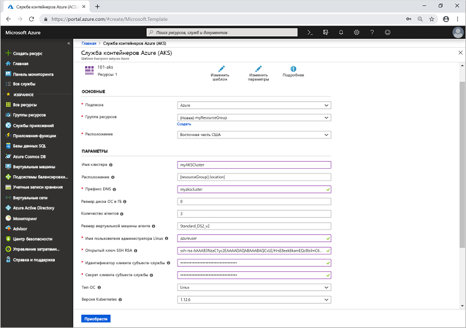

# <a name="quickstart-deploy-an-azure-kubernetes-service-aks-cluster-using-an-azure-resource-manager-template"></a>Краткое руководство. Развертывание кластера Службы Azure Kubernetes (AKS) с использованием шаблона Azure Resource Manager

Служба Azure Kubernetes (AKS) — это управляемая служба Kubernetes, которая позволяет быстро развертывать кластеры и управлять ими. В этом кратком руководстве вы развернете кластер AKS с использованием шаблона Azure Resource Manager. Затем в кластере будет запущено многоконтейнерное приложение, которое включает в себя веб-интерфейс и экземпляр Redis.


В этом руководстве предполагается, что у вас есть некоторое представление о функциях Kubernetes. Дополнительные сведения см. в статье о [ключевых концепциях Kubernetes для Службы Azure Kubernetes (AKS)][kubernetes-concepts].

Если у вас еще нет подписки Azure, [создайте бесплатную учетную запись Azure](https://azure.microsoft.com/free/?WT.mc_id=A261C142F), прежде чем начинать работу.

[!INCLUDE [cloud-shell-try-it.md](../../includes/cloud-shell-try-it.md)]

Если вы решили установить и использовать CLI на локальном компьютере, для выполнения инструкций из этого руководства вам потребуется Azure CLI версии 2.0.61 или более поздней. Чтобы узнать версию, выполните команду `az --version`. Если вам необходимо выполнить установку или обновление, см. статью [Установка Azure CLI 2.0][azure-cli-install].

## <a name="prerequisites"></a>Предварительные требования

Чтобы создать кластер AKS с использованием шаблона Resource Manager, укажите открытый ключ SSH и субъект-службу Azure Active Directory. Если вам требуется один из этих ресурсов, следуйте инструкциям из следующего раздела. В противном случае перейдите к разделу [Создание кластера AKS](#create-an-aks-cluster).

### <a name="create-an-ssh-key-pair"></a>Создание пары ключей SSH

Чтобы получить доступ к узлам AKS, установите подключение с помощью пары ключей SSH. Чтобы создать файлы открытого и закрытого ключей SSH, используйте команду `ssh-keygen`. По умолчанию эти файлы хранятся в каталоге *~/.ssh*. Если в выбранном расположении существует пара ключей SSH с теми же именами, они будут перезаписаны.

Следующая команда создает пару 2048-разрядных ключей SSH, использующих шифрование RSA:

```azurecli-interactive
ssh-keygen -t rsa -b 2048
```

Дополнительные сведения о создании ключей SSH см. в статье [Detailed steps: Create and manage SSH keys for authentication to a Linux VM in Azure][ssh-keys] (Подробные инструкции. Создание ключей SSH для проверки подлинности на виртуальной машине Linux в Azure и управление этими ключами).

### <a name="create-a-service-principal"></a>Создание субъекта-службы

Для взаимодействия с API-интерфейсами Azure кластеру AKS требуется субъект-служба Azure Active Directory. Создайте субъект-службу с помощью команды [az ad sp create-for-rbac][az-ad-sp-create-for-rbac]. Параметр `--skip-assignment` ограничивает назначение дополнительных разрешений. По умолчанию этот субъект-служба действителен в течение одного года.

```azurecli-interactive
az ad sp create-for-rbac --skip-assignment
```

Вы должны увидеть результат, аналогичный приведенному ниже.

```json
{
  "appId": "8b1ede42-d407-46c2-a1bc-6b213b04295f",
  "displayName": "azure-cli-2019-04-19-21-42-11",
  "name": "http://azure-cli-2019-04-19-21-42-11",
  "password": "27e5ac58-81b0-46c1-bd87-85b4ef622682",
  "tenant": "73f978cf-87f2-41bf-92ab-2e7ce012db57"
}
```

Запишите значения параметров *appId* и *password*. Эти значения используются в приведенных далее действиях.

## <a name="create-an-aks-cluster"></a>Создание кластера AKS

Шаблон, используемый в этом кратком руководстве, предназначен для [развертывания кластера Службы Azure Kubernetes](https://azure.microsoft.com/resources/templates/101-aks/). Дополнительные примеры AKS см. на странице [Шаблоны быстрого запуска Azure][aks-quickstart-templates].

1. Выберите следующее изображение, чтобы войти на портал Azure и открыть шаблон.

    [](https://portal.azure.com/#create/Microsoft.Template/uri/https%3A%2F%2Fraw.githubusercontent.com%2FAzure%2Fazure-quickstart-templates%2Fmaster%2F101-aks%2Fazuredeploy.json)

2. Введите или выберите следующие значения.  

    В этом кратком руководстве оставьте значения по умолчанию для параметров *OS Disk Size GB* (Размер диска операционной системы в ГБ), *Число агентов*, *Размер виртуальной машины агента*, *Тип ОС* и *Версия Kubernetes*. Укажите собственные значения для следующих параметров шаблона:

    * **Подписка**: Выберите подписку Azure.
    * **Группа ресурсов.** Выберите **Создать**. Введите уникальное имя для группы ресурсов, например *myResourceGroup*, а затем нажмите кнопку **ОК**.
    * **Расположение.** Выберите расположение, например **восточная часть США**.
    * **Имя кластера**. Введите уникальное имя для кластера AKS, например *myAKSCluster*.
    * **DNS-префикс**. Введите уникальный префикс DNS для своего кластера, например *myakscluster*.
    * **Имя администратора Linux**. Введите имя пользователя для подключения с помощью SSH, например *azureuser*.
    * **Открытый ключ SSH RSA**. Скопируйте и вставьте *открытую* часть пары ключей SSH (по умолчанию содержимое *~/.ssh/id_rsa.pub*).
    * **Идентификатор клиента для субъекта-службы**. Скопируйте и вставьте *appId* участника-службы из команды `az ad sp create-for-rbac`.
    * **Секрет клиента субъекта-службы**. Скопируйте и вставьте *пароль* участника-службы из команды `az ad sp create-for-rbac`.
    * **I agree to the terms and conditions state above** (Я принимаю указанные выше условия). Установите этот флажок, чтобы принять условия.

    

3. Щелкните **Приобрести**.

Создание кластера AKS занимает несколько минут. Дождитесь успешного развертывания кластера, прежде чем перейти к следующему шагу.

## <a name="connect-to-the-cluster"></a>Подключение к кластеру

Управлять кластером Kubernetes можно c помощью [kubectl][kubectl], клиента командной строки Kubernetes. Если вы используете Azure Cloud Shell, `kubectl` уже установлен. Чтобы установить `kubectl` локально, используйте команду [az aks install-cli][az-aks-install-cli]:

```azurecli
az aks install-cli
```

Чтобы настроить `kubectl` на подключение к кластеру Kubernetes, выполните команду [az aks get-credentials][az-aks-get-credentials]. Эта команда скачивает учетные данные и настраивает интерфейс командной строки Kubernetes для их использования.

```azurecli-interactive
az aks get-credentials --resource-group myResourceGroup --name myAKSCluster
```

Проверьте подключение к кластеру, выполнив команду [kubectl get][kubectl-get], чтобы просмотреть список узлов кластера.

```azurecli-interactive
kubectl get nodes
```

В следующем примере показан узел, созданный на предыдущих шагах. Убедитесь, что узлы находятся в состоянии *Готово*:

```
NAME                       STATUS   ROLES   AGE     VERSION
aks-agentpool-41324942-0   Ready    agent   6m44s   v1.12.6
aks-agentpool-41324942-1   Ready    agent   6m46s   v1.12.6
aks-agentpool-41324942-2   Ready    agent   6m45s   v1.12.6
```

## <a name="run-the-application"></a>Выполнение приложения

Файл манифеста Kubernetes определяет требуемое состояние для кластера, включая образы контейнеров, которые нужно запустить. В этом кратком руководстве манифест используется для создания всех объектов, необходимых для запуска приложения Azure для голосования. Этот манифест включает в себя два [развертывания Kubernetes][kubernetes-deployment]. Одно используется для примера приложений Azure для голосования на Python, а другое — для экземпляра Redis. Создаются две [службы Kubernetes][kubernetes-service], внутренняя и внешняя. Внутренняя служба используется для экземпляра Redis, а внешняя — для доступа к приложению Azure для голосования через Интернет.

> [!TIP]
> В этом кратком руководстве вы вручную создадите и развернете манифесты приложений в кластере AKS. В сценариях, более приближенных к реальному использованию, можно использовать [Azure Dev Spaces][azure-dev-spaces] для быстрого итерационного выполнения кода и его отладки непосредственно в кластере AKS. Служба Dev Spaces позволяет использовать различные платформы ОС и среды разработки и работать совместно с другими членами команды.

Создайте файл `azure-vote.yaml` и скопируйте в него следующее определение YAML. Если вы используете Azure Cloud Shell, этот файл можно создать с помощью `vi` или `nano`, как при работе в виртуальной или физической системе:

```yaml
apiVersion: apps/v1
kind: Deployment
metadata:
  name: azure-vote-back
spec:
  replicas: 1
  selector:
    matchLabels:
      app: azure-vote-back
  template:
    metadata:
      labels:
        app: azure-vote-back
    spec:
      nodeSelector:
        "beta.kubernetes.io/os": linux
      containers:
      - name: azure-vote-back
        image: redis
        resources:
          requests:
            cpu: 100m
            memory: 128Mi
          limits:
            cpu: 250m
            memory: 256Mi
        ports:
        - containerPort: 6379
          name: redis
---
apiVersion: v1
kind: Service
metadata:
  name: azure-vote-back
spec:
  ports:
  - port: 6379
  selector:
    app: azure-vote-back
---
apiVersion: apps/v1
kind: Deployment
metadata:
  name: azure-vote-front
spec:
  replicas: 1
  selector:
    matchLabels:
      app: azure-vote-front
  template:
    metadata:
      labels:
        app: azure-vote-front
    spec:
      nodeSelector:
        "beta.kubernetes.io/os": linux
      containers:
      - name: azure-vote-front
        image: microsoft/azure-vote-front:v1
        resources:
          requests:
            cpu: 100m
            memory: 128Mi
          limits:
            cpu: 250m
            memory: 256Mi
        ports:
        - containerPort: 80
        env:
        - name: REDIS
          value: "azure-vote-back"
---
apiVersion: v1
kind: Service
metadata:
  name: azure-vote-front
spec:
  type: LoadBalancer
  ports:
  - port: 80
  selector:
    app: azure-vote-front
```

Разверните приложение с помощью команды [kubectl apply][kubectl-apply] и укажите имя манифеста YAML:

```azurecli-interactive
kubectl apply -f azure-vote.yaml
```

В следующем примере выходных данных показано, что развертывания и службы успешно созданы.

```
deployment "azure-vote-back" created
service "azure-vote-back" created
deployment "azure-vote-front" created
service "azure-vote-front" created
```

## <a name="test-the-application"></a>Тестирование приложения

При запуске приложения Служба Kubernetes предоставляет внешний интерфейс приложения в Интернете. Процесс создания может занять несколько минут.

Чтобы отслеживать ход выполнения, используйте команду [kubectl get service][kubectl-get] с аргументом `--watch`.

```azurecli-interactive
kubectl get service azure-vote-front --watch
```

Изначально для параметра *EXTERNAL-IP* (Внешний IP-адрес) службы *azure-vote-front* отображается состояние *pending* (ожидание).

```
NAME               TYPE           CLUSTER-IP   EXTERNAL-IP   PORT(S)        AGE
azure-vote-front   LoadBalancer   10.0.37.27   <pending>     80:30572/TCP   6s
```

Когда значение *EXTERNAL-IP* изменится с состояния *pending* на фактический общедоступный IP-адрес, используйте команду `CTRL-C`, чтобы остановить процесс отслеживания `kubectl`. В следующем примере выходных данных показан общедоступный IP-адрес, присвоенный службе.

```
azure-vote-front   LoadBalancer   10.0.37.27   52.179.23.131   80:30572/TCP   2m
```

Чтобы увидеть приложение для голосования Azure в действии, откройте в веб-браузере внешний IP-адрес вашей службы.


## <a name="delete-cluster"></a>Удаление кластера

Чтобы удалить ненужные кластер, группу ресурсов, службу контейнеров и все связанные с ней ресурсы, выполните команду [az group delete][az-group-delete].

```azurecli-interactive
az group delete --name myResourceGroup --yes --no-wait
```

> [!NOTE]
> Когда вы удаляете кластер, субъект-служба Azure Active Directory, используемый в кластере AKS, не удаляется. Инструкции по удалению субъекта-службы см. в разделе с [дополнительными замечаниями][sp-delete].

## <a name="get-the-code"></a>Получение кода

В этом кратком руководстве для создания развертывания Kubernetes используются предварительно созданные образы контейнеров. Связанный с приложением код, файл Dockerfile и файл манифеста Kubernetes доступны на сайте GitHub.

[https://github.com/Azure-Samples/azure-voting-app-redis][azure-vote-app]

## <a name="next-steps"></a>Дополнительная информация

С помощью этого краткого руководства мы развернули кластер Kubernetes, а затем развернули в нем многоконтейнерное приложение. [Получите доступ к веб-панели Kubernetes][kubernetes-dashboard] для кластера, который вы создали.

Дополнительные сведения о AKS и инструкции по созданию полного кода для примера развертывания см. в руководстве по кластерам Kubernetes.

> [!div class="nextstepaction"]
> [Руководство по AKS][aks-tutorial]

<!-- LINKS - external -->
[azure-vote-app]: https://github.com/Azure-Samples/azure-voting-app-redis.git
[kubectl]: https://kubernetes.io/docs/user-guide/kubectl/
[kubectl-apply]: https://kubernetes.io/docs/reference/generated/kubectl/kubectl-commands#apply
[kubectl-get]: https://kubernetes.io/docs/reference/generated/kubectl/kubectl-commands#get
[azure-dev-spaces]: https://docs.microsoft.com/azure/dev-spaces/
[aks-quickstart-templates]: https://azure.microsoft.com/resources/templates/?term=Azure+Kubernetes+Service

<!-- LINKS - internal -->
[kubernetes-concepts]: concepts-clusters-workloads.md
[aks-monitor]: https://aka.ms/coingfonboarding
[aks-tutorial]: ./tutorial-kubernetes-prepare-app.md
[az-aks-browse]: /cli/azure/aks?view=azure-cli-latest#az-aks-browse
[az-aks-create]: /cli/azure/aks?view=azure-cli-latest#az-aks-create
[az-aks-get-credentials]: /cli/azure/aks?view=azure-cli-latest#az-aks-get-credentials
[az-aks-install-cli]: /cli/azure/aks?view=azure-cli-latest#az-aks-install-cli
[az-group-create]: /cli/azure/group#az-group-create
[az-group-delete]: /cli/azure/group#az-group-delete
[azure-cli-install]: /cli/azure/install-azure-cli
[sp-delete]: kubernetes-service-principal.md#additional-considerations
[azure-portal]: https://portal.azure.com
[kubernetes-deployment]: concepts-clusters-workloads.md#deployments-and-yaml-manifests
[kubernetes-service]: concepts-network.md#services
[kubernetes-dashboard]: kubernetes-dashboard.md
[ssh-keys]: ../virtual-machines/linux/create-ssh-keys-detailed.md
[az-ad-sp-create-for-rbac]: /cli/azure/ad/sp#az-ad-sp-create-for-rbac
