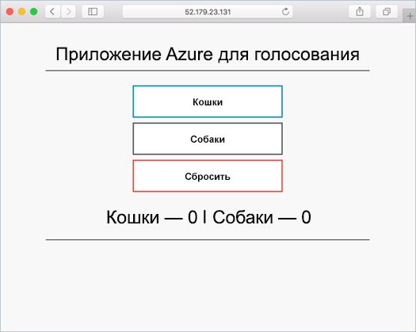

# <a name="quickstart-deploy-an-azure-kubernetes-service-cluster-using-the-azure-cli"></a>Краткое руководство. Развертывание кластера Службы Azure Kubernetes с помощью Azure CLI

Выполнив инструкции из этого краткого руководства, вы развернете кластер Службы Azure Kubernetes (AKS) с помощью Azure CLI. Служба Azure Kubernetes (AKS) — это управляемая служба Kubernetes, которая позволяет быстро развертывать кластеры и управлять ими. Затем в кластере будет запущено многоконтейнерное приложение, которое включает в себя веб-интерфейс и экземпляр Redis. Затем вы узнаете, как отслеживать работоспособность кластера и модулей pod, на которых выполняется ваше приложение.

Если вам нужно использовать контейнеры Windows Server (сейчас реализована предварительная версия в AKS), см. статью о [создании кластера AKS, который поддерживает контейнеры Windows Server][windows-container-cli].



В этом руководстве предполагается, что у вас есть некоторое представление о функциях Kubernetes. Дополнительные сведения см. в статье о [ключевых концепциях Kubernetes для Службы Azure Kubernetes (AKS)][kubernetes-concepts].

Если у вас еще нет подписки Azure, [создайте бесплатную учетную запись Azure](https://azure.microsoft.com/free/?WT.mc_id=A261C142F), прежде чем начинать работу.

[!INCLUDE [cloud-shell-try-it.md](../../includes/cloud-shell-try-it.md)]

Если вы решили установить и использовать CLI на локальном компьютере, для выполнения инструкций из этого руководства вам потребуется Azure CLI 2.0.64 или более поздней версии. Чтобы узнать версию, выполните команду `az --version`. Если вам необходимо выполнить установку или обновление, см. статью [Установка Azure CLI 2.0][azure-cli-install].

> [!NOTE]
> Если команды из этого краткого руководства выполняются в локальной среде (а не в Azure Cloud Shell), убедитесь, что они выполняются от имени администратора.

## <a name="create-a-resource-group"></a>Создание группы ресурсов

Группа ресурсов Azure — это логическая группа, в которой выполняется развертывание и администрирование ресурсов Azure. Во время создания группы ресурсов вам будет предложено указать расположение. В этом расположении сохраняются метаданные группы ресурсов, а также выполняется их работа в Azure, если во время создания ресурса вы не указали другой регион. Создайте группу ресурсов с помощью команды [az group create][az-group-create].

В следующем примере создается группа ресурсов с именем *myResourceGroup* в расположении *eastus*.

```azurecli-interactive
az group create --name myResourceGroup --location eastus
```

В следующем примере выходных данных показано, что группа ресурсов успешно создана:

```json
{
  "id": "/subscriptions/<guid>/resourceGroups/myResourceGroup",
  "location": "eastus",
  "managedBy": null,
  "name": "myResourceGroup",
  "properties": {
    "provisioningState": "Succeeded"
  },
  "tags": null
}
```

## <a name="create-aks-cluster"></a>Создание кластера AKS

Используйте команду [az aks create][az-aks-create], чтобы создать кластер AKS. В следующем примере создается кластер *myAKSCluster* с одним узлом. Также с помощью параметра *--enable-addons monitoring* можно включить Azure Monitor для контейнеров.  Это может занять несколько минут.

> [!NOTE]
> При создании кластера AKS для хранения ресурсов AKS автоматически создается вторая группа ресурсов. Дополнительные сведения см. в разделе [Почему с AKS создаются две группы ресурсов?](https://docs.microsoft.com/azure/aks/faq#why-are-two-resource-groups-created-with-aks)

```azurecli-interactive
az aks create --resource-group myResourceGroup --name myAKSCluster --node-count 1 --enable-addons monitoring --generate-ssh-keys
```

Через несколько минут выполнение команды завершается и отображаются сведения о кластере в формате JSON.

## <a name="connect-to-the-cluster"></a>Подключение к кластеру

Управлять кластером Kubernetes можно c помощью [kubectl][kubectl], клиента командной строки Kubernetes. Если вы используете Azure Cloud Shell, `kubectl` уже установлен. Чтобы установить `kubectl` локально, используйте команду [az aks install-cli][az-aks-install-cli]:

```azurecli
az aks install-cli
```

Чтобы настроить `kubectl` на подключение к кластеру Kubernetes, выполните команду [az aks get-credentials][az-aks-get-credentials]. Эта команда скачивает учетные данные и настраивает интерфейс командной строки Kubernetes для их использования.

```azurecli-interactive
az aks get-credentials --resource-group myResourceGroup --name myAKSCluster
```

Проверьте подключение к кластеру, выполнив команду [kubectl get][kubectl-get], чтобы просмотреть список узлов кластера.

```azurecli-interactive
kubectl get nodes
```

В следующем примере показан единый узел, созданный на предыдущих шагах. Убедитесь, что узел находится в состоянии *Ready* (Готово):

```output
NAME                       STATUS   ROLES   AGE     VERSION
aks-nodepool1-31718369-0   Ready    agent   6m44s   v1.12.8
```

## <a name="run-the-application"></a>Выполнение приложения

Файл манифеста Kubernetes определяет требуемое состояние для кластера, включая образы контейнеров, которые нужно запустить. В этом кратком руководстве манифест используется для создания всех объектов, необходимых для запуска приложения Azure для голосования. Этот манифест включает в себя два [развертывания Kubernetes][kubernetes-deployment]. Одно используется для примера приложений Azure для голосования на Python, а другое — для экземпляра Redis. Создаются две [службы Kubernetes][kubernetes-service], внутренняя и внешняя. Внутренняя служба используется для экземпляра Redis, а внешняя — для доступа к приложению Azure для голосования через Интернет.

> [!TIP]
> В этом кратком руководстве вы вручную создадите и развернете манифесты приложений в кластере AKS. В сценариях, более приближенных к реальному использованию, можно использовать [Azure Dev Spaces][azure-dev-spaces] для быстрого итерационного выполнения кода и его отладки непосредственно в кластере AKS. Служба Dev Spaces позволяет использовать различные платформы ОС и среды разработки и работать совместно с другими членами команды.

Создайте файл `azure-vote.yaml` и скопируйте в него следующее определение YAML. Если вы используете Azure Cloud Shell, этот файл можно создать с помощью `vi` или `nano`, как при работе в виртуальной или физической системе:

```yaml
apiVersion: apps/v1
kind: Deployment
metadata:
  name: azure-vote-back
spec:
  replicas: 1
  selector:
    matchLabels:
      app: azure-vote-back
  template:
    metadata:
      labels:
        app: azure-vote-back
    spec:
      nodeSelector:
        "beta.kubernetes.io/os": linux
      containers:
      - name: azure-vote-back
        image: redis
        resources:
          requests:
            cpu: 100m
            memory: 128Mi
          limits:
            cpu: 250m
            memory: 256Mi
        ports:
        - containerPort: 6379
          name: redis
---
apiVersion: v1
kind: Service
metadata:
  name: azure-vote-back
spec:
  ports:
  - port: 6379
  selector:
    app: azure-vote-back
---
apiVersion: apps/v1
kind: Deployment
metadata:
  name: azure-vote-front
spec:
  replicas: 1
  selector:
    matchLabels:
      app: azure-vote-front
  template:
    metadata:
      labels:
        app: azure-vote-front
    spec:
      nodeSelector:
        "beta.kubernetes.io/os": linux
      containers:
      - name: azure-vote-front
        image: microsoft/azure-vote-front:v1
        resources:
          requests:
            cpu: 100m
            memory: 128Mi
          limits:
            cpu: 250m
            memory: 256Mi
        ports:
        - containerPort: 80
        env:
        - name: REDIS
          value: "azure-vote-back"
---
apiVersion: v1
kind: Service
metadata:
  name: azure-vote-front
spec:
  type: LoadBalancer
  ports:
  - port: 80
  selector:
    app: azure-vote-front
```

Разверните приложение с помощью команды [kubectl apply][kubectl-apply] и укажите имя манифеста YAML:

```azurecli-interactive
kubectl apply -f azure-vote.yaml
```

В следующем примере выходных данных показано, что развертывания и службы успешно созданы.

```output
deployment "azure-vote-back" created
service "azure-vote-back" created
deployment "azure-vote-front" created
service "azure-vote-front" created
```

## <a name="test-the-application"></a>Тестирование приложения

При запуске приложения Служба Kubernetes предоставляет внешний интерфейс приложения в Интернете. Процесс создания может занять несколько минут.

Чтобы отслеживать ход выполнения, используйте команду [kubectl get service][kubectl-get] с аргументом `--watch`.

```azurecli-interactive
kubectl get service azure-vote-front --watch
```

Изначально для параметра *EXTERNAL-IP* (Внешний IP-адрес) службы *azure-vote-front* отображается состояние *pending* (ожидание).

```output
NAME               TYPE           CLUSTER-IP   EXTERNAL-IP   PORT(S)        AGE
azure-vote-front   LoadBalancer   10.0.37.27   <pending>     80:30572/TCP   6s
```

Когда значение *EXTERNAL-IP* изменится с состояния *pending* на фактический общедоступный IP-адрес, используйте команду `CTRL-C`, чтобы остановить процесс отслеживания `kubectl`. В следующем примере выходных данных показан общедоступный IP-адрес, присвоенный службе.

```output
azure-vote-front   LoadBalancer   10.0.37.27   52.179.23.131   80:30572/TCP   2m
```

Чтобы увидеть приложение для голосования Azure в действии, откройте в веб-браузере внешний IP-адрес вашей службы.


После создания кластера AKS для сбора метрик работоспособности узлов кластера и модулей pod включается служба [Azure Monitor для контейнеров](../azure-monitor/insights/container-insights-overview.md). Эти метрики работоспособности доступны на портале Azure.

## <a name="delete-the-cluster"></a>Удаление кластера

Чтобы избежать расходов за использование Azure, необходимо удалить ненужные ресурсы.  Чтобы удалить ненужные кластер, группу ресурсов, службу контейнеров и все связанные с ней ресурсы, выполните команду [az group delete][az-group-delete].

```azurecli-interactive
az group delete --name myResourceGroup --yes --no-wait
```

> [!NOTE]
> Когда вы удаляете кластер, субъект-служба Azure Active Directory, используемый в кластере AKS, не удаляется. Инструкции по удалению субъекта-службы см. в разделе с [дополнительными замечаниями][sp-delete].

## <a name="get-the-code"></a>Получение кода

В этом кратком руководстве для создания развертывания Kubernetes используются предварительно созданные образы контейнеров. Связанный с приложением код, файл Dockerfile и файл манифеста Kubernetes доступны на сайте GitHub.

[https://github.com/Azure-Samples/azure-voting-app-redis][azure-vote-app]

## <a name="next-steps"></a>Дополнительная информация

С помощью этого краткого руководства мы развернули кластер Kubernetes, а затем развернули в нем многоконтейнерное приложение. Кроме того, вы можете [получить доступ к веб-панели мониторинга Kubernetes][kubernetes-dashboard] для своего кластера AKS.

Дополнительные сведения о AKS и инструкции по созданию полного кода для примера развертывания см. в руководстве по кластерам Kubernetes.

> [!div class="nextstepaction"]
> [Руководство по AKS][aks-tutorial]

<!-- LINKS - external -->
[azure-vote-app]: https://github.com/Azure-Samples/azure-voting-app-redis.git
[kubectl]: https://kubernetes.io/docs/user-guide/kubectl/
[kubectl-apply]: https://kubernetes.io/docs/reference/generated/kubectl/kubectl-commands#apply
[kubectl-get]: https://kubernetes.io/docs/reference/generated/kubectl/kubectl-commands#get
[azure-dev-spaces]: https://docs.microsoft.com/azure/dev-spaces/

<!-- LINKS - internal -->
[kubernetes-concepts]: concepts-clusters-workloads.md
[aks-monitor]: https://aka.ms/coingfonboarding
[aks-tutorial]: ./tutorial-kubernetes-prepare-app.md
[az-aks-browse]: /cli/azure/aks?view=azure-cli-latest#az-aks-browse
[az-aks-create]: /cli/azure/aks?view=azure-cli-latest#az-aks-create
[az-aks-get-credentials]: /cli/azure/aks?view=azure-cli-latest#az-aks-get-credentials
[az-aks-install-cli]: /cli/azure/aks?view=azure-cli-latest#az-aks-install-cli
[az-group-create]: /cli/azure/group#az-group-create
[az-group-delete]: /cli/azure/group#az-group-delete
[azure-cli-install]: /cli/azure/install-azure-cli
[sp-delete]: kubernetes-service-principal.md#additional-considerations
[azure-portal]: https://portal.azure.com
[kubernetes-deployment]: concepts-clusters-workloads.md#deployments-and-yaml-manifests
[kubernetes-service]: concepts-network.md#services
[kubernetes-dashboard]: kubernetes-dashboard.md
[windows-container-cli]: windows-container-cli.md
