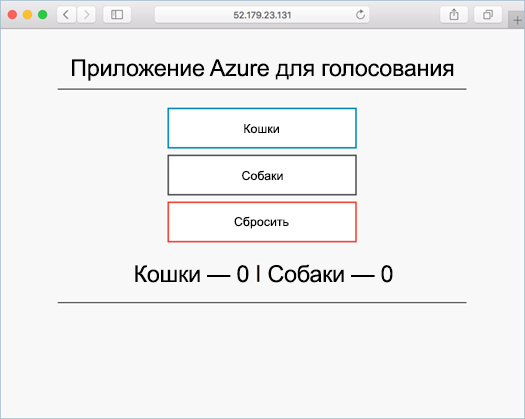

# <a name="tutorial-run-applications-in-azure-kubernetes-service-aks"></a>Руководство по Запуск приложений в Службе Azure Kubernetes (AKS)

Kubernetes предоставляет распределенную платформу для контейнерных приложений. Вы создаете и развертываете собственные приложения и службы в кластере Kubernetes, а также предоставляете кластеру возможность управлять доступностью и подключением. В этом руководстве (часть 4 из 7) выполняется развертывание примера приложения в кластер Kubernetes. Вы узнаете, как выполнять следующие задачи:

> [!div class="checklist"]
> * Обновление файла манифеста Kubernetes
> * Выполнение приложения в Kubernetes.
> * Тестирование приложения

В дополнительных руководствах это приложение масштабируется и обновляется.

В этом руководстве предполагается, что у вас есть некоторое представление о функциях Kubernetes. Дополнительные сведения см. в статье [Ключевые концепции Kubernetes для службы Azure Kubernetes (AKS)][kubernetes-concepts].

## <a name="before-you-begin"></a>Перед началом работы

В предыдущих руководствах приложение упаковывалось в образ контейнера, далее этот образ отправлялся в реестр контейнеров Azure, после чего создавался кластер Kubernetes.

Для работы с этим руководством необходимо предварительно создать файл манифеста Kubernetes `azure-vote-all-in-one-redis.yaml`. Этот файл был скачан вместе с исходным кодом приложения в предыдущем руководстве. Проверьте, клонировали ли вы репозиторий и изменили ли каталоги на клонированный репозиторий. Если вы не выполнили эти действия, вы можете начать с раздела руководства 1 [Создание образов контейнеров][aks-tutorial-prepare-app].

Для выполнения задач из этого руководства требуется Azure CLI 2.0.53 или более поздней версии. Чтобы узнать версию, выполните команду `az --version`. Если вам необходимо выполнить установку или обновление, см. статью [Установка Azure CLI 2.0][azure-cli-install].

## <a name="update-the-manifest-file"></a>Обновление файла манифеста

В этих руководствах экземпляр Реестра контейнеров Azure (ACR) хранит образ контейнера для примера приложения. Для развертывания приложения необходимо обновить имя образа в файле манифеста Kubernetes, чтобы включить имя сервера входа ACR.

Получите имя сервера входа ACR, выполнив команду [az acr list][az-acr-list] следующим образом:

```azurecli
az acr list --resource-group myResourceGroup --query "[].{acrLoginServer:loginServer}" --output table
```

Пример файла манифеста из репозитория git, клонированного в первом руководстве, использует имя сервера входа *microsoft*. Перейдите в клонированный каталог *azure-voting-app-redis*, а затем в текстовом редакторе, например `vi`, откройте файл манифеста:

```console
vi azure-vote-all-in-one-redis.yaml
```

Замените *microsoft* именем сервера входа ACR. Имя образа можно найти в строке 51 файла манифеста. В следующем примере показано имя образа по умолчанию:

```yaml
containers:
- name: azure-vote-front
  image: microsoft/azure-vote-front:v1
```

Укажите собственное имя сервера входа ACR таким образом, чтобы файл манифеста выглядел, как в следующем примере:

```yaml
containers:
- name: azure-vote-front
  image: <acrName>.azurecr.io/azure-vote-front:v1
```

Сохраните и закройте файл. В `vi` используйте команду `:wq`.

## <a name="deploy-the-application"></a>Развертывание приложения

Чтобы развернуть приложение, используйте команду [kubectl apply][kubectl-apply]. Эта команда анализирует файл манифеста и создает заданные объекты Kubernetes. Укажите пример файла манифеста, как показано в следующем примере:

```console
kubectl apply -f azure-vote-all-in-one-redis.yaml
```

В следующем примере выходных данных показано, что ресурсы успешно созданы в кластере AKS:

```
$ kubectl apply -f azure-vote-all-in-one-redis.yaml

deployment "azure-vote-back" created
service "azure-vote-back" created
deployment "azure-vote-front" created
service "azure-vote-front" created
```

## <a name="test-the-application"></a>Тестирование приложения

При запуске приложения Служба Kubernetes предоставляет внешний интерфейс приложения в Интернете. Процесс создания может занять несколько минут.

Чтобы отслеживать ход выполнения, используйте команду [kubectl get service][kubectl-get] с аргументом `--watch`.

```console
kubectl get service azure-vote-front --watch
```

Изначально для параметра *EXTERNAL-IP* (Внешний IP-адрес) службы *azure-vote-front* отображается состояние *pending* (ожидание).

```
azure-vote-front   LoadBalancer   10.0.34.242   <pending>     80:30676/TCP   5s
```

Когда значение *EXTERNAL-IP* изменится с состояния *pending* на ожидаемый IP-адрес, используйте команду `CTRL-C`, чтобы остановить процесс отслеживания `kubectl`. В следующем примере выходных данных показан общедоступный IP-адрес, присвоенный службе:

```
azure-vote-front   LoadBalancer   10.0.34.242   52.179.23.131   80:30676/TCP   67s
```

Чтобы увидеть приложение в действии, откройте в веб-браузере внешний IP-адрес вашей службы.



Если не удалось загрузить приложение, возможно, возникла проблема с авторизацией реестра образов. Чтобы просмотреть состояние контейнеров, используйте команду `kubectl get pods`. Если образы контейнера невозможно извлечь, ознакомьтесь с разделом [Доступ с помощью секрета Kubernetes](https://docs.microsoft.com/azure/container-registry/container-registry-auth-aks#access-with-kubernetes-secret).

## <a name="next-steps"></a>Дополнительная информация

В этом руководстве пример приложения Azure для голосования был развернут в кластере Kubernetes Службы контейнеров Azure. Вы научились выполнять следующие задачи:

> [!div class="checklist"]
> * Обновление файлов манифестов Kubernetes.
> * Выполнение приложения в Kubernetes.
> * Тестирование приложения

Перейдите к следующему руководству, чтобы узнать о способах масштабировании приложения Kubernetes и базовой инфраструктуре Kubernetes.

> [!div class="nextstepaction"]
> [Масштабирование pod и инфраструктуры Kubernetes][aks-tutorial-scale]

<!-- LINKS - external -->
[kubectl-apply]: https://kubernetes.io/docs/reference/generated/kubectl/kubectl-commands#apply
[kubectl-create]: https://kubernetes.io/docs/reference/generated/kubectl/kubectl-commands#create
[kubectl-get]: https://kubernetes.io/docs/reference/generated/kubectl/kubectl-commands#get

<!-- LINKS - internal -->
[aks-tutorial-prepare-app]: ./tutorial-kubernetes-prepare-app.md
[aks-tutorial-scale]: ./tutorial-kubernetes-scale.md
[az-acr-list]: /cli/azure/acr
[azure-cli-install]: /cli/azure/install-azure-cli
[kubernetes-concepts]: concepts-clusters-workloads.md
[kubernetes-service]: concepts-network.md#services
