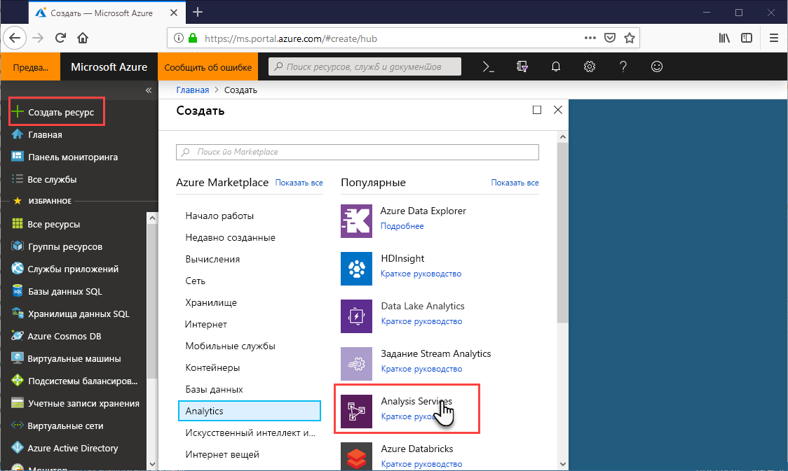

# Краткое руководство по созданию сервера с помощью портала

В этом кратком руководстве описывается создание ресурса сервера Analysis Services в подписке Azure с помощью портала.

## предварительные требования 

* **Подписка Azure**: откройте ссылку на [бесплатную пробную версию Azure](https://azure.microsoft.com/offers/ms-azr-0044p/), чтобы создать учетную запись.
* **Azure Active Directory**: ваша подписка должна быть связана с клиентом Azure Active Directory. И необходимо войти в Azure с учетной записью в этом Azure Active Directory. Дополнительные сведения см. в руководстве по [аутентификации и настройке пользовательских разрешений](analysis-services-manage-users.md).

## Вход на портал Azure 

[Войдите на портал](https://portal.azure.com).

## Создание сервера

1. Выберите **+ Создать ресурс** > **Аналитика** > **Службы Analysis Services**.

    

2. В колонке **Службы Analysis Services** заполните обязательные поля и нажмите кнопку **Создать**.
   
   * **Имя сервера**: введите уникальное имя, используемое для обращения к серверу. Имя сервера должно начинаться со строчной буквы и содержать от 3 до 128 знаков нижнего регистра и цифры. Пробелы и специальные символы не допускаются.
   * **Подписка**: выберите подписку, с которой будет связан этот сервер.
   * **Группа ресурсов**: создайте новую группу ресурсов или выберите уже имеющуюся. Группы ресурсов предназначены для управления коллекцией ресурсов Azure. Дополнительные сведения см. в описании [групп ресурсов](../azure-resource-manager/management/overview.md).
   * **Расположение**: в этом расположении центра обработки данных Azure размещается сервер. Выберите расположение, ближайшее к крупнейшей имеющейся базе пользователей.
   * **Ценовая категория**: выберите ценовую категорию. Если вы тестируете и собираетесь установить пример шаблона базы данных модели, выберите свободный уровень **D1**. Дополнительные сведения см. в разделе [цен на службы Azure Analysis Services](https://azure.microsoft.com/pricing/details/analysis-services/). 
   * **Администратор**: по умолчанию это будет учетная запись, с которой вы вошли в систему. Вы можете выбрать другую учетную запись в Azure Active Directory.
   * **Настройка резервного хранилища**: необязательно. Если у вас уже есть [учетная запись хранения](../storage/common/storage-introduction.md), вы можете указать ее как резервную копию шаблона базы данных по умолчанию. Вы также можете указать [параметры резервного копирования и восстановления](analysis-services-backup.md) позже.
   * **Истечение срока хранения ключа**: необязательно. Укажите период истечения срока хранения ключа.

Создание сервера обычно занимает меньше минуты. Если был выбран параметр **Add to Portal** (Добавить на портал), перейдите на портал, чтобы просмотреть новый сервер. Или перейдите по меню **Все службы** > **Analysis Services**, чтобы проверить, готов ли ваш сервер. Серверы поддерживают табличные модели на уровне совместимости 1200 и выше. Уровень совместимости модели указывается в Visual Studio или SSMS.

## Очистка ресурсов

Если сервер больше не нужен, удалите его. В разделе **Обзор** вашего сервера нажмите кнопку **Удалить**. 

 

## Дальнейшие действия
В этом кратком руководстве вы узнали, как создать сервер в своей подписке Azure. Теперь, когда у вас есть сервер, вы можете защитить его, настроив брандмауэр сервера (необязательно). Можно также добавить базовый образец модели данных на сервер непосредственно с портала. Наличие образца модели полезно для изучения настройки ролей модели базы данных и тестирования клиентских подключений. Для получения дополнительных сведений перейдите к руководству по добавлению образца модели.

> [!div class="nextstepaction"]
> [Краткое руководство. Настройка брандмауэра сервера с помощью портала](analysis-services-qs-firewall.md)   