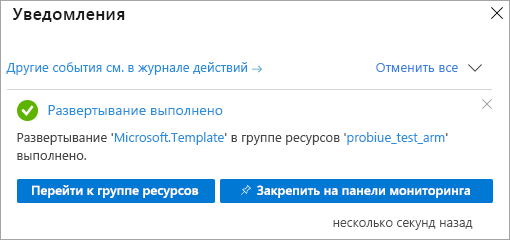

# <a name="quickstart-create-a-server---arm-template"></a>Краткое руководство. Создание сервера — шаблон ARM

В этом кратком руководстве показано, как создать ресурс сервера Analysis Services в подписке Azure с помощью шаблона Azure Resource Manager (шаблона ARM).

[!INCLUDE [About Azure Resource Manager](../../includes/resource-manager-quickstart-introduction.md)]

Если среда соответствует предварительным требованиям и вы знакомы с использованием шаблонов ARM, нажмите кнопку **Развертывание в Azure**. Шаблон откроется на портале Azure.

[](https://portal.azure.com/#create/Microsoft.Template/uri/https%3A%2F%2Fraw.githubusercontent.com%2FAzure%2Fazure-quickstart-templates%2Fmaster%2F101-analysis-services-create%2Fazuredeploy.json)

## <a name="prerequisites"></a>Предварительные требования

* **Подписка Azure**: Откройте ссылку на [бесплатную пробную версию Azure](https://azure.microsoft.com/offers/ms-azr-0044p/), чтобы создать учетную запись.
* **Azure Active Directory**. Ваша подписка должна быть связана с клиентом Azure Active Directory. И необходимо войти в Azure с учетной записью в этом Azure Active Directory. Дополнительные сведения см. в руководстве по [аутентификации и настройке пользовательских разрешений](analysis-services-manage-users.md).

## <a name="review-the-template"></a>Изучение шаблона

Шаблон, используемый в этом кратком руководстве, взят из [шаблонов быстрого запуска Azure](https://azure.microsoft.com/resources/templates/101-analysis-services-create/).

:::code language="json" source="~/quickstart-templates/101-analysis-services-create/azuredeploy.json" range="1-79" highlight="63-78":::

В шаблоне определяется один ресурс [Microsoft.AnalysisServices/Servers](/azure/templates/microsoft.analysisservices/servers) с правилом брандмауэра.

## <a name="deploy-the-template"></a>Развертывание шаблона

1. Выберите следующую ссылку "Развертывание в Azure", чтобы войти на портал Azure и открыть шаблон. Шаблон используется для создания ресурса сервера Analysis Services и указания обязательных и дополнительных свойств.

   [](https://portal.azure.com/#create/Microsoft.Template/uri/https%3A%2F%2Fraw.githubusercontent.com%2FAzure%2Fazure-quickstart-templates%2Fmaster%2F101-analysis-services-create%2Fazuredeploy.json)

2. Введите или выберите следующие значения.

    Если не указано иное, используйте значения по умолчанию.

    * **Подписка**: Выберите подписку Azure.
    * **Группа ресурсов.** Щелкните **Создать** и введите уникальное имя новой группы ресурсов.
    * **Расположение.** Выберите расположение по умолчанию для ресурсов, созданных в группе ресурсов.
    * **Имя сервера**. Введите имя для ресурсов сервера. 
    * **Расположение.** Игнорируйте для Analysis Services. Расположение указывается в поле "Расположение сервера".
    * **Расположение сервера**. Введите расположение сервера Analysis Services. Обычно это тот же регион, что и у расположения по умолчанию, заданного для группы ресурсов, но это не обязательно. Например, **Центрально-северная часть США**. Сведения о поддерживаемых регионах см. в разделе [Доступность по регионам](analysis-services-overview.md#availability-by-region).
    * **Имя SKU**. Введите имя SKU для создаваемого сервера Analysis Services. Выберите один из следующих типов. B1, B2, D1, S0, S1, S2, S3, S4, S8v2, S9v2. Доступность SKU зависит от региона. Для оценки и тестирования рекомендуется использовать типы S0 или D1.
    * **Capacity**. Введите общее число масштабируемых экземпляров реплики запроса. Горизонтальное масштабирование более чем для одного экземпляра поддерживается только в выбранных регионах.
    * **Параметры брандмауэра**. Введите правила брандмауэра для входящего трафика, которые необходимо определить для сервера. Если этот параметр не указан, брандмауэр отключен.
    * **Backup Blob Container URI** (URI контейнера BLOB-объектов резервного копирования). Укажите для URI SAS частный контейнер хранилища BLOB-объектов Azure с разрешениями на чтение, запись и перечисление. Требуется только в том случае, если вы планируете использовать [резервное копирование и восстановление](analysis-services-backup.md).
    * **I agree to the terms and conditions state above** (Я принимаю указанные выше условия). Установите этот флажок.

3. Щелкните **Приобрести**. После успешного развертывания сервера вы получите уведомление:

   

## <a name="validate-the-deployment"></a>Проверка развертывания

Чтобы убедиться, что группа ресурсов и ресурс сервера созданы, используйте портал Azure или Azure PowerShell.

### <a name="powershell"></a>PowerShell

```azurepowershell-interactive
$resourceGroupName = Read-Host -Prompt "Enter the Resource Group name"
(Get-AzResource -ResourceType "Microsoft.AnalysisServices/servers" -ResourceGroupName $resourceGroupName).Name
 Write-Host "Press [ENTER] to continue..."
```

---

## <a name="clean-up-resources"></a>Очистка ресурсов

Чтобы удалить группу ресурсов и ресурс сервера, используйте портал Azure, Azure CLI или Azure PowerShell.

# <a name="cli"></a>[CLI](#tab/CLI)

```azurecli-interactive
echo "Enter the Resource Group name:" &&
read resourceGroupName &&
az group delete --name $resourceGroupName &&
echo "Press [ENTER] to continue ..."
```

# <a name="powershell"></a>[PowerShell](#tab/PowerShell)

```azurepowershell-interactive
$resourceGroupName = Read-Host -Prompt "Enter the Resource Group name"
Remove-AzResourceGroup -Name $resourceGroupName
Write-Host "Press [ENTER] to continue..."
```

---

## <a name="next-steps"></a>Дальнейшие действия

В этом кратком руководстве показано, как создать группу ресурсов и ресурс сервера Azure Analysis Services с помощью шаблона ARM. Создав ресурс сервера с помощью шаблона, ознакомьтесь со следующими материалами:

- [Краткое руководство. Создание сервера с помощью PowerShell](analysis-services-create-powershell.md)
- [Добавление примера модели с портала](analysis-services-create-sample-model.md)
- [Настройка ролей администратора и пользователя сервера](tutorials/analysis-services-tutorial-roles.md)
