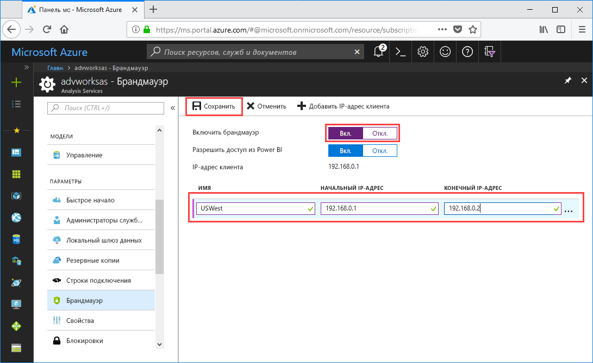

# Краткое руководство. Настройка брандмауэра сервера с помощью портала

Это краткое руководство поможет настроить брандмауэр для сервера Azure Analysis Services. Включение брандмауэра и настройка диапазонов IP-адресов только для тех компьютеров, которые имеют доступ к серверу, является важной частью процесса защиты сервера и данных.

## Предварительные требования

- Подписка на сервер служб Analysis Services. Дополнительные сведения см. в статье [ Краткое руководство по созданию сервера с помощью портала](analysis-services-create-server.md) или [ Краткое руководство по созданию сервера с помощью PowerShell](analysis-services-create-powershell.md).
- Один или несколько диапазонов IP-адресов для клиентских компьютеров (при необходимости).
- Обратите внимание, что сценарий импорта из Power BI Premium сейчас не поддерживается.

## Вход на портал Azure 

[Войдите на портал](https://portal.azure.com).

## Настройка брандмауэра

1. Чтобы открыть страницу обзора, щелкните сервер. 
2. Во вкладках **ПАРАМЕТРЫ** > **Брандмауэр** > **Включить брандмауэр** щелкните кнопку **Включить**.
3. Чтобы разрешить доступ к DirectQuery из службы Power BI для поля **Разрешить доступ из Power BI**, нажмите кнопку **Включить**.  
4. (Необязательно) Укажите один или несколько диапазонов IP-адресов. Введите имя, начальный и конечный IP-адрес для каждого из диапазонов. Длина имени правила брандмауэра не должна превышать 128 знаков и может содержать только прописные и строчные буквы, цифры, подчеркивания и дефис. Пробелы и другие специальные символы не допускаются.
5. Выберите команду **Сохранить**.

     

## Очистка ресурсов

Удалите диапазоны IP-адресов или отключите брандмауэр, когда они больше не нужны.

## Дополнительная информация
Из этого краткого руководства вы узнали, как настроить брандмауэр для сервера. Теперь, когда сервер защищен брандмауэром, можно добавить к нему базовый образец модели данных с портала. Наличие образца модели полезно, чтобы изучить настройку ролей шаблонов базы данных и тестирование клиентских подключений. Для получения дополнительных сведений перейдите к руководству по добавлению образца модели.

> [!div class="nextstepaction"]
> [Руководство. Добавление примера модели на сервер](analysis-services-create-sample-model.md)
