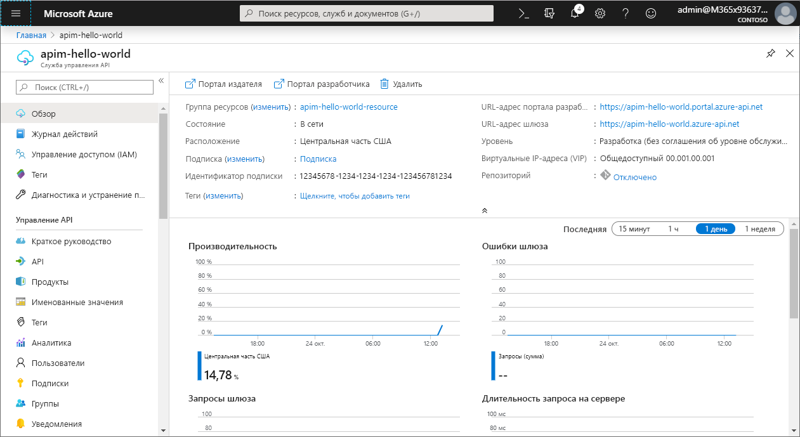
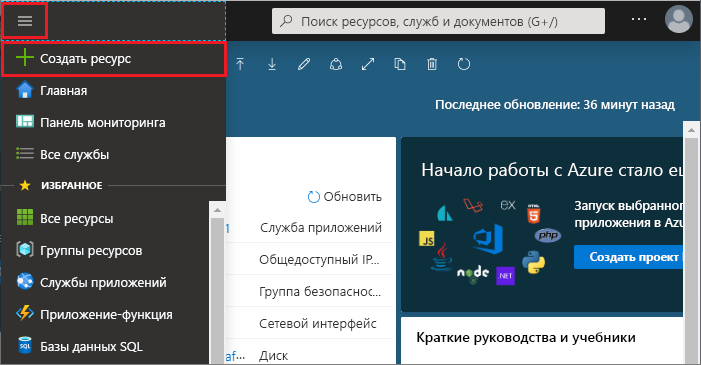
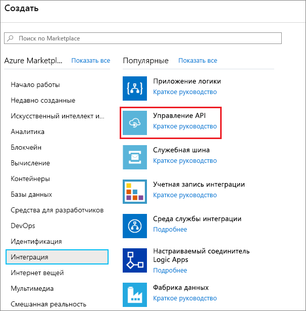
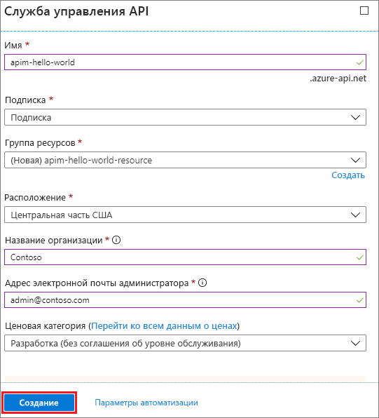
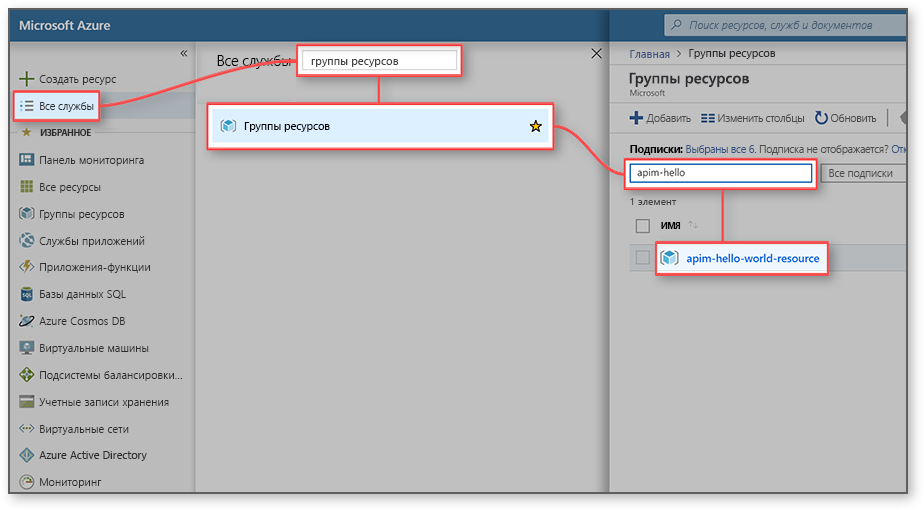
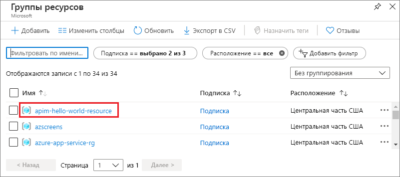
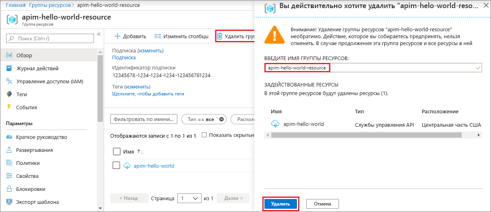

# Создание экземпляра службы управления API Azure

Служба управления API Azure помогает организациям публиковать API-интерфейсы для внешних пользователей, партнеров и собственных разработчиков, раскрывая таким образом потенциал своих данных и услуг. Служба управления API предоставляет базовые возможности для успешного выполнения программы API за счет привлечения разработчиков, бизнес-аналитики, анализа, безопасности и защищенности. Служба управления API позволяет создавать современные шлюзы API для существующих серверных служб, размещенных в любом месте, и управлять ими. Дополнительные сведения см. в разделе [общих сведений](api-management-key-concepts.md).

В этом кратком руководстве описаны шаги по созданию экземпляра службы управления API с помощью портала Azure.

[!INCLUDE [quickstarts-free-trial-note](../../includes/quickstarts-free-trial-note.md)]

## Вход в Azure

Войдите на [портал Azure](https://portal.azure.com).

## Создание службы

1. В меню портала Azure выберите **Создать ресурс**. Вы также можете выбрать команду **Cоздать ресурс** на **домашней странице** Azure. 
   
   
   
1. На экране **Создать** выберите **Интеграция**, а затем выберите **Управление API**.
   
   
   
1. В окне **Служба управления API** введите настройки.
   
   
   
   | Параметр                 | Рекомендуемое значение                               | Описание                                                                                                                                                                                                                                                                                                                         |
|-------------------------|-----------------------------------------------|-------------------------------------------------------------------------------------------------------------------------------------------------------------------------------------------------------------------------------------------------------------------------------------------------------------------------------------|
| **имя**;                | Уникальное имя для вашей службы управления API | Это имя нельзя будет изменить позже. Имя службы используется для создания имени домена по умолчанию в форме *{имя}.azure-api.net.* Если планируется использовать собственное доменное имя, см. статью [Настройка доменного имени](configure-custom-domain.md).   Имя службы используется для обращения к службе и соответствующему ресурсу Azure. |
| **Подписка**        | Ваша подписка                             | Подписка, в которой будет создан новый экземпляр службы. Можно выбрать одну из различных подписок Azure, к которым у вас есть доступ.                                                                                                                                                            |
| **Группа ресурсов**      | *apimResourceGroup*                           | Можно выбрать новый или существующий ресурс. Группа ресурсов — это коллекция ресурсов с одинаковым жизненным циклом, разрешениями и политиками. Дополнительные сведения см. [здесь](../azure-resource-manager/management/overview.md#resource-groups).                                                                                                  |
| **Расположение**            | *Западная часть США*                                    | Выберите ближайший к вам географический регион. В раскрывающемся списке отображаются только доступные регионы службы управления API.                                                                                                                                                                                                          |
| **Название организации**   | Название вашей организации                 | Это имя используется в нескольких местах, включая заголовок портала разработчика и отправителя уведомлений по электронной почте.                                                                                                                                                                                                             |
| **Адрес электронной почты администратора** | *admin\@org.com*                               | Укажите адрес электронной почты, на который будут отправляться все уведомления **службы управления API**.                                                                                                                                                                                                                                              |
| **Ценовая категория**        | *Разработчик*                                   | Укажите категорию **Разработчик** для оценки службы. Эта категория не предназначена для производственных целей. Дополнительные сведения о масштабировании категорий службы управления API см. в статье о [повышении категории и масштабировании](upgrade-and-scale.md).                                                                                                                                    |

3. Выберите **Создать**.

    > [!TIP]
    > Обычно создание службы управления API занимает от 20 до 30 минут. При выборе параметра **Закрепить на панели мониторинга** поиск только что созданной службы упрощается.

[!INCLUDE [api-management-navigate-to-instance](../../includes/api-management-navigate-to-instance.md)]

## Очистка ресурсов

Когда группа ресурсов и все связанные с ней ресурсы будут не нужны, их можно удалить. Для этого выполните следующие действия.

1. Войдите на портал Azure; найдите в поиске и выберите **Группы ресурсов**. Можно также выбрать **Группы ресурсов** на **домашней странице**. 

   

1. На странице **Группы ресурсов** выберите свою группу ресурсов.

   

1. На странице группы ресурсов выберите **Удалить группу ресурсов**. 
   
1. Введите имя группы ресурсов, которую необходимо удалить, и щелкните **Удалить**.

   

## Дальнейшие действия

> [!div class="nextstepaction"]
> [Импорт и публикация первого API](import-and-publish.md)

Хотите оптимизировать и сократить ваши расходы на облако?

> [!div class="nextstepaction"]
> [Начните анализировать затраты с помощью службы "Управление затратами"](https://docs.microsoft.com/azure/cost-management-billing/costs/quick-acm-cost-analysis?WT.mc_id=costmanagementcontent_docsacmhorizontal_-inproduct-learn)