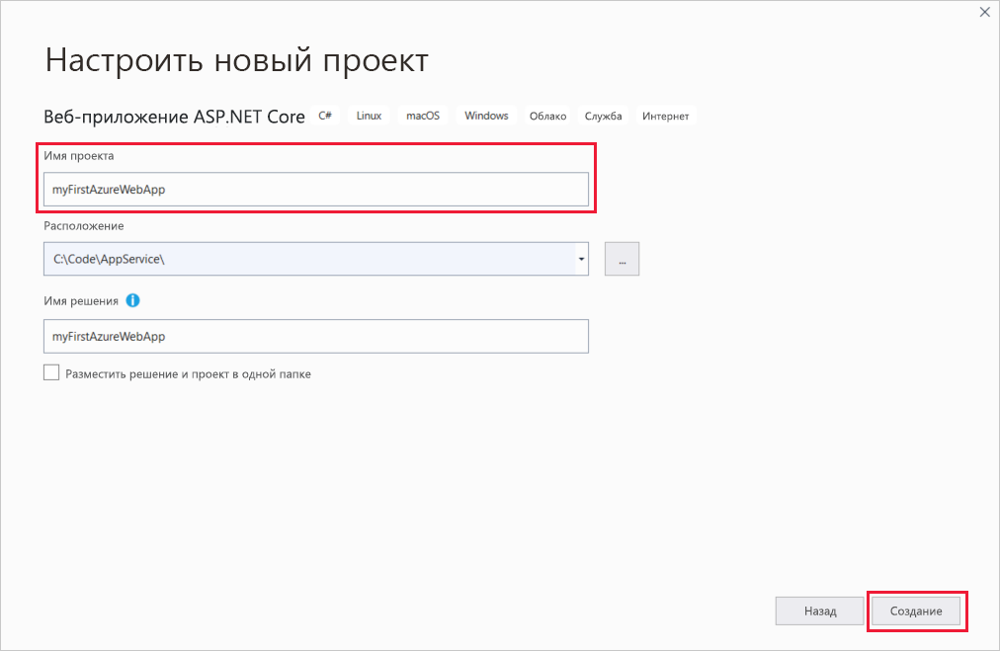
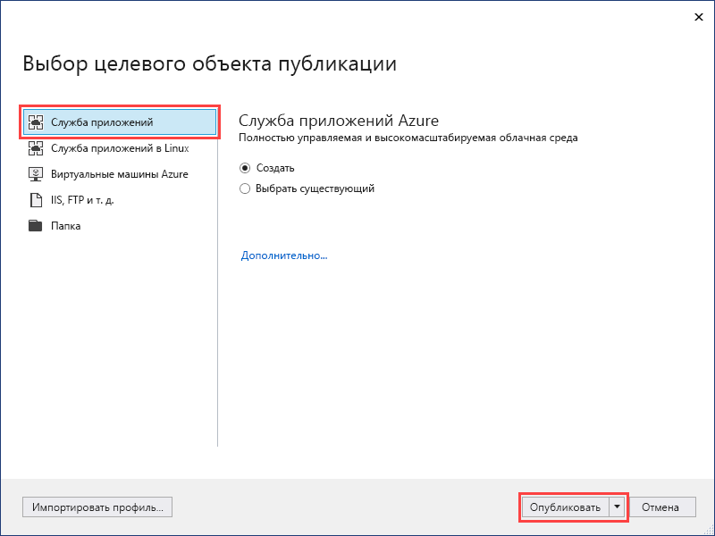
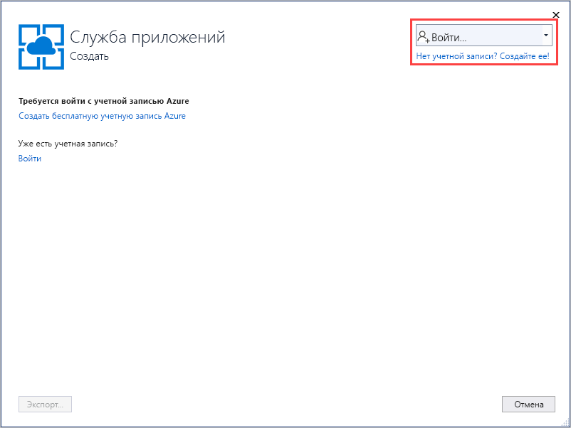
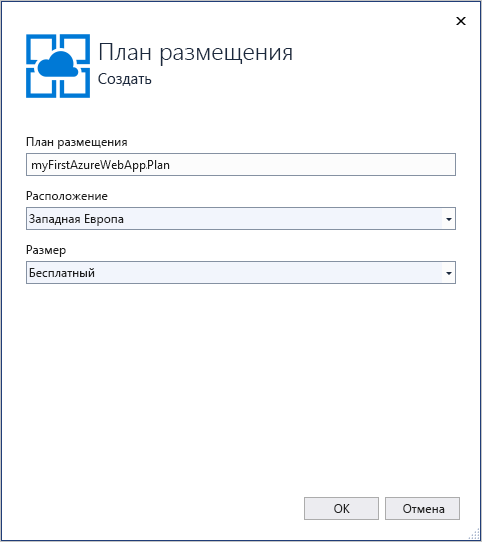
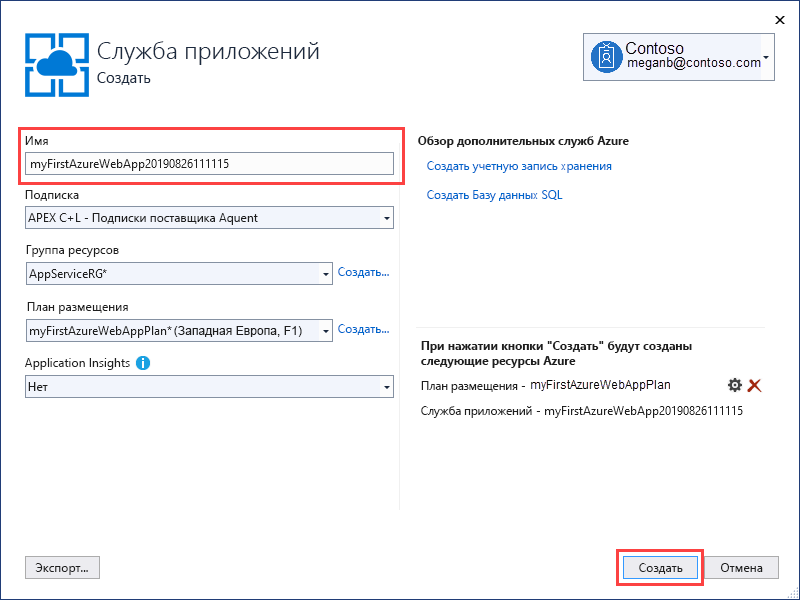
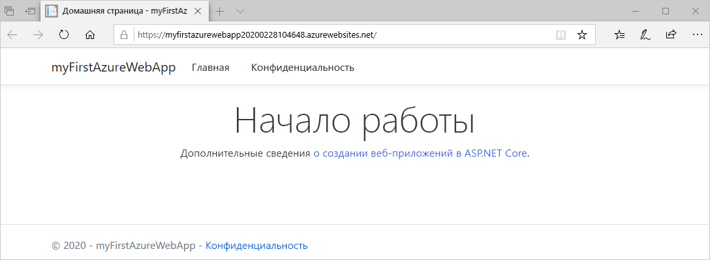
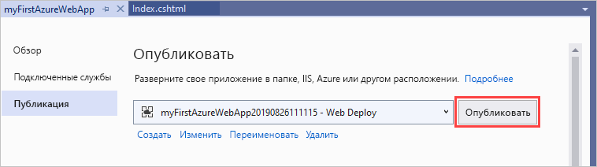
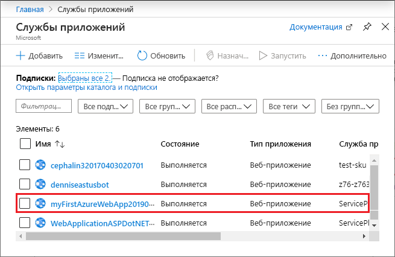
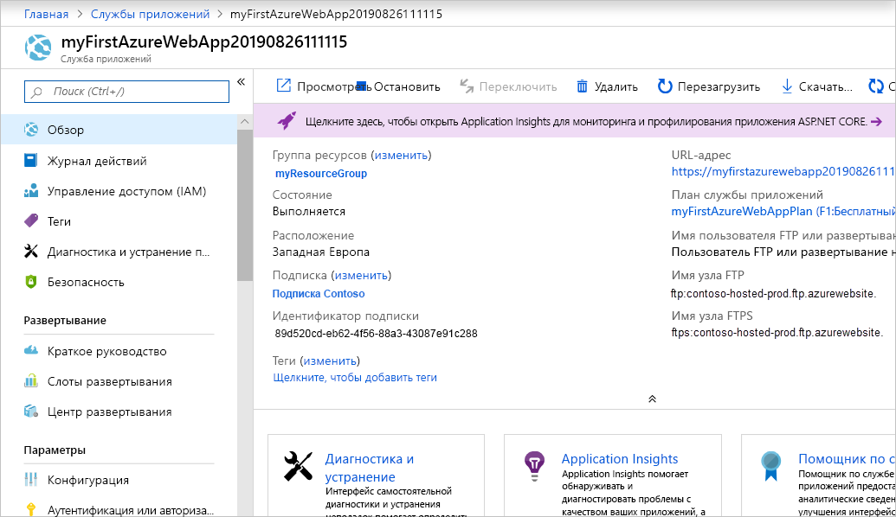

# <a name="create-an-aspnet-core-web-app-in-azure"></a>Создание веб-приложения ASP.NET Core в Azure

> [!NOTE]
> В этой статье мы развернем приложение в службе приложений на платформе Windows. Чтобы развернуть приложение .NET Core в службе приложений на платформе _Linux_, см. статью [Создание веб-приложения .NET Core в службе приложений на платформе Linux](./containers/quickstart-dotnetcore.md).
>

[Служба приложений Azure](overview.md) — это служба веб-размещения с самостоятельной установкой исправлений и высоким уровнем масштабируемости.

В этом кратком руководстве рассматривается развертывание веб-приложения ASP.NET Core в Службе приложений Azure. В результате будет создана группа ресурсов, состоящая из плана и приложения Службы приложений с развернутым веб-приложением.

[!INCLUDE [quickstarts-free-trial-note](../../includes/quickstarts-free-trial-note.md)]

## <a name="prerequisites"></a>Предварительные требования

Для работы с этим руководством установите <a href="https://www.visualstudio.com/downloads/" target="_blank">Visual Studio 2019</a> с рабочей нагрузкой **ASP.NET и разработка веб-приложений**.

Если у вас уже установлена версия Visual Studio 2019, сделайте следующее.

- Установите последние обновления для Visual Studio, выбрав **Справка** > **Проверить обновления**.
- Добавьте рабочую нагрузку, выбрав **Инструменты** > **Получить средства и компоненты**.

## <a name="create-an-aspnet-core-web-app"></a>Создание веб-приложения ASP.NET Core

Создайте веб-приложение ASP.NET Core, сделав следующее:

1. Откройте Visual Studio и выберите **Создать проект**.

1. В окне **Создание проекта** найдите и выберите **Веб-приложение ASP.NET Core** для C#, а затем щелкните **Далее**.

1. В окне **Настройка проекта** присвойте приложению имя _myFirstAzureWebApp_ и щелкните **Создать**.

   

1. Для работы с этим кратким руководством выберите шаблон **Веб-приложение**. В параметрах аутентификации выберите только значение **Без аутентификации**. Нажмите кнопку **Создать**.

   

    Вы можете развернуть в Azure веб-приложения ASP.NET Core любого типа.

1. В меню Visual Studio выберите **Отладка** > **Запустить без отладки**, чтобы запустить приложение локально.

   

## <a name="publish-your-web-app"></a>Публикация веб-приложения

1. Щелкните правой кнопкой мыши проект **myFirstAzureWebApp** в **обозревателе решений** и выберите **Опубликовать**.

1. Выберите **Служба приложений** и щелкните **Опубликовать**.

   

1. Выбор параметров на странице **создания Службы приложений** зависит от того, вошли ли вы в Azure и есть ли у вас учетная запись Visual Studio, связанная с учетной записью Azure. Выберите **Добавить учетную запись** или **Войти**, чтобы войти в подписку Azure. Если вы уже вошли, выберите нужную учетную запись.

   > [!NOTE]
   > Если вы уже выполнили вход, пока не нажимайте кнопку **Создать**.
   >

   

   [!INCLUDE [resource group intro text](../../includes/resource-group.md)]

1. В разделе **Группа ресурсов** выберите **Создать**.

1. В разделе **Новое имя группы ресурсов** введите *myResourceGroup* и щелкните **ОК**.

   [!INCLUDE [app-service-plan](../../includes/app-service-plan.md)]

1. В разделе **План размещения** щелкните **Создать**.

1. В разделе **Настройка плана размещения** введите значения из следующей таблицы и щелкните **ОК**.

   | Параметр | Рекомендуемое значение | ОПИСАНИЕ |
   |-|-|-|
   |План обслуживания приложения| myAppServicePlan | Имя плана службы приложений. |
   | Location | Западная Европа | Центр обработки данных, где размещается веб-приложение. |
   | Размер | Free | [Ценовая категория](https://azure.microsoft.com/pricing/details/app-service/?ref=microsoft.com&utm_source=microsoft.com&utm_medium=docs&utm_campaign=visualstudio) определяет возможности размещения. |

   

1. В поле **Имя** введите уникальное имя приложения, включающее только допустимые символы: `a-z`, `A-Z`, `0-9` и `-`. Вы можете использовать автоматически созданное уникальное имя. URL-адрес веб-приложения: `http://<app_name>.azurewebsites.net`, где `<app_name>` — имя приложения.

   

1. Нажмите кнопку **Создать**, чтобы начать создавать ресурсы Azure.

Когда мастер завершит работу, веб-приложение ASP.NET Core будет опубликовано в Azure и запущено в браузере по умолчанию.



Имя приложения, указанное на странице **создания приложения в Службе приложений**, используется как префикс URL-адреса в формате `http://<app_name>.azurewebsites.net`.

**Поздравляем!** Ваше веб-приложение ASP.NET Core работает в Службе приложений Azure в реальном времени.

## <a name="update-the-app-and-redeploy"></a>Обновление и повторное развертывание приложения

1. В **обозревателе решений** в проекте откройте **Страницы** > **Index.cshtml**.

1. Замените содержимое двух тегов `<div>` кодом, приведенным ниже:

   ```HTML
   <div class="jumbotron">
       <h1>ASP.NET in Azure!</h1>
       <p class="lead">This is a simple app that we’ve built that demonstrates how to deploy a .NET app to Azure App Service.</p>
   </div>
   ```

1. Чтобы выполнить повторное развертывание в Azure, щелкните правой кнопкой мыши проект **myFirstAzureWebApp** в **обозревателе решений**, а затем выберите **Опубликовать**.

1. На странице **Публикация** со сводными сведениями щелкните **Опубликовать**.

   

По завершении публикации Visual Studio открывает в браузере страницу с URL-адресом веб-приложения.


## <a name="manage-the-azure-app"></a>Управление приложением Azure

1. Перейдите на <a href="https://portal.azure.com" target="_blank">портал Azure</a> для управления веб-приложением.

1. В меню слева выберите **Службы приложений**, а затем щелкните имя своего приложения Azure.

   

   Отобразится страница обзора вашего веб-приложения. Здесь вы можете выполнять базовые задачи управления: просмотр, завершение, запуск, перезагрузку и удаление.

   

   В меню слева доступно несколько страниц для настройки приложения.

[!INCLUDE [Clean-up section](../../includes/clean-up-section-portal.md)]

## <a name="next-steps"></a>Дополнительная информация

> [!div class="nextstepaction"]
> [Использование ASP.NET Core с базой данных SQL](app-service-web-tutorial-dotnetcore-sqldb.md)
