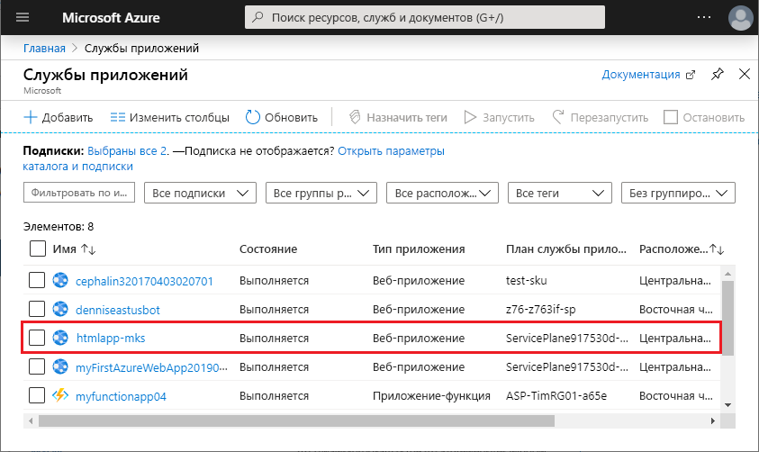
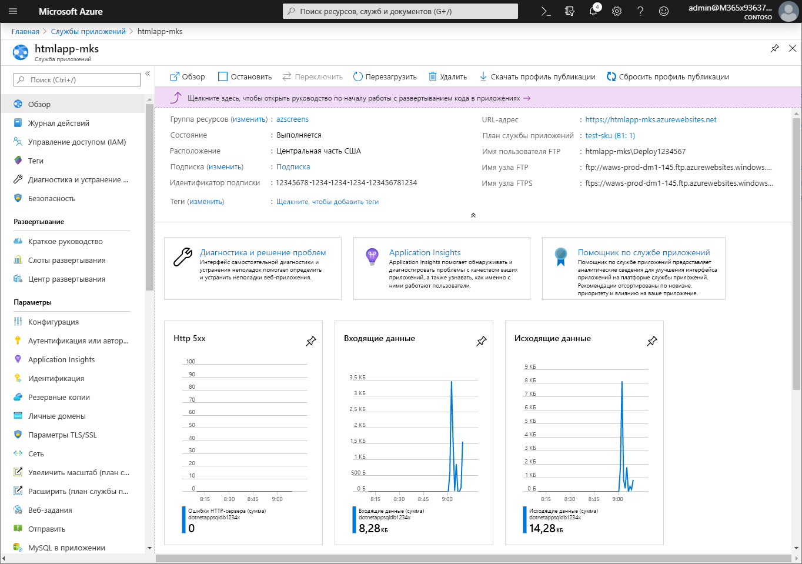

# <a name="create-a-static-html-web-app-in-azure"></a>Создание статического веб-приложения HTML в Azure

[Служба приложений Azure](overview.md) — это служба веб-размещения с самостоятельной установкой исправлений и высоким уровнем масштабируемости. В этом кратком руководстве объясняется, как развернуть простейший сайт HTML+CSS в Служба приложений Azure. Действия в этом руководстве выполняются в [Cloud Shell](https://docs.microsoft.com/azure/cloud-shell/overview), но эти же команды можно выполнить локально в [Azure CLI](/cli/azure/install-azure-cli).


[!INCLUDE [quickstarts-free-trial-note](../../includes/quickstarts-free-trial-note.md)]

[!INCLUDE [cloud-shell-try-it.md](../../includes/cloud-shell-try-it.md)]

## <a name="download-the-sample"></a>Скачивание примера приложения

В Cloud Shell создайте каталог quickstart и перейдите в него.

```bash
mkdir quickstart

cd $HOME/quickstart
```

Затем выполните следующую команду, чтобы клонировать репозиторий с примером приложения в локальный каталог quickstart.

```bash
git clone https://github.com/Azure-Samples/html-docs-hello-world.git
```

## <a name="create-a-web-app"></a>Создание веб-приложения

Перейдите в каталог, в котором содержится пример кода, и выполните команду `az webapp up`.

В следующем примере замените <app_name> уникальным именем приложения.

```bash
cd html-docs-hello-world

az webapp up --location westeurope --name <app_name>
```

Команда `az webapp up` выполняет следующие действия:

- создание группы ресурсов по умолчанию;

- создание плана службы приложений по умолчанию;

- создание приложения с указанным именем.

- [Разверните ZIP-файлы](https://docs.microsoft.com/azure/app-service/deploy-zip) для веб-приложения из текущего рабочего каталога.

Выполнение этой команды может занять несколько минут. При выполнении эта команда выводит приблизительно следующие сведения:

```json
{
  "app_url": "https://<app_name>.azurewebsites.net",
  "location": "westeurope",
  "name": "<app_name>",
  "os": "Windows",
  "resourcegroup": "appsvc_rg_Windows_westeurope",
  "serverfarm": "appsvc_asp_Windows_westeurope",
  "sku": "FREE",
  "src_path": "/home/<username>/quickstart/html-docs-hello-world ",
  < JSON data removed for brevity. >
}
```

Запишите значение `resourceGroup`. Оно потребуется при выполнении задач в разделе об [очистке ресурсов](#clean-up-resources).

## <a name="browse-to-the-app"></a>Переход в приложение

В браузере перейдите по URL-адресу приложения: `http://<app_name>.azurewebsites.net`.

Страница выполняется как веб-приложение службы приложений Azure.


**Поздравляем!** Вы развернули свое первое HTML-приложение в службе приложений.

## <a name="update-and-redeploy-the-app"></a>Обновление и повторное развертывание приложения

В Cloud Shell введите `nano index.html`, чтобы открыть текстовый редактор Nano. В теге заголовка `<h1>` измените запись "Azure App Service - Sample Static HTML Site" (Служба приложений Azure — пример статического HTML-сайта) на "Azure App Service" (Служба приложений Azure), как показано ниже.


Сохраните изменения и выйдите из редактора Nano. Выполните команду `^O`, чтобы сохранить файл, и `^X` — чтобы выйти.

Теперь повторно разверните приложение с помощью той же команды `az webapp up`.

```bash
az webapp up --location westeurope --name <app_name>
```

После завершения развертывания перейдите в окно браузера, открытое на шаге **перехода в приложение**, и обновите страницу.


## <a name="manage-your-new-azure-app"></a>Управление новым приложением Azure

Перейдите на <a href="https://portal.azure.com" target="_blank">портал Azure</a> для управления созданным веб-приложением.

В меню слева щелкните **Службы приложений**, а затем — имя своего приложения Azure.



Отобразится страница обзора вашего веб-приложения. Вы можете выполнять базовые задачи управления: обзор, завершение, запуск, перезагрузку и удаление.



В меню слева доступно несколько страниц для настройки приложения.

## <a name="clean-up-resources"></a>Очистка ресурсов

На предыдущем шаге вы создали ресурсы Azure в группе ресурсов. Если эти ресурсы вам не понадобятся в будущем, вы можете удалить группу ресурсов, выполнив приведенную ниже команду в Cloud Shell. Помните, что имя группы ресурсов автоматически создано на этапе [создания веб-приложения](#create-a-web-app).

```bash
az group delete --name appsvc_rg_Windows_westeurope
```

Ее выполнение может занять до минуты.

## <a name="next-steps"></a>Дополнительная информация

> [!div class="nextstepaction"]
> [Сопоставление пользовательского домена](app-service-web-tutorial-custom-domain.md)
