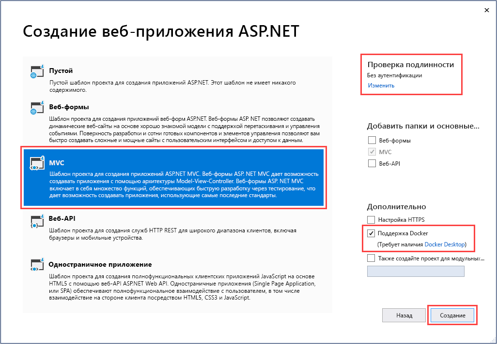
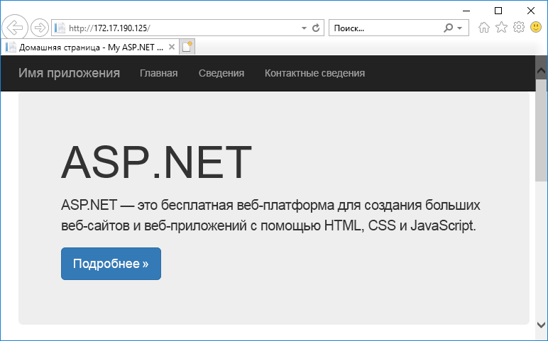
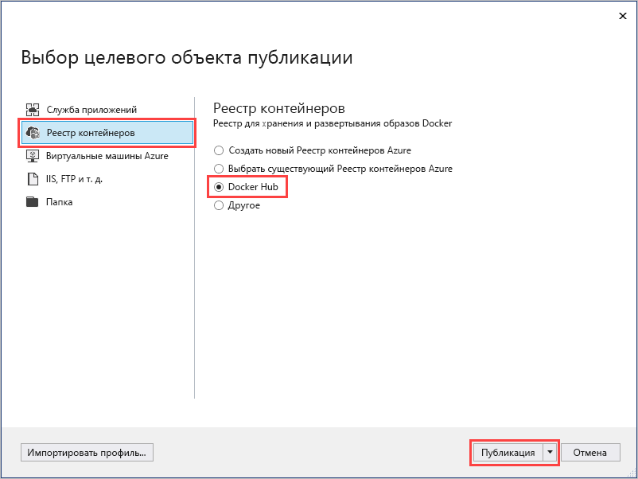
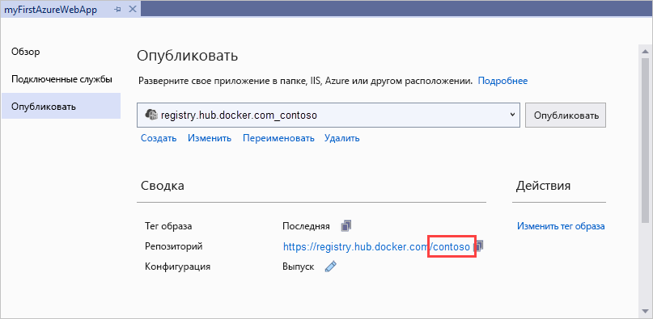
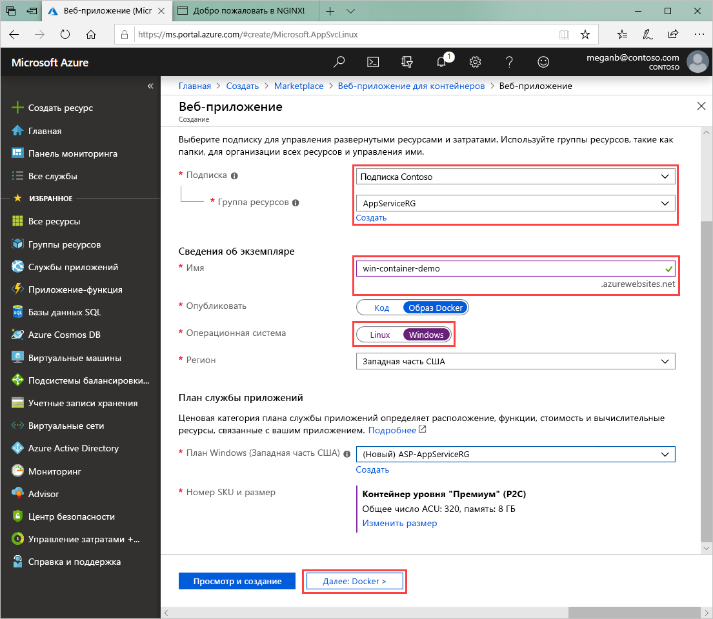
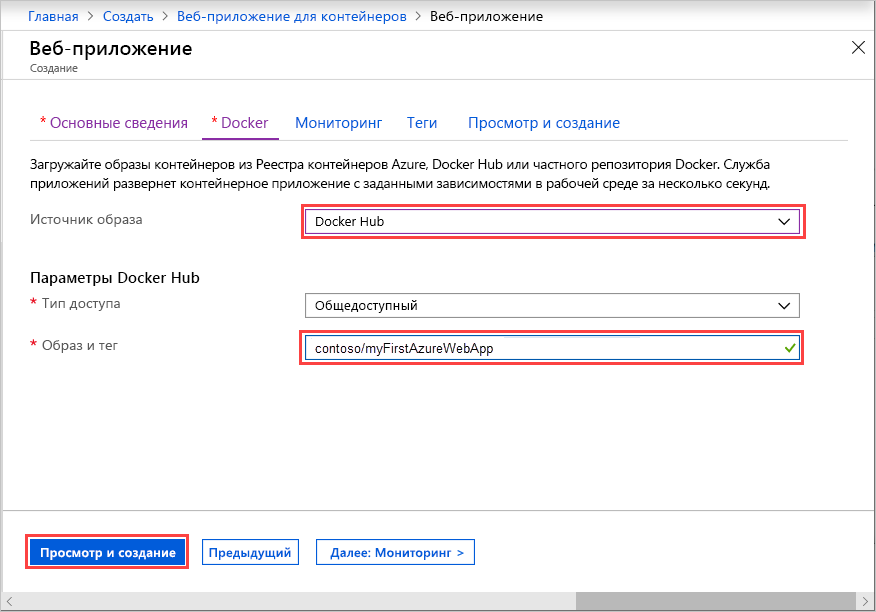
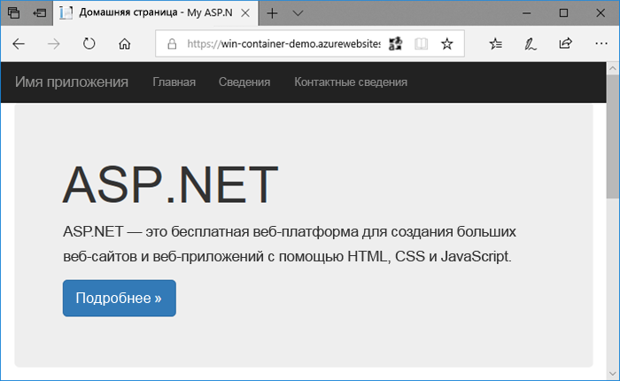
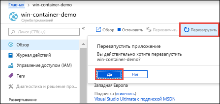
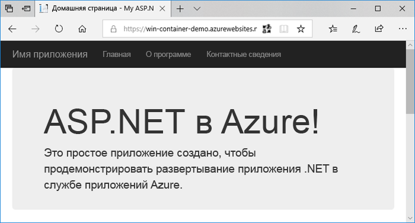

# <a name="run-a-custom-windows-container-in-azure-preview"></a>Запуск пользовательского контейнера Windows в Azure (предварительная версия)

[Служба приложений Azure](overview.md) предоставляет предопределенные стеки приложений на платформе Windows, например ASP.NET или Node.js, выполняющиеся в IIS. Предварительно настроенная среда Windows блокирует в операционной системе возможность административного доступа, установки программного обеспечения, изменений в глобальном кэше сборок и т. д. Дополнительные сведения см. в статье [Функциональные возможности операционной системы для службы приложений Azure](operating-system-functionality.md). Если приложению требуется более высокий уровень доступа, чем предусмотрено в предварительно настроенной среде, можно развернуть пользовательский контейнер Windows.

В этом кратком руководстве показано, как развернуть приложение ASP.NET в образе Windows на сайте [Docker Hub](https://hub.docker.com/) из Visual Studio. Приложение можно запустить в пользовательском контейнере в Службе приложений Azure.

## <a name="prerequisites"></a>Предварительные требования

Для работы с этим руководством:

- <a href="https://hub.docker.com/" target="_blank">зарегистрируйте учетную запись центра Docker</a>.
- <a href="https://docs.docker.com/docker-for-windows/install/" target="_blank">Установите Docker для ОС Windows</a>.
- <a href="https://docs.microsoft.com/virtualization/windowscontainers/quick-start/quick-start-windows-10" target="_blank">Переключите Docker для запуска контейнеров Windows</a>.
- <a href="https://www.visualstudio.com/downloads/" target="_blank">Установите Visual Studio 2019</a>, а также следующие рабочие нагрузки: **ASP.NET и веб-разработка** и **разработка Azure**. Если у вас уже установлена версия Visual Studio 2019, сделайте следующее.

    - Установите последние обновления для Visual Studio, выбрав **Справка** > **Проверить обновления**.
    - Добавьте рабочие нагрузки в Visual Studio, выбрав **Инструменты** > **Получить средства и компоненты**.

## <a name="create-an-aspnet-web-app"></a>Создание веб-приложения ASP.NET

Создайте веб-приложение ASP.NET, сделав следующее:

1. Откройте Visual Studio и выберите **Создать проект**.

1. В окне **Создание нового проекта** найдите и выберите **Веб-приложение ASP.NET (.NET Framework)** для C#, а затем нажмите кнопку **Далее**.

1. В окне **Настройка проекта** присвойте приложению имя _myFirstAzureWebApp_ и щелкните **Создать**.

   

1. Вы можете развернуть любой тип веб-приложения ASP.NET в Azure. В рамках этого краткого руководства выберите шаблон **MVC**.

1. Выберите **Поддержка Docker** и обязательно выберите **Без проверки подлинности** в параметрах проверки подлинности. Нажмите кнопку **Создать**.

   

1. Если файл _Dockerfile_ не открылся автоматически, откройте его в **обозревателе решений**.

1. Вам потребуется [поддерживаемый родительский образ](#use-a-different-parent-image). Измените родительский образ, заменив строку `FROM` приведенным ниже кодом. Затем сохраните файл.

   ```Dockerfile
   FROM mcr.microsoft.com/dotnet/framework/aspnet:4.7.2-windowsservercore-ltsc2019
   ```

1. В меню Visual Studio выберите **Отладка** > **Запустить без отладки**, чтобы запустить приложение локально.

   

## <a name="publish-to-docker-hub"></a>Публикация на сайте Docker Hub

1. Щелкните правой кнопкой мыши проект **myFirstAzureWebApp** в **обозревателе решений** и выберите **Опубликовать**.

1. Выберите **Служба приложений**, а затем нажмите кнопку **Опубликовать**.

1. В разделе **Выберите целевой объект публикации** выберите **Реестр контейнеров** и **Docker Hub**, а затем нажмите кнопку **Опубликовать**.

   

1. Укажите данные для входа учетной записи Docker Hub и нажмите кнопку **Сохранить**.

   Дождитесь завершения развертывания. Теперь на странице **Публикация** отображается имя репозитория для последующего использования.

   

1. Скопируйте имя этого репозитория для последующего использования.

## <a name="create-a-windows-container-app"></a>Создание приложения-контейнера Windows

1. Войдите на [портале Azure]( https://portal.azure.com).

1. Выберите **Создать ресурс** в верхнем левом углу окна портала Azure.

1. В поле поиска над списком ресурсов Azure Marketplace найдите и выберите **Веб-приложение для контейнеров**, а затем нажмите кнопку **Создать**.

1. В окне **Создание веб-приложения** выберите подписку и **группу ресурсов**. При необходимости можно создать новую группу ресурсов.

1. Укажите имя приложения, например *win-container-demo*, а для параметра **Операционная система** выберите значение **Windows**. По завершении выберите **Next: Docker** (Далее: Docker), чтобы продолжить.

   

1. В поле **Источник образа** выберите **Docker Hub**, а для параметра **Образ и тег** введите имя репозитория, скопированное в разделе [Публикация на сайте Docker Hub](#publish-to-docker-hub).

   

    Если у вас есть пользовательский образ для веб-приложения в другом расположении, например [реестре контейнеров Azure](/azure/container-registry/) или любом другом частном репозитории, его можно настроить здесь.

1. Выберите **Просмотр и создание**, а затем нажмите кнопку **Создать** и подождите, пока Azure создаст необходимые ресурсы.

## <a name="browse-to-the-container-app"></a>Переход к контейнеру приложения

По завершении операции Azure отображается окно уведомления.


1. Щелкните **Перейти к ресурсу**.

1. В обзоре этого ресурса перейдите по ссылке рядом с **URL-адресом**.

В браузере откроется следующая страница:


Подождите несколько минут и повторите попытку, пока не отобразится домашняя страница ASP.NET по умолчанию.



**Поздравляем!** Вы запустили свой первый пользовательский контейнер Windows в службе приложений Azure.

## <a name="see-container-start-up-logs"></a>Просмотр журналов запуска контейнера

Загрузка контейнера Windows может занять некоторое время. Чтобы просмотреть ход выполнения, перейдите по следующему URL-адресу, указав вместо *\<app_name >* имя приложения.
```
https://<app_name>.scm.azurewebsites.net/api/logstream
```

Потоковые журналы выглядят следующим образом:

```
2018-07-27T12:03:11  Welcome, you are now connected to log-streaming service.
27/07/2018 12:04:10.978 INFO - Site: win-container-demo - Start container succeeded. Container: facbf6cb214de86e58557a6d073396f640bbe2fdec88f8368695c8d1331fc94b
27/07/2018 12:04:16.767 INFO - Site: win-container-demo - Container start complete
27/07/2018 12:05:05.017 INFO - Site: win-container-demo - Container start complete
27/07/2018 12:05:05.020 INFO - Site: win-container-demo - Container started successfully
```

## <a name="update-locally-and-redeploy"></a>Обновление на локальном компьютере и повторное развертывание

1. В Visual Studio в **обозревателе решений** откройте **Представления** > **Главная страница** > **Index.cshtml**.

1. Найдите тег HTML `<div class="jumbotron">` в верхней области и замените его следующим кодом:

   ```HTML
   <div class="jumbotron">
       <h1>ASP.NET in Azure!</h1>
       <p class="lead">This is a simple app that we’ve built that demonstrates how to deploy a .NET app to Azure App Service.</p>
   </div>
   ```

1. Чтобы выполнить повторное развертывание в Azure, щелкните правой кнопкой мыши проект **myFirstAzureWebApp** в **обозревателе решений**, а затем выберите **Опубликовать**.

1. На странице публикации выберите **Опубликовать** и дождитесь завершения публикации.

1. Чтобы указать службе приложений извлечь новый образ из Docker Hub, перезапустите приложение. На странице приложения на портале щелкните **Перезапустить** > **Да**.

   

Еще раз [перейдите к контейнерному приложению](#browse-to-the-container-app). После обновления веб-страницы сначала должна появиться страница "Starting up" (Запуск) приложения, а через несколько минут должна отобразиться обновленная веб-страница.



## <a name="use-a-different-parent-image"></a>Использование другого родительского образа

Для запуска приложения можно использовать другой пользовательский образ Docker. При этом необходимо выбрать правильный [родительский образ](https://docs.docker.com/develop/develop-images/baseimages/) для платформы, которую вы хотите использовать:

- Для развертывания приложений .NET Framework используйте родительский образ на основе выпуска [канала долгосрочного обслуживания (LTSC)](https://docs.microsoft.com/windows-server/get-started-19/servicing-channels-19#long-term-servicing-channel-ltsc) для Windows Server Core 2019. 
- Для развертывания приложений .NET Core используйте родительский образ на основе выпуска [канала полугодичного обслуживания (SAC)](https://docs.microsoft.com/windows-server/get-started-19/servicing-channels-19#semi-annual-channel) для Windows Server Nano 1809. 

Скачивание родительского образа во время запуска приложения занимает некоторое время. Но вы можете ускорить запуск, используя один из следующих родительских образов, уже кэшированных в службе приложений Azure:

- [mcr.Microsoft.com/DotNet/Framework/ASPNET](https://hub.docker.com/_/microsoft-dotnet-framework-aspnet/): 4.7.2-windowsservercore-ltsc2019
- [mcr.Microsoft.com/Windows/nanoserver](https://hub.docker.com/_/microsoft-windows-nanoserver/):1809 — это базовый контейнер, используемый для образов [ASP.NET Core](https://hub.docker.com/_microsoft-dotnet-cores-aspnet) Microsoft Windows Nano Server.

## <a name="next-steps"></a>Дополнительная информация

> [!div class="nextstepaction"]
> [Перенос в контейнер Windows в Azure](app-service-web-tutorial-windows-containers-custom-fonts.md)
