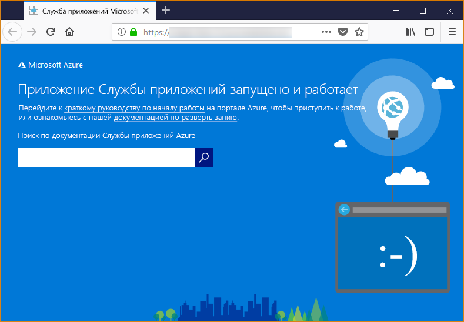

# <a name="configure-a-linux-python-app-for-azure-app-service"></a>Настройка приложения Python в Linux для Службы приложений Azure

В этой статье описывается, как [Служба приложений Azure](app-service-linux-intro.md) запускает приложения Python, а также как вы можете настроить поведение Службы приложений при необходимости. Приложения Python нужно развертывать со всеми необходимыми модулями [pip](https://pypi.org/project/pip/).

Механизм развертывания Службы приложений автоматически активирует виртуальное окружение и запускает команду `pip install -r requirements.txt` при развертывании [репозитория Git](../deploy-local-git.md?toc=%2fazure%2fapp-service%2fcontainers%2ftoc.json) или [ZIP-пакета](../deploy-zip.md?toc=%2fazure%2fapp-service%2fcontainers%2ftoc.json) с включенными процессами сборки.

Это руководство содержит основные понятия и инструкции для разработчиков Python, которые используют встроенный контейнер Linux в Службе приложений. Если вы раньше не использовали Службу приложений Azure, ознакомьтесь сначала со статьями [Создание приложения Python в Службе приложений Azure в Linux (предварительная версия)](quickstart-python.md) и [Создание приложения Python с подключением к базе данных PostgreSQL в Службе приложений Azure](tutorial-python-postgresql-app.md).

> [!NOTE]
> Сейчас для запуска приложения Python в Службе приложений рекомендуется использовать Linux. Возможности использования Windows описаны в статье [Работа с Python в Службе приложений Azure (Windows)](https://docs.microsoft.com/visualstudio/python/managing-python-on-azure-app-service).
>

## <a name="show-python-version"></a>Просмотр версии Python

Чтобы отобразить текущую версию Python, выполните следующую команду в [Cloud Shell](https://shell.azure.com):

```azurecli-interactive
az webapp config show --resource-group <resource-group-name> --name <app-name> --query linuxFxVersion
```

Чтобы отобразить все поддерживаемые версии Python, выполните следующую команду в [Cloud Shell](https://shell.azure.com):

```azurecli-interactive
az webapp list-runtimes --linux | grep PYTHON
```

Вы можете запустить неподдерживаемую версию Python, выполнив сборку собственного образа контейнера. Дополнительные сведения см. в статье об [использовании пользовательского образа Docker](tutorial-custom-docker-image.md).

## <a name="set-python-version"></a>Выбор версии Python

Выполните следующую команду в [Cloud Shell](https://shell.azure.com), чтобы задать для Python версию 3.7:

```azurecli-interactive
az webapp config set --resource-group <resource-group-name> --name <app-name> --linux-fx-version "PYTHON|3.7"
```

## <a name="container-characteristics"></a>Характеристики контейнера

Приложения Python, развернутые в службе приложений под управлением Linux, выполняются в контейнере Docker, который определен в репозитории GitHub, [Python 3.6](https://github.com/Azure-App-Service/python/tree/master/3.6.6) или [Python 3.7](https://github.com/Azure-App-Service/python/tree/master/3.7.0).

Этот контейнер отличается следующими характеристиками.

- Приложения запускаются с помощью [HTTP-сервера Gunicorn WSGI](https://gunicorn.org/), используя дополнительные аргументы `--bind=0.0.0.0 --timeout 600`.

- По умолчанию базовый образ включает в себя веб-платформу Flask, но контейнер также поддерживает другие платформы, совместимые с WSGI и с Python 3.7, например Django.

- Чтобы установить дополнительные пакеты, такие как Django, создайте файл [*requirements.txt*](https://pip.pypa.io/en/stable/user_guide/#requirements-files) в корневой папке проекта, используя `pip freeze > requirements.txt`. Затем опубликуйте проект в службе приложений с помощью развертывания Git, которое автоматически выполняет `pip install -r requirements.txt` в контейнере для установки зависимостей приложения.

## <a name="container-startup-process"></a>Процесс запуска контейнера

Во время запуска служба приложений под управлением контейнера Linux выполнит следующие действия.

1. Используйте [пользовательскую команду запуска](#customize-startup-command), если предоставлена такая возможность.
2. Проверьте наличие [приложения Django](#django-app) и запустите для него сервер Gunicorn, если он обнаружен.
3. Проверьте наличие [приложения Flask](#flask-app) и запустите для него сервер Gunicorn, если он обнаружено.
4. Если другие приложения не найдены, запускается приложение по умолчанию, встроенное в контейнер.

В следующих разделах приведены дополнительные сведения о каждом параметре.

### <a name="django-app"></a>Приложение Django

Для приложений Django служба приложений выполняет поиск файла с именем `wsgi.py` в вашем коде приложения, а затем запускает Gunicorn, используя следующую команду:

```bash
# <module> is the path to the folder that contains wsgi.py
gunicorn --bind=0.0.0.0 --timeout 600 <module>.wsgi
```

Если необходим определенный контроль над командой запуска, используйте [пользовательские команды запуска](#customize-startup-command) и замените `<module>` именем модуля, который содержит *wsgi.py*.

### <a name="flask-app"></a>Приложение Flask

Для Flask Служба приложений выполняет поиск файла с именем *application.py* или *app.py* и запускает Gunicorn следующим образом:

```bash
# If application.py
gunicorn --bind=0.0.0.0 --timeout 600 application:app
# If app.py
gunicorn --bind=0.0.0.0 --timeout 600 app:app
```

Если модуль основного приложения содержится в другом файле, используйте другое имя для объекта приложения или, если вы хотите указать дополнительные аргументы для Gunicorn, используйте [пользовательские команды запуска](#customize-startup-command).

### <a name="default-behavior"></a>Поведение по умолчанию

Если в службе приложений не найдена пользовательская команда, приложение Django или Flask, тогда она запускает приложение по умолчанию с разрешением только для чтения, расположенное в папке _opt/defaultsite_. Приложение по умолчанию выглядит следующим образом:



## <a name="customize-startup-command"></a>Настройка команды запуска

Вы можете задать поведение при запуске контейнера, указав пользовательскую команду запуска Gunicorn. Для этого выполните следующую команду в [Cloud Shell](https://shell.azure.com):

```azurecli-interactive
az webapp config set --resource-group <resource-group-name> --name <app-name> --startup-file "<custom-command>"
```

Например, если вы используете приложение Flask, главным модулем которого является *hello.py*, а объект приложения Flask в этом файле называется `myapp`, тогда команда *\<custom-command>* будет выглядеть следующим образом:

```bash
gunicorn --bind=0.0.0.0 --timeout 600 hello:myapp
```

Если главный модуль находится в подпапке, например `website`, укажите эту подпапку с помощью аргумента `--chdir`:

```bash
gunicorn --bind=0.0.0.0 --timeout 600 --chdir website hello:myapp
```

Кроме того, вы можете добавить любые дополнительные аргументы для Gunicorn в команду *\<custom-command>*, например `--workers=4`. Дополнительные сведения см. в статье [Running Gunicorn](https://docs.gunicorn.org/en/stable/run.html) (Запуск Gunicorn) (docs.gunicorn.org).

Для использования сервера, отличного от Gunicorn, например [aiohttp](https://aiohttp.readthedocs.io/en/stable/web_quickstart.html), *\<custom-command>* можно заменить следующим образом:

```bash
python3.7 -m aiohttp.web -H localhost -P 8080 package.module:init_func
```

> [!Note]
> Служба приложений игнорирует все ошибки, возникающие при обработке файла с пользовательской командой, и продолжает процесс запуска путем поиска приложений Django и Flask. Если вы не видите ожидаемое поведение, убедитесь, что файл запуска развернут в службе приложений и что в нем нет ошибок.

## <a name="access-environment-variables"></a>Доступ к переменным среды

В Службе приложений можно [задать параметры приложения](../web-sites-configure.md?toc=%2fazure%2fapp-service%2fcontainers%2ftoc.json#app-settings) вне кода приложения. Затем вы сможете получать к ним доступ, используя стандартный шаблон [os.environ](https://docs.python.org/3/library/os.html#os.environ). Например, для доступа к параметру приложения с именем `WEBSITE_SITE_NAME` используйте следующий код:

```python
os.environ['WEBSITE_SITE_NAME']
```

## <a name="detect-https-session"></a>Обнаружение сеанса HTTPS

В Службе приложений [завершение SSL-запросов](https://wikipedia.org/wiki/TLS_termination_proxy) происходит в подсистеме балансировки нагрузки сети, поэтому все HTTPS-запросы достигают вашего приложения в виде незашифрованных HTTP-запросов. Если логика вашего приложения проверяет, зашифрованы ли пользовательские запросы, проверяйте заголовок `X-Forwarded-Proto`.

```python
if 'X-Forwarded-Proto' in request.headers and request.headers['X-Forwarded-Proto'] == 'https':
# Do something when HTTPS is used
```

Популярные веб-платформы позволяют получить доступ к информации `X-Forwarded-*` в стандартном шаблоне приложения. В [CodeIgniter](https://codeigniter.com/) функция [is_https()](https://github.com/bcit-ci/CodeIgniter/blob/master/system/core/Common.php#L338-L365) по умолчанию проверяет значение `X_FORWARDED_PROTO`.

## <a name="access-diagnostic-logs"></a>Доступ к журналам диагностики

[!INCLUDE [Access diagnostic logs](../../../includes/app-service-web-logs-access-no-h.md)]

## <a name="open-ssh-session-in-browser"></a>Открытие сеанса SSH в браузере

[!INCLUDE [Open SSH session in browser](../../../includes/app-service-web-ssh-connect-builtin-no-h.md)]

## <a name="troubleshooting"></a>Устранение неполадок

- **После развертывания кода приложения отображается приложение по умолчанию.** Приложение по умолчанию отображается, потому что вы либо не развертывали код приложения в Службу приложений, либо она не смогла найти ваш код приложения и вместо этого использовала приложение по умолчанию.
- Перезапустите службу приложений, подождите 15–20 секунд и снова проверьте приложение.
- Убедитесь, что вы используете службу приложений для Linux, а не экземпляр для Windows. В Azure CLI выполните команду `az webapp show --resource-group <resource_group_name> --name <app_service_name> --query kind`, заменив `<resource_group_name>` и `<app_service_name>` соответствующими значениями. Команда должна вывести строку `app,linux`. Если этого не произошло, заново создайте службу приложений и выберите Linux.
- Используйте SSH или консоль Kudu для подключения непосредственно к службе приложений и убедитесь, что файлы существуют в каталоге *site/wwwroot*. Если файлов нет, проверьте процесс развертывания и повторно разверните приложение.
- Если файлы имеются, значит службе приложений не удалось определить конкретный загрузочный файл. Убедитесь, что ваше приложение структурировано, так как служба приложений ожидает [Djangо](#django-app) или [Flask](#flask-app) или использует [пользовательскую команду запуска](#customize-startup-command).
- **В браузере появилось сообщение "Служба недоступна".** Истекло время ожидания браузером ответа от службы приложений, что указывает, что она запустила сервер Gunicorn, но аргументы, указывающие код приложения, неверные.
- Обновите браузер, особенно если вы используете самую низкую ценовую категорию в плане службы приложений. Приложению может потребоваться больше времени для запуска, например при использовании бесплатных уровней, и оно начнет отвечать после обновления браузера.
- Убедитесь, что ваше приложение структурировано, так как служба приложений ожидает [Djangо](#django-app) или [Flask](#flask-app) или использует [пользовательскую команду запуска](#customize-startup-command).
- [Получите доступ к потоку журнала](#access-diagnostic-logs).

## <a name="next-steps"></a>Дополнительная информация

Сейчас встроенный образ Python в Службе приложений на платформе Linux доступен в предварительной версии. Вы можете настроить команду для запуска приложения. Также приложения Python для рабочей среды можно создавать с помощью настраиваемого контейнера.

> [!div class="nextstepaction"]
> [Руководство по использованию приложения Python с PostgreSQL](tutorial-python-postgresql-app.md)

> [!div class="nextstepaction"]
> [Руководство по развертыванию из частного репозитория контейнеров](tutorial-custom-docker-image.md)

> [!div class="nextstepaction"]
> [Служба приложений под управлением Linux: вопросы и ответы](app-service-linux-faq.md)