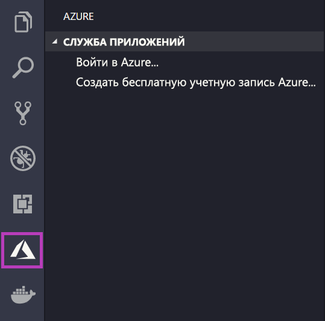
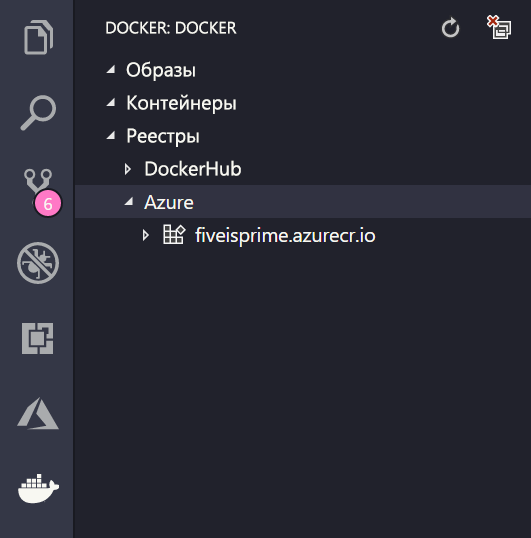

# <a name="deploy-a-custom-linux-container-to-azure-app-service"></a>Развертывание пользовательского контейнера Linux в Службе приложений Azure

Служба приложений в Linux предоставляет предопределенные стеки приложений на платформе Linux с поддержкой определенных языков (например, .NET, PHP, Node.js и т. д.). Вы также можете использовать пользовательский образ Docker для запуска веб-приложения в стеке приложений, который еще не определен в Azure. В этом кратком руководстве показано, как развернуть образ из [Реестра контейнеров Azure](/azure/container-registry) (ACR) в Службе приложений.

## <a name="prerequisites"></a>Предварительные требования

* [учетная запись Azure](https://azure.microsoft.com/free/?utm_source=campaign&utm_campaign=vscode-tutorial-docker-extension&mktingSource=vscode-tutorial-docker-extension);
* [Docker](https://www.docker.com/community-edition)
* [Visual Studio Code](https://code.visualstudio.com/)
* [Расширение Службы приложений Azure для VS Code](vscode:extension/ms-azuretools.vscode-azureappservice). Это расширение можно использовать для создания и развертывания веб-приложений Linux на платформе Azure в рамках модели "платформа как служба" (PaaS), а также для управления ими.
* [Расширение Docker для VS Code](vscode:extension/ms-azuretools.vscode-docker). С помощью этого расширения можно упростить управление локальными образами и командами Docker, а также развернуть созданные образы приложений в Azure.

## <a name="create-an-image"></a>Создание образа

Для выполнения заданий этого краткого руководства вам потребуется подходящий образ веб-приложения, хранящийся в [Реестре контейнеров Azure](/azure/container-registry). Следуйте инструкциям в статье [Краткое руководство. Создание частного реестра контейнеров с помощью портала Azure](/azure/container-registry/container-registry-get-started-portal), но вместо образа `hello-world` используйте `mcr.microsoft.com/azuredocs/go`.

> [!IMPORTANT]
> Не забудьте установить для параметра **Администратор** значение **Включить** при создании реестра контейнеров. Его также можно установить из раздела **Ключи доступа** на странице реестра на портале Azure. Этот параметр необходим для доступа к Службе приложений.

## <a name="sign-in"></a>Вход

Затем запустите VS Code и войдите в учетную запись Azure с помощью расширения Службы приложений. Для этого выберите логотип Azure на панели действий, перейдите в обозреватель **Службы приложений**, а затем выберите **Войти в Azure** и следуйте инструкциям.



## <a name="check-prerequisites"></a>Проверка предварительных требований

Теперь можно проверить, правильно ли установлены и настроены все необходимые компоненты.

В VS Code должна отображаться следующая информация: адрес электронной почты Azure в строке состояния и подписка в обозревателе **Службы приложений**.

Затем убедитесь, что у вас установлен и работает Docker. Следующая команда отобразит версию Docker, если она выполняется.

```bash
docker --version
```

Наконец, убедитесь, что Реестр контейнеров Azure подключен. Для этого выберите логотип Docker на панели действий, а затем перейдите к разделу **Реестры**.



## <a name="deploy-the-image-to-azure-app-service"></a>Развертывание образа в Службе приложений Azure

Теперь, когда все настроено, вы можете развернуть образ в [Службе приложений Azure](https://azure.microsoft.com/services/app-service/) непосредственно из обозревателя расширений Docker.

Найдите образ в узле **Реестры** в обозревателе **DOCKER** и разверните его, чтобы отобразить его теги. Щелкните тег правой кнопкой мыши и выберите пункт **Deploy Image to Azure App Service** (Развернуть образ в Службе приложений Azure).

Следуйте инструкциям на экране, чтобы выбрать подписку, глобально уникальное имя приложения, группу ресурсов и план Службы приложений. Выберите значение **B1 Basic** (B1 Базовый) для ценовой категории и регион.

После развертывания приложение будет доступно по адресу `http://<app name>.azurewebsites.net`.

**Группа ресурсов** — это именованная коллекция всех ресурсов вашего приложения в Azure. Например, группа ресурсов может содержать ссылку на веб-сайт, базу данных и функцию Azure.

**План Службы приложений** определяет физические ресурсы, которые будут использоваться для размещения веб-сайта. В этом кратком руководстве используется план размещения **Базовый** в инфраструктуре **Linux**. Это означает, что сайт будет размещаться на компьютере Linux вместе с другими веб-сайтами. Если начать работу с планом **Базовый**, можно использовать портал Azure для увеличения масштаба, чтобы ваш сайт был единственным на компьютере.

## <a name="browse-the-website"></a>Открытие веб-сайта в браузере

Панель **Выходные данные** откроется во время развертывания, чтобы указать состояние операции. После завершения операции найдите приложение, созданное в обозревателе **Службы приложений**, щелкните его правой кнопкой мыши, а затем выберите **Обзор веб-сайта**, чтобы открыть сайт в браузере.

> [!div class="nextstepaction"]
> [У меня есть проблема](https://www.research.net/r/PWZWZ52?tutorial=quickstart-docker&step=deploy-app)

## <a name="next-steps"></a>Дополнительная информация

Поздравляем, вы успешно завершили работу с этим руководством!

Теперь ознакомьтесь с другими расширениями Azure.

* [База данных Cosmos](https://marketplace.visualstudio.com/items?itemName=ms-azuretools.vscode-cosmosdb)
* [Функции Azure](https://marketplace.visualstudio.com/items?itemName=ms-azuretools.vscode-azurefunctions)
* [Средства интерфейса командной строки Azure](https://marketplace.visualstudio.com/items?itemName=ms-vscode.azurecli)
* [Средства Azure Resource Manager](https://marketplace.visualstudio.com/items?itemName=msazurermtools.azurerm-vscode-tools)

Или получите их, установив пакет расширений [инструментов Azure](https://marketplace.visualstudio.com/items?itemName=ms-vscode.vscode-node-azure-pack).
