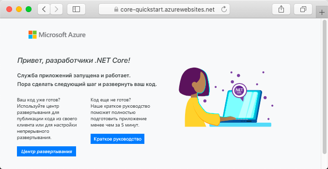

# <a name="create-an-aspnet-core-app-in-app-service-on-linux"></a>Создание приложения .NET Core в Службе приложений в Linux

> [!NOTE]
> В этой статье мы развернем приложение в службе приложений на платформе Linux. Сведения о развертывании в службе приложений на платформе _Windows_ см. в статье [Создание веб-приложения ASP.NET Core в Azure](../app-service-web-get-started-dotnet.md).
>

[Служба приложений на платформе Linux](app-service-linux-intro.md) — это высокомасштабируемая служба размещения с самостоятельной установкой исправлений на основе операционной системы Linux. В этом кратком руководстве показано, как создать приложение [.NET Core](https://docs.microsoft.com/aspnet/core/) в службе приложений на платформе Linux. Создайте приложение с помощью [Azure CLI](https://docs.microsoft.com/cli/azure/get-started-with-azure-cli) и разверните код .NET Core в приложении с помощью Git.


Выполните инструкции, приведенные в этом руководстве, с помощью компьютера Mac, Windows или Linux.

[!INCLUDE [quickstarts-free-trial-note](../../../includes/quickstarts-free-trial-note.md)]

## <a name="prerequisites"></a>Предварительные требования

Для работы с этим кратким руководством сделайте следующее:

* <a href="https://git-scm.com/" target="_blank">установите Git</a>;
* <a href="https://www.microsoft.com/net/core/" target="_blank">установите .NET Core</a>.

## <a name="create-the-app-locally"></a>Локальное создание приложения

В окне терминала на компьютере создайте каталог `hellodotnetcore` и перейдите в него.

```bash
mkdir hellodotnetcore
cd hellodotnetcore
```

Создание нового приложения .NET Core

```bash
dotnet new web
```

## <a name="run-the-app-locally"></a>Локальный запуск приложения

Запустите приложение локально, чтобы увидеть, как оно будет выглядеть после развертывания в Azure. 

Восстановите пакеты NuGet и запустите приложение.

```bash
dotnet run
```

Откройте веб-браузер и перейдите к приложению в `http://localhost:5000`.

На странице отобразится сообщение **Hello World** из примера приложения.


В окне терминала нажмите клавиши **CTRL+C**, чтобы выйти из веб-сервера. Инициализируйте репозиторий Git для проекта .NET Core.

```bash
git init
git add .
git commit -m "first commit"
```

[!INCLUDE [cloud-shell-try-it.md](../../../includes/cloud-shell-try-it.md)]

[!INCLUDE [Configure deployment user](../../../includes/configure-deployment-user.md)]

[!INCLUDE [Create resource group](../../../includes/app-service-web-create-resource-group-linux.md)]

[!INCLUDE [Create app service plan](../../../includes/app-service-web-create-app-service-plan-linux.md)]

## <a name="create-a-web-app"></a>Создание веб-приложения

[!INCLUDE [Create web app](../../../includes/app-service-web-create-web-app-dotnetcore-linux-no-h.md)]

Перейдите к только что созданному веб-приложению. Замените _&lt;app-name>_ именем своего приложения.

```bash
http://<app-name>.azurewebsites.net
```

Новое приложение должно выглядеть следующим образом.



[!INCLUDE [Push to Azure](../../../includes/app-service-web-git-push-to-azure.md)] 

```bash
Counting objects: 22, done.
Delta compression using up to 8 threads.
Compressing objects: 100% (18/18), done.
Writing objects: 100% (22/22), 51.21 KiB | 3.94 MiB/s, done.
Total 22 (delta 1), reused 0 (delta 0)
remote: Updating branch 'master'.
remote: Updating submodules.
remote: Preparing deployment for commit id '741f16d1db'.
remote: Generating deployment script.
remote: Project file path: ./hellodotnetcore.csproj
remote: Generated deployment script files
remote: Running deployment command...
remote: Handling ASP.NET Core Web Application deployment.
remote: ...............................................................................................
remote:   Restoring packages for /home/site/repository/hellodotnetcore.csproj...
remote: ....................................
remote:   Installing System.Xml.XPath 4.0.1.
remote:   Installing System.Diagnostics.Tracing 4.1.0.
remote:   Installing System.Threading.Tasks.Extensions 4.0.0.
remote:   Installing System.Reflection.Emit.ILGeneration 4.0.1.
remote:   ...
remote: Finished successfully.
remote: Running post deployment command(s)...
remote: Deployment successful.
To https://<app-name>.scm.azurewebsites.net/<app-name>.git
 * [new branch]      master -> master
```

## <a name="browse-to-the-app"></a>Переход в приложение

Перейдите в развертываемое приложение с помощью веб-браузера.

```bash
http://<app_name>.azurewebsites.net
```

Пример кода .NET Core выполняется в службе приложений в Linux со встроенным образом.


**Поздравляем!** Вы развернули свое первое приложение .NET Core в службе приложений в Linux.

## <a name="update-and-redeploy-the-code"></a>Обновление и повторное развертывание кода

В локальном каталоге откройте файл _Startup.cs_. Внесите некоторые изменения в текст в вызове метода `context.Response.WriteAsync`:

```csharp
await context.Response.WriteAsync("Hello Azure!");
```

Зафиксируйте изменения в Git, а затем отправьте изменения кода в Azure.

```bash
git commit -am "updated output"
git push azure master
```

После завершения развертывания переключитесь в окно браузера, открытое на этапе **перехода в приложение**, и щелкните "Обновить".


## <a name="manage-your-new-azure-app"></a>Управление новым приложением Azure

Перейдите на <a href="https://portal.azure.com" target="_blank">портал Azure</a>, чтобы управлять созданным приложением.

В меню слева щелкните **Службы приложений**, а затем — имя своего приложения Azure.


Отобразится страница обзора вашего приложения. Вы можете выполнять базовые задачи управления: обзор, завершение, запуск, перезагрузку и удаление. 


В меню слева доступно несколько страниц для настройки приложения. 

[!INCLUDE [cli-samples-clean-up](../../../includes/cli-samples-clean-up.md)]

## <a name="next-steps"></a>Дополнительная информация

> [!div class="nextstepaction"]
> [Руководство. по приложению ASP.NET Core с Базой данных SQL](tutorial-dotnetcore-sqldb-app.md)

> [!div class="nextstepaction"]
> [Настройка приложения ASP.NET Core](configure-language-dotnetcore.md)
