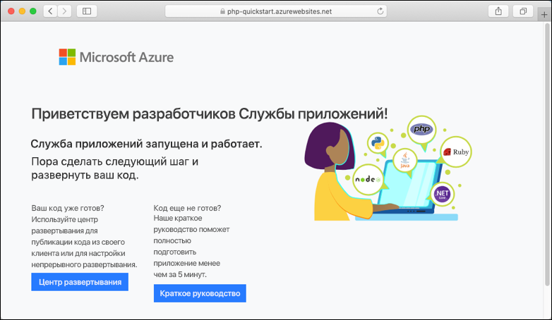

# <a name="create-a-php-app-in-app-service-on-linux"></a>Создание приложения PHP в Службе приложений Azure в Linux

> [!NOTE]
> В этой статье мы развернем приложение в службе приложений на платформе Linux. Сведения о развертывании в Службе приложений на платформе _Windows_ см. в статье [Создание веб-приложения PHP в Azure](../app-service-web-get-started-php.md).
>

[Служба приложений на платформе Linux](app-service-linux-intro.md) — это высокомасштабируемая служба размещения с самостоятельной установкой исправлений на основе операционной системы Linux. В этом кратком руководстве показано, как развернуть приложение PHP в Службе приложений Azure в Linux с помощью [Cloud Shell](https://docs.microsoft.com/azure/cloud-shell/overview).


Выполните инструкции, приведенные в этом руководстве, с помощью компьютера Mac, Windows или Linux.

[!INCLUDE [quickstarts-free-trial-note](../../../includes/quickstarts-free-trial-note.md)]

## <a name="prerequisites"></a>Предварительные требования

Для работы с этим кратким руководством сделайте следующее:

* <a href="https://git-scm.com/" target="_blank">установите Git</a>;
* <a href="https://php.net" target="_blank">установите PHP</a>.

## <a name="download-the-sample"></a>Скачивание примера приложения

В окне терминала выполните команды ниже. Так вы клонируете пример приложения на локальный компьютер и перейдете в каталог, содержащий пример кода.

```bash
git clone https://github.com/Azure-Samples/php-docs-hello-world
cd php-docs-hello-world
```

## <a name="run-the-app-locally"></a>Локальный запуск приложения

Запустите приложение локально, чтобы увидеть, как оно будет выглядеть после развертывания в Azure. Откройте окно терминала и выполните команду `php`, чтобы запустить встроенный веб-сервер PHP.

```bash
php -S localhost:8080
```

Откройте веб-браузер и перейдите к примеру приложения по адресу `http://localhost:8080`.

На странице отобразится сообщение **Hello World!** из примера приложения.


В окне терминала нажмите клавиши **CTRL+C**, чтобы выйти из веб-сервера.

[!INCLUDE [cloud-shell-try-it.md](../../../includes/cloud-shell-try-it.md)]

[!INCLUDE [Configure deployment user](../../../includes/configure-deployment-user.md)]

[!INCLUDE [Create resource group](../../../includes/app-service-web-create-resource-group-linux.md)]

[!INCLUDE [Create app service plan](../../../includes/app-service-web-create-app-service-plan-linux.md)]

## <a name="create-a-web-app"></a>Создание веб-приложения

[!INCLUDE [Create web app](../../../includes/app-service-web-create-web-app-php-linux-no-h.md)] 

Перейдите на сайт, чтобы просмотреть созданное приложение со встроенным образом. Замените _&lt;app name>_ именем своего приложения.

```bash
http://<app_name>.azurewebsites.net
```

Новое приложение должно выглядеть следующим образом.



[!INCLUDE [Push to Azure](../../../includes/app-service-web-git-push-to-azure.md)] 

```bash
Counting objects: 2, done.
Delta compression using up to 4 threads.
Compressing objects: 100% (2/2), done.
Writing objects: 100% (2/2), 352 bytes | 0 bytes/s, done.
Total 2 (delta 1), reused 0 (delta 0)
remote: Updating branch 'master'.
remote: Updating submodules.
remote: Preparing deployment for commit id '25f18051e9'.
remote: Generating deployment script.
remote: Running deployment command...
remote: Handling Basic Web Site deployment.
remote: Kudu sync from: '/home/site/repository' to: '/home/site/wwwroot'
remote: Copying file: '.gitignore'
remote: Copying file: 'LICENSE'
remote: Copying file: 'README.md'
remote: Copying file: 'index.php'
remote: Ignoring: .git
remote: Finished successfully.
remote: Running post deployment command(s)...
remote: Deployment successful.
To https://<app_name>.scm.azurewebsites.net/<app_name>.git
   cc39b1e..25f1805  master -> master
```

## <a name="browse-to-the-app"></a>Переход в приложение

Перейдите в развертываемое приложение с помощью веб-браузера.

```bash
http://<app_name>.azurewebsites.net
```

Пример кода PHP выполняется в Службе приложений в Linux со встроенным образом.


**Поздравляем!** Вы развернули свое первое приложение PHP в службе приложений на платформе Linux.

## <a name="update-locally-and-redeploy-the-code"></a>Обновление на локальном компьютере и повторное развертывание кода

В локальном каталоге в приложении PHP откройте файл `index.php` и внесите небольшое изменение в текстовой строке рядом с `echo`:

```php
echo "Hello Azure!";
```

Зафиксируйте изменения в Git, а затем отправьте изменения кода в Azure.

```bash
git commit -am "updated output"
git push azure master
```

После завершения развертывания перейдите в окно браузера, открытое на шаге **перехода в приложение**, и обновите страницу.


## <a name="manage-your-new-azure-app"></a>Управление новым приложением Azure

Перейдите на <a href="https://portal.azure.com" target="_blank">портал Azure</a>, чтобы управлять созданным приложением.

В меню слева щелкните **Службы приложений**, а затем — имя своего приложения Azure.


Отобразится страница обзора вашего приложения. Вы можете выполнять базовые задачи управления: обзор, завершение, запуск, перезагрузку и удаление.


В меню слева доступно несколько страниц для настройки приложения. 

[!INCLUDE [cli-samples-clean-up](../../../includes/cli-samples-clean-up.md)]

## <a name="next-steps"></a>Дополнительная информация

> [!div class="nextstepaction"]
> [Руководство. по приложению PHP с MySQL](tutorial-php-mysql-app.md)

> [!div class="nextstepaction"]
> [Настройка приложения PHP](configure-language-php.md)
