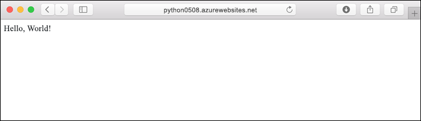
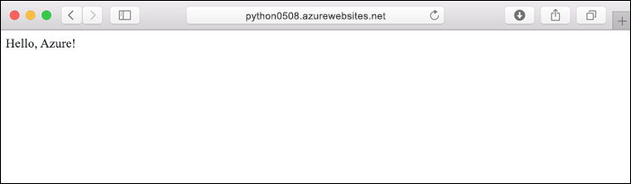
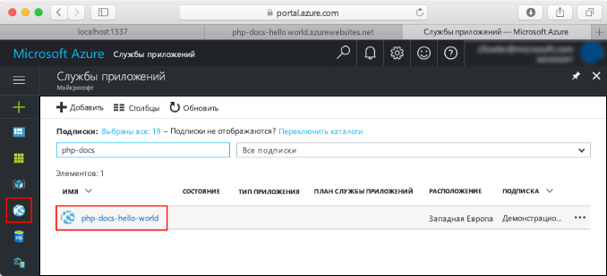

# <a name="create-a-python-app-in-azure-app-service-on-linux"></a>Создание приложения Python в Службе приложений Azure в Linux

В этом кратком руководстве вы развернете простое приложение Python в [Службе приложений на платформе Linux](app-service-linux-intro.md), которая предоставляет высокомасштабируемую веб-службу размещения с самостоятельной установкой исправлений. В руководстве используется интерфейс командной строки Azure ([Azure CLI](/cli/azure/install-azure-cli)) в интерактивной браузерной оболочке Azure Cloud Shell. Поэтому все инструкции можно выполнять на компьютере Mac, Linux или Windows.



[!INCLUDE [quickstarts-free-trial-note](../../../includes/quickstarts-free-trial-note.md)]

[!INCLUDE [cloud-shell-try-it.md](../../../includes/cloud-shell-try-it.md)]

## <a name="download-the-sample"></a>Скачивание примера приложения

В Cloud Shell создайте каталог quickstart и перейдите в него.

```bash
mkdir quickstart

cd $HOME/quickstart
```

Затем выполните следующую команду, чтобы клонировать репозиторий с примером приложения в локальный каталог quickstart.

```bash
git clone https://github.com/Azure-Samples/python-docs-hello-world
```

При выполнении эта команда выводит приблизительно следующие сведения:

```bash
Cloning into 'python-docs-hello-world'...
remote: Enumerating objects: 43, done.
remote: Total 43 (delta 0), reused 0 (delta 0), pack-reused 43
Unpacking objects: 100% (43/43), done.
Checking connectivity... done.
```

## <a name="create-a-web-app"></a>Создание веб-приложения

Перейдите в каталог, в котором содержится пример кода, и выполните команду `az webapp up`.

В следующем примере замените *\<app_name>* глобальным уникальным именем приложения (допустимые символы: `a-z`, `0-9` и `-`).

```bash
cd python-docs-hello-world

az webapp up -n <app_name>
```

Выполнение этой команды может занять несколько минут. При выполнении эта команда выводит приблизительно следующие сведения:

```json
The behavior of this command has been altered by the following extension: webapp
Creating Resource group 'appsvc_rg_Linux_CentralUS' ...
Resource group creation complete
Creating App service plan 'appsvc_asp_Linux_CentralUS' ...
App service plan creation complete
Creating app '<app_name>' ....
Webapp creation complete
Creating zip with contents of dir /home/username/quickstart/python-docs-hello-world ...
Preparing to deploy contents to app.
All done.
{
  "app_url": "https:/<app_name>.azurewebsites.net",
  "location": "Central US",
  "name": "<app_name>",
  "os": "Linux",
  "resourcegroup": "appsvc_rg_Linux_CentralUS ",
  "serverfarm": "appsvc_asp_Linux_CentralUS",
  "sku": "BASIC",
  "src_path": "/home/username/quickstart/python-docs-hello-world ",
  "version_detected": "-",
  "version_to_create": "python|3.7"
}
```

Команда `az webapp up` выполняет следующие действия:

- создание группы ресурсов по умолчанию;

- создание плана службы приложений по умолчанию;

- создание приложения с указанным именем.

- [развертывание ZIP-файлов](https://docs.microsoft.com/azure/app-service/deploy-zip) для приложения из текущего рабочего каталога.

## <a name="browse-to-the-app"></a>Переход в приложение

Перейдите в развертываемое приложение с помощью веб-браузера.

```bash
http://<app_name>.azurewebsites.net
```

Пример кода Python выполняется в Службе приложений в Linux со встроенным образом.


**Поздравляем!** Вы развернули свое первое приложение Python в службе приложений в Linux.

## <a name="update-and-redeploy-the-code"></a>Обновление и повторное развертывание кода

В Cloud Shell введите `code application.py`, чтобы открыть текстовый редактор Cloud Shell.


 Внесите небольшое изменение в текст вызова метода `return`:

```python
return "Hello Azure!"
```

Сохраните изменения и выйдите из редактора. Выполните команду `^S`, чтобы сохранить файл, и `^Q` — чтобы выйти.

Теперь можно повторно развернуть приложение. Замените `<app_name>` именем своего приложения.

```bash
az webapp up -n <app_name>
```

После завершения развертывания перейдите в окно браузера, открытое на шаге **перехода в приложение**, и обновите страницу.



## <a name="manage-your-new-azure-app"></a>Управление новым приложением Azure

Перейдите на <a href="https://portal.azure.com" target="_blank">портал Azure</a>, чтобы управлять созданным приложением.

В меню слева щелкните **Службы приложений**, а затем — имя своего приложения Azure.



Отобразится страница обзора вашего приложения. Вы можете выполнять базовые задачи управления: обзор, завершение, запуск, перезагрузку и удаление.


В меню слева доступно несколько страниц для настройки приложения. 

[!INCLUDE [cli-samples-clean-up](../../../includes/cli-samples-clean-up.md)]

## <a name="next-steps"></a>Дополнительная информация

> [!div class="nextstepaction"]
> [Руководство. по использованию приложения Python с PostgreSQL](tutorial-python-postgresql-app.md)

> [!div class="nextstepaction"]
> [Настройка приложения Python](how-to-configure-python.md)

> [!div class="nextstepaction"]
> [Руководство. по развертыванию из частного репозитория контейнеров](tutorial-custom-docker-image.md)
