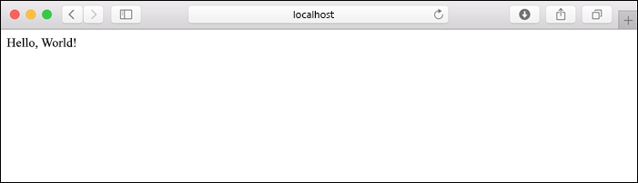
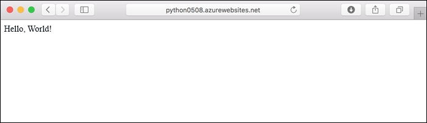
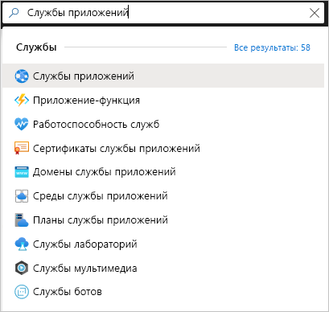
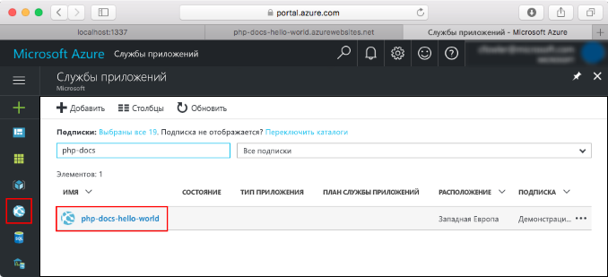
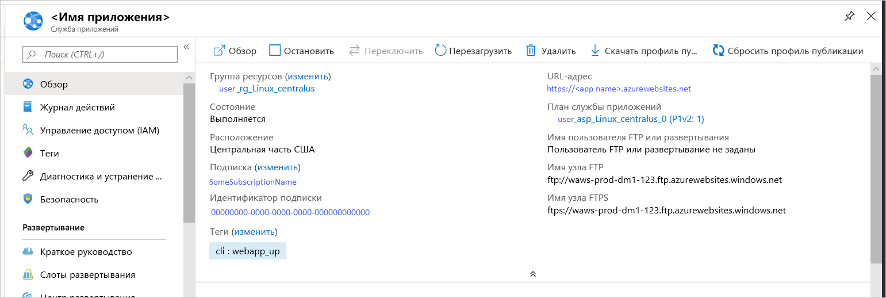

# <a name="quickstart-create-a-python-app-in-azure-app-service-on-linux"></a>Краткое руководство. Создание приложения Python в Службе приложений Azure в Linux

В этом кратком руководстве описывается процесс развертывания веб-приложения Python для [службы приложений на платформе Linux](app-service-linux-intro.md), высокомасштабируемой службы веб-размещения Azure с самостоятельной установкой исправлений. Вы используете локальный [интерфейс командной строки Azure (CLI)](/cli/azure/install-azure-cli) на компьютере Mac, Linux или Windows. Веб-приложение, которое вы настраиваете, использует бесплатный уровень Службы приложений, поэтому в процессе выполнения этого руководства затраты на ресурсы Azure не изменяются.

Если вы предпочитаете развертывать приложения с помощью интегрированной среды разработки, см. статью [Развертывание приложений Python в службе приложений из Visual Studio Code](/azure/python/tutorial-deploy-app-service-on-linux-01).

## <a name="prerequisites"></a>Предварительные требования

- Подписка Azure — [создайте бесплатную учетную запись](https://azure.microsoft.com/free/?ref=microsoft.com&utm_source=microsoft.com&utm_medium=docs&utm_campaign=visualstudio).
- <a href="https://www.python.org/downloads/" target="_blank">Python 3.7</a> (также поддерживается Python 3.6)
- <a href="https://git-scm.com/downloads" target="_blank">Git</a>;
- <a href="https://docs.microsoft.com/cli/azure/install-azure-cli" target="_blank">Azure CLI</a> 2.0.80 или последующей версии. Выполните команду `az --version`, чтобы узнать номер версии.

## <a name="download-the-sample"></a>Скачивание примера приложения

В окне терминала выполните следующую команду, чтобы клонировать пример приложения на локальный компьютер. 

```terminal
git clone https://github.com/Azure-Samples/python-docs-hello-world
```

Затем перейдите в эту папку:

```terminal
cd python-docs-hello-world
```

Репозиторий содержит файл *application.py*, который сообщает Службе приложений, что код содержит приложение Flask. Дополнительные сведения см. в статье [Настройка приложений Python для Службы приложений Azure под управлением Linux](how-to-configure-python.md).

## <a name="run-the-sample"></a>Запуск примера

В окне терминала выполните приведенные ниже команды (в зависимости от операционной системы), чтобы установить необходимые зависимости и запустить встроенный сервер разработки. 

# <a name="bash"></a>[Bash](#tab/bash)

```bash
python3 -m venv venv
source venv/bin/activate
pip install -r requirements.txt
export FLASK_APP=application.py
flask run
```

# <a name="powershell"></a>[PowerShell](#tab/powershell)

```powershell
py -3 -m venv env
env\scripts\activate
pip install -r requirements.txt
Set-Item Env:FLASK_APP ".\application.py"
flask run
```

# <a name="cmd"></a>[Cmd](#tab/cmd)

```cmd
py -3 -m venv env
env\scripts\activate
pip install -r requirements.txt
SET FLASK_APP=application.py
flask run
```

---

Откройте веб-браузер и перейдите к примеру приложения по адресу `http://localhost:5000/`. Приложение отображает сообщение **Hello World!** .



В окне терминала нажмите клавиши **CTRL**+**C**, чтобы выйти из веб-сервера.

## <a name="sign-in-to-azure"></a>Вход в Azure

Azure CLI предоставляет множество удобных команд, которые можно использовать в локальном терминале для подготовки к работе ресурсов Azure и управления ими из командной строки. Команды можно использовать для выполнения тех же задач, которые можно выполнить с помощью портала Azure в браузере. Для автоматизации процессов управления можно также использовать команды интерфейса командной строки в скриптах.

Чтобы выполнить команды Azure в интерфейсе командной строки Azure, необходимо сначала выполнить вход с помощью команды `az login`. Эта команда открывает окно браузера для ввода учетных данных.

```azurecli
az login
```

## <a name="deploy-the-sample"></a>Развертывание примера

Команда [`az webapp up`](/cli/azure/webapp#az-webapp-up) создает веб-приложение в Службе приложений и развертывает ваш код.

В папке *python-docs-hello-world*, содержащей пример кода, выполните следующую команду `az webapp up`. Замените `<app-name>` глобальным уникальным именем приложения (*допустимые символы: `a-z`, `0-9` и `-`* ).


```azurecli
az webapp up --sku F1 -n <app-name>
```

Аргумент `--sku F1` создает веб-приложение в ценовой категории "Бесплатный". Этот аргумент можно опустить, чтобы использовать ценовую категорию "Премиум" с почасовой стоимостью.

Вы также можете добавить аргумент `-l <location-name>`, где `<location_name>` — это регион Azure, например **centralus**, **eastasia**, **westeurope**, **koreasouth**, **brazilsouth**, **centralindia** и т. д. Список допустимых регионов для учетной записи Azure можно получить, выполнив команду [`az account list-locations`](/cli/azure/appservice?view=azure-cli-latest.md#az-appservice-list-locations).

Выполнение команды `az webapp up` может занять несколько минут. При выполнении эта команда выводит приблизительно следующие сведения, где `<app-name>` — это указанное вами ранее имя:

<pre>
Creating Resource group 'appsvc_rg_Linux_centralus' ...
Resource group creation complete
Creating App service plan 'appsvc_asp_Linux_centralus' ...
App service plan creation complete
Creating app '&lt;app-name&gt;' ....
Configuring default logging for the app, if not already enabled
Creating zip with contents of dir D:\Examples\python-docs-hello-world ...
Getting scm site credentials for zip deployment
Starting zip deployment. This operation can take a while to complete ...
Deployment endpoint responded with status code 202
You can launch the app at http://&lt;app-name&gt;.azurewebsites.net
{
  "URL": "http://&lt;app-name&gt;.net",
  "appserviceplan": "appsvc_asp_Linux_centralus",
  "location": "eastus",
  "name": "&lt;app-name&gt;",
  "os": "Linux",
  "resourcegroup": "appsvc_rg_Linux_centralus",
  "runtime_version": "python|3.7",
  "runtime_version_detected": "-",
  "sku": "FREE",
  "src_path": "D:\\Examples\\python-docs-hello-world"
}
</pre>

[!INCLUDE [AZ Webapp Up Note](../../../includes/app-service-web-az-webapp-up-note.md)]

## <a name="browse-to-the-app"></a>Переход в приложение

Найдите развернутое приложение в веб-браузере по URL-адресу `http://<app-name>.azurewebsites.net`.

Пример кода Python запускает контейнер Linux в Службе приложений с помощью встроенного образа.



**Поздравляем!** Вы развернули свое приложение Python в службе приложений в Linux.

## <a name="redeploy-updates"></a>Повторное развертывание обновлений

Откройте в редакторе файл *application.py* и измените функцию `hello` следующим образом. Будет добавлена инструкция `print` для создания выходных данных журнала, которые понадобятся в следующем разделе. 

```python
def hello():
    print("Handling request to home page.")
    return "Hello Azure!"
```

Сохраните изменения и выйдите из редактора. 

Повторно разверните приложение с помощью команды `az webapp up`.

```azurecli
az webapp up
```

Эта команда использует значения, которые кэшируются в файле *.azure/config*, включая имя приложения, группу ресурсов и план службы приложений.

После завершения развертывания вернитесь в окно браузера, откройте `http://<app-name>.azurewebsites.net` и обновите страницу, на которой должно отобразиться измененное сообщение:


> [!TIP]
> Visual Studio Code предоставляет разнообразные расширения для Python и Службы приложений Azure, которые упрощают процесс развертывания веб-приложений Python в службе приложений. Дополнительные сведения см. в статье [Развертывание приложений Python в Службе приложений из Visual Studio Code](/azure/python/tutorial-deploy-app-service-on-linux-01).

## <a name="stream-logs"></a>Журналы потоковой передачи

Вы можете получить доступ к журналам консоли, созданным в приложении, и контейнеру, в котором он выполняется. Журналы содержат все выходные данные, созданные с помощью инструкций `print`.

Чтобы включить потоковую передачу журналов, выполните следующую команду:

```azurecli
az webapp log tail
```

Обновите приложение в браузере, чтобы сгенерировать журналы консоли, которые должны содержать строки, аналогичные приведенным ниже. Если выходные данные не отображаются немедленно, повторите попытку через 30 секунд.

<pre>
2020-04-03T22:54:04.236405938Z Handling request to home page.
2020-04-03T22:54:04.236497641Z 172.16.0.1 - - [03/Apr/2020:22:54:04 +0000] "GET / HTTP/1.1" 200 12 "-" "Mozilla/5.0 (Windows NT 10.0; Win64; x64) AppleWebKit/537.36 (KHTML, like Gecko) Chrome/81.0.4044.83 Safari/537.36 Edg/81.0.416.41"
</pre>

Вы также можете проверить файлы журнала в браузере на странице `https://<app-name>.scm.azurewebsites.net/api/logs/docker`.

Чтобы остановить потоковую передачу журналов, нажмите клавиши `Ctrl`+`C`.

## <a name="manage-the-azure-app"></a>Управление приложением Azure

Перейдите на <a href="https://portal.azure.com" target="_blank">портал Azure</a>, чтобы управлять созданным приложением. Найдите в поиске и выберите **Службы приложений**.



Выберите имя приложения Azure.



Отобразится страница обзора вашего приложения. Вы можете выполнять базовые задачи управления: обзор, завершение, запуск, перезагрузку и удаление.



В меню службы приложений слева доступно несколько страниц для настройки приложения.

## <a name="clean-up-resources"></a>Очистка ресурсов

На предыдущем шаге вы создали ресурсы Azure в группе ресурсов. Группа ресурсов имеет имя, такое как "appsvc_rg_Linux_CentralUS", в зависимости от расположения. Если вы используете номер SKU Службы приложений, отличающийся от бесплатного уровня F1, за эти ресурсы будет взиматься плата (см. сведения о [ценах на Службу приложений](https://azure.microsoft.com/pricing/details/app-service/linux/)).

Если вы не планируете использовать эти ресурсы в будущем, удалите группу ресурсов, выполнив следующую команду, заменив `<resource-group-name>` на имя группы ресурсов, показанное в выходных данных команды `az webapp up`, например "appsvc_rg_Linux_centralus". Выполнение этой команды может занять около минуты.

```azurecli
az group delete -n <resource-group-name>
```

## <a name="next-steps"></a>Дальнейшие действия

> [!div class="nextstepaction"]
> [Руководство. Веб-приложение Python (Django) с PostgreSQL](tutorial-python-postgresql-app.md)

> [!div class="nextstepaction"]
> [Добавление возможности входа пользователя в веб-приложение Python](../../active-directory/develop/quickstart-v2-python-webapp.md)

> [!div class="nextstepaction"]
> [Настройка приложения Python](how-to-configure-python.md)

> [!div class="nextstepaction"]
> [Руководство. Запуск приложения Python в настраиваемом контейнере](tutorial-custom-docker-image.md)
