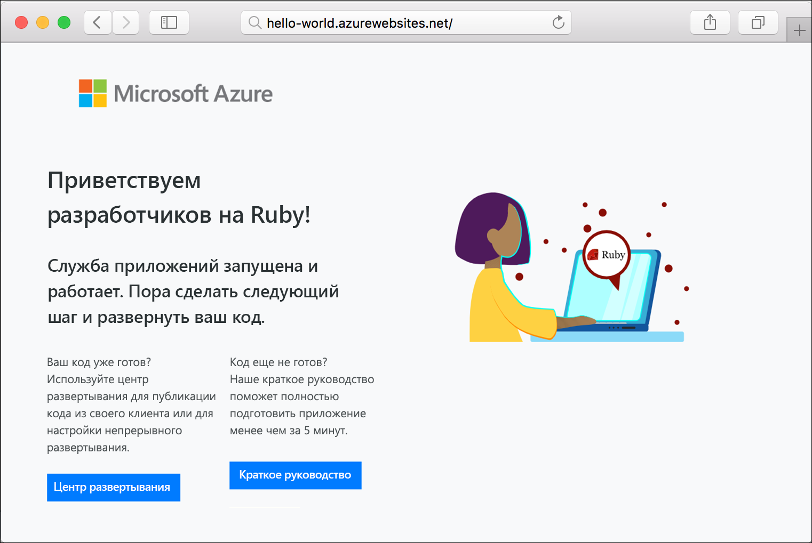

# <a name="create-a-ruby-on-rails-app-in-app-service-on-linux"></a>Создание приложения Ruby on Rails в Службе приложений на платформе Linux

[Служба приложений на платформе Linux](app-service-linux-intro.md) — это высокомасштабируемая служба размещения с самостоятельной установкой исправлений на основе операционной системы Linux. В этом кратком руководстве показано, как развернуть приложение Ruby on Rails в Службе приложений в Linux с помощью [Cloud Shell](https://docs.microsoft.com/azure/cloud-shell/overview).

> [!NOTE]
> Сейчас стек разработки на Ruby поддерживает только Ruby on Rails. Если требуется использовать другую платформу, например Sinatra, или [неподдерживаемую версию Ruby](app-service-linux-intro.md), вам нужно [запустить ее в пользовательском контейнере](quickstart-docker-go.md).


[!INCLUDE [quickstarts-free-trial-note](../../../includes/quickstarts-free-trial-note.md)]

## <a name="prerequisites"></a>Предварительные требования

* <a href="https://www.ruby-lang.org/en/documentation/installation/#rubyinstaller" target="_blank">установите Ruby 2.6 или последующей версии</a>;
* <a href="https://git-scm.com/" target="_blank">установите Git</a>;

## <a name="download-the-sample"></a>Скачивание примера приложения

В окне терминала выполните следующую команду, чтобы клонировать репозиторий с примером приложения на локальный компьютер.

```bash
git clone https://github.com/Azure-Samples/ruby-docs-hello-world
```

## <a name="run-the-application-locally"></a>Локальный запуск приложения

Запустите приложение локально, чтобы увидеть, как оно будет выглядеть после развертывания в Azure. Откройте окно терминала, измените каталог `hello-world` и выполните команду `rails server` для запуска сервера.

Первый этап — установка необходимых пакетов. В пример добавлен `Gemfile`, поэтому просто выполните следующую команду:

```bash
bundle install
```

После установки пакетов мы воспользуемся средством увязки в пакеты, чтобы запустить приложение:

```bash
bundle exec rails server
```

С помощью веб-браузера перейдите к `http://localhost:3000`, чтобы протестировать приложение локально.


[!INCLUDE [Try Cloud Shell](../../../includes/cloud-shell-try-it.md)]

[!INCLUDE [Configure deployment user](../../../includes/configure-deployment-user.md)]

[!INCLUDE [Create resource group](../../../includes/app-service-web-create-resource-group-linux.md)]

[!INCLUDE [Create app service plan](../../../includes/app-service-web-create-app-service-plan-linux.md)]

## <a name="create-a-web-app"></a>Создание веб-приложения

[!INCLUDE [Create web app](../../../includes/app-service-web-create-web-app-ruby-linux-no-h.md)] 

Перейдите к приложению, чтобы просмотреть созданное веб-приложение со встроенным образом. Замените _&lt;имя_приложения>_ уникальным именем веб-приложения.

```bash
http://<app_name>.azurewebsites.net
```

Новое веб-приложение должно выглядеть так:



## <a name="deploy-your-application"></a>Развертывание приложения

Выполните следующие команды, чтобы развернуть локальное приложение в веб-приложение Azure.

```bash
git remote add azure <Git deployment URL from above>
git push azure master
```

Убедитесь, что операции удаленного развертывания успешно выполнены. Выходные данные команд будут выглядеть следующим образом:

```bash
remote: Using turbolinks 5.2.0
remote: Using uglifier 4.1.20
remote: Using web-console 3.7.0
remote: Bundle complete! 18 Gemfile dependencies, 78 gems now installed.
remote: Bundled gems are installed into `/tmp/bundle`
remote: Zipping up bundle contents
remote: .......
remote: ~/site/repository
remote: Finished successfully.
remote: Running post deployment command(s)...
remote: Deployment successful.
remote: App container will begin restart within 10 seconds.
To https://<app-name>.scm.azurewebsites.net/<app-name>.git
   a6e73a2..ae34be9  master -> master
```

После завершения развертывания подождите около 10 секунд пока веб-приложение перезапустится, а затем перейдите к нему и проверьте результаты.

```bash
http://<app-name>.azurewebsites.net
```


> [!NOTE]
> Во время перезапуска приложения в браузере можете отображаться код состояния HTTP `Error 503 Server unavailable` или страница по умолчанию `Hey, Ruby developers!`. На полный перезапуск приложения может потребоваться несколько минут.
>

[!INCLUDE [Clean-up section](../../../includes/cli-script-clean-up.md)]

## <a name="next-steps"></a>Дополнительная информация

> [!div class="nextstepaction"]
> [Руководство. по Ruby on Rails с Postgres](tutorial-ruby-postgres-app.md)

> [!div class="nextstepaction"]
> [Настройка приложения Ruby](configure-language-ruby.md)
