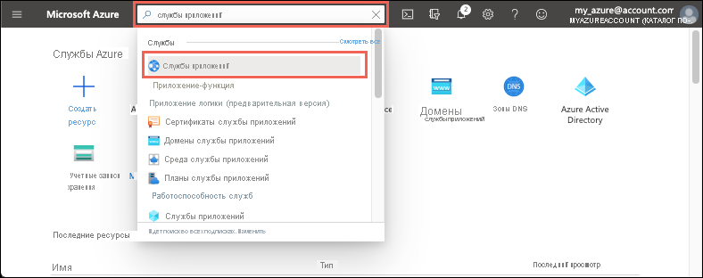

# <a name="quickstart-create-an-aspnet-core-web-app-in-azure"></a>Краткое руководство. Создание веб-приложения ASP.NET Core в Azure

::: zone pivot="platform-windows"  

Из этого краткого руководства вы узнаете, как создать и развернуть первое веб-приложение ASP.NET Core в [Службе приложений Azure](overview.md). 

Когда вы закончите работу с ним, у вас будет создана группа ресурсов Azure с планом размещения Службы приложений и Службой приложений, где развернуто веб-приложение.

## <a name="prerequisites"></a>Предварительные требования

- Учетная запись Azure с активной подпиской. [Создайте учетную запись](https://azure.microsoft.com/free/dotnet/) бесплатно.
- В этом кратком руководстве описывается, как развернуть приложение в Службе приложений на платформе Windows. Чтобы развернуть Службу приложений в _Linux_, см. статью [Создание веб-приложения .NET Core в Службе приложений](./quickstart-dotnetcore.md).
- Установите <a href="https://www.visualstudio.com/downloads/" target="_blank">Visual Studio 2019</a> с рабочей нагрузкой **ASP.NET и веб-разработка**.

  Если у вас уже установлена версия Visual Studio 2019, сделайте следующее.

  - Установите последние обновления для Visual Studio, выбрав **Справка** > **Проверить обновления**.
  - Добавьте рабочую нагрузку, выбрав **Инструменты** > **Получить средства и компоненты**.


## <a name="create-an-aspnet-core-web-app"></a>Создание веб-приложения ASP.NET Core

Создайте веб-приложение ASP.NET Core в Visual Studio, выполнив следующие действия:

1. Откройте Visual Studio и выберите **Создать проект**.

1. В разделе **Создание нового проекта** выберите **Веб-приложение ASP.NET Core** и убедитесь, что в списке для этого варианта указан язык **C#** , а затем щелкните **Далее**.

1. В окне **Настройка нового проекта** присвойте проекту веб-приложения имя *myFirstAzureWebApp* и щелкните **Создать**.

   

1. Вы можете развернуть в Azure веб-приложение ASP.NET Core любого типа, но для этого краткого руководства нам нужен шаблон **Веб-приложение**. В разделе **Проверка подлинности** выберите вариант **Без проверки подлинности** и убедитесь, что остальные варианты не выбраны. Затем выберите **Создать**.

    
   
1. В меню Visual Studio выберите **Отладка** > **Запустить без отладки**, чтобы запустить веб-приложение локально.

   

## <a name="publish-your-web-app"></a>Публикация веб-приложения

Прежде чем опубликовать веб-приложение, следует создать и настроить новую Службу приложений, в которой вы сможете опубликовать это приложение. 

В процессе настройки Службы приложений вы создадите следующее:

- Новая [группа ресурсов](../azure-resource-manager/management/overview.md#terminology) для всех ресурсов Azure, которые потребуются для этой службы.
- Новый [план размещения](./overview-hosting-plans.md), который позволяет определить расположение, размер и функции фермы веб-серверов для размещения приложения.

Выполните следующие действия, чтобы создать Службу приложений и опубликовать веб-приложение:

1. Щелкните правой кнопкой мыши проект **myFirstAzureWebApp** в **обозревателе решений** и выберите **Опубликовать**. Если вы еще не вошли в учетную запись Azure из Visual Studio, выберите **Добавление учетной записи** или **Вход**. Вы также можете создать бесплатную учетную запись Azure.

1. В диалоговом окне **Выберите целевого объекта публикации** выберите вариант **Служба приложений**, затем щелкните **Создать** и **Создать профиль**.

   

1. В диалоговом окне **Служба приложение Azure: Создать новое** укажите для приложения глобально уникальное имя в поле **Имя**, подтвердив вариант по умолчанию или введя новое имя. Допустимые символы: `a-z`, `A-Z`, `0-9` и `-`. Это **имя** используется в качестве префикса URL-адреса для веб-приложения в формате `http://<app_name>.azurewebsites.net`.

1. Для параметра **Подписка** подтвердите предложенный вариант или выберите другой из раскрывающегося списка.

1. Для параметра **Группа ресурсов** выберите **Создать**. В разделе **Новое имя группы ресурсов** введите *myResourceGroup* и щелкните **ОК**. 

1. В разделе **План размещения** щелкните **Создать**. 

1. В диалоговом окне **План размещения. Создать новый** введите значения, указанные в следующей таблице.

   | Параметр  | Рекомендуемое значение | Описание |
   | -------- | --------------- | ----------- |
   | **План размещения**  | *myFirstAzureWebAppPlan* | Имя плана службы приложений. |
   | **Расположение**      | *Западная Европа* | Центр обработки данных, где размещается веб-приложение. |
   | **Размер**          | *Бесплатный* | [Ценовая категория](https://azure.microsoft.com/pricing/details/app-service/?ref=microsoft.com&utm_source=microsoft.com&utm_medium=docs&utm_campaign=visualstudio) определяет возможности размещения. |
   
   

1. Для параметра **Application Insights** укажите значение *Нет*.

1. В диалоговом окне **Служба приложение Azure: Создать новую** щелкните **Создать**, чтобы начать создание ресурсов Azure.

   

1. Когда мастер завершит работу, щелкните **Опубликовать**.

   

   Visual Studio опубликует веб-приложение ASP.NET Core в Azure и запустит это приложение в браузере по умолчанию. 

   

**Поздравляем!** Ваше веб-приложение ASP.NET Core работает в Службе приложений Azure в реальном времени.

## <a name="update-the-app-and-redeploy"></a>Обновление и повторное развертывание приложения

Чтобы обновить и повторно развернуть веб-приложение, сделайте следующее:

1. В **обозревателе решений** в проекте откройте **Страницы** > **Index.cshtml**.

1. Замените весь тег `<div>` следующим кодом:

   ```html
   <div class="jumbotron">
       <h1>ASP.NET in Azure!</h1>
       <p class="lead">This is a simple app that we've built that demonstrates how to deploy a .NET app to Azure App Service.</p>
   </div>
   ```

1. Чтобы выполнить повторное развертывание в Azure, щелкните правой кнопкой мыши проект **myFirstAzureWebApp** в **обозревателе решений**, а затем выберите **Опубликовать**.

1. На странице **Публикация** со сводными сведениями щелкните **Опубликовать**.

   

По завершении публикации Visual Studio открывает в браузере страницу с URL-адресом веб-приложения.


## <a name="manage-the-azure-app"></a>Управление приложением Azure

Чтобы управлять веб-приложением, перейдите на [портал Azure](https://portal.azure.com), найдите и выберите **Службы приложений**.



На странице **Службы приложений** выберите имя веб-приложения.

:::image type="content" source="./media/quickstart-dotnetcore/select-app-service.png" alt-text="Снимок экрана: страница служб приложений с примером выбранного веб-приложения.":::

На странице **Обзор** для веб-приложения вы можете выполнять базовые задачи управления: просмотр, завершение, запуск, перезагрузку и удаление. В меню слева есть дополнительные страницы для настройки приложения.


[!INCLUDE [Clean-up section](../../includes/clean-up-section-portal.md)]

## <a name="next-steps"></a>Дальнейшие действия

В этом кратком руководстве вы применили Visual Studio, чтобы создать и развернуть веб-приложение ASP.NET Core в Службе приложений Azure.

Переходите к следующей статье, чтобы узнать, как создать приложение .NET Core и подключить его к Базе данных SQL.

> [!div class="nextstepaction"]
> [Использование ASP.NET Core с базой данных SQL](tutorial-dotnetcore-sqldb-app.md)

> [!div class="nextstepaction"]
> [Настройка приложения ASP.NET Core](configure-language-dotnetcore.md)

::: zone-end  

::: zone pivot="platform-linux"
[Служба приложений на платформе Linux](overview.md#app-service-on-linux) — это высокомасштабируемая служба размещения с самостоятельной установкой исправлений на основе операционной системы Linux. В этом кратком руководстве показано, как создать приложение [.NET Core](/aspnet/core/) в службе приложений на платформе Linux. Создайте приложение с помощью [Azure CLI](/cli/azure/get-started-with-azure-cli) и разверните код .NET Core в приложении с помощью Git.


Выполните инструкции, приведенные в этом руководстве, с помощью компьютера Mac, Windows или Linux.

[!INCLUDE [quickstarts-free-trial-note](../../includes/quickstarts-free-trial-note.md)]

## <a name="prerequisites"></a>Предварительные требования

Для работы с этим кратким руководством сделайте следующее:

* <a href="https://git-scm.com/" target="_blank">установите Git</a>;
* <a href="https://dotnet.microsoft.com/download/dotnet-core/3.1" target="_blank">установите пакет SDK для .NET Core 3.1 с последними обновлениями</a>.

## <a name="create-the-app-locally"></a>Локальное создание приложения

В окне терминала на компьютере создайте каталог `hellodotnetcore` и перейдите в него.

```bash
mkdir hellodotnetcore
cd hellodotnetcore
```

Создание нового приложения .NET Core

```bash
dotnet new web
```

## <a name="run-the-app-locally"></a>Локальный запуск приложения

Запустите приложение локально, чтобы увидеть, как оно будет выглядеть после развертывания в Azure. 

Восстановите пакеты NuGet и запустите приложение.

```bash
dotnet run
```

Откройте веб-браузер и перейдите к приложению в `http://localhost:5000`.

На странице отобразится сообщение **Hello World** из примера приложения.


В окне терминала нажмите клавиши **CTRL+C**, чтобы выйти из веб-сервера. Инициализируйте репозиторий Git для проекта .NET Core.

```bash
git init
git add .
git commit -m "first commit"
```

[!INCLUDE [cloud-shell-try-it.md](../../includes/cloud-shell-try-it.md)]

[!INCLUDE [Configure deployment user](../../includes/configure-deployment-user.md)]

[!INCLUDE [Create resource group](../../includes/app-service-web-create-resource-group-linux.md)]

[!INCLUDE [Create app service plan](../../includes/app-service-web-create-app-service-plan-linux.md)]

## <a name="create-a-web-app"></a>Создание веб-приложения

[!INCLUDE [Create web app](../../includes/app-service-web-create-web-app-dotnetcore-linux-no-h.md)]

Перейдите к только что созданному веб-приложению. Замените _&lt;app-name>_ именем своего приложения.

```bash
https://<app-name>.azurewebsites.net
```

Новое приложение должно выглядеть следующим образом.


[!INCLUDE [Push to Azure](../../includes/app-service-web-git-push-to-azure.md)] 

<pre>
Enumerating objects: 5, done.
Counting objects: 100% (5/5), done.
Compressing objects: 100% (3/3), done.
Writing objects: 100% (3/3), 285 bytes | 95.00 KiB/s, done.
Total 3 (delta 2), reused 0 (delta 0), pack-reused 0
remote: Deploy Async
remote: Updating branch 'master'.
remote: Updating submodules.
remote: Preparing deployment for commit id 'd6b54472f7'.
remote: Repository path is /home/site/repository
remote: Running oryx build...
remote: Build orchestrated by Microsoft Oryx, https://github.com/Microsoft/Oryx
remote: You can report issues at https://github.com/Microsoft/Oryx/issues
remote:
remote: Oryx Version      : 0.2.20200114.13, Commit: 204922f30f8e8d41f5241b8c218425ef89106d1d, ReleaseTagName: 20200114.13
remote: Build Operation ID: |imoMY2y77/s=.40ca2a87_
remote: Repository Commit : d6b54472f7e8e9fd885ffafaa64522e74cf370e1
.
.
.
remote: Deployment successful.
remote: Deployment Logs : 'https://&lt;app-name&gt;.scm.azurewebsites.net/newui/jsonviewer?view_url=/api/deployments/d6b54472f7e8e9fd885ffafaa64522e74cf370e1/log'
To https://&lt;app-name&gt;.scm.azurewebsites.net:443/&lt;app-name&gt;.git
   d87e6ca..d6b5447  master -> master
</pre>

## <a name="browse-to-the-app"></a>Переход в приложение

Перейдите в развертываемое приложение с помощью веб-браузера.

```bash
http://<app_name>.azurewebsites.net
```

Пример кода .NET Core выполняется в службе приложений в Linux со встроенным образом.


**Поздравляем!** Вы развернули свое первое приложение .NET Core в службе приложений в Linux.

## <a name="update-and-redeploy-the-code"></a>Обновление и повторное развертывание кода

В локальном каталоге откройте файл _Startup.cs_. Внесите некоторые изменения в текст в вызове метода `context.Response.WriteAsync`:

```csharp
await context.Response.WriteAsync("Hello Azure!");
```

Зафиксируйте изменения в Git, а затем отправьте изменения кода в Azure.

```bash
git commit -am "updated output"
git push azure master
```

После завершения развертывания переключитесь в окно браузера, открытое на этапе **перехода в приложение**, и щелкните "Обновить".


## <a name="manage-your-new-azure-app"></a>Управление новым приложением Azure

Перейдите на <a href="https://portal.azure.com" target="_blank">портал Azure</a>, чтобы управлять созданным приложением.

В меню слева щелкните **Службы приложений**, а затем — имя своего приложения Azure.

:::image type="content" source="./media/quickstart-dotnetcore/portal-app-service-list.png" alt-text="Снимок экрана: страница служб приложений с примером выбранного веб-приложения.":::

Отобразится страница обзора вашего приложения. Вы можете выполнять базовые задачи управления: обзор, завершение, запуск, перезагрузку и удаление. 


В меню слева доступно несколько страниц для настройки приложения. 

[!INCLUDE [cli-samples-clean-up](../../includes/cli-samples-clean-up.md)]

## <a name="next-steps"></a>Дальнейшие действия

> [!div class="nextstepaction"]
> [Руководство. по приложению ASP.NET Core с Базой данных SQL](tutorial-dotnetcore-sqldb-app.md)

> [!div class="nextstepaction"]
> [Настройка приложения ASP.NET Core](configure-language-dotnetcore.md)

::: zone-end