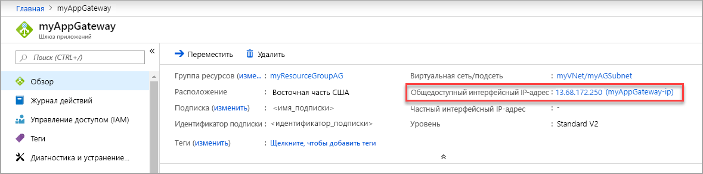

# <a name="create-an-application-gateway-with-a-web-application-firewall-using-the-azure-portal"></a>Создание шлюза приложений с брандмауэром веб-приложения с помощью портала Azure

> [!div class="op_single_selector"]
>
> - [Портал Azure](application-gateway-web-application-firewall-portal.md)
> - [PowerShell](tutorial-restrict-web-traffic-powershell.md)
> - [Инфраструктура CLI Azure](tutorial-restrict-web-traffic-cli.md)
>
> 

Этом руководстве показано, как использовать портал Azure для создания [шлюза приложений](application-gateway-introduction.md) с [брандмауэр веб-приложения](application-gateway-web-application-firewall-overview.md) (WAF). Для защиты приложения WAF использует правила [OWASP](https://www.owasp.org/index.php/Category:OWASP_ModSecurity_Core_Rule_Set_Project). Эти правила включают защиту от атак, например от внедрения кода SQL, межсайтовых скриптов и захватов сеанса. Создав шлюз приложений, протестируйте его, чтобы убедиться в том, что он работает правильно. Шлюз приложений Azure позволяет направлять веб-трафик приложения к определенным ресурсам. Для этого портам назначаются прослушиватели, создаются определенные правила и в серверный пул добавляются соответствующие ресурсы. Чтобы упростить восприятие, в этой статье используется простая настройка с открытым интерфейсным IP-адресом, базовый прослушиватель для размещения одного сайта на этом шлюзе приложений, две виртуальные машины, используемые для серверного пула, и базовое правило маршрутизации запросов.

В этой статье раскрываются следующие темы:

> [!div class="checklist"]
> * Создание шлюза приложений с включенным WAF.
> * Создание виртуальных машин, используемых в качестве внутренних серверов.
> * Создание учетной записи хранения и настройка диагностики.


[!INCLUDE [updated-for-az](../../includes/updated-for-az.md)]

## <a name="sign-in-to-azure"></a>Вход в Azure

Войдите на портал Azure по адресу [https://portal.azure.com](https://portal.azure.com).

## <a name="create-an-application-gateway"></a>Создание шлюза приложений

В Azure для обмена между создаваемыми ресурсами необходима виртуальная сеть. Вы можете создать новую виртуальную сеть или использовать существующую. В этом примере мы создадим новую виртуальную сеть. Вы можете создать виртуальную сеть во время создания шлюза приложений. Экземпляры Шлюза приложений создаются в отдельных подсетях. В этом примере создаются две подсети: одна — для шлюза приложений, а вторая — для внутренних серверов.

Выберите **Создать ресурс** в верхнем левом меню портала Azure. Появится окно **Создать**.

Выберите **Сети**, а затем в списке **Рекомендованные** выберите **Шлюз приложений**.

### <a name="basics-page"></a>Страница "Основные"

1. На странице **Основы** введите эти значения для следующих параметров шлюза приложений:
   - **Имя.** Введите *myAppGateway* для имени шлюза приложений.
   - **Группа ресурсов.** Выберите **myResourceGroupAG** для группы ресурсов. Выберите **Создать** для создания группы ресурсов, если она еще не существует.
   - Выберите *WAF* для уровня шлюза приложений.

Оставьте значения по умолчанию для остальных параметров и нажмите кнопку **ОК**.

### <a name="settings-page"></a>Страница «Параметры»

1. На странице **Параметры** в разделе **Конфигурация подсети** выберите **Выбор виртуальной сети**. <br>
2. На странице **Выбор виртуальной сети** выберите **Создать**, а затем введите значения для следующих параметров виртуальной сети:
   - **Имя.** Введите *myVNet* для имени виртуальной сети.
   - **Диапазон адресов**: Введите *10.0.0.0/16* для адресного пространства виртуальной сети.
   - **Имя подсети**. Введите *myAGSubnet* для имени подсети.<br>Подсеть шлюза приложений может содержать только шлюзы приложений. Другие ресурсы запрещены.
   - **Диапазон адресов подсети**: Введите *10.0.0.0/24* диапазона адресов подсети.
3. Нажмите кнопку **ОК**, чтобы создать виртуальную сеть и подсеть.
4. Выберите **Интерфейсная IP-конфигурация**. В разделе **Интерфейсная IP-конфигурация** убедитесь, что для параметра **Тип IP-адреса** установлено значение **Общедоступный**. В разделе **Общедоступный IP-адрес** убедитесь, что выбрано **Создать**. <br>Вы можете настроить общедоступный интерфейсный или частный IP-адрес, согласно вашему варианту использования. В этом примере мы будем использовать общедоступный интерфейсный IP-адрес. 
5. Введите *myAGPublicIPAddress* для имени общедоступного IP-адреса. 
6. Оставьте значения по умолчанию для других параметров, а затем нажмите кнопку **ОК**.<br>Чтобы упростить работу, в этой статье мы будем использовать значения по умолчанию. Вы же можете настроить пользовательские значения для других параметров в зависимости от вашего варианта использования. 

### <a name="summary-page"></a>Страница "Сводка"

Просмотрите параметры на странице **Сводка** и нажмите кнопку **ОК**, чтобы создать виртуальную сеть, общедоступный IP-адрес и шлюз приложений. Создание шлюза приложений в Azure может занять несколько минут. Дождитесь успешного завершения развертывания перед переходом к следующему разделу.

## <a name="add-backend-pool"></a>Добавление внутреннего пула

Внутренний пул используется для перенаправления запросов на внутренние серверы, на которых будет обслуживаться запрос. Внутренние пулы могут состоять из сетевых адаптеров, масштабируемых наборов виртуальных машин, общедоступных IP-адресов, внутренних IP-адресов, полных доменных имен и таких мультитенантых серверных частей, как служба приложений Azure. Необходимо добавить свои внутренние целевые объекты во внутренний пул.

В этом примере мы будем использовать виртуальные машины в качестве целевых объектов серверной части. Мы можем использовать существующие виртуальные машины или создать новые. В этом примере мы создадим две виртуальные машины, которые будут использоваться в Azure как внутренние серверы для шлюза приложений. Для этого нам необходимо:

1. Создать новую подсеть, *myBackendSubnet*, в которой будут создаваться новые виртуальные машины. 
2. Создать 2 новые виртуальные машины, *myVM* и *myVM2*, которые будут использоваться в качестве внутренних серверов.
3. Установить службы IIS на виртуальных машинах, чтобы убедиться, что шлюз приложений успешно создан.
4. Добавить внутренние серверы к внутренним пулам.

### <a name="add-a-subnet"></a>Добавление подсети

Добавьте подсеть к созданной виртуальной сети, выполнив следующие шаги.

1. Выберите **Все ресурсы** в меню слева на портале Azure, введите *myVNet* в поле поиска, а затем выберите **myVNet** из результатов поиска.

2. Выберите **Подсети** в меню слева, а затем щелкните **+ Подсеть**. 

   

3. На странице **Добавление подсети** введите *myBackendSubnet* для параметра **Имя** подсети, а затем щелкните **ОК**.

### <a name="create-a-virtual-machine"></a>Создание виртуальной машины

1. На портале Azure выберите **Создать ресурс**. Появится окно **Создать**.
2. Выберите **Вычисление**, а затем в списке **Рекомендованные** выберите **Windows Server 2016 Datacenter**. Появится страница **Создание виртуальной машины**.<br>Шлюз приложений может осуществлять маршрутизацию трафика для любого типа виртуальной машины, используемой в этом внутреннем пуле. В этом примере используется Windows Server 2016 Datacenter.
3. На вкладке **Основы** введите для следующих параметров виртуальной машины такие значения:
   - **Группа ресурсов.** Выберите **myResourceGroupAG** для имени группы ресурсов.
   - **Имя виртуальной машины**. Введите *myVM* для имени виртуальной машины.
   - **Имя пользователя**. Введите *azureuser* для имени администратора.
   - **Пароль**. Введите *Azure123456!* для пароля администратора.
4. Примите остальные значения по умолчанию и щелкните **Далее: Диски**.  
5. Примите значения по умолчанию на вкладке **Диски**, а затем выберите **Далее: Сети**.
6. На вкладке **Сети** убедитесь, что для параметра **Виртуальная сеть** выбрано значение **myVNet**, а для параметра **Подсеть** — значение **myBackendSubnet**. Примите остальные значения по умолчанию и щелкните **Далее: управление**.<br>Шлюз приложений может взаимодействовать с экземплярами за пределами виртуальной сети, к которой он относится, при наличии подключения по IP-адресу. 
7. На вкладке **Управление** для параметра **Диагностика загрузки** задайте значение **Выкл**. Примите другие значения по умолчанию и выберите **Review + create** (Просмотр и создание).
8. На вкладке **Review + create** (Просмотр и создание) проверьте параметры, устраните ошибки проверки, а затем выберите **Создать**.
9. Прежде чем продолжить, дождитесь завершения создания виртуальной машины.

### <a name="install-iis-for-testing"></a>Установка служб IIS для тестирования

В этом примере, чтобы проверить, что шлюз приложений успешно создан на Azure, мы устанавливаем IIS на виртуальные машины. 

1. Откройте [Azure PowerShell](https://docs.microsoft.com/azure/cloud-shell/quickstart-powershell). Для этого выберите **Cloud Shell** в верхней панели навигации портала Azure, а затем выберите **PowerShell** из раскрывающегося списка. 

   

2. Чтобы установить службы IIS, выполните на виртуальной машине следующие команды: 

   ```azurepowershell-interactive
   Set-AzVMExtension `
     -ResourceGroupName myResourceGroupAG `
     -ExtensionName IIS `
     -VMName myVM `
     -Publisher Microsoft.Compute `
     -ExtensionType CustomScriptExtension `
     -TypeHandlerVersion 1.4 `
     -SettingString '{"commandToExecute":"powershell Add-WindowsFeature Web-Server; powershell Add-Content -Path \"C:\\inetpub\\wwwroot\\Default.htm\" -Value $($env:computername)"}' `
     -Location EastUS
   ```

3. Создайте вторую виртуальную машину и установите IIS, следуя только что выполненным инструкциям. Используйте *myVM2* для имени виртуальной машины и **VMName** параметр **AzVMExtension набора** командлета.

### <a name="add-backend-servers-to-backend-pool"></a>Добавление серверов во внутренние пулы

1. Выберите **Все ресурсы**, а затем — **myAppGateway**.

2. Выберите **Серверные пулы** в меню слева. При создании шлюза приложений в Azure автоматически создается пул по умолчанию **appGatewayBackendPool**. 

3. Выберите **appGatewayBackendPool**.

4. В разделе **Цели** выберите **Виртуальная машина** из раскрывающегося списка.

5. В столбцах **Виртуальная машина** и **Сетевые интерфейсы** выберите виртуальные машины **myVM** и **myVM2** и связанные с ними сетевые интерфейсы из раскрывающихся списков.

   

6. Щелкните **Сохранить**.

## <a name="create-a-storage-account-and-configure-diagnostics"></a>Создание учетной записи хранения и настройка диагностики.

### <a name="create-a-storage-account"></a>Создание учетной записи хранения

В этом руководстве шлюз приложений использует учетную запись хранения, чтобы хранить данные для выявления и предотвращения угроз. Для записи данных можно также использовать журналы Azure Monitor или концентратор событий.

1. Нажмите кнопку **Создать** в левом верхнем углу портала Azure.
2. Выберите **Хранилище**, а затем выберите **Учетная запись хранения — BLOB-объект, файл, таблица, очередь**.
3. Введите имя учетной записи хранения, выберите параметр **Использовать существующую** для группы ресурсов, а затем выберите **myResourceGroupAG**. В этом примере имя учетной записи хранения — *myagstore1*. Оставьте значения по умолчанию для остальных параметров и нажмите кнопку **Создать**.

### <a name="configure-diagnostics"></a>Настройка диагностики

Настройте диагностику для записи данных в журналы ApplicationGatewayAccessLog, ApplicationGatewayPerformanceLog и ApplicationGatewayFirewallLog.

1. В меню слева щелкните **Все ресурсы**, а затем выберите *myAppGateway*.
2. В разделе "Мониторинг" щелкните **Журналы диагностики**.
3. Нажмите кнопку **Добавить параметр диагностики**.
4. Введите значение *myDiagnosticsSettings* для имени параметров диагностики.
5. Установите флажок **Архивировать в учетной записи хранения** и нажмите кнопку **Настроить**, чтобы выбрать учетную запись хранения *myagstore1*, которую вы создали.
6. Выберите журналы шлюза приложений для сбора и хранения.
7. Выберите команду **Сохранить**.

    

## <a name="test-the-application-gateway"></a>Тестирование шлюза приложений

Для создания шлюза приложений не требуется устанавливать IIS. Но в рамках этого руководства они устанавливаются, чтобы проверить, создан ли шлюз приложений. Используйте IIS для тестирования шлюза приложений.

1. На странице **Обзор** найдите общедоступный IP-адрес для шлюза приложений. . В качестве альтернативы вы можете выбрать **Все ресурсы** и ввести в поисковое поле *myAGPublicIPAddress*, а затем выбрать его из результатов поиска. Общедоступный IP-адрес отобразится в Azure на странице **Обзор**.
2. Скопируйте общедоступный IP-адрес и вставьте его в адресную строку браузера.
3. Проверьте ответ. Допустимый ответ подтверждает, что шлюз приложений успешно создан и может успешно подключиться к серверу.

## <a name="clean-up-resources"></a>Очистка ресурсов

Если вам уже не нужны ресурсы, созданные с помощью шлюза приложений, удалите группу ресурсов. Удалив ее, вы также удалите шлюз приложений и все связанные с ним ресурсы. 

Чтобы удалить группу ресурсов:

1. На портале Azure в меню слева выберите **Группы ресурсов**.
2. На странице **Группы ресурсов** выполните поиск группы **myResourceGroupAG** в списке и выберите ее.
3. На странице **группы ресурсов** выберите **Удалить группу ресурсов**.
4. Введите *myResourceGroupAG* в поле **Введите имя группы ресурсов**, а затем выберите **Удалить**.

## <a name="next-steps"></a>Дальнейшие действия

Из этой статьи вы узнали, как выполнять следующие задачи:

> [!div class="checklist"]
> * Создание шлюза приложений с включенным WAF.
> * Создание виртуальных машин, используемых в качестве внутренних серверов.
> * Создание учетной записи хранения и настройка диагностики.

Чтобы узнать больше о шлюзах приложений и связанных с ними ресурсах, перейдите к статьям с инструкциями.
