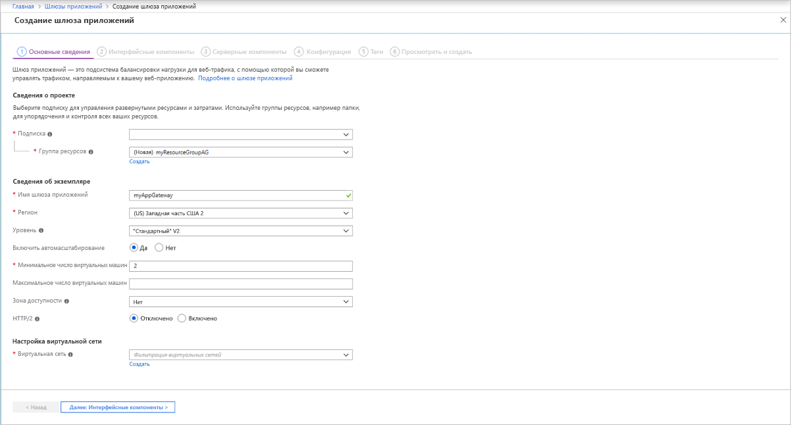
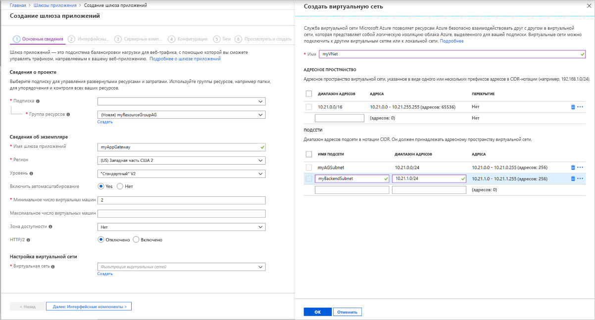
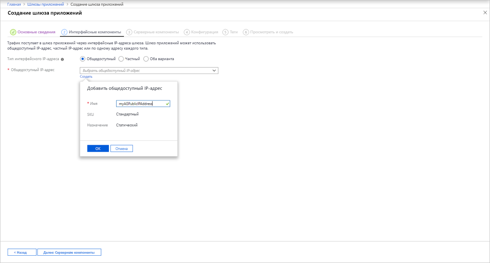
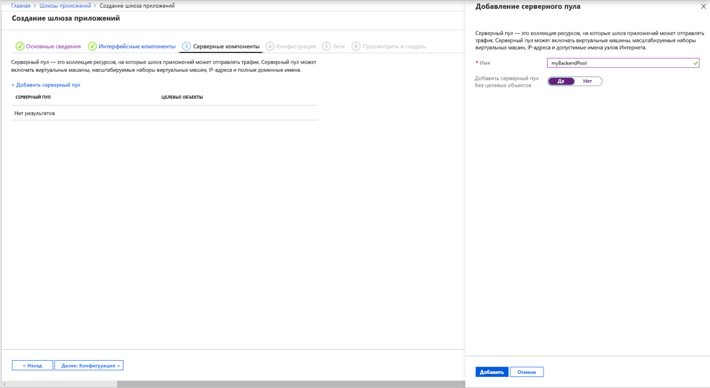
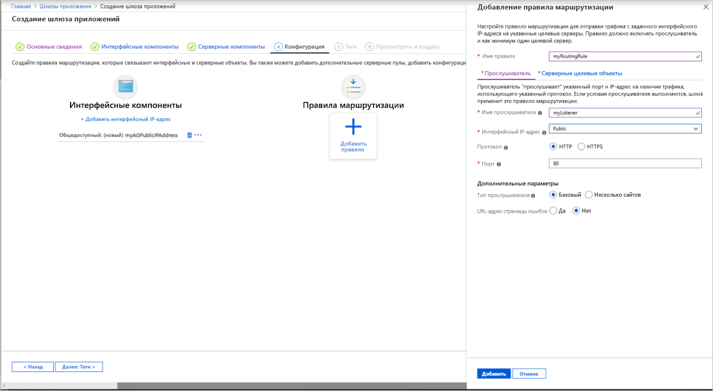
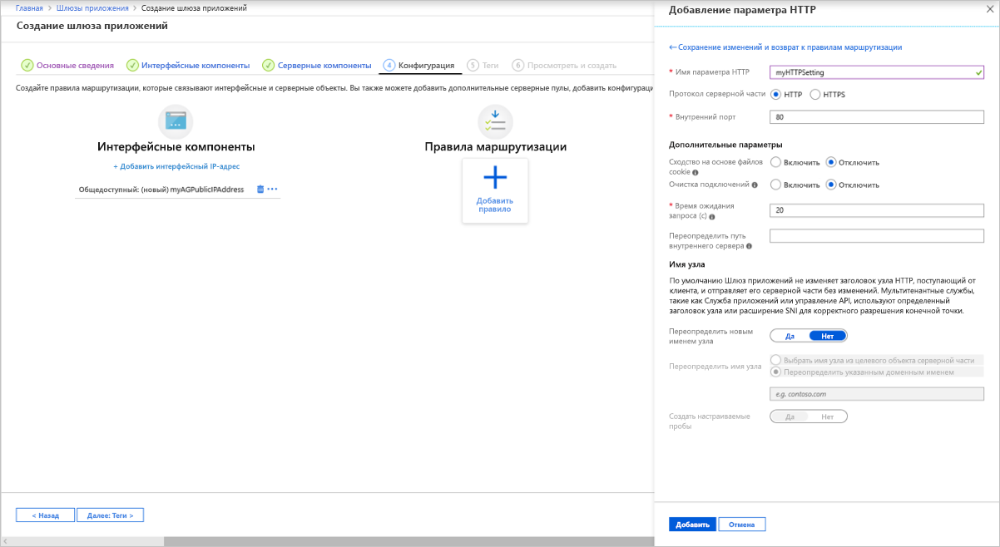
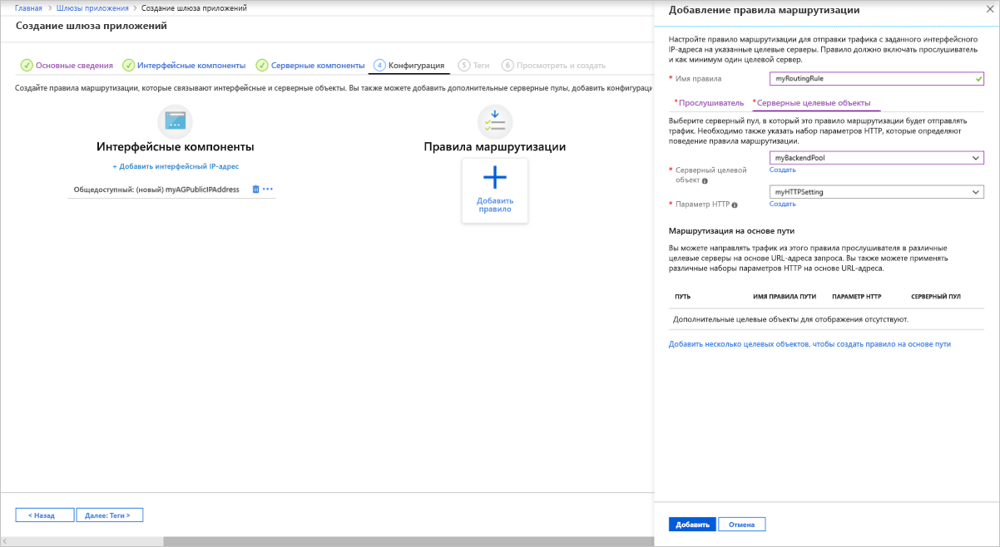
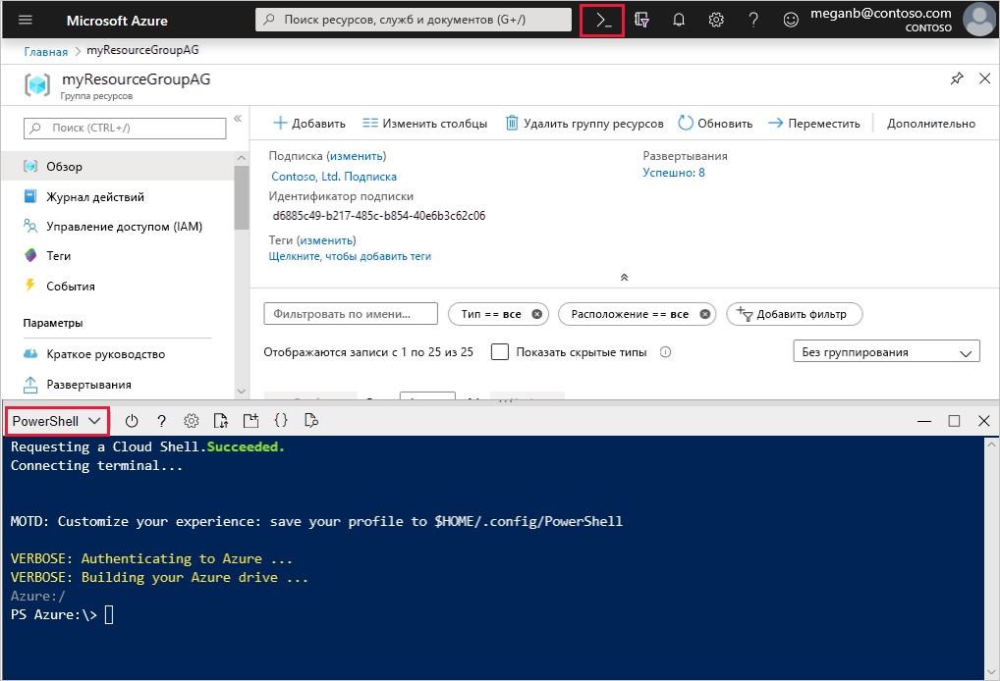
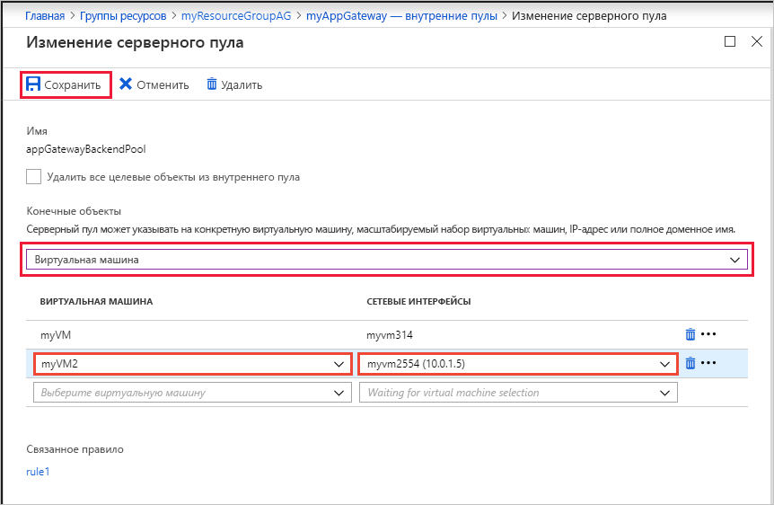

# <a name="tutorial-configure-an-application-gateway-with-ssl-termination-using-the-azure-portal"></a>Руководство по Настройка шлюза приложений с завершением SSL-запросов с помощью портала Azure

С помощью портала Azure можно настроить [шлюз приложений](overview.md) с сертификатом для завершения SSL-запросов, в котором используются виртуальные машины для внутренних серверов.

Из этого руководства вы узнаете, как выполнять следующие задачи:

> [!div class="checklist"]
> * Создание самозаверяющего сертификата
> * создание шлюза приложений с сертификатом;
> * создание виртуальных машин, используемых в качестве внутренних серверов.
> * Тестирование шлюза приложений

Если у вас еще нет подписки Azure, [создайте бесплатную учетную запись Azure](https://azure.microsoft.com/free/?WT.mc_id=A261C142F), прежде чем начинать работу.

[!INCLUDE [updated-for-az](../../includes/updated-for-az.md)]

## <a name="sign-in-to-azure"></a>Вход в Azure

Войдите на портал Azure по адресу [https://portal.azure.com](https://portal.azure.com).

## <a name="create-a-self-signed-certificate"></a>Создание самозаверяющего сертификата

В этом разделе вы создадите самозаверяющий сертификат с помощью командлета [New-SelfSignedCertificate](https://docs.microsoft.com/powershell/module/pkiclient/new-selfsignedcertificate). Передайте этот сертификат на портал Azure при создании прослушивателя для шлюза приложений.

На локальном компьютере откройте окно Windows PowerShell от имени администратора. Выполните следующую команду для создания сертификата.

```powershell
New-SelfSignedCertificate `
  -certstorelocation cert:\localmachine\my `
  -dnsname www.contoso.com
```

Вы увидите примерно такой ответ:

```
PSParentPath: Microsoft.PowerShell.Security\Certificate::LocalMachine\my

Thumbprint                                Subject
----------                                -------
E1E81C23B3AD33F9B4D1717B20AB65DBB91AC630  CN=www.contoso.com
```

Используйте [Export-PfxCertificate](https://docs.microsoft.com/powershell/module/pkiclient/export-pfxcertificate) с возвращенным отпечатком, чтобы экспортировать PFX-файл из сертификата:

> [!NOTE]
> Не используйте специальные символы в пароле PFX-файла. Поддерживаются только буквенно-цифровые символы.

```powershell
$pwd = ConvertTo-SecureString -String "Azure123456!" -Force -AsPlainText
Export-PfxCertificate `
  -cert cert:\localMachine\my\E1E81C23B3AD33F9B4D1717B20AB65DBB91AC630 `
  -FilePath c:\appgwcert.pfx `
  -Password $pwd
```

## <a name="create-an-application-gateway"></a>Создание шлюза приложений

1. Выберите **Создать ресурс** в верхнем левом меню портала Azure. Появится окно **Создать**.

2. Выберите **Сети**, а затем в списке **Рекомендованные** выберите **Шлюз приложений**.

### <a name="basics-tab"></a>Вкладка "Основные сведения"

1. На вкладке **Основные сведения** введите значения для следующих параметров шлюза приложений.

   - **Группа ресурсов.** Выберите **myResourceGroupAG** для группы ресурсов. Выберите **Создать** для создания группы ресурсов, если она еще не существует.
   - **Имя шлюза приложений**. Введите *myAppGateway* для имени шлюза приложений.

     

2.  В Azure для обмена между создаваемыми ресурсами необходима виртуальная сеть. Вы можете создать новую виртуальную сеть или использовать существующую. В этом примере вы можете создать виртуальную сеть одновременно со шлюзом приложений. Экземпляры Шлюза приложений создаются в отдельных подсетях. В этом примере создаются две подсети: одна — для шлюза приложений, а вторая — для внутренних серверов.

    В разделе **Настройка виртуальной сети** создайте новую виртуальную сеть, выбрав команду **Создать**. В открывшемся окне **Создание виртуальной сети** введите следующие значения, которые будут использоваться для создания виртуальной сети и двух подсетей.

    - **Имя.** Введите *myVNet* для имени виртуальной сети.

    - **Имя подсети** (Подсеть шлюза приложений). В сетке **Подсети** будет показана подсеть с именем *По умолчанию*. Измените имя этой подсети на *myAGSubnet*.<br>Подсеть шлюза приложений может содержать только шлюзы приложений. Другие ресурсы запрещены.

    - **Имя подсети** (подсеть внутреннего сервера). Во второй строке таблицы **Подсети** введите *myBackendSubnet* в столбце **Имя подсети**.

    - **Диапазон адресов** (подсеть внутреннего сервера). Во второй строке таблицы **Подсети** введите диапазон адресов, которые не пересекаются с диапазоном адресов *myAGSubnet*. Например, если диапазон адресов *myAGSubnet* равен 10.0.0.0/24, введите *10.0.1.0/24* для диапазона адресов *myBackendSubnet*.

    Выберите **ОК**, чтобы закрыть окно **Создание виртуальной сети** и сохранить настройки виртуальной сети.

     
    
3. На вкладке **Основные сведения** примите значения по умолчанию для других параметров и выберите **Далее: интерфейсные серверы**.

### <a name="frontends-tab"></a>Вкладка "Интерфейсные серверы"

1. На вкладке **Интерфейсные серверы** убедитесь, что для параметра **Тип IP-адреса интерфейсных серверов** установлено значение **Общедоступный**. <br>Вы можете настроить общедоступный интерфейсный или частный IP-адрес, согласно вашему варианту использования. В этом примере мы будем использовать общедоступный интерфейсный IP-адрес.
   > [!NOTE]
   > Для этого номера SKU Шлюза приложений версии 2 можно выбрать только **общедоступную** интерфейсную IP-конфигурацию. Частная интерфейсная IP-конфигурация сейчас не поддерживается для номера SKU версии 2.

2. Выберите команду **Создать** для **Общедоступного IP-адреса** и введите *myAGPublicIPAddress* в качестве имени общедоступного IP-адреса, а затем щелкните **ОК**. 

     

3. По завершении выберите **Next: серверные компоненты**.

### <a name="backends-tab"></a>Вкладка "Серверные компоненты"

Серверный пул используется для перенаправления запросов на внутренние серверы, на которых обслуживается запрос. Внутренние пулы могут состоять из сетевых адаптеров, масштабируемых наборов виртуальных машин, общедоступных IP-адресов, внутренних IP-адресов, полных доменных имен и таких мультитенантых серверных частей, как служба приложений Azure. В этом примере вы создадите пустой серверный пул со своим шлюзом приложений, а затем добавите в него целевые объекты.

1. На вкладке **Серверные компоненты** выберите **Добавить внутренний пул**.

2. В открывшемся окне **Добавить внутренний пул** введите следующие значения для создания пустого внутреннего пула.

    - **Имя.** Введите *myBackendPool* в качестве имени внутреннего пула.
    - **Добавление внутреннего пула без целей**. Чтобы создать серверный пул без целевых объектов, выберите **Да**. После создания шлюза приложения вы добавите серверные целевые объекты.

3. В окне **Добавление внутреннего пула** выберите **Добавить**, чтобы сохранить конфигурацию внутреннего пула и вернуться на вкладку **Серверные компоненты**.

     

4. На вкладке **Серверные компоненты** выберите **Далее: конфигурация**.

### <a name="configuration-tab"></a>Вкладка "Конфигурация"

На вкладке **Конфигурация** созданный интерфейсный и внутренний пул подключается с помощью правила маршрутизации.

1. Выберите **Добавить правило** в столбце **Правила маршрутизации**.

2. В открывшемся окне **Добавление правила маршрутизации** введите *myRoutingRule* в поле **Имя правила**.

3. Для правила маршрутизации требуется прослушиватель. На вкладке **Прослушиватель** в окне **Добавление правила маршрутизации** введите следующие значения для прослушивателя.

    - **Имя прослушивателя**. Введите *myListener* в качестве имени прослушивателя.
    - **Интерфейсный IP-адрес**. Выберите **Общедоступные**, чтобы выбрать общедоступный IP-адрес, который вы создали для интерфейсных серверов.
    - **Протокол**: Выберите **HTTPS**.
    - **Порт**: Убедитесь, что для порта указан номер 443.

   В разделе **HTTPS-сертификат** укажите следующее:

   - **PFX-файл сертификата**. Найдите и выберите файл c:\appgwcert.pfx, созданный ранее.
   - **Имя сертификата**. Введите *mycert1* для имени сертификата.
   - **Пароль**. Введите *Azure123456!* . в качестве пароля.
  
      Примите значения по умолчанию для других параметров на вкладке **Прослушиватель**, а затем выберите вкладку **Серверные целевые объекты**, чтобы настроить остальную часть правила маршрутизации.

   

4. На вкладке **Серверные целевые объекты** выберите значение **myBackendPool** для параметра **Серверный целевой объект**.

5. Для **Параметр HTTP** выберите **Создать**, чтобы создать новый параметр HTTP. Параметр HTTP будет определять поведение правила маршрутизации. В открывшемся окне **Добавление параметра HTTP** введите *myHTTPSetting* в поле **Имя параметра HTTP**. Примите значения по умолчанию для других параметров в окне **Добавление параметра HTTP**, затем выберите **Добавить**, чтобы вернуться к окну **Добавление правила маршрутизации**. 

     

6. В окне **Добавление правила маршрутизации** выберите **Добавить**, чтобы сохранить правило маршрутизации и вернуться на вкладку **Конфигурация**.

     

7. По завершении выберите **Next: Теги** , а затем **Далее: Отзыв и создание**.

### <a name="review--create-tab"></a>Вкладка "Просмотр и создание"

Просмотрите параметры на вкладке **Просмотр и создание**, а затем выберите **Создать**, чтобы создать виртуальную сеть, общедоступный IP-адрес и шлюз приложения. Создание шлюза приложений в Azure может занять несколько минут. Дождитесь успешного завершения развертывания перед переходом к следующему разделу.

## <a name="add-backend-targets"></a>Добавление серверных целевых объектов

В этом примере мы будем использовать виртуальные машины в качестве целевых объектов серверной части. Вы можете использовать существующие виртуальные машины или создать новые. В этом примере вы создадите две виртуальные машины, которые будут использоваться в Azure как внутренние серверы для шлюза приложений.

Для этого сделайте следующее:

1. Создайте две виртуальные машины (*myVM* и *myVM2*), которые будут использоваться в качестве внутренних серверов.
2. Установить службы IIS на виртуальных машинах, чтобы убедиться, что шлюз приложений успешно создан.
3. Добавить внутренние серверы к внутренним пулам.

### <a name="create-a-virtual-machine"></a>Создание виртуальной машины

1. На портале Azure выберите **Создать ресурс**. Появится окно **Создать**.
2. Выберите **Windows Server 2016 Datacenter** в списке **Популярные**. Появится страница **Создание виртуальной машины**.

   Шлюз приложений может осуществлять маршрутизацию трафика для любого типа виртуальной машины, используемой в этом внутреннем пуле. В этом примере используется Windows Server 2016 Datacenter.

1. На вкладке **Основы** введите для следующих параметров виртуальной машины такие значения:

    - **Группа ресурсов.** Выберите **myResourceGroupAG** для имени группы ресурсов.
    - **Имя виртуальной машины**. Введите *myVM* для имени виртуальной машины.
    - **Имя пользователя**. Введите *azureuser* для имени администратора.
    - **Пароль**. Введите *Azure123456!* для пароля администратора.
4. Примите остальные значения по умолчанию и щелкните **Далее: Диски**.  
5. Примите значения по умолчанию на вкладке **Диски**, а затем выберите **Далее: Сети**.
6. На вкладке **Сети** убедитесь, что для параметра **Виртуальная сеть** выбрано значение **myVNet**, а для параметра **Подсеть** — значение **myBackendSubnet**. Примите остальные значения по умолчанию и щелкните **Далее: управление**.

   Шлюз приложений может взаимодействовать с экземплярами за пределами виртуальной сети, к которой он относится, при наличии подключения по IP-адресу.
1. На вкладке **Управление** для параметра **Диагностика загрузки** задайте значение **Выкл**. Примите другие значения по умолчанию и выберите **Review + create** (Просмотр и создание).
2. На вкладке **Review + create** (Просмотр и создание) проверьте параметры, устраните ошибки проверки, а затем выберите **Создать**.
3. Дождитесь завершения развертывания, прежде чем продолжить.

### <a name="install-iis-for-testing"></a>Установка служб IIS для тестирования

В этом примере службы IIS устанавливаются на виртуальные машины, чтобы проверить, создан ли шлюз приложений в Azure.

1. Откройте [Azure PowerShell](https://docs.microsoft.com/azure/cloud-shell/quickstart-powershell). Для этого выберите **Cloud Shell** в верхней панели навигации портала Azure, а затем выберите **PowerShell** из раскрывающегося списка. 

    

2. Чтобы установить службы IIS, выполните на виртуальной машине следующие команды: 

    ```azurepowershell-interactive
    Set-AzVMExtension `
      -ResourceGroupName myResourceGroupAG `
      -ExtensionName IIS `
      -VMName myVM `
      -Publisher Microsoft.Compute `
      -ExtensionType CustomScriptExtension `
      -TypeHandlerVersion 1.4 `
      -SettingString '{"commandToExecute":"powershell Add-WindowsFeature Web-Server; powershell Add-Content -Path \"C:\\inetpub\\wwwroot\\Default.htm\" -Value $($env:computername)"}' `
      -Location EastUS
    ```

3. Создайте вторую виртуальную машину и установите IIS, следуя только что выполненным инструкциям. Используйте *myVM2* в качестве имени виртуальной машины и параметр **VMName** для командлета **Set-AzVMExtension**.

### <a name="add-backend-servers-to-backend-pool"></a>Добавление серверов во внутренние пулы

1. Выберите **Все ресурсы**, а затем — **myAppGateway**.

2. Выберите **Серверные пулы** в меню слева.

3. Выберите **myBackendPool**.

4. В разделе **Цели** выберите **Виртуальная машина** из раскрывающегося списка.

5. В столбцах **Виртуальная машина** и **Сетевые интерфейсы** выберите виртуальные машины **myVM** и **myVM2** и связанные с ними сетевые интерфейсы из раскрывающихся списков.

    

6. Щелкните **Сохранить**.

7. Прежде чем переходить к следующему шагу, дождитесь завершения развертывания.

## <a name="test-the-application-gateway"></a>Тестирование шлюза приложений

1. Выберите **Все ресурсы**, а затем щелкните **myAGPublicIPAddress**.

    

2. В адресной строке браузера введите *https://\<IP-адрес шлюза приложений\>* .

   Чтобы принять предупреждение системы безопасности, если используется самозаверяющий сертификат безопасности, выберите **Сведения** (или **Advanced** (Дополнительно) в Chrome), а затем перейдите на веб-страницу.

    

    На экране отобразится защищенный веб-сайт IIS, как в показано следующем примере:

    

## <a name="next-steps"></a>Дополнительная информация

> [!div class="nextstepaction"]
> [Подробнее о поддержке SSL для Шлюза приложений](ssl-overview.md)