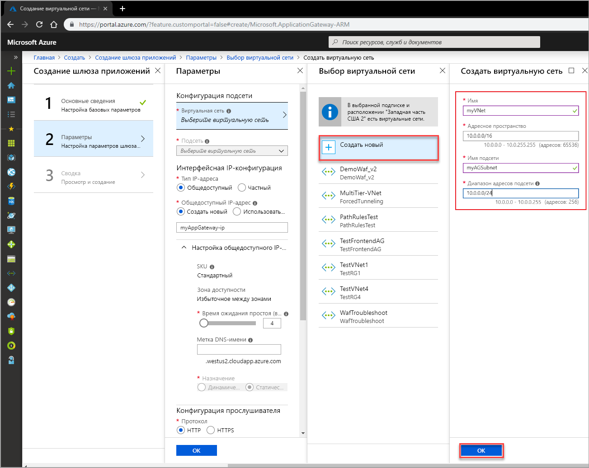

# <a name="quickstart-direct-web-traffic-with-azure-application-gateway---azure-portal"></a>Краткое руководство. Направление веб-трафика с помощью Шлюза приложений Azure на портале Azure

Шлюз приложений Azure позволяет направлять веб-трафик приложения к определенным ресурсам. Для этого портам назначаются прослушиватели, создаются определенные правила, и в серверный пул добавляются соответствующие ресурсы.

Из этого краткого руководства вы узнаете, как с помощью портала Azure быстро создать шлюз приложений с двумя виртуальными машинами в серверном пуле. Затем вы протестируете шлюз, чтобы убедиться, что он работает правильно.

Если у вас еще нет подписки Azure, [создайте бесплатную учетную запись Azure](https://azure.microsoft.com/free/?WT.mc_id=A261C142F), прежде чем начинать работу.

## <a name="sign-in-to-azure"></a>Вход в Azure

Войдите на портал Azure по адресу [https://portal.azure.com](https://portal.azure.com).

## <a name="create-an-application-gateway"></a>Создание шлюза приложений

Виртуальная сеть необходима для обмена данными между создаваемыми ресурсами. В этом примере создаются две подсети: одна для шлюза приложений, а другая — для внутренних серверов. Вы можете создать виртуальную сеть во время создания шлюза приложений.

1. Выберите **Создать ресурс** в верхнем левом углу окна на портале Azure.
2. Выберите **Сети**, а затем в списке "Рекомендованные" щелкните **Шлюз приложений**.

### <a name="basics"></a>Основы

1. Введите следующие значения для шлюза приложений:

    - *myAppGateway* — для имени шлюза приложений.
    - *myResourceGroupAG* — для новой группы ресурсов.

    

2. Оставьте значения по умолчанию для остальных параметров и нажмите кнопку **ОК**.

### <a name="settings"></a>Параметры

1. Щелкните **Выбрать виртуальную сеть**, выберите **Создать**, а затем введите следующие значения для виртуальной сети:

    - *myVNet* — имя виртуальной сети;
    - *10.0.0.0/16* — диапазон адресов виртуальной сети;
    - *myAGSubnet* — имя подсети;
    - *10.0.0.0/24* — диапазон адресов подсети.

    

6. Щелкните **ОК** чтобы вернуться к странице "Параметры".
7. В разделе **Интерфейсная IP-конфигурация** убедитесь, что в качестве **типа IP-адреса** задано значение **Открытый** и в разделе **Общедоступный IP-адрес** выбрано значение **Создать**. Введите *myAGPublicIPAddress* для имени общедоступного IP-адреса. Оставьте значения по умолчанию для остальных параметров и нажмите кнопку **ОК**.

### <a name="summary"></a>Сводка

Просмотрите параметры на странице сводки и нажмите кнопку **ОК**, чтобы создать виртуальную сеть, общедоступный IP-адрес и шлюз приложений. Создание шлюза приложений может занять несколько минут. Дождитесь успешного завершения развертывания перед переходом к следующему разделу.

## <a name="add-a-subnet"></a>Добавление подсети

1. Щелкните **Все ресурсы** в меню слева, а затем из списка ресурсов выберите **myVNet**.
2. Щелкните **Подсети**, а затем — **+ Subnet** (+ Подсеть).

    

3. Введите *myBackendSubnet* в качестве имени подсети и нажмите кнопку **ОК**.

## <a name="create-backend-servers"></a>Создание внутренних серверов

В этом примере вы создадите две виртуальные машины, которые будут использоваться как внутренние серверы для шлюза приложений. Вы также установите службы IIS на виртуальных машинах, чтобы убедиться, что шлюз приложений успешно создан.

### <a name="create-a-virtual-machine"></a>Создание виртуальной машины

1. На портале Azure щелкните **Создать ресурс**.
2. Щелкните **Вычисления**, а затем в списке "Рекомендованные" выберите **Windows Server 2016 Datacenter**.
3. Введите следующие значения для виртуальной машины:

    - *myResourceGroupAG* — для группы ресурсов.
    - *myVM* — имя виртуальной машины;
    - *azureuser* — имя пользователя учетной записи администратора;
    - *Azure123456!* — в качестве пароля.

   Примите остальные значения по умолчанию и щелкните кнопку **Далее: Диски**.
4. Примите параметры дисков по умолчанию и щелкните кнопку **Далее: Сеть**.
5. Убедитесь, что выбрана виртуальная сеть **myVNet** и подсеть **myBackendSubnet**.
6. Примите остальные значения по умолчанию и щелкните кнопку **Далее: Управление**.
7. Щелкните **Отключить**, чтобы выключить диагностику загрузки. Примите другие параметры по умолчанию и щелкните кнопку **Просмотр и создание**.
8. Просмотрите параметры на странице сводки и нажмите кнопку **Создать**.
9. Прежде чем продолжить, дождитесь завершения создания виртуальной машины.

### <a name="install-iis"></a>Установка служб IIS

1. Откройте интерактивную оболочку и убедитесь, что для нее задано значение **PowerShell**.

    

2. Чтобы установить службы IIS, выполните на виртуальной машине следующие команды: 

    ```azurepowershell-interactive
    Set-AzureRmVMExtension `
      -ResourceGroupName myResourceGroupAG `
      -ExtensionName IIS `
      -VMName myVM `
      -Publisher Microsoft.Compute `
      -ExtensionType CustomScriptExtension `
      -TypeHandlerVersion 1.4 `
      -SettingString '{"commandToExecute":"powershell Add-WindowsFeature Web-Server; powershell Add-Content -Path \"C:\\inetpub\\wwwroot\\Default.htm\" -Value $($env:computername)"}' `
      -Location EastUS
    ```

3. Создайте вторую виртуальную машину и установите службы IIS, следуя только что выполненным инструкциям. Введите *myVM2* в качестве имени виртуальной машины и значения параметра VMName в команде Set-AzureRmVMExtension.

### <a name="add-backend-servers"></a>Добавление внутренних серверов

1. Выберите **Все ресурсы**, а затем щелкните **myAppGateway**.
4. Щелкните **Серверные пулы**. Пул по умолчанию был создан автоматически с помощью шлюза приложений. Щелкните **appGatewayBackendPool**.
5. В разделе **Целевые объекты** щелкните **IP-адрес или полное доменное имя** и выберите **Виртуальная машина**.
6. В разделе **Виртуальная машина** добавьте виртуальные машины myVM и myVM2 и связанные с ними сетевые интерфейсы.

    

6. Выберите команду **Сохранить**.

## <a name="test-the-application-gateway"></a>Тестирование шлюза приложений

1. Найдите общедоступный IP-адрес для шлюза приложений на экране обзора. Выберите **Все ресурсы**, а затем щелкните **myAGPublicIPAddress**.

    

2. Скопируйте общедоступный IP-адрес и вставьте его в адресную строку браузера.

    

## <a name="clean-up-resources"></a>Очистка ресурсов

Ставшие ненужными группу ресурсов, шлюз приложений и все связанные ресурсы можно удалить. Для этого выберите группу ресурсов, содержащую шлюз приложений, и щелкните **Удалить**.

## <a name="next-steps"></a>Дополнительная информация

> [!div class="nextstepaction"]
> [Руководство по управлению веб-трафиком с помощью шлюза приложений и Azure CLI](./tutorial-manage-web-traffic-cli.md)
