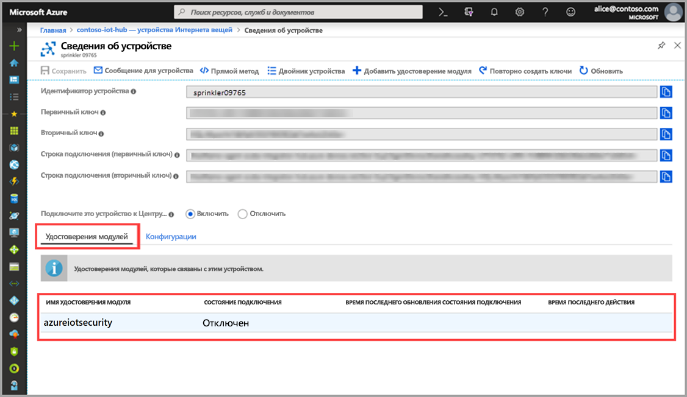

# Краткое руководство. Создание двойника модуля azureiotsecurity

> [!IMPORTANT]
> Центр безопасности Azure для Интернета вещей сейчас предоставляется в общедоступной предварительной версии. Эта предварительная версия предоставляется без соглашения об уровне обслуживания и не рекомендована для использования рабочей среде. Некоторые функции могут не поддерживаться или их возможности могут быть ограничены. Дополнительные сведения см. в статье [Дополнительные условия использования предварительных выпусков Microsoft Azure](https://azure.microsoft.com/support/legal/preview-supplemental-terms/).

В этом кратком руководстве объясняется, как создать экземпляр двойника модуля _azureiotsecurity_ для новых устройств, а также создать двойники модуля для всех устройств Центра Интернета вещей в пакетном режиме.  

## Основные сведения о двойнике модуля azureiotsecurity 

Для созданных в Azure решений Интернета вещей двойники устройств играют ключевую роль в управлении устройствами и автоматизации процессов. 

Центр безопасности Azure (ASC) для Интернета вещей обеспечивает полную интеграцию с платформой управления устройствами Интернета вещей, позволяя управлять состоянием защиты устройства и использовать существующие возможности управления устройствами.
Интеграцию с ASC Интернета вещей обеспечивает механизм двойников Центра Интернета вещей.  

См. дополнительные сведения об [общих принципах работы двойников модуля в Центре Интернета вещей](https://docs.microsoft.com/azure/iot-hub/iot-hub-devguide-module-twins). 
 
ASC Интернета вещей использует механизм двойника модуля и хранит двойник модуля _azureiotsecurity_ для каждого устройства.
Двойник модуля безопасности содержит все сведения о безопасности каждого устройства. 
 
Для полноценного использования ASC и возможностей Центра Интернета вещей необходимо создать, настроить и запустить такие двойники модуля безопасности для каждого устройства в службе.  

## Создание двойника модуля azureiotsecurity 

Двойник модуля _azureiotsecurity_ можно создать двумя способами:
1. [С применением пакетного сценария модуля](https://aka.ms/iot-security-github-create-module) — двойник модуля автоматически создается для новых устройств или устройств без двойника модуля с использованием конфигурации по умолчанию.
2. Вручную отредактировать каждый двойник модуля по отдельности с использованием определенных конфигураций для каждого устройства.

>[!NOTE] 
> При применении пакетного метода существующие двойники модуля azureiotsecurity не перезаписываются. При использовании пакетного метода просто создаются двойники модуля для устройств, у которых нет двойника модуля безопасности. 

Дополнительные сведения о том, как изменять настройки существующего модуля безопасности, см. в статье о [конфигурации агента](how-to-agent-configuration.md). 

Чтобы создать двойник модуля _azureiotsecurity_ для устройства вручную, сделайте следующее: 

1. В своем Центре Интернета вещей найдите и выберите устройство, для которого вы хотите создать двойник модуля безопасности в Центре Интернета вещей.
1. Выберите устройство, а затем щелкните **Добавить удостоверение модуля**.
1. В поле **Имя удостоверения модуля** введите **azureiotsecurity**.

1. Выберите команду **Сохранить**. 

## Проверка создания двойника модуля

Чтобы проверить, существует ли двойник модуля безопасности у определенного устройства, сделайте следующее:

1. В Центре Интернета вещей выберите **Устройства IoT** в меню **Обозреватели**.    
1. Введите идентификатор устройства или выберите один из вариантов в **поле запроса устройств** и щелкните **Запрос устройств**. 
    
1. Выберите устройство или дважды щелкните его, чтобы открыть страницу сведений об устройстве. 
1. Выберите меню **Удостоверения модулей** и подтвердите существование модуля **azureiotsecurity** в списке удостоверений модулей, связанных с устройством. 
    

Дополнительные сведения о настройке свойств ASC для двойников модуля Интернета вещей см. в руководстве по [настройке агента](how-to-agent-configuration.md).

## Дополнительная информация

В следующей стать описано, как настраивать оповещения.

> [!div class="nextstepaction"]
> [Configure custom alerts](quickstart-create-custom-alerts.md) (Настройка оповещений)
