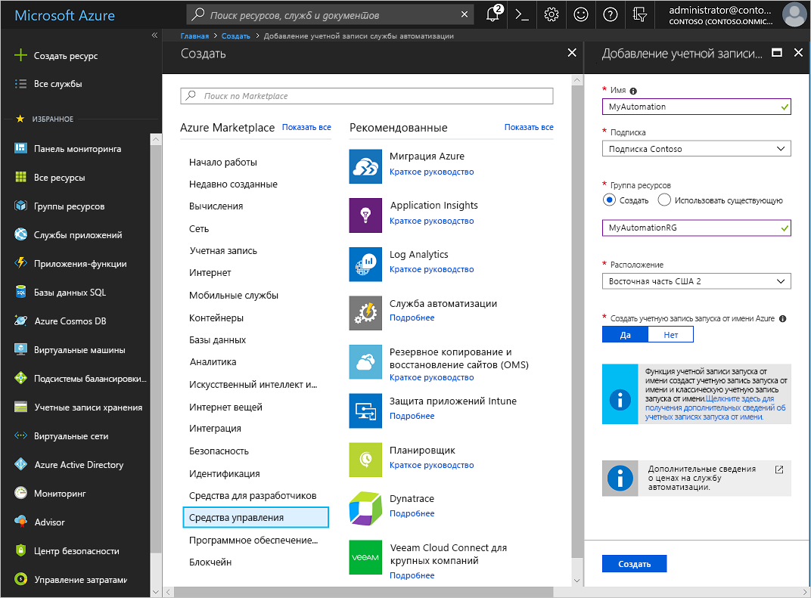
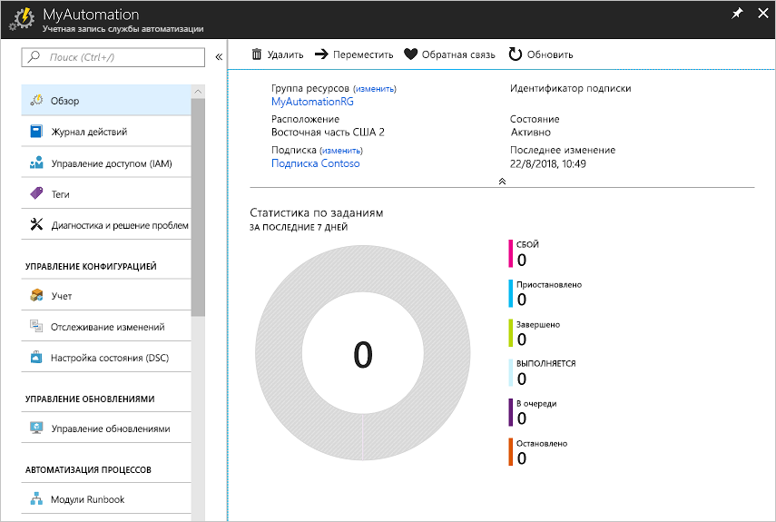
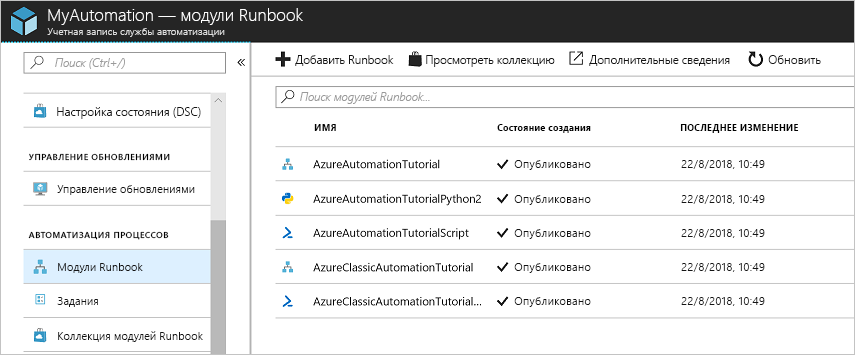
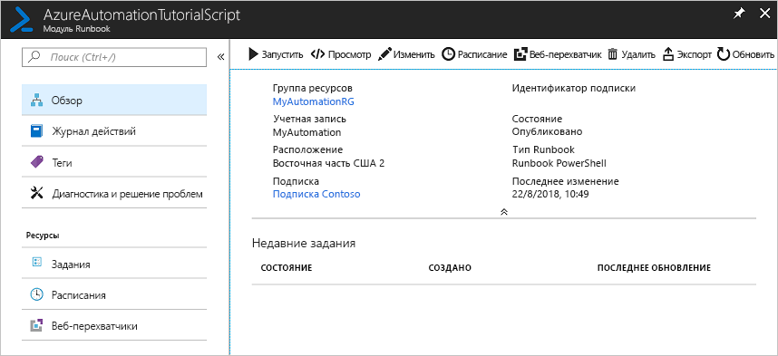
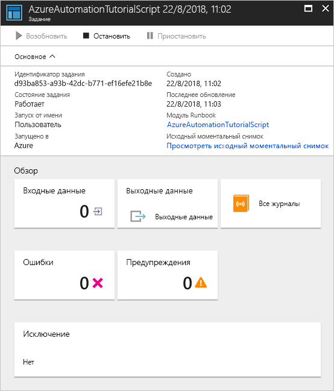

# Создание учетной записи службы автоматизации Azure

Учетные записи службы автоматизации Azure можно создавать с помощью Azure. В этом случае для создания и настройки учетных записей службы автоматизации и связанных ресурсов Azure используется пользовательский интерфейс на основе браузера. В этом кратком руководстве содержатся инструкции по созданию учетной записи службы автоматизации и запуске в ней модуля runbook.

Если у вас еще нет подписки Azure, создайте [бесплатную учетную запись](https://azure.microsoft.com/free/?WT.mc_id=A261C142F) Azure, прежде чем начинать работу.

## Вход в Azure

Войдите в Azure (https://portal.azure.com).

## Создание учетной записи службы автоматизации

1. Щелкните **Создать ресурс** в верхнем левом углу окна портала Azure.

1. Выберите **Средства управления** и **Служба автоматизации**.

1. Введите сведения об учетной записи. Для параметра **Создать учетную запись запуска от имени Azure** выберите **Да**, чтобы артефакты, которые упрощают аутентификацию в Azure, включались автоматически. Важно отметить, что при создании учетной записи службы автоматизации указанное имя нельзя будет изменить. *Имена учетных записей службы автоматизации уникальны для каждого региона и группы ресурсов. Имена учетных записей службы автоматизации, которые были удалены, могут быть недоступны некоторое время.* Одна учетная запись автоматизации может управлять ресурсами во всех регионах и подписках для конкретного клиента. По завершении нажмите кнопку **Создать**, чтобы начать развертывание учетной записи службы автоматизации.

      

    > [!NOTE]
    > Обновленный список расположений, в которых можно развернуть учетную запись службы автоматизации, см. на странице [Доступность продуктов по регионам](https://azure.microsoft.com/global-infrastructure/services/?products=automation&regions=all).

1. По завершении развертывания щелкните **Все службы**, выберите **Учетные записи службы автоматизации** и выберите созданную учетную запись.

    

## Запуск модуля runbook

Запустите один из учебных модулей runbook.

1. Щелкните **Модули Runbook** в разделе **Автоматизация процессов**. Отобразится список модулей runbook. По умолчанию в учетной записи включено несколько учебных модулей runbook.

    

1. Выберите модуль runbook **AzureAutomationTutorialScript**. Откроется страница общих сведений о runbook.

    

1. Щелкните **Запустить** и на странице **Запуск Runbook** нажмите кнопку **ОК**, чтобы запустить runbook.

    

1. Когда в строке **Состояние задания** отобразится значение **Выполняется**, щелкните **Вывод** или **All Logs** (Все журналы), чтобы просмотреть выходные данные задания runbook. Для этого учебного модуля runbook выводится список ресурсов Azure.

## Дополнительная информация

В этом кратком руководстве вы развернули учетную запись службы автоматизации, запустили задание runbook и просмотрели его результаты. Дополнительные сведения о службе автоматизации Azure см. в следующем кратком руководстве по созданию первого модуля runbook.

> [!div class="nextstepaction"]
> [Краткое руководство по службе автоматизации. Создание runbook](./automation-quickstart-create-runbook.md)

