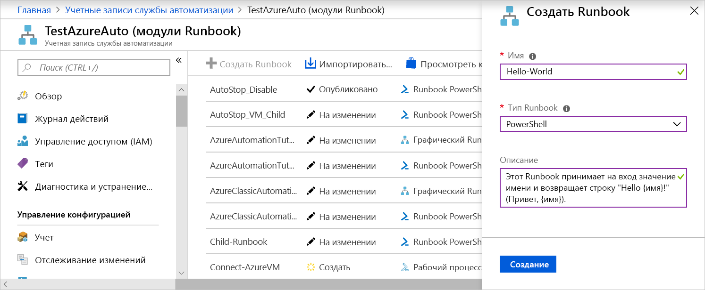

# <a name="create-an-azure-automation-runbook"></a>Создание runbook службы автоматизации Azure

В Azure можно создавать runbook для службы автоматизации Azure. Вам предоставляется браузерный пользовательский интерфейс для создания runbook службы автоматизации. В этом кратком руководстве описаны процедуры создания, изменения, тестирования и публикации runbook PowerShell службы автоматизации.

Если у вас еще нет подписки Azure, создайте [бесплатную учетную запись](https://azure.microsoft.com/free/?WT.mc_id=A261C142F) Azure, прежде чем начинать работу.

## <a name="sign-in-to-azure"></a>Вход в Azure

Войдите в Azure по адресу https://portal.azure.com.

## <a name="create-the-runbook"></a>Создание модуля runbook

Для начала создайте runbook. В этом кратком руководстве вы создадите простой пример runbook, который по умолчанию выводит `Hello World`.

1. Откройте учетную запись автоматизации.

1. Выберите **Модули Runbook** в разделе **Автоматизация процессов**. Отобразится список модулей runbook.

1. Нажмите кнопку **Создать Runbook** в верхней части списка.

1. Введите имя `Hello-World` в поле **Имя** и выберите **PowerShell** в поле **Тип Runbook**. 

   

1. Нажмите кнопку **Создать**. После этого создается модуль runbook и откроется страница "Изменение Runbook PowerShell".

    :::image type="content" source="./media/automation-quickstart-create-runbook/automation-edit-runbook-empty.png" alt-text="Снимок экрана: страница &quot;Изменение runbook PowerShell&quot;.":::

1. Наберите следующий код в панели редактирования или скопируйте и вставьте его туда. Этот код создает необязательный входной параметр с именем `Name` и значением по умолчанию `World` и выводит строку, содержащую значение этого входного параметра:

   ```powershell-interactive
   param
   (
       [Parameter(Mandatory=$false)]
       [String] $Name = "World"
   )

   "Hello $Name!"
   ```

1. Нажмите кнопку **Сохранить**, чтобы сохранить черновую копию runbook.

    :::image type="content" source="./media/automation-quickstart-create-runbook/automation-edit-runbook.png" alt-text="Снимок экрана: страница &quot;Изменение runbook PowerShell&quot;.":::

## <a name="test-the-runbook"></a>Тестирование модуля Runbook

Созданный runbook нужно протестировать, чтобы проверить правильность его выполнения.

1. Щелкните **Область тестирования**.

1. Введите значение для параметра **Name** и щелкните **Запустить**. Это действие запускает задание тестирования и отображение его состояния и выходных данных.

    :::image type="content" source="./media/automation-quickstart-create-runbook/automation-test-runbook.png" alt-text="Снимок экрана: страница &quot;Изменение runbook PowerShell&quot;." нажмите кнопку **Опубликовать**, чтобы опубликовать официальную версию runbook в учетной записи.

   :::image type="content" source="./media/automation-quickstart-create-runbook/automation-hello-world-runbook-job.png" alt-text="Снимок экрана: страница &quot;Изменение runbook PowerShell&quot;.":::

## <a name="run-the-runbook"></a>Запуск runbook

После публикации runbook отобразится страница с общими сведениями.

1. Щелкните **Запустить** на этой странице, чтобы открыть страницу конфигурации "Запустить Runbook" для этого runbook.

   :::image type="content" source="./media/automation-quickstart-create-runbook/automation-hello-world-runbook-start.png" alt-text="Снимок экрана: страница &quot;Изменение runbook PowerShell&quot;.":::

1. Оставьте поле **Имя** пустым, чтобы применить значение по умолчанию, и щелкните **ОК**. Задание runbook отправится на выполнение, после чего откроется страница этого задания.

   :::image type="content" source="./media/automation-quickstart-create-runbook/automation-job-page.png" alt-text="Снимок экрана: страница &quot;Изменение runbook PowerShell&quot;.":::

1. Если состояние задания имеет значение `Running` или `Completed`, щелкните **Выходные данные**, чтобы открыть панель с результатами работы runbook.

   :::image type="content" source="./media/automation-quickstart-create-runbook/automation-hello-world-runbook-job-output.png" alt-text="Снимок экрана: страница &quot;Изменение runbook PowerShell&quot;.":::

## <a name="clean-up-resources"></a>Очистка ресурсов

Удалите runbook, если он больше не нужен. Для этого выберите ненужный runbook в списке и щелкните **Удалить**.

## <a name="next-steps"></a>Дальнейшие действия

В этом руководстве вы создали, изменили, протестировали и опубликовали runbook, а затем запустили задание runbook. Дополнительные сведения о runbook службы автоматизации см. в статьях о разных типах runbook, которые можно создавать и использовать в службе автоматизации.

> [!div class="nextstepaction"]
> [Типы последовательностей runbook в службе автоматизации Azure](./automation-runbook-types.md)
