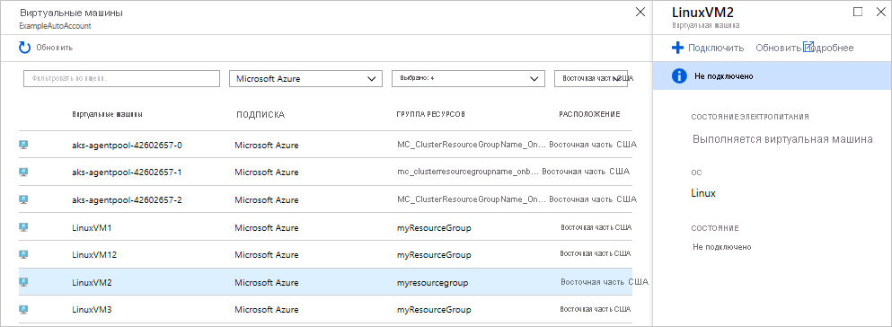
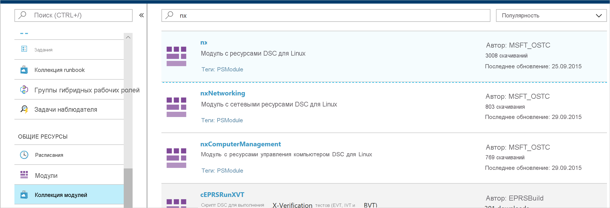
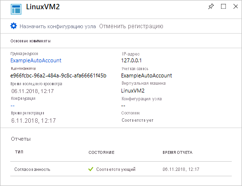
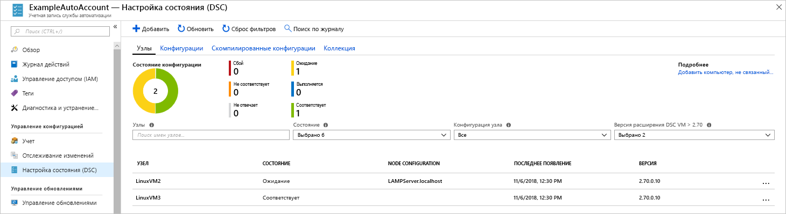

# <a name="configure-a-linux-virtual-machine-with-desired-state-configuration"></a>Настройка требуемого состояния на виртуальной машине Linux

Включив настройку требуемого состояния (DSC), вы сможете контролировать и отслеживать конфигурации серверов Windows и Linux. Она позволяет выявлять или автоматически исправлять конфигурации, которые отличаются от требуемой конфигурации. Это руководство описывает процедуру подключения виртуальной машины Linux и развертывания стека LAMP с поддержкой DSC.

## <a name="prerequisites"></a>Предварительные требования

Для работы с этим кратким руководством вам понадобится:

* Подписка Azure. Если у вас еще нет подписки Azure, [создайте бесплатную учетную запись](https://azure.microsoft.com/free/).
* Учетная запись службы автоматизации Azure. Указания по созданию учетной записи запуска от имени пользователя для службы автоматизации Azure см. в статье [Проверка подлинности модулей Runbook в Azure с помощью учетной записи запуска от имени](automation-sec-configure-azure-runas-account.md).
* Виртуальная машина Azure Resource Manager (не классическая) под управлением Red Hat Enterprise Linux, CentOS или Oracle Linux. Инструкции по созданию виртуальной машины см. в статье [Создание первой виртуальной машины Linux на портале Azure](../virtual-machines/linux/quick-create-portal.md).

## <a name="sign-in-to-azure"></a>Вход в Azure
Войдите в Azure (https://portal.azure.com).

## <a name="onboard-a-virtual-machine"></a>Подключение виртуальной машины
Подключить компьютер и активировать настройку требуемого состояния можно разными способами. В этом руководстве мы рассматриваем подключение с помощью учетной записи службы автоматизации. Сведения о других методах подключения компьютера к настройке требуемого состояния см. [в этой статье](https://docs.microsoft.com/azure/automation/automation-dsc-onboarding).

1. В области слева на портале Azure выберите **Учетные записи службы автоматизации**. Если в этой области нет такого элемента, щелкните **Все службы** и найдите его в этом представлении.
1. Выберите из списка учетную запись службы автоматизации.
1. На странице учетной записи службы автоматизации в области слева выберите **Настройка состояния (DSC)**.
2. Чтобы открыть страницу для выбора виртуальной машины, нажмите кнопку **Добавить**.
3. Найдите виртуальную машину, для которой вы хотите включить DSC. Для поиска конкретной виртуальной машины можно применить поле поиска и фильтры.
4. Щелкните виртуальную машину, а затем выберите **Подключить**.
5. Выберите настройки DSC для этой виртуальной машины. Если у вас есть уже готовая конфигурация, укажите ее в поле *Имя конфигурации узла*. Также вы можете задать [режим конфигурации](https://docs.microsoft.com/powershell/dsc/metaconfig), который определяет правила применения настройки для виртуальной машины.
6. Щелкните **ОК**



Пока расширение настройки требуемого состояния развертывается на виртуальной машине, для нее отображается состояние *Подключение.*

## <a name="import-modules"></a>Импорт модулей

Модули содержат ресурсы DSC. Множество разных модулей вы найдете в [коллекции PowerShell](https://www.powershellgallery.com). Все ресурсы, используемые в конфигурациях, нужно перед компиляцией импортировать в учетную запись автоматизации. В этом руководстве используется модуль с именем **nx**.

1. На странице учетной записи автоматизации в области слева выберите **Коллекция модулей** (в разделе "Общие ресурсы").
1. Найдите модуль, который вы хотите импортировать. Для этого введите часть его имени: *nx*.
1. Щелкните модуль, который вы хотите импортировать.
1. Щелкните **Импорт**.



## <a name="import-the-configuration"></a>Импорт конфигурации

В этом руководстве используется конфигурация DSC, которая настраивает на компьютере HTTP-сервер Apache, PHP и MySQL.

Дополнительные сведения о конфигурации DSC см. в статье [Конфигурации DSC](https://docs.microsoft.com/powershell/dsc/configurations).

В текстовом редакторе введите следующую команду и сохраните ее локально как `LAMPServer.ps1`.

```powershell-interactive
configuration LAMPServer {
   Import-DSCResource -module "nx"

   Node localhost {

        $requiredPackages = @("httpd","mod_ssl","php","php-mysql","mariadb","mariadb-server")
        $enabledServices = @("httpd","mariadb")

        #Ensure packages are installed
        ForEach ($package in $requiredPackages){
            nxPackage $Package{
                Ensure = "Present"
                Name = $Package
                PackageManager = "yum"
            }
        }

        #Ensure daemons are enabled
        ForEach ($service in $enabledServices){
            nxService $service{
                Enabled = $true
                Name = $service
                Controller = "SystemD"
                State = "running"
            }
        }
   }
}
```

Процесс импорта конфигурации.

1. На странице учетной записи службы автоматизации в области слева выберите **Настройка состояния (DSC)**, а затем щелкните вкладку **Конфигурации**.
2. Щелкните **+ Добавить**.
3. Выберите *файл конфигурации*, который вы сохранили на предыдущем этапе.
4. Щелкните **ОК**

## <a name="compile-a-configuration"></a>Компиляция конфигурации

Прежде чем назначать конфигурацию DSC узлу, ее нужно скомпилировать в конфигурации узла (документ MOF). В процессе компиляции проходит проверка конфигурации и предоставляется возможность ввести значения параметров. Дополнительные сведения о компиляции конфигурации см. в статье [Компилирование конфигураций DSC в службе "Настройка состояния службы автоматизации Azure"](https://docs.microsoft.com/azure/automation/automation-dsc-compile).

Чтобы скомпилировать конфигурацию, выполните следующие действия.

1. На странице учетной записи службы автоматизации в области слева выберите **Настройка состояния (DSC)**, а затем щелкните вкладку **Конфигурации**.
1. Выберите конфигурацию LAMPServer, которую вы импортировали на предыдущем шаге.
1. Выберите из меню пункт **Компиляция**, а затем выберите **Да**.
1. Откроется представление "Конфигурации", где вы увидите размещенное в очереди новое *задание компиляции*. Когда это задание успешно завершится, можете переходить к следующему шагу. Если же при выполнении возникнут ошибки, щелкните это задание компиляции для просмотра сведений о нем.

## <a name="assign-a-node-configuration"></a>Назначение конфигурации узлу

Скомпилированную *конфигурацию узла* можно назначить любому узлу DSC. Назначенная конфигурация применяется к компьютеру и отслеживает (или автоматически исправляет) на нем любые отклонения от заданных настроек.

1. На странице учетной записи службы автоматизации в области слева выберите **"Настройка состояния (DSC)", а затем щелкните вкладку **Узлы**.
1. Выберите узел, для которого вы хотите назначить эту конфигурацию.
1. Щелкните **Назначение конфигурации узлу**.
1. Для назначения выберите *Конфигурация узла* - **LAMPServer.localhost**, а затем нажмите кнопку **ОК**
1. Теперь скомпилированная конфигурация будет применена у этому узлу, и его состояние изменится на *Ожидание*. При следующей периодической проверке этот узел получит назначенную конфигурацию, применит ее и сообщит об изменении состояния. Получение конфигурации может занять до 30 минут в зависимости от настроек узла. Чтобы принудительно выполнить немедленную проверку данных, запустите следующую команду на виртуальной машине Linux: `sudo /opt/microsoft/dsc/Scripts/PerformRequiredConfigurationChecks.py`



## <a name="viewing-node-status"></a>Просмотр состояния узла

Сведения о состоянии всех управляемых узлов можно найти под вкладкой **Узлы** на странице **Настройка состояния (DSC)** в учетной записи службы автоматизации. Этот список можно отфильтровать по состоянию, конфигурации узла или шаблону имени.



## <a name="next-steps"></a>Дополнительная информация

В этом руководстве вы подключили виртуальную машину Linux к DSC, создали конфигурацию для стека LAMP и развернули ее на виртуальной машине. Дополнительные сведения о применении службы Automation DSC для непрерывного развертывания вы найдете в следующей статье:

> [!div class="nextstepaction"]
> [Пример использования. Непрерывное развертывание на виртуальных машинах с помощью Automation DSC и Chocolatey](./automation-dsc-cd-chocolatey.md)

* Дополнительные сведения о настройке требуемого состояния для PowerShell см. в статье [Обзор платформы Desired State Configuration в Windows PowerShell](https://docs.microsoft.com/powershell/dsc/overview).
* Дополнительные сведения об управлении Automation DSC из PowerShell см. в документации по [Azure PowerShell](https://docs.microsoft.com/powershell/module/azurerm.automation/?view=azurermps-5.0.0).
* Чтобы научиться пересылать отчеты DSC в журналы Azure Monitor для создания отчетов и оповещений, изучите статью [Пересылка данных отчетов "Настройка состояния службы автоматизации Azure" в Log Analytics](https://docs.microsoft.com/azure/automation/automation-dsc-diagnostics). 

