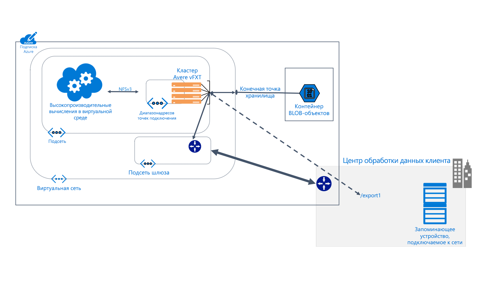

# Общие сведения об Avere vFXT для Azure 

Avere vFXT для Azure — это решение кэширования файловой системы для задач высокопроизводительных вычислений (HPC). С этим решением вы получаете масштабируемость облачных вычислений, благодаря чему вы можете сделать свои данные доступными в нужное время и в нужном расположении, даже те данные, которые хранятся на локальном оборудовании.

Avere vFXT поддерживает следующие распространенные сценарии вычислений: 

* Архитектура гибридного облака. Avere vFXT для Azure может работать с аппаратной системой хранения, предоставляя преимущества облачных вычислений без необходимости перемещать файлы. 
* Выход в облако. Avere vFXT для Azure может помочь перенести данные в облако для одного проекта или полностью переместить весь рабочий процесс. 

Avere vFXT для Azure лучше всего подходит для следующих ситуаций: 

* Интенсивные операции чтения для рабочих нагрузок HPC.
* Приложения, использующие общий протокол NFS.
* Вычислительные фермы с числом ядер ЦП от 1000 до 40 000.
* Интеграция с NAS на локальном оборудовании, хранилищем BLOB-объектов Azure или обоими.

Дополнительные сведения см. по адресу <https://azure.microsoft.com/services/storage/avere-vfxt/>.

## Кто использует Avere vFXT для Azure? 

Avere vFXT может помочь со всеми видами вычислительных задач с интенсивными операциями чтения.

### Отрисовка визуальных эффектов 

В среде мультимедиа и развлечений кластер Avere vFXT может ускорить доступ к данным для критически важных проектов отрисовки. Так как вы можете добавлять дополнительный объем кэша и вычислительные узлы в Azure, у вас есть возможность эффективно управлять большими проектами. 

### медико-биологическая отрасль. 

Avere vFXT может позволить исследователям запускать свои вторичные аналитические рабочие процессы в службе вычислений Azure и получать доступ к геномным данным независимо от их расположения.

В фармацевтических исследованиях кластеры Avere vFXT могут использоваться для ускорения обнаружения лекарств, помогая исследователям прогнозировать взаимодействие лекарственных средств и анализировать данные исследований.

### Аналитика финансовых операций

Кластер Avere vFXT может помочь ускорить расчеты количественного анализа, благодаря чему компании финансового обслуживания получают лучшие аналитические сведения для принятия стратегических решений. 

## Функции и спецификации

Система Avere vFXT состоит из трех (или больше) узлов виртуального пограничного файлового хранилища, настроенных в кластере. Она может располагаться рядом с клиентскими компьютерами, которые подключают кластер, а не хранилище напрямую. 

Кластер Avere vFXT кэширует файлы по мере их запроса. Повторные запросы могут быть обработаны из кэша более чем в 80 % случаев.

### Совместимость 

* Совместимость с аппаратными системами NAS от NetApp или Dell EMC Isilon.
* Совместимость с большими двоичными объектами Azure.
* Использование протокола NFSv3 или SMB2.

Avere vFXT использует следующие ресурсы Azure: 

|Компонент Azure|   |
|----------|-----------|
|Виртуальные машины|3 E32s_v3 или более|
|Хранилище SSD (цен. категория "Премиум")|200 ГБ пространства ОС плюс от 1 до 4 ТБ объема кэша на узел |
|Учетная запись хранения (необязательно) |Версия 2|
|Серверное хранилище данных (необязательно) | Один пустой контейнер больших двоичных объектов в LRS |

## Дополнительная информация

Сведения о создании развертывания Avere vFXT см. по следующим ссылкам. 

* [Планирование системы Avere vFXT](avere-vfxt-deploy-plan.md)
* [Общие сведения о развертывании](avere-vfxt-deploy-overview.md)
* [Создание системы vFXT](avere-vfxt-deploy.md)
