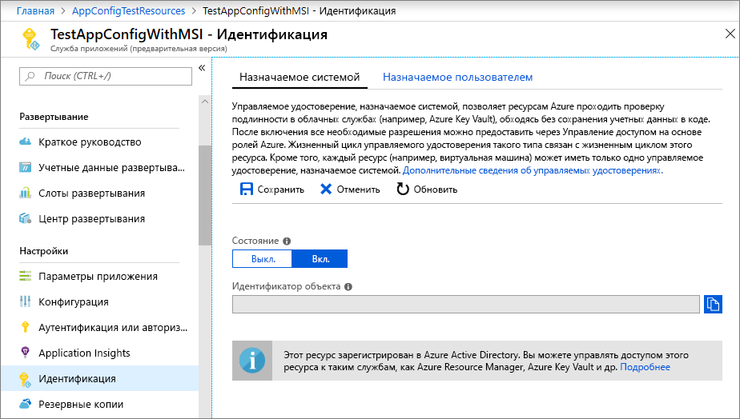
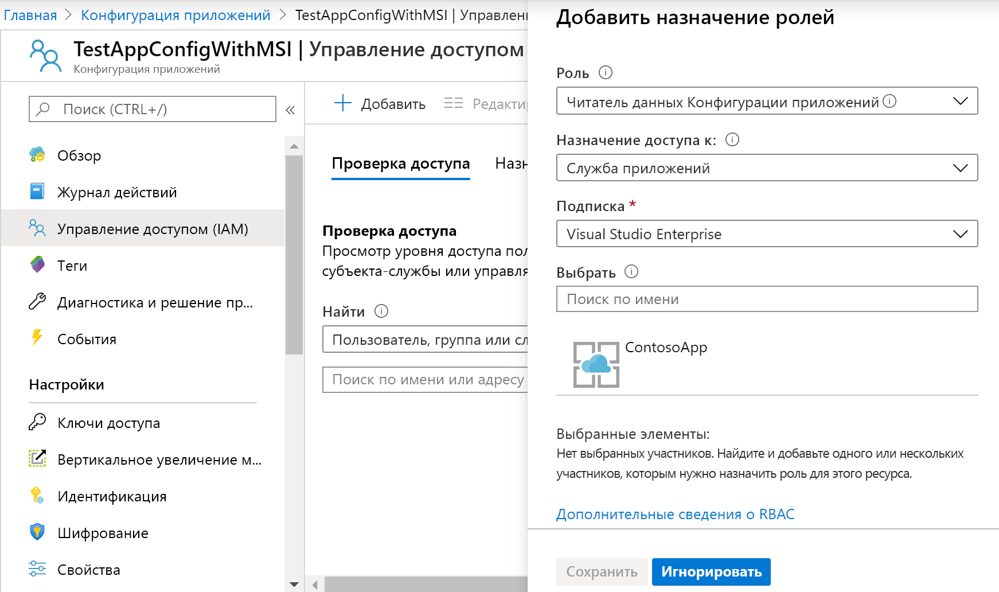

# <a name="tutorial-integrate-with-azure-managed-identities"></a>Руководство по интеграции с управляемыми удостоверениями Azure

[Управляемые удостоверения](https://docs.microsoft.com/azure/active-directory/managed-identities-azure-resources/overview) Azure Active Directory помогают упростить управление секретами для вашего облачного приложения. С помощью управляемого удостоверения можно настроить код для использования субъекта-службы, созданного для службы вычислений Azure, на которой она выполняется. Вы используете управляемое удостоверение, а не отдельные учетные данные, хранящиеся в Azure Key Vault, или локальную строку подключения. 

Служба "Конфигурация приложений Azure" и ее клиентские библиотеки для .NET Core, .NET и Java Spring имеют встроенную поддержку управляемого удостоверения службы (MSI). Хотя использовать MSI необязательно, это устраняет потребность в маркере доступа, который содержит секреты. Ваш код должен знать только конечную точку службы для хранилища конфигурации приложений, чтобы получить к ней доступ. Этот URL-адрес можно внедрить непосредственно в код, не беспокоясь о раскрытии любых секретов.

В этом руководстве описывается, как использовать MSI для доступа к службе "Конфигурация приложений". При этом в качестве основы используется код веб-приложения, представленный в кратких руководствах. Прежде чем продолжить, ознакомьтесь со статьей [Краткое руководство. Создание приложения ASP.NET Core с помощью службы "Конфигурация приложений Azure"](./quickstart-aspnet-core-app.md).

Вы можете выполнять шаги в этом учебнике с помощью любого редактора кода. [Visual Studio Code](https://code.visualstudio.com/) является отличным вариантом, который доступен на платформах Windows, macOS и Linux.

Из этого руководства вы узнаете, как выполнять следующие задачи:

> [!div class="checklist"]
> * предоставление доступа к службе "Конфигурация приложений" с помощью управляемого удостоверения;
> * настройка приложения на использование управляемого удостоверения при подключении к службе "Конфигурация приложений".

## <a name="prerequisites"></a>Технические условия

Для работы с этим руководством требуется:

* [пакет SDK для .NET Core](https://www.microsoft.com/net/download/windows);
* [настроенный Azure Cloud Shell](https://docs.microsoft.com/azure/cloud-shell/quickstart).

[!INCLUDE [quickstarts-free-trial-note](../../includes/quickstarts-free-trial-note.md)]

## <a name="add-a-managed-identity"></a>Добавление управляемого удостоверения

Чтобы настроить управляемое удостоверение на портале, сначала необходимо создать обычное приложение, а затем активировать соответствующую функцию.

1. Создайте приложение на [портале Azure](https://aka.ms/azconfig/portal) обычным образом. Перейдите к нему на портале.

2. Прокрутите вниз до группы **параметров** в левой панели и выберите **Удостоверение**.

3. На вкладке **Назначено системой** для параметра **Состояние** установите значение **Вкл.** и выберите **Сохранить**.

    

## <a name="grant-access-to-app-configuration"></a>Предоставление доступа к службе "Конфигурация приложений"

1. На [портале Azure](https://aka.ms/azconfig/portal) щелкните **Все ресурсы** и выберите хранилище конфигураций приложений, которое вы создали по инструкциям из краткого руководства.

2. Выберите **Управление доступом (IAM)**.

3. На вкладке **Проверить доступ** щелкните **Добавить** в пользовательском интерфейсе карточки **Добавить назначение роли**.

4. В поле **Роль** выберите **Участник**. В поле **Назначение доступа к** задайте значение **Служба приложений** (в разделе **Управляемое удостоверение, назначаемое системой**).

5. В поле **Подписка** выберите подписку Azure. Выберите ресурс Службы приложений для своего приложения.

6. Щелкните **Сохранить**.

    

## <a name="use-a-managed-identity"></a>Администрирование управляемого удостоверения

1. Откройте *appsettings.json* и добавьте следующий скрипт. Замените  *\<service_endpoint >*, включая скобки, URL-адресом в хранилище конфигурации приложения:

    ```json
    "AppConfig": {
        "Endpoint": "<service_endpoint>"
    }
    ```

2. Откройте файл *Program.cs* и обновите метод `CreateWebHostBuilder`, заменив метод `config.AddAzureAppConfiguration()`.

    ```csharp
    public static IWebHostBuilder CreateWebHostBuilder(string[] args) =>
        WebHost.CreateDefaultBuilder(args)
            .ConfigureAppConfiguration((hostingContext, config) =>
            {
                var settings = config.Build();
                config.AddAzureAppConfiguration(options =>
                    options.ConnectWithManagedIdentity(settings["AppConfig:Endpoint"]));
            })
            .UseStartup<Startup>();
    ```

[!INCLUDE [Prepare repository](../../includes/app-service-deploy-prepare-repo.md)]

[!INCLUDE [cloud-shell-try-it](../../includes/cloud-shell-try-it.md)]

## <a name="deploy-from-local-git"></a>Развертывание из локального репозитория Git

Включить локальное развертывание Git для вашего приложения с сервера сборки Kudu проще всего с помощью Azure Cloud Shell.

### <a name="configure-a-deployment-user"></a>Настойка пользователя развертывания

[!INCLUDE [Configure a deployment user](../../includes/configure-deployment-user-no-h.md)]

### <a name="enable-local-git-with-kudu"></a>Включить локальный Git с помощью Kudu

Чтобы включить локальное развертывание Git для вашего приложения с сервера сборки Kudu, выполните [`az webapp deployment source config-local-git`](/cli/azure/webapp/deployment/source?view=azure-cli-latest#az-webapp-deployment-source-config-local-git) в Cloud Shell.

```azurecli-interactive
az webapp deployment source config-local-git --name <app_name> --resource-group <group_name>
```

Чтобы вместо этого создать приложение с поддержкой Git, выполните команду [`az webapp create`](/cli/azure/webapp?view=azure-cli-latest#az-webapp-create) в Cloud Shell с параметром `--deployment-local-git`.

```azurecli-interactive
az webapp create --name <app_name> --resource-group <group_name> --plan <plan_name> --deployment-local-git
```

Команда `az webapp create` предоставляет примерно следующие выходные данные:

```json
Local git is configured with url of 'https://<username>@<app_name>.scm.azurewebsites.net/<app_name>.git'
{
  "availabilityState": "Normal",
  "clientAffinityEnabled": true,
  "clientCertEnabled": false,
  "cloningInfo": null,
  "containerSize": 0,
  "dailyMemoryTimeQuota": 0,
  "defaultHostName": "<app_name>.azurewebsites.net",
  "deploymentLocalGitUrl": "https://<username>@<app_name>.scm.azurewebsites.net/<app_name>.git",
  "enabled": true,
  < JSON data removed for brevity. >
}
```

### <a name="deploy-your-project"></a>Развертывание проекта

Вернитесь к _окну терминала (в локальном расположении)_ и добавьте удаленное приложение Azure в локальный репозиторий Git. Замените _\<url>_ URL-адресом удаленного репозитория Git, полученным на шаге [Включение использования репозитория Git для приложения](#enable-local-git-with-kudu).

```bash
git remote add azure <url>
```

Отправьте код в удаленное приложение Azure, чтобы развернуть приложение. Когда появится запрос на ввод пароля, введите пароль, созданный в разделе [Настройка пользователя развертывания](#configure-a-deployment-user). Не используйте пароль, который вы используете для входа на портал Azure.

```bash
git push azure master
```

В выходных данных могут отображаться автоматизированные операции среды выполнения, например MSBuild для ASP.NET, `npm install` для Node.js и `pip install` для Python.

### <a name="browse-to-the-azure-web-app"></a>Переход к веб-приложению Azure

Перейдите к своему веб-приложению с помощью браузера, чтобы убедиться, что содержимое развернуто.

```bash
http://<app_name>.azurewebsites.net
```


## <a name="use-managed-identity-in-other-languages"></a>Использование управляемого удостоверения с другими языками

Поставщики службы "Конфигурация приложений" для платформы .NET Framework и Java Spring также имеют встроенную поддержку управляемых удостоверений. В таких случаях при настройке поставщика вы можете использовать конечную точку URL-адреса для хранилища конфигураций приложений, а не указывать строку подключения целиком. Например, для консольного приложения .NET Framework, созданного по инструкциям из краткого руководства, нужно указать следующие параметры в файле *App.config*:

```xml
    <configSections>
        <section name="configBuilders" type="System.Configuration.ConfigurationBuildersSection, System.Configuration, Version=4.0.0.0, Culture=neutral, PublicKeyToken=b03f5f7f11d50a3a" restartOnExternalChanges="false" requirePermission="false" />
    </configSections>

    <configBuilders>
        <builders>
            <add name="MyConfigStore" mode="Greedy" endpoint="${Endpoint}" type="Microsoft.Configuration.ConfigurationBuilders.AzureAppConfigurationBuilder, Microsoft.Configuration.ConfigurationBuilders.AzureAppConfiguration" />
            <add name="Environment" mode="Greedy" type="Microsoft.Configuration.ConfigurationBuilders.EnvironmentConfigBuilder, Microsoft.Configuration.ConfigurationBuilders.Environment" />
        </builders>
    </configBuilders>

    <appSettings configBuilders="Environment,MyConfigStore">
        <add key="AppName" value="Console App Demo" />
        <add key="Endpoint" value ="Set via an environment variable - for example, dev, test, staging, or production endpoint." />
    </appSettings>
```

## <a name="clean-up-resources"></a>Очистка ресурсов

[!INCLUDE [azure-app-configuration-cleanup](../../includes/azure-app-configuration-cleanup.md)]

## <a name="next-steps"></a>Дальнейшие действия

По инструкциям из этого руководства вы добавили управляемое удостоверение службы Azure, чтобы упростить доступ к службе "Конфигурация приложений" и улучшить управление учетными данными для вашего приложения. Чтобы узнать больше об использовании службы "Конфигурация приложений", перейдите к примерам скриптов Azure CLI.

> [!div class="nextstepaction"]
> [Примеры интерфейса командной строки](./cli-samples.md)
