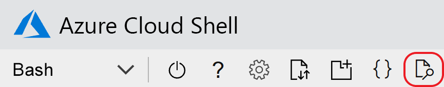

# <a name="quickstart-create-an-aspnet-core-app-with-azure-app-configuration"></a>Краткое руководство. Создание приложения ASP.NET Core с помощью службы "Конфигурация приложений Azure"

В этом кратком руководстве описано, как использовать Конфигурацию приложений Azure, чтобы обеспечить централизованное хранение параметров приложения ASP.NET Core и управление ими. ASP.NET Core создает один объект конфигурации на основе пары "ключ — значение" с использованием параметров из одного или нескольких источников данных, указанных приложением. Эти источники данных называются *поставщиками конфигурации*. Так как в качестве поставщика конфигурации реализован клиент .NET Core службы "Конфигурация приложений", служба выглядит как другой источник данных.

## <a name="prerequisites"></a>Предварительные требования

- Подписка Azure — [создайте бесплатную учетную запись](https://azure.microsoft.com/free/).
- [Базовый пакет SDK для .NET](https://dotnet.microsoft.com/download)

>[!TIP]
> Azure Cloud Shell — это бесплатная интерактивная оболочка, с помощью которой можно выполнять инструкции командной строки, описанные в этой статье.  Она содержит предварительно установленные общие инструменты Azure, включая пакет SDK для .NET Core. Если вы вошли в подписку Azure, запустите [Azure Cloud Shell](https://shell.azure.com) на сайте shell.azure.com.  Дополнительные сведения об Azure Cloud Shell см. в [нашей документации](../cloud-shell/overview.md)

## <a name="create-an-app-configuration-store"></a>Создание хранилища Конфигурации приложений

[!INCLUDE [azure-app-configuration-create](../../includes/azure-app-configuration-create.md)]

6. Выберите **Обозреватель конфигураций** > **Создать** > **Ключ-значение**, чтобы добавить следующие пары "ключ-значение":

    | Клавиши | Значение |
    |---|---|
    | TestApp:Settings:BackgroundColor | White |
    | TestApp:Settings:FontSize | 24 |
    | TestApp:Settings:FontColor | Черный |
    | TestApp:Settings:FontSize | Данные из конфигурации приложения Azure |

    Поля **Метка** и **Тип контента** пока заполнять не нужно. Нажмите кнопку **Применить**.

## <a name="create-an-aspnet-core-web-app"></a>Создание веб-приложения ASP.NET Core

Используйте [интерфейс командной строки .NET Core](https://docs.microsoft.com/dotnet/core/tools/) для создания проекта веб-приложения MVC для ASP.NET Core. [Azure Cloud Shell](https://shell.azure.com) предоставляет эти инструменты.  Они также доступны на платформах Windows, macOS и Linux.

1. Создайте новый каталог для своего проекта В этом кратком руководстве назовите его *TestAppConfig*.

1. В новой папке выполните следующую команду, чтобы создать проект веб-приложения MVC для ASP.NET Core:

```dotnetcli
dotnet new mvc --no-https
```

## <a name="add-secret-manager"></a>Добавление диспетчера секретов

Чтобы использовать диспетчер секретов, добавьте элемент `UserSecretsId` в файл *.csproj*.

1. Откройте *CSPROJ*-файл.

1.  Добавьте элемент `UserSecretsId`, как показано здесь. Вы можете использовать тот же GUID или заменить это значение собственным.

    > [!IMPORTANT]
    > `CreateHostBuilder` заменяет `CreateWebHostBuilder` в .NET Core 3.0.  Выберите правильный синтаксис в зависимости от среды.
    
    #### <a name="net-core-2x"></a>[.NET Core 2.x](#tab/core2x)
    
    ```xml
    <Project Sdk="Microsoft.NET.Sdk.Web">
    
        <PropertyGroup>
            <TargetFramework>netcoreapp2.1</TargetFramework>
            <UserSecretsId>79a3edd0-2092-40a2-a04d-dcb46d5ca9ed</UserSecretsId>
        </PropertyGroup>
    
        <ItemGroup>
            <PackageReference Include="Microsoft.AspNetCore.App" />
            <PackageReference Include="Microsoft.AspNetCore.Razor.Design" Version="2.1.2" PrivateAssets="All" />
        </ItemGroup>
    
    </Project>
    ```
    
    #### <a name="net-core-3x"></a>[.NET Core 3.x](#tab/core3x)
    
    ```xml
    <Project Sdk="Microsoft.NET.Sdk.Web">
        
        <PropertyGroup>
            <TargetFramework>netcoreapp3.1</TargetFramework>
            <UserSecretsId>79a3edd0-2092-40a2-a04d-dcb46d5ca9ed</UserSecretsId>
        </PropertyGroup>
    
    </Project>
    ```
    ---

1. Сохраните *CSPROJ*-файл.

Инструмент "Диспетчер секретов" хранит конфиденциальные данные для разработки вне вашего дерева проектов. Этот подход помогает предотвратить случайный обмен секретами приложений в исходном коде.

> [!TIP]
> Дополнительные сведения о диспетчере секретов см. в руководстве по [безопасному хранению секретов приложений при разработке с помощью ASP.NET Core](https://docs.microsoft.com/aspnet/core/security/app-secrets).

## <a name="connect-to-an-app-configuration-store"></a>Подключение к хранилищу Конфигурации приложений

1. Добавьте ссылку на пакет NuGet `Microsoft.Azure.AppConfiguration.AspNetCore`, выполнив следующую команду:

    ```dotnetcli
    dotnet add package Microsoft.Azure.AppConfiguration.AspNetCore
    ```

1. Выполните следующую команду, чтобы восстановить пакеты проекта:

    ```dotnetcli
    dotnet restore
    ```

1. Добавьте секрет с именем *ConnectionStrings:AppConfig* в диспетчер секретов.

    Этот секрет содержит строку подключения для получения доступа к хранилищу Конфигурации приложений. Замените значение в следующей команде строкой подключения к своему хранилищу Конфигурации приложений. Строку подключения можно найти в разделе **Ключи доступа** на портале Azure.

    Эта команда должна выполняться в том же каталоге, что и файл *CSPROJ*.

    ```dotnetcli
    dotnet user-secrets set ConnectionStrings:AppConfig <your_connection_string>
    ```

    > [!IMPORTANT]
    > Некоторые оболочки усекают строки подключения, которые не заключены в кавычки. Убедитесь, что вывод команды `dotnet user-secrets` отображает полную строку подключения. В противном случае повторно выполните команду, заключив строку подключения в кавычки.

    Диспетчер секретов используется только для локальной проверки веб-приложения. При развертывании приложения, например в [Службе приложений Azure](https://azure.microsoft.com/services/app-service/web), вы будете использовать параметр приложения **Строки подключения** в Службе приложений, а не хранить строку подключения с помощью диспетчера секретов.

    Доступ к этому секрету можно получить с помощью API конфигурации. Двоеточие (:) используется в имени конфигурации с API конфигурации на всех поддерживаемых платформах. Дополнительные сведения см. в статье [Конфигурация в .NET Core](https://docs.microsoft.com/aspnet/core/fundamentals/configuration/index?tabs=basicconfiguration&view=aspnetcore-2.0).

1. Откройте файл *Program.cs* и добавьте ссылку на поставщик конфигурации приложений .NET Core.

    ```csharp
    using Microsoft.Extensions.Configuration.AzureAppConfiguration;
    ```

1. Обновите метод `CreateWebHostBuilder`, чтобы использовать службу "Конфигурация приложений", путем вызова метода `config.AddAzureAppConfiguration()`.

    > [!IMPORTANT]
    > `CreateHostBuilder` заменяет `CreateWebHostBuilder` в .NET Core 3.0.  Выберите правильный синтаксис в зависимости от среды.

    #### <a name="net-core-2x"></a>[.NET Core 2.x](#tab/core2x)

    ```csharp
    public static IWebHostBuilder CreateWebHostBuilder(string[] args) =>
        WebHost.CreateDefaultBuilder(args)
            .ConfigureAppConfiguration((hostingContext, config) =>
            {
                var settings = config.Build();
                config.AddAzureAppConfiguration(settings["ConnectionStrings:AppConfig"]);
            })
            .UseStartup<Startup>();
    ```

    #### <a name="net-core-3x"></a>[.NET Core 3.x](#tab/core3x)

    ```csharp
    public static IHostBuilder CreateHostBuilder(string[] args) =>
        Host.CreateDefaultBuilder(args)
        .ConfigureWebHostDefaults(webBuilder =>
        webBuilder.ConfigureAppConfiguration((hostingContext, config) =>
        {
            var settings = config.Build();
            config.AddAzureAppConfiguration(settings["ConnectionStrings:AppConfig"]);
        })
        .UseStartup<Startup>());
    ```

    ---

1. Перейдите в каталог *<app root>/Views/Home* и откройте файл *Index.cshtml*. Замените содержимое приведенным ниже кодом:

    ```HTML
    @using Microsoft.Extensions.Configuration
    @inject IConfiguration Configuration

    <style>
        body {
            background-color: @Configuration["TestApp:Settings:BackgroundColor"]
        }
        h1 {
            color: @Configuration["TestApp:Settings:FontColor"];
            font-size: @Configuration["TestApp:Settings:FontSize"]px;
        }
    </style>

    <h1>@Configuration["TestApp:Settings:Message"]</h1>
    ```

1. Перейдите в каталог *<app root>/Views/Shared* и откройте файл *_Layout.cshtml*. Замените содержимое приведенным ниже кодом:

    ```HTML
    <!DOCTYPE html>
    <html>
    <head>
        <meta charset="utf-8" />
        <meta name="viewport" content="width=device-width, initial-scale=1.0" />
        <title>@ViewData["Title"] - hello_world</title>

        <link rel="stylesheet" href="~/lib/bootstrap/dist/css/bootstrap.css" />
        <link rel="stylesheet" href="~/css/site.css" />
    </head>
    <body>
        <div class="container body-content">
            @RenderBody()
        </div>

        <script src="~/lib/jquery/dist/jquery.js"></script>
        <script src="~/lib/bootstrap/dist/js/bootstrap.js"></script>
        <script src="~/js/site.js" asp-append-version="true"></script>

        @RenderSection("Scripts", required: false)
    </body>
    </html>
    ```

## <a name="build-and-run-the-app-locally"></a>Создание и запуск приложения локально

1. Чтобы создать приложение с помощью .NET Core CLI, перейдите к корневому каталогу приложения и выполните следующую команду в командной оболочке:

    ```dotnetcli
    dotnet build
    ```

1. Когда создание завершится, запустите веб-приложение локально с помощью следующей команды:

    ```dotnetcli
    dotnet run
    ```

1. Если вы работаете на локальном компьютере, перейдите по адресу `http://localhost:5000` в браузере. Это URL-адрес по умолчанию для локального веб-приложения.  

Если вы работаете в Azure Cloud Shell, нажмите кнопку *Просмотр в Интернете*, а затем — *Настроить*.  



При появлении запроса на настройку порта для предварительного просмотра введите 5000 и выберите *Открыть и перейти*.  На веб-странице будет указано "Данные из конфигурации приложения Azure".

## <a name="clean-up-resources"></a>Очистка ресурсов

[!INCLUDE [azure-app-configuration-cleanup](../../includes/azure-app-configuration-cleanup.md)]

## <a name="next-steps"></a>Дальнейшие действия

В этом кратком руководстве вы создали хранилище Конфигурации приложений и использовали его с веб-приложением ASP.NET Core с помощью [поставщика Конфигурации приложений](https://go.microsoft.com/fwlink/?linkid=2074664). Чтобы узнать, как настроить приложение ASP.NET Core для динамического обновления параметров конфигурации, перейдите к следующему учебнику.

> [!div class="nextstepaction"]
> [Включение динамической конфигурации](./enable-dynamic-configuration-aspnet-core.md)
