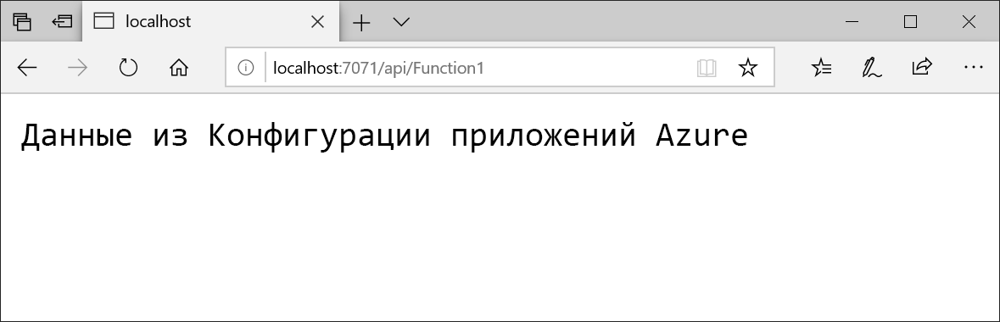

# <a name="quickstart-create-an-azure-function-with-azure-app-configuration"></a>Краткое руководство. Создание функции Azure с использованием службы "Конфигурация приложений Azure"

В этом кратком руководстве описано, как добавить службу "Конфигурация приложений Azure" в функцию Azure, чтобы обеспечить централизованное хранение всех параметров приложения и управление ими отдельно от кода.

## <a name="prerequisites"></a>Предварительные требования

- Подписка Azure — [создайте бесплатную учетную запись](https://azure.microsoft.com/free/).
- [Visual Studio 2019](https://visualstudio.microsoft.com/vs) с рабочей нагрузкой **разработки Azure**.
- [Инструменты Функций Azure](../azure-functions/functions-develop-vs.md#check-your-tools-version)

## <a name="create-an-app-configuration-store"></a>Создание хранилища конфигураций приложений

[!INCLUDE [azure-app-configuration-create](../../includes/azure-app-configuration-create.md)]

6. Выберите **Configuration Explorer** (Обозреватель конфигураций)  >  **+ Создать**, чтобы добавить следующие пары "ключ-значение".

    | Ключ | Значение |
    |---|---|
    | TestApp:Settings:FontSize | Данные из конфигурации приложения Azure |

    Поля **Метка** и **Тип контента** пока заполнять не нужно.

## <a name="create-a-function-app"></a>Создание приложения-функции

[!INCLUDE [Create a project using the Azure Functions template](../../includes/functions-vstools-create.md)]

## <a name="connect-to-an-app-configuration-store"></a>Подключение к хранилищу конфигураций приложений

1. Щелкните проект правой кнопкой мыши и выберите **Управление пакетами NuGet**. На вкладке **Обзор** найдите и добавьте в проект следующие пакеты NuGet. Если вы не можете их найти, установите флажок **Включить предварительные выпуски**.

    ```
    Microsoft.Extensions.Configuration.AzureAppConfiguration 2.0.0-preview-009200001-1437 or later
    ```

2. Откройте файл *Function1.cs* и добавьте ссылку на поставщик общей конфигурации NET Core и поставщик конфигурации приложений .NET Core.

    ```csharp
    using Microsoft.Extensions.Configuration;
    using Microsoft.Extensions.Configuration.AzureAppConfiguration;
    ```

3. Измените метод `Run`, чтобы использовать службу "Конфигурация приложений", путем вызова `builder.AddAzureAppConfiguration()`.

    ```csharp
    public static async Task<IActionResult> Run(
        [HttpTrigger(AuthorizationLevel.Anonymous, "get", "post", Route = null)] HttpRequest req, ILogger log)
    {
        log.LogInformation("C# HTTP trigger function processed a request.");

        var builder = new ConfigurationBuilder();
        builder.AddAzureAppConfiguration(Environment.GetEnvironmentVariable("ConnectionString"));
        var config = builder.Build();
        string message = config["TestApp:Settings:Message"];
        message = message ?? req.Query["message"];

        string requestBody = await new StreamReader(req.Body).ReadToEndAsync();
        dynamic data = JsonConvert.DeserializeObject(requestBody);
        message = message ?? data?.message;

        return message != null
            ? (ActionResult) new OkObjectResult(message)
            : new BadRequestObjectResult("Please pass a message from a configuration store, on the query string or in the request body");
    }
    ```

## <a name="test-the-function-locally"></a>Локальное тестирование функции

1. Задайте переменную среды с именем **ConnectionString** и укажите для нее ключ доступа к хранилищу конфигураций приложений. Если вы используете командную строку Windows, выполните следующую команду и перезапустите командную строку, чтобы изменения вступили в силу:

        setx ConnectionString "connection-string-of-your-app-configuration-store"

    Если вы используете Windows PowerShell, выполните следующую команду:

        $Env:ConnectionString = "connection-string-of-your-app-configuration-store"

    Если вы используете macOS или Linux, выполните следующую команду:

        export ConnectionString='connection-string-of-your-app-configuration-store'

2. Чтобы проверить работу функции, нажмите клавишу F5. Если будет предложено, примите запрос от Visual Studio на скачивание и установку **основных инструментов решения "Функции Azure" (CLI)** . Кроме того, возможно, вам понадобиться включить исключение брандмауэра, чтобы инструменты могли обрабатывать HTTP-запросы.

3. Скопируйте URL-адрес функции из выходных данных среды выполнения функций Azure.

    

4. Вставьте URL-адрес запроса в адресную строку браузера. На изображении ниже показан ответ в браузере на локальный запрос GET, возвращаемый функцией.

    

## <a name="clean-up-resources"></a>Очистка ресурсов

[!INCLUDE [azure-app-configuration-cleanup](../../includes/azure-app-configuration-cleanup.md)]

## <a name="next-steps"></a>Дополнительная информация

При работе с этим кратким руководством вы создали новое хранилище конфигураций приложений и использовали его с функцией Azure. Ознакомьтесь с дополнительными сведениями об использовании службы "Конфигурация приложений" в следующем учебнике, посвященном проверке подлинности.

> [!div class="nextstepaction"]
> [Руководство по интеграции с управляемыми удостоверениями Azure](./howto-integrate-azure-managed-service-identity.md)
