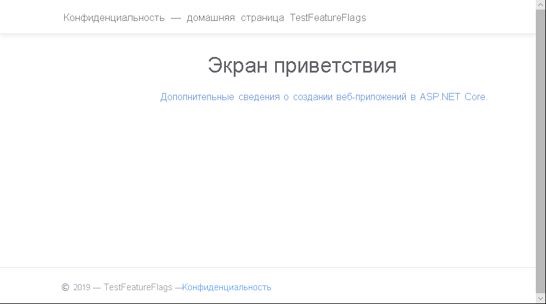
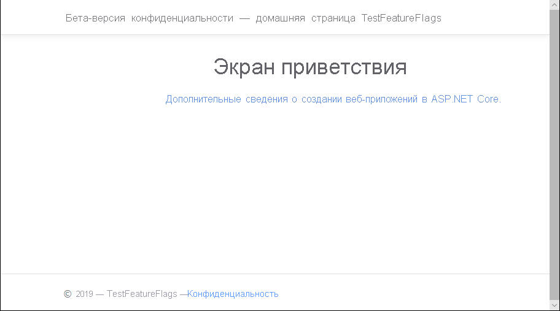

# <a name="quickstart-add-feature-flags-to-an-aspnet-core-app"></a>Краткое руководство. Добавление флагов функций в приложение ASP.NET Core

В этом кратком руководстве описано, как внедрить Конфигурацию приложений Azure в веб-приложение ASP.NET Core, чтобы реализовать комплексное управление функциями. Вы можете использовать службу "Конфигурация приложений" для централизованного хранения всех флагов функций и управления их состояниями. 

Библиотеки управления функциями .NET Core расширяют возможности платформы за счет всесторонней поддержки флагов функций. Эти библиотеки создаются на основе системы конфигурации .NET Core. Они легко интегрируются с Конфигурацией приложений посредством поставщика конфигураций .NET Core.

## <a name="prerequisites"></a>Предварительные требования

- Подписка Azure — [создайте бесплатную учетную запись](https://azure.microsoft.com/free/).
- [пакет SDK для .NET Core](https://dotnet.microsoft.com/download);

## <a name="create-an-app-configuration-store"></a>Создание хранилища конфигураций приложений

[!INCLUDE [azure-app-configuration-create](../../includes/azure-app-configuration-create.md)]

6. Выберите **Диспетчер компонентов** >  **+Добавить**, чтобы добавить следующие флаги функций.

    | Ключ | Состояние |
    |---|---|
    | Beta | Отключить |

## <a name="create-an-aspnet-core-web-app"></a>Создание веб-приложения ASP.NET Core

Используйте [интерфейс командной строки .NET Core](https://docs.microsoft.com/dotnet/core/tools/) для создания проекта веб-приложения MVC для ASP.NET Core. Преимущество использования .NET Core CLI вместо Visual Studio заключается в том, что .NET Core CLI доступен на платформах Windows, MacOS и Linux.

1. Создайте новый каталог для своего проекта В этом кратком руководстве назовите его *TestFeatureFlags*.

1. В новой папке выполните следующую команду, чтобы создать проект веб-приложения MVC для ASP.NET Core:

   ```    
   dotnet new mvc --no-https
   ```

## <a name="add-secret-manager"></a>Добавление диспетчера секретов

Добавьте в проект [инструмент "Диспетчер секретов"](https://docs.microsoft.com/aspnet/core/security/app-secrets). Инструмент "Диспетчер секретов" хранит конфиденциальные данные для разработки вне вашего дерева проектов. Этот подход помогает предотвратить случайный обмен секретами приложений в исходном коде.

1. Откройте *CSPROJ*-файл.
1. Добавьте элемент `UserSecretsId`, как показано в примере ниже, и замените его значение своим значением, которое обычно является идентификатором GUID.

    ```xml
    <Project Sdk="Microsoft.NET.Sdk.Web">

    <PropertyGroup>
        <TargetFramework>netcoreapp2.1</TargetFramework>
        <UserSecretsId>79a3edd0-2092-40a2-a04d-dcb46d5ca9ed</UserSecretsId>
    </PropertyGroup>

    <ItemGroup>
        <PackageReference Include="Microsoft.AspNetCore.App" />
        <PackageReference Include="Microsoft.AspNetCore.Razor.Design" Version="2.1.2" PrivateAssets="All" />
    </ItemGroup>

    </Project>
    ```

1. Сохраните файл.

## <a name="connect-to-an-app-configuration-store"></a>Подключение к хранилищу конфигураций приложений

1. Добавьте ссылку на пакеты NuGet `Microsoft.Azure.AppConfiguration.AspNetCore` и `Microsoft.FeatureManagement.AspNetCore`, выполнив следующие команды.

    ```
    dotnet add package Microsoft.Azure.AppConfiguration.AspNetCore --version 2.0.0-preview-009470001-12
    dotnet add package Microsoft.FeatureManagement.AspNetCore --version 1.0.0-preview-009000001-1251
    ```

1. Выполните следующую команду, чтобы восстановить пакеты проекта:

    ```
    dotnet restore
    ```

1. Добавьте секрет с именем **ConnectionStrings:AppConfig** в диспетчер секретов.

    Этот секрет содержит строку подключения для получения доступа к хранилищу Конфигурации приложений. Замените значение `<your_connection_string>` в следующей команде строкой подключения к своему хранилищу Конфигурации приложений.

    Эта команда должна выполняться в том же каталоге, что и файл *CSPROJ*.

    ```
    dotnet user-secrets set ConnectionStrings:AppConfig <your_connection_string>
    ```

    Диспетчер секретов используется только для локальной проверки веб-приложения. При развертывании приложения, например, в [Службе приложений Azure](https://azure.microsoft.com/services/app-service) вы будете использовать параметр приложения **Строки подключения** в Службе приложений, а не хранить строку подключения с помощью диспетчера секретов.

    Этот секрет можно получить с помощью API Конфигурации приложений. Двоеточие (:) используется в имени конфигурации при работе с API Конфигурации приложений на всех поддерживаемых платформах. Дополнительные сведения см. в статье [Конфигурация в .NET Core](https://docs.microsoft.com/aspnet/core/fundamentals/configuration).

1. Откройте файл *Program.cs* и добавьте в него ссылку на поставщик Конфигурации приложений .NET Core.

    ```csharp
    using Microsoft.Extensions.Configuration.AzureAppConfiguration;
    ```

1. Обновите метод `CreateWebHostBuilder`, чтобы использовать службу "Конфигурация приложений", путем вызова метода `config.AddAzureAppConfiguration()`.
    
    > [!IMPORTANT]
    > `CreateHostBuilder` заменяет `CreateWebHostBuilder` в .NET Core 3.0.  Выберите правильный синтаксис в зависимости от среды.

    ### <a name="update-createwebhostbuilder-for-net-core-2x"></a>Обновите `CreateWebHostBuilder` для .NET Core 2.x

    ```csharp
    public static IWebHostBuilder CreateWebHostBuilder(string[] args) =>
        WebHost.CreateDefaultBuilder(args)
            .ConfigureAppConfiguration((hostingContext, config) =>
            {
                var settings = config.Build();
                config.AddAzureAppConfiguration(options => {
                    options.Connect(settings["ConnectionStrings:AppConfig"])
                            .UseFeatureFlags();
                });
            })
            .UseStartup<Startup>();
    ```

    ### <a name="update-createhostbuilder-for-net-core-3x"></a>Обновите `CreateHostBuilder` для .NET Core 3.x

    ```csharp
    public static IHostBuilder CreateHostBuilder(string[] args) =>
        Host.CreateDefaultBuilder(args)
        .ConfigureWebHostDefaults(webBuilder =>
        webBuilder.ConfigureAppConfiguration((hostingContext, config) =>
        {
            var settings = config.Build();
            config.AddAzureAppConfiguration(settings["ConnectionStrings:AppConfig"])
                .UseFeatureFlags();
        })
        .UseStartup<Startup>());
    ```


1. Откройте файл *Startup.cs* и добавьте в него ссылки на диспетчер функций .NET Core.

    ```csharp
    using Microsoft.FeatureManagement;
    ```

1. Обновите метод `ConfigureServices`, добавив поддержку флагов функций с помощью вызова метода `services.AddFeatureManagement()`. При необходимости можно добавить любой фильтр для флагов функций, вызвав `services.AddFeatureFilter<FilterType>()`.

    ```csharp
    public void ConfigureServices(IServiceCollection services)
    {
        services.AddFeatureManagement();
    }
    ```

1. Обновите метод `Configure`, чтобы добавить ПО промежуточного слоя. Оно позволит периодически обновлять значения флагов функций, пока веб-приложение ASP.NET Core продолжает получать запросы.

    ```csharp
    public void Configure(IApplicationBuilder app, IHostingEnvironment env)
    {
        app.UseAzureAppConfiguration();
        app.UseMvc();
    }
    ```

1. Добавьте файл *MyFeatureFlags.cs*.

    ```csharp
    namespace TestFeatureFlags
    {
        public enum MyFeatureFlags
        {
            Beta
        }
    }
    ```

1. Добавьте файл *BetaController.cs* в каталог *Контроллеры*.

    ```csharp
    using Microsoft.AspNetCore.Mvc;
    using Microsoft.FeatureManagement;
    using Microsoft.FeatureManagement.Mvc;

    namespace TestFeatureFlags.Controllers
    {
        public class BetaController: Controller
        {
            private readonly IFeatureManager _featureManager;

            public BetaController(IFeatureManagerSnapshot featureManager)
            {
                _featureManager = featureManager;
            }

            [FeatureGate(MyFeatureFlags.Beta)]
            public IActionResult Index()
            {
                return View();
            }
        }
    }
    ```

1. Откройте файл *_ViewImports.cshtml* в каталоге *Представления* и добавьте в него вспомогательную функцию тегов диспетчера функций.

    ```html
    @addTagHelper *, Microsoft.FeatureManagement.AspNetCore
    ```

1. Откройте файл *_Layout.cshtml* в каталоге *Представления*\\*Общие* и замените штрихкод `<nav>` под строкой `<body>` > `<header>` следующим кодом.

    ```html
    <nav class="navbar navbar-expand-sm navbar-toggleable-sm navbar-light bg-white border-bottom box-shadow mb-3">
        <div class="container">
            <a class="navbar-brand" asp-area="" asp-controller="Home" asp-action="Index">TestFeatureFlags</a>
            <button class="navbar-toggler" type="button" data-toggle="collapse" data-target=".navbar-collapse" aria-controls="navbarSupportedContent"
            aria-expanded="false" aria-label="Toggle navigation">
            <span class="navbar-toggler-icon"></span>
            </button>
            <div class="navbar-collapse collapse d-sm-inline-flex flex-sm-row-reverse">
                <ul class="navbar-nav flex-grow-1">
                    <li class="nav-item">
                        <a class="nav-link text-dark" asp-area="" asp-controller="Home" asp-action="Index">Home</a>
                    </li>
                    <feature name="Beta">
                    <li class="nav-item">
                        <a class="nav-link text-dark" asp-area="" asp-controller="Beta" asp-action="Index">Beta</a>
                    </li>
                    </feature>
                    <li class="nav-item">
                        <a class="nav-link text-dark" asp-area="" asp-controller="Home" asp-action="Privacy">Privacy</a>
                    </li>
                </ul>
            </div>
        </div>
    </nav>
    ```

1. Создайте каталог *Beta* в каталоге *Представления* и добавьте в него файл *Index.cshtml*.

    ```html
    @{
        ViewData["Title"] = "Beta Home Page";
    }

    <h1>
        This is the beta website.
    </h1>
    ```

## <a name="build-and-run-the-app-locally"></a>Создание и запуск приложения локально

1. Чтобы создать приложение с помощью .NET Core CLI, выполните следующую команду в оболочке командной строки:

    ```
    dotnet build
    ```

1. Когда создание завершится, запустите веб-приложение локально с помощью следующей команды:

    ```
    dotnet run
    ```

1. Откройте окно браузера и перейдите по адресу `https://localhost:5001`, который является URL-адресом по умолчанию для веб-приложения, размещенного локально.

    

1. Войдите на [портале Azure](https://portal.azure.com). Щелкните **Все ресурсы** и выберите экземпляр хранилища Конфигурации приложений, который вы создали по инструкциям из краткого руководства.

1. Выберите **Feature Manager** (Диспетчер функций) и измените состояние ключа **Beta** на **On** (Включен).

    | Ключ | Состояние |
    |---|---|
    | Beta | С |

1. Перезапустите приложение, перейдя в командную строку и нажав `Ctrl-C`, чтобы отменить выполняющийся процесс `dotnet` и снова запустить `dotnet run`.

1. Обновите страницу браузера, чтобы просмотреть новые параметры конфигурации.

    

## <a name="clean-up-resources"></a>Очистка ресурсов

[!INCLUDE [azure-app-configuration-cleanup](../../includes/azure-app-configuration-cleanup.md)]

## <a name="next-steps"></a>Дополнительная информация

В этом кратком руководстве вы создали хранилище Конфигурации приложений и использовали его для управления функциями веб-приложения ASP.NET Core с помощью [библиотек управления функциями](https://go.microsoft.com/fwlink/?linkid=2074664).

- Узнайте больше об [управлении функциями](./concept-feature-management.md).
- [Управляйте флагами функций](./manage-feature-flags.md).
- [Используйте флаги функций в приложении ASP.NET Core](./use-feature-flags-dotnet-core.md).
- [Использование динамической конфигурации в приложении ASP.NET Core](./enable-dynamic-configuration-aspnet-core.md)
