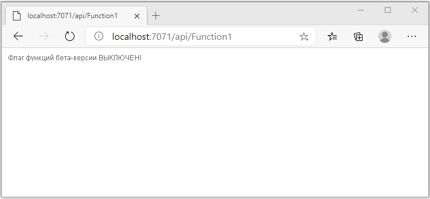
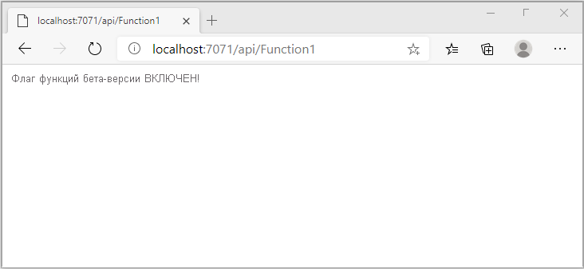

# <a name="quickstart-add-feature-flags-to-an-azure-functions-app"></a>Краткое руководство. Добавление флагов функций в приложение "Функции Azure"

Используя сведения этого краткого руководства, вы создадите реализацию управления функциями в приложении "Функции Azure" с помощью службы "Конфигурация приложений Azure". Вы сможете использовать службу "Конфигурация приложений" для централизованного хранения всех флагов функций и управления их состояниями. 

Библиотеки управления функциями .NET расширяют возможности платформы за счет поддержки флагов функций. Эти библиотеки создаются на основе системы конфигурации .NET. Они интегрируются со службой "Конфигурация приложений" посредством поставщика конфигураций .NET.

## <a name="prerequisites"></a>Предварительные требования

- Подписка Azure — [создайте бесплатную учетную запись](https://azure.microsoft.com/free/).
- [Visual Studio 2019](https://visualstudio.microsoft.com/vs) с рабочей нагрузкой **разработки Azure**.
- [Средства функций Azure](../azure-functions/functions-develop-vs.md#check-your-tools-version)

## <a name="create-an-app-configuration-store"></a>Создание хранилища Конфигурации приложений

[!INCLUDE [azure-app-configuration-create](../../includes/azure-app-configuration-create.md)]

7. Выберите **Диспетчер компонентов** >  **+Добавить**, чтобы добавить флаг функции `Beta`.

    > [!div class="mx-imgBorder"]
    > 

    Не определяйте `label` и `Description` сейчас.

8. Чтобы сохранить новый флаг функции, выберите **Применить**.

## <a name="create-a-functions-app"></a>Создание приложения-функции

[!INCLUDE [Create a project using the Azure Functions template](../../includes/functions-vstools-create.md)]

## <a name="connect-to-an-app-configuration-store"></a>Подключение к хранилищу Конфигурации приложений

1. Щелкните проект правой кнопкой мыши и выберите **Управление пакетами NuGet**. На вкладке **Обзор** найдите и добавьте в проект следующие пакеты NuGet. Для `Microsoft.Extensions.DependencyInjection` проверьте, что вы используете самую последнюю стабильную сборку. 

    ```
    Microsoft.Extensions.DependencyInjection
    Microsoft.Extensions.Configuration
    Microsoft.FeatureManagement
    ```


1. Откройте *Function1.cs* и добавьте пространства имен этих пакетов.

    ```csharp
    using Microsoft.Extensions.Configuration;
    using Microsoft.FeatureManagement;
    using Microsoft.Extensions.DependencyInjection;
    ```

1. Добавьте приведенный ниже статический конструктор `Function1` для начальной загрузки поставщика Конфигурации приложений Azure. Затем добавьте два элемента `static`, поле с именем `ServiceProvider`, чтобы создать отдельный экземпляр `ServiceProvider`, и указанное ниже свойство `Function1` с именем `FeatureManager`, чтобы создать отдельный экземпляр `IFeatureManager`. Затем подключитесь к службе "Конфигурация приложений" в `Function1`, вызвав `AddAzureAppConfiguration()`. Будет загружена конфигурация при запуске приложения. Позже один и тот же экземпляр конфигурации будет использоваться для всех вызовов функций. 

    ```csharp
        // Implements IDisposable, cached for life time of function
        private static ServiceProvider ServiceProvider; 

        static Function1()
        {
            IConfigurationRoot configuration = new ConfigurationBuilder()
                .AddAzureAppConfiguration(options =>
                {
                    options.Connect(Environment.GetEnvironmentVariable("ConnectionString"))
                           .UseFeatureFlags();
                }).Build();

            var services = new ServiceCollection();                                                                             
            services.AddSingleton<IConfiguration>(configuration).AddFeatureManagement();

            ServiceProvider = services.BuildServiceProvider(); 
        }

        private static IFeatureManager FeatureManager => ServiceProvider.GetRequiredService<IFeatureManager>();
    ```

1. Обновите метод `Run`, чтобы изменить значение отображаемого сообщения в зависимости от состояния флага функций.

    ```csharp
        [FunctionName("Function1")]
        public static async Task<IActionResult> Run(
                [HttpTrigger(AuthorizationLevel.Anonymous, "get", "post", Route = null)] HttpRequest req,
                ILogger log)
            {
                string message = await FeatureManager.IsEnabledAsync("Beta")
                     ? "The Feature Flag 'Beta' is turned ON"
                     : "The Feature Flag 'Beta' is turned OFF";
                
                return (ActionResult)new OkObjectResult(message); 
            }
    ```

## <a name="test-the-function-locally"></a>Локальное тестирование функции

1. Задайте переменную среды с именем **ConnectionString**, где значение является ключом доступа, полученным ранее в хранилище службы "Конфигурация приложений" в разделе **Ключи доступа**. Если вы используете командную строку Windows, выполните следующую команду и перезапустите командную строку, чтобы изменения вступили в силу:

    ```cmd
        setx ConnectionString "connection-string-of-your-app-configuration-store"
    ```

    Если вы используете Windows PowerShell, выполните следующую команду:

    ```azurepowershell
        $Env:ConnectionString = "connection-string-of-your-app-configuration-store"
    ```

    Если вы используете macOS или Linux, выполните следующую команду:

    ```bash
        export ConnectionString='connection-string-of-your-app-configuration-store'
    ```

1. Чтобы проверить работу функции, нажмите клавишу F5. Если будет предложено, примите запрос от Visual Studio на скачивание и установку **основных инструментов решения "Функции Azure" (CLI)**. Кроме того, возможно, вам понадобиться включить исключение брандмауэра, чтобы инструменты могли обрабатывать HTTP-запросы.

1. Скопируйте URL-адрес функции из выходных данных среды выполнения функций Azure.

    

1. Вставьте URL-адрес для HTTP-запроса в адресной строке браузера. На следующем рисунке показан ответ, указывающий, что флаг функций `Beta` отключен. 

    

1. Войдите на [портал Azure](https://portal.azure.com). Щелкните **Все ресурсы** и выберите экземпляр хранилища Конфигурации приложений, который вы создали.

1. Выберите **Диспетчер компонентов** и измените состояние ключа **Beta** на **Вкл**.

1. Вернитесь в командную строку и отмените запущенный процесс, нажав кнопку `Ctrl-C`.  Перезапустите приложение, нажав клавишу F5. 

1. Скопируйте URL-адрес функции из выходных данных среды выполнения Функций Azure, используя тот же процесс, что и в шаге 3. Вставьте URL-адрес для HTTP-запроса в адресной строке браузера. Ответ браузера должен измениться и показать, что флаг функции `Beta` включен, как показано на рисунке ниже.
 
    

## <a name="clean-up-resources"></a>Очистка ресурсов

[!INCLUDE [azure-app-configuration-cleanup](../../includes/azure-app-configuration-cleanup.md)]

## <a name="next-steps"></a>Дальнейшие действия

Используя сведения из этого краткого руководства, вы создали флаг функции и использовали его с приложением "Функции Azure" с помощью [поставщика Конфигурации приложений](https://go.microsoft.com/fwlink/?linkid=2074664).

- Узнайте больше об [управлении функциями](./concept-feature-management.md).
- [Управляйте флагами функций](./manage-feature-flags.md).
- [использованию динамической конфигурации в приложении Функций Azure](./enable-dynamic-configuration-azure-functions-csharp.md)
