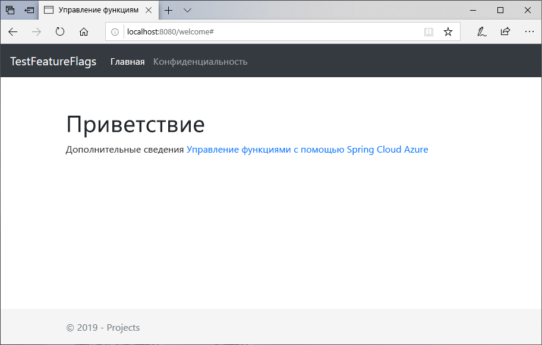
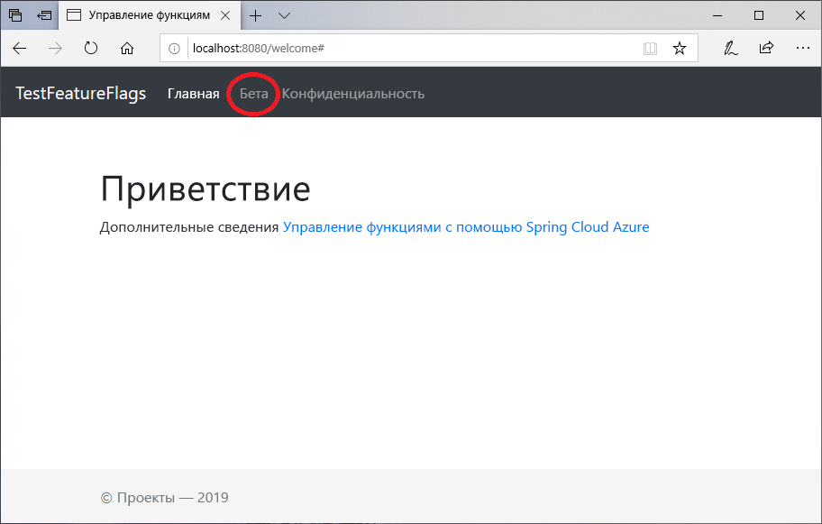

# <a name="quickstart-add-feature-flags-to-a-spring-boot-app"></a>Краткое руководство. Добавление флагов функций в приложение Spring Boot

В этом кратком руководстве описано, как внедрить Конфигурацию приложений Azure в веб-приложение Spring Boot, чтобы реализовать комплексное управление функциями. Вы можете использовать службу "Конфигурация приложений" для централизованного хранения всех флагов функций и управления их состояниями.

Библиотеки управления функциями Spring Boot расширяют возможности платформы за счет всесторонней поддержки флагов функций. Эти библиотеки **не** зависят от любой библиотеки Azure. Они легко интегрируются с Конфигурацией приложений через поставщика конфигураций Spring Boot.

## <a name="prerequisites"></a>Предварительные требования

- Подписка Azure — [создайте бесплатную учетную запись](https://azure.microsoft.com/free/).
- Поддерживаемый [пакет SDK для комплекта разработчика Java](https://docs.microsoft.com/java/azure/jdk) версии 8.
- [Apache Maven](https://maven.apache.org/download.cgi) версии 3.0 или более поздней.

## <a name="create-an-app-configuration-store"></a>Создание хранилища Конфигурации приложений

[!INCLUDE [azure-app-configuration-create](../../includes/azure-app-configuration-create.md)]

6. Выберите **Feature Manager** (Диспетчер функций)  >  **+ Создать**, чтобы добавить следующие флаги функций.

    | Ключ | Состояние |
    |---|---|
    | Beta | Отключить |

## <a name="create-a-spring-boot-app"></a>Создание приложения Spring Boot

Для создания проекта Spring Boot воспользуйтесь [Spring Initializr](https://start.spring.io/).

1. Перейдите по адресу <https://start.spring.io/>.

2. Задайте такие параметры:

   - Выберите в соответствующих полях **Maven Project** (Проект Maven) и **Java**.
   - Выберите **Spring Boot** не ниже версии 2.0.
   - Заполните поля **Group** (Группа) и **Artifact** (Артефакт) для приложения.
   - Добавьте зависимость **Web** (Веб).

3. После указания предыдущих параметров выберите **Создать проект**. При появлении запроса скачайте проект на локальный компьютер.

## <a name="add-feature-management"></a>Добавление управления функциями

1. После извлечения файлов в локальной системе простое приложение Spring Boot можно редактировать. Найдите файл *pom.xml* в корневой папке приложения.

2. Откройте файл *pom.xml* в текстовом редакторе и добавьте начальное приложение Spring Cloud Azure Config и управление функциями в список `<dependencies>`.

    ```xml
    <dependency>
        <groupId>com.microsoft.azure</groupId>
        <artifactId>spring-cloud-starter-azure-appconfiguration-config</artifactId>
        <version>1.1.0.M4</version>
    </dependency>
    <dependency>
        <groupId>com.microsoft.azure</groupId>
        <artifactId>spring-cloud-azure-feature-management-web</artifactId>
        <version>1.1.0.M4</version>
    </dependency>
    <dependency>
            <groupId>org.springframework.boot</groupId>
            <artifactId>spring-boot-starter-thymeleaf</artifactId>
    </dependency>
    ```

> [!Note]
> Существует библиотека управления функциями вне обозревателя интернета, которая не зависит от spring-web (веб-сайта). Смотрите дополнительные [Документы](https://github.com/microsoft/spring-cloud-azure/tree/master/spring-cloud-azure-feature-management) для ознакомления с отличиями. Кроме того, если конфигурация приложений не используется, см. [Объявление флага функции](https://github.com/microsoft/spring-cloud-azure/tree/master/spring-cloud-azure-feature-management#feature-flag-declaration).

## <a name="connect-to-an-app-configuration-store"></a>Подключение к хранилищу Конфигурации приложений

1. В каталоге ресурсов приложения откройте файл `bootstrap.properties` и добавьте в него приведенные ниже строки. Добавьте сведения о конфигурации приложения.

    ```properties
    spring.cloud.azure.appconfiguration.stores[0].name= ${APP_CONFIGURATION_CONNECTION_STRING}
    ```

2. На портале конфигурации приложения для хранилища конфигураций перейдите к разделу "Ключи доступа". Выберите вкладку "Ключи только для чтения". На данной вкладке скопируйте значение одной из строк подключения и добавьте его в качестве новой переменной среды с именем переменной `APP_CONFIGURATION_CONNECTION_STRING`.

3. Откройте основной файл приложения Java и добавьте `@EnableConfigurationProperties`, чтобы включить эту функцию.

    ```java
    @SpringBootApplication
    @EnableConfigurationProperties(MessageProperties.class)
    public class AzureConfigApplication {
        public static void main(String[] args) {
            SpringApplication.run(AzureConfigApplication.class, args);
        }
    }
    ```

4. Создайте файл Java с именем *HelloController.java* в каталоге пакета приложения. Добавьте следующие строки.

    ```java
    @Controller
    @ConfigurationProperties("controller")
    public class HelloController {

        private FeatureManager featureManager;

        public HelloController(FeatureManager featureManager) {
            this.featureManager = featureManager;
        }

        @GetMapping("/welcome")
        public String mainWithParam(Model model) {
            model.addAttribute("Beta", featureManager.isEnabled("Beta"));
            return "welcome";
        }
    }
    ```

5. Создайте файл HTML с именем *welcome.html* в каталоге шаблонов приложения. Добавьте следующие строки.

    ```html
    <!DOCTYPE html>
    <html lang="en" xmlns:th="http://www.thymeleaf.org">
    <head>
        <meta charset="utf-8">
        <meta name="viewport" content="width=device-width, initial-scale=1, shrink-to-fit=no">
        <title>Feature Management with Spring Cloud Azure</title>

        <link rel="stylesheet" href="/css/main.css">
        <link rel="stylesheet" href="https://stackpath.bootstrapcdn.com/bootstrap/4.3.1/css/bootstrap.min.css" integrity="sha384-ggOyR0iXCbMQv3Xipma34MD+dH/1fQ784/j6cY/iJTQUOhcWr7x9JvoRxT2MZw1T" crossorigin="anonymous">

        <script src="https://code.jquery.com/jquery-3.3.1.slim.min.js" integrity="sha384-q8i/X+965DzO0rT7abK41JStQIAqVgRVzpbzo5smXKp4YfRvH+8abtTE1Pi6jizo" crossorigin="anonymous"></script>
        <script src="https://cdnjs.cloudflare.com/ajax/libs/popper.js/1.14.7/umd/popper.min.js" integrity="sha384-UO2eT0CpHqdSJQ6hJty5KVphtPhzWj9WO1clHTMGa3JDZwrnQq4sF86dIHNDz0W1" crossorigin="anonymous"></script>
        <script src="https://stackpath.bootstrapcdn.com/bootstrap/4.3.1/js/bootstrap.min.js" integrity="sha384-JjSmVgyd0p3pXB1rRibZUAYoIIy6OrQ6VrjIEaFf/nJGzIxFDsf4x0xIM+B07jRM" crossorigin="anonymous"></script>

    </head>
    <body>
        <header>
        <!-- Fixed navbar -->
        <nav class="navbar navbar-expand-md navbar-dark fixed-top bg-dark">
            <a class="navbar-brand" href="#">TestFeatureFlags</a>
            <button class="navbar-toggler" aria-expanded="false" aria-controls="navbarCollapse" aria-label="Toggle navigation" type="button" data-target="#navbarCollapse" data-toggle="collapse">
            <span class="navbar-toggler-icon"></span>
            </button>
            <div class="collapse navbar-collapse" id="navbarCollapse">
            <ul class="navbar-nav mr-auto">
                <li class="nav-item active">
                <a class="nav-link" href="#">Home <span class="sr-only">(current)</span></a>
                </li>
                <li class="nav-item" th:if="${Beta}">
                <a class="nav-link" href="#">Beta</a>
                </li>
                <li class="nav-item">
                <a class="nav-link" href="#">Privacy</a>
                </li>
            </ul>
            </div>
        </nav>
        </header>
        <div class="container body-content">
            <h1 class="mt-5">Welcome</h1>
            <p>Learn more about <a href="https://github.com/microsoft/spring-cloud-azure/blob/master/spring-cloud-azure-feature-management/README.md">Feature Management with Spring Cloud Azure</a></p>

        </div>
        <footer class="footer">
            <div class="container">
            <span class="text-muted">&copy; 2019 - Projects</span>
        </div>

        </footer>
    </body>
    </html>

    ```

6. Создайте папку с именем "CSS" под статическим элементом и внутри нее – новый CSS файл с именем *main.css*. Добавьте следующие строки.

    ```css
    html {
    position: relative;
    min-height: 100%;
    }
    body {
    margin-bottom: 60px;
    }
    .footer {
    position: absolute;
    bottom: 0;
    width: 100%;
    height: 60px;
    line-height: 60px;
    background-color: #f5f5f5;
    }

    body > .container {
    padding: 60px 15px 0;
    }

    .footer > .container {
    padding-right: 15px;
    padding-left: 15px;
    }

    code {
    font-size: 80%;
    }
    ```

## <a name="build-and-run-the-app-locally"></a>Создание и запуск приложения локально

1. Создайте приложение Spring Boot с помощью Maven и запустите его, например, следующим образом:

    ```shell
    mvn clean package
    mvn spring-boot:run
    ```

2. Откройте окно браузера и перейдите по адресу `https://localhost:8080`, который является URL-адресом по умолчанию для веб-приложения, размещенного локально.

    

3. На портале конфигурации приложений выберите **Feature Manager** (Диспетчер функций) и измените состояние ключа **Beta** на **On** (Включен).

    | Ключ | Состояние |
    |---|---|
    | Beta | С |

4. Обновите страницу браузера, чтобы просмотреть новые параметры конфигурации.

    

## <a name="clean-up-resources"></a>Очистка ресурсов

[!INCLUDE [azure-app-configuration-cleanup](../../includes/azure-app-configuration-cleanup.md)]

## <a name="next-steps"></a>Дополнительная информация

В этом кратком руководстве вы создали хранилище Конфигурации приложений и использовали его для управления функциями веб-приложения Spring Boot с помощью [библиотек управления функциями](https://go.microsoft.com/fwlink/?linkid=2074664).

- Узнайте больше об [управлении функциями](./concept-feature-management.md).
- [Управляйте флагами функций](./manage-feature-flags.md).
- [Использование флагов функций в приложении Spring Boot Core](./use-feature-flags-spring-boot.md).
