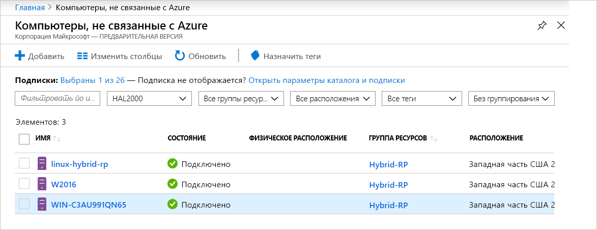

# <a name="what-is-azure-arc-for-servers"></a>Что собой представляет Azure Arc для серверов

Azure Arc для серверов позволяет управлять компьютерами, которые находятся за пределами Azure.
Если виртуальная машина, не относящаяся к Azure, подключена к Azure, она становится **подключенным компьютером** и считается ресурсом в Azure. Каждый **подключенный компьютер** имеет идентификатор ресурса, управляется как часть группы ресурсов в подписке, а также получает преимущества стандартных функций Azure, таких как Политика Azure и расстановка тегов.

Для подключения к Azure пакет агента необходимо установить на каждом компьютере. В оставшейся части этого документа процесс описывается более подробно.

Компьютеры будут находиться в состоянии **Подключено** или **Отключено** в зависимости от того, как давно агент выполнял возврат. Каждый возврат называется пульсом. Если компьютер не выполнял возврат в течение последних 5 минут, он будет отображаться как находящийся вне сети, пока подключение не будет восстановлено.  <!-- For more information on troubleshooting agent connectivity, see [Troubleshooting Azure Arc for servers](troubleshoot/arc-for-servers.md). -->



## <a name="clients"></a>Клиенты

### <a name="supported-operating-systems"></a>Поддерживаемые операционные системы

В общедоступной предварительной версии поддерживается:

- Windows Server 2012 R2 и более поздних версий
- Ubuntu 16.04 и 18.04.

Выпуск общедоступной предварительной версии предназначен для ознакомления, и его не следует использовать для управления критически важными рабочими ресурсами.

## <a name="azure-subscription-and-service-limits"></a>Ограничения подписки и службы Azure

Обязательно ознакомьтесь с ограничениями Azure Resource Manager и запланируйте количество компьютеров, которые необходимо подключить, в соответствии с рекомендациями, указанными для [подписки](../../azure-subscription-service-limits.md#subscription-limits---azure-resource-manager), а также для [групп ресурсов](../../azure-subscription-service-limits.md#resource-group-limits). В частности, на группу ресурсов по умолчанию установлено ограничение в 800 серверов.

## <a name="networking-configuration"></a>Конфигурация сети

Во время установки и выполнения агенту требуется подключение к **конечным точкам службы Azure Arc**. При блокировке исходящего подключения с помощью брандмауэров убедитесь, что в список запрещенных не были по умолчанию добавлены указанные ниже URL-адреса. Все подключения исходят от агента в Azure и защищены с помощью **SSL**. Весь трафик может маршрутизироваться через прокси-сервер **HTTPS**. Если разрешаете IP-диапазоны или доменные имена, к которым разрешено подключаться серверам, необходимо разрешить доступ через порт 443 к следующим тегам служб и DNS-именам.

Теги служб:

* AzureActiveDirectory
* AzureTrafficManager.

Список IP-адресов для каждого тега или региона службы см. в файле JSON [Azure IP Ranges and Service Tags – Public Cloud](https://www.microsoft.com/download/details.aspx?id=56519) (Диапазоны IP-адресов и теги служб Azure — общедоступное облако). Корпорация Майкрософт публикует еженедельные обновления, содержащие каждую службу Azure и диапазоны IP-адресов, которые она использует. Дополнительные сведения см. в разделе о [тегах служб](https://docs.microsoft.com/azure/virtual-network/security-overview#service-tags).

Эти DNS-имена предоставляются в дополнение к сведениям о диапазоне IP-адресов для тега службы, так как в большинстве служб сейчас нет регистрации тега службы, в связи с чем IP-адреса могут изменяться. Если для настройки брандмауэра требуются диапазоны IP-адресов, то для предоставления доступа ко всем службам Azure следует использовать тег службы **AzureCloud**. Не отключайте мониторинг безопасности или проверку URL-адресов, но предоставьте им разрешения такие же, как и интернет-трафику.

| Доменная среда | Требуемые конечные точки службы Azure |
|---------|---------|
|management.azure.com|Azure Resource Manager|
|login.windows.net|Azure Active Directory|
|dc.services.visualstudio.com|Application Insights|
|agentserviceapi.azure-automation.net|Гостевая конфигурация|
|*-agentservice-prod-1.azure-automation.net|Гостевая конфигурация|
|*.his.hybridcompute.azure-automation.net|Служба гибридной идентификации|

### <a name="installation-network-requirements"></a>Требования сети к установке

Скачайте [пакет агента подключенного компьютера Azure](https://aka.ms/AzureConnectedMachineAgent) с официальных серверов распространения. Указанные ниже сайты должны быть доступны из вашей среды. Вы можете скачать пакет в общую папку и установить агент из нее. В этом случае может потребоваться изменить скрипт подключения, созданный на портале Azure.

Windows:

* `aka.ms`
* `download.microsoft.com`

Linux:

* `aka.ms`
* `packages.microsoft.com`

Сведения о настройке агента для использования прокси-сервера см. в разделе о [конфигурации прокси-сервера](quickstart-onboard-powershell.md#proxy-server-configuration).

## <a name="register-the-required-resource-providers"></a>Регистрация необходимых поставщиков ресурсов

Чтобы использовать Azure Arc для серверов, вы должны зарегистрировать необходимых поставщиков ресурсов.

* **Microsoft.HybridCompute**
* **Microsoft.GuestConfiguration**

Ниже приведены команды, с помощью которых можно зарегистрировать поставщики ресурсов.

Azure PowerShell

```azurepowershell-interactive
Login-AzAccount
Set-AzContext -SubscriptionId [subscription you want to onboard]
Register-AzResourceProvider -ProviderNamespace Microsoft.HybridCompute
Register-AzResourceProvider -ProviderNamespace Microsoft.GuestConfiguration
```

Azure CLI:

```azurecli-interactive
az account set --subscription "{Your Subscription Name}"
az provider register --namespace 'Microsoft.HybridCompute'
az provider register --namespace 'Microsoft.GuestConfiguration'
```

Вы также можете зарегистрировать поставщики ресурсов с помощью портала Azure, выполнив действия, описанные в [этом разделе](../../azure-resource-manager/resource-manager-supported-services.md#azure-portal).

## <a name="machine-changes-after-installing-the-agent"></a>Изменения компьютера после установки агента

Если в вашей среде развернуто решение для отслеживания изменений, вы можете использовать приведенный ниже список, чтобы отслеживать, обнаруживать и разрешать изменения, внесенные пакетом установки **агента подключенного компьютера Azure (AzCMAgent)** .

После установки агента вы увидите следующие изменения, внесенные на серверы.

### <a name="windows"></a>Windows

Установленные службы:

* `Himds` — служба **агента подключенного компьютера Azure**.
* `Dscservice` или `gcd` — служба **гостевой конфигурации**.

Файлы, добавленные на сервер:

* `%ProgramFiles%\AzureConnectedMachineAgent\*.*` — расположение файлов **агента подключенного компьютера Azure**.
* `%ProgramData%\GuestConfig\*.*`  -  журналы **гостевой конфигурации**.

Расположение разделов реестра:

* `HKEY_LOCAL_MACHINE\SOFTWARE\Microsoft\Azure Connected Machine Agent` — разделы реестра для **агента подключенного компьютера Azure**.

### <a name="linux"></a>Linux

Установленные службы:

* `Himdsd` — служба **агента подключенного компьютера Azure**.
* `dscd` или `gcd` — служба **гостевой конфигурации**.

Файлы, добавленные на сервер:

* `/var/opt/azcmagent/**` — расположение файлов **агента подключенного компьютера Azure**.
* `/var/lib/GuestConfig/**`  -  журналы **гостевой конфигурации**.

## <a name="supported-scenarios"></a>Поддерживаемые сценарии

После регистрации узла можно приступить к управлению узлами с помощью других служб Azure.

В общедоступной предварительной версии поддерживаются следующие сценарии для **подключенных компьютеров**.

## <a name="guest-configuration"></a>Гостевая конфигурация

После подключения компьютера к Azure вы можете назначить политики Azure **подключенным компьютерам**, используя те же действия, что и для назначения политик для виртуальных машин Azure.

Дополнительные сведения см.в статье [Understand Azure Policy's Guest Configuration](../../governance/policy/concepts/guest-configuration.md) (Общие сведения о гостевой конфигурации службы "Политика Azure").

Журналы агента гостевой конфигурации для **подключенного компьютера** находятся в следующих расположениях:

* Для Windows — `%ProgramFiles%\AzureConnectedMachineAgent\logs\dsc.log`.
* Для Linux — `/opt/logs/dsc.log`.

## <a name="log-analytics"></a>Log Analytics

Данные журнала, собранные [Microsoft Monitoring Agent (MMA)](https://docs.microsoft.com/azure/azure-monitor/log-query/log-query-overview) и хранящиеся в рабочей области Log Analytics, теперь содержат свойства, относящиеся к компьютеру, такие как **ResourceId**, которые можно использовать для доступа к журналам ресурсов.

- На компьютерах, на которых уже установлен агент MMA, будут доступны функции **Azure Arc**, включенные с помощью обновленных пакетов управления.
- Для интеграции Azure Arc для серверов требуется [агент MMA версии 10.20.18011 или более поздней](https://docs.microsoft.com/azure/virtual-machines/extensions/oms-windows#agent-and-vm-extension-version).
- При запросе данных журнала в [Azure Monitor](https://docs.microsoft.com/azure/azure-monitor/log-query/log-query-overview) возвращаемая схема данных будет содержать гибридный **ResourceId** в форме `/subscriptions/<SubscriptionId/resourceGroups/<ResourceGroup>/providers/Microsoft.HybridCompute/machines/<MachineName>`.

Дополнительные сведения см. в статье [Начало работы с Log Analytics в Azure Monitor](https://docs.microsoft.com/azure/azure-monitor/log-query/get-started-portal).

<!-- MMA agent version 10.20.18011 and later -->

## <a name="next-steps"></a>Дальнейшие действия

Подключить компьютеры с помощью Azure Arc для серверов можно двумя способами.

* **Интерактивно.** Следуйте инструкциям в [кратком руководстве по порталу](quickstart-onboard-portal.md), чтобы создать скрипт на портале и выполнить его на компьютере. Это лучший вариант, если вы подключаете один компьютер за раз.
* **В масштабе.** Следуйте инструкциям в [кратком руководстве по PowerShell](quickstart-onboard-powershell.md), чтобы создать субъект-службу для подключения компьютеров в неинтерактивном режиме.
