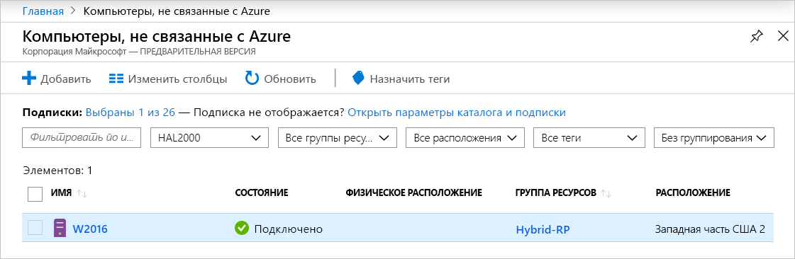
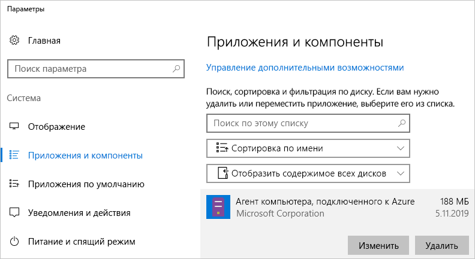

# <a name="quickstart-connect-machines-to-azure-using-azure-arc-for-servers---portal"></a>Краткое руководство. Подключение компьютеров к Azure с помощью Azure Arc для серверов на портале

Если у вас еще нет подписки Azure, [создайте бесплатную учетную запись Azure](https://azure.microsoft.com/free/?WT.mc_id=A261C142F), прежде чем начинать работу.

## <a name="prerequisites"></a>Предварительные требования

Ознакомьтесь со сведениями о поддерживаемых клиентах и требуемой конфигурации сети в [обзоре решения Azure Arc для серверов](overview.md).

## <a name="generate-the-agent-install-script-using-the-azure-portal"></a>Создание скрипта установки агента с помощью портала Azure

1. Запустите [https://aka.ms/hybridmachineportal](https://aka.ms/hybridmachineportal)
1. Щелкните **+Добавить**.
1. Выполните все указания мастера.
1. На последней странице создается скрипт, который можно скопировать (или скачать).

Скрипт необходимо выполнить на целевом компьютере, к которому нужно подключиться. Он скачивает агент, устанавливает его и подключает компьютер в рамках единой операции.

На серверах, не относящихся к Azure, которыми вы хотите управлять, сделайте следующее:

1. Войдите на сервер (с помощью удаленного взаимодействия через SSH, RDP или PowerShell).
1. Запустите оболочку: bash в Linux или PowerShell от имени администратора в Windows.
1. Вставьте скрипт с портала и выполните его на сервере, чтобы подключиться к Azure.
1. Для подключения отдельного сервера выполняется *интерактивная* проверка подлинности (по умолчанию) с использованием имени для входа устройства Azure. При запуске скрипта вы увидите примерно следующее сообщение:

  ```none
  To sign in, use a web browser to open the page https://microsoft.com/devicelogin and enter the code B3V3NLWRF to authenticate.
  ```
  
   Откройте браузер и введите код для проверки подлинности. Браузер не должен работать на подключаемом сервере, он может находиться на другом компьютере, например на ноутбуке.

1. Если вы хотите выполнять проверку подлинности в неинтерактивном режиме, выполните действия, описанные в разделе [Создание субъекта-службы для масштабного подключения](quickstart-onboard-powershell.md#create-a-service-principal-for-onboarding-at-scale), и измените скрипт, созданный на портале.

> [!NOTE]
> Если вы используете Internet Explorer на сервере для первого входа в систему, произойдет ошибка. Вы можете просто снова открыть браузер и повторить попытку.

## <a name="execute-the-script-on-target-nodes"></a>Выполнение скрипта на целевых узлах

Войдите в каждый узел и выполните скрипт, созданный на портале. После успешного завершения скрипта перейдите на портал Azure и убедитесь, что сервер успешно подключен.



## <a name="clean-up"></a>Очистка

Чтобы отключить компьютер от Azure Arc для серверов, необходимо выполнить два действия:

1. Выберите компьютер на [портале](https://aka.ms/hybridmachineportal), щелкните многоточие (`...`) и выберите команду **Удалить**.
1. Удалите агент с компьютера.

   В Windows для удаления агента можно использовать панель управления "Приложения и возможности".
  
  

   Если для удаления вам нужен скрипт, используйте приведенный ниже пример, который получает **PackageId**, и удалите агент с помощью команды `msiexec /X`.

   Откройте раздел реестра `HKEY_LOCAL_MACHINE\Software\Microsoft\Windows\CurrentVersion\Uninstall` и найдите параметр **PackageId**. Затем можно удалить агент с помощью команды `msiexec`.

   В приведенном ниже примере показано удаление агента.

   ```powershell
   Get-ChildItem -Path HKLM:\Software\Microsoft\Windows\CurrentVersion\Uninstall | `
   Get-ItemProperty | `
   Where-Object {$_.DisplayName -eq "Azure Connected Machine Agent"} | `
   ForEach-Object {MsiExec.exe /Quiet /X "$($_.PsChildName)"}
   ```

   В Linux выполните приведенную ниже команду, чтобы удалить агент.

   ```bash
   sudo apt purge hybridagent
   ```

## <a name="next-steps"></a>Дополнительная информация

> [!div class="nextstepaction"]
> [Назначение политики подключенным компьютерам](../../governance/policy/assign-policy-portal.md)