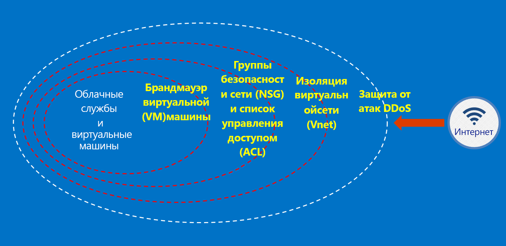

# Azure в Австралии

В 2014 году Azure был запущен в двух регионах Австралии: Восточная Австралия (Сидней) и Юго-Восточная Австралия (Мельбурн). В апреле 2018 года были запущены два новых региона Azure, расположенных в Канберре (Центральная Австралия и Центральная Австралия 2). Регионы Центральная Австралия и Центральная Австралия 2 разработаны для удовлетворения потребностей правительственной и критически важной национальной инфраструктуры и предлагают специализированные возможности подключения и гибкость, позволяя размещать системы вне облака. При этом их уровни безопасности и отказоустойчивости соответствуют секретным зашифрованным сетям. Azure для Австралии — это платформа для цифрового преобразования правительственной и критически важной национальной инфраструктуры, которая является единственным доступным в Австралии облачным хранилищем, специально предназначенным для этих целей.

Правительство Австралии выдвигает специальные требования для подключения, использования и работы на платформе [Microsoft Azure для Австралии](https://azure.microsoft.com/global-infrastructure/australia/) для соответствующих данных и систем. На этой странице приведены ресурсы, где содержатся применимые ко всем клиентам общие рекомендации с особым акцентом на безопасность настройки и эксплуатации.

Обратитесь к странице для Австралии на [Портале служб защиты данных (Майкрософт)](https://aka.ms/au-irap) для получения текущей информации об оценках, сертификации и включении в список сертифицированных облачных служб (CCSL) по программе Azure Australia Information Security Registered Assessor (IRAP). На странице для Австралии вы также найдете другие рекомендации корпорации Майкрософт, специально предназначенные для поставщиков правительственной, критически важной инфраструктуры.

## Принципы обеспечения безопасности данных клиента на платформе Azure для Австралии

Azure для Австралии предоставляет набор функций и служб, позволяющих создать облачные решения, соответствующие требованиям в отношении данных, подлежащих регулированию и контролю. Соответствующее требованиям клиента решение — это всего лишь эффективная реализация готовых возможностей Azure для Австралии наряду с обеспечением надежной защиты данных.

При размещении решения в Azure для Австралии корпорация Майкрософт обрабатывает многие из этих требований на уровне инфраструктуры облака.

На приведенной ниже схеме показана модель эшелонированной защиты. Например, корпорация Майкрософт обеспечивает базовую облачную инфраструктуру для защиты от атак DDOS, а также такие клиентские возможности, как использование устройств безопасности или служб DDOS высокого уровня для предотвращения атак DDOS в приложениях.

В этих статьях описываются основные принципы защиты служб и приложений, а также рекомендации по применению этих принципов. Другими словами, в них вы узнаете, каким образом эффективно использовать Azure для Австралии, чтобы соблюдать обязательства и обязанности, предусмотренные в рамках решения для обработки конфиденциальных правительственных данных.

Для правительственных ведомств Австралии, переходящих на использование Azure, существует две категории документации.

## Безопасность в Azure в Австралии

Ключевыми элементами, которые необходимо реализовать, являются идентификация, управление доступом на основе ролей, защита данных с помощью шифрования и управления правами, эффективный мониторинг и контроль конфигурации. В этом разделе содержится цикл статей, посвященных встроенным возможностям Azure и их связи с ISM и ASD Essential 8.

Эти статьи доступны в меню *Основные понятия -> Безопасность в Azure в Австралии*.

## Шлюзы в Azure в Австралии

Еще одним ключевым этапом для правительственных учреждений является реализация возможностей обеспечения безопасности периметра. Эти возможности называются защищенными шлюзами Интернета (SIG). При использовании Azure вы обязаны обеспечить эту защиту. Корпорация Майкрософт не управляет SIG. Однако, объединяя наши пограничные сетевые службы, которые защищают всех клиентов, и конкретные службы, развернутые в вашей среде Azure, вы можете использовать схожие функции.

Доступ к этим статьям можно получить через меню в разделе *Основные понятия -> Шлюзы в Azure в Австралии*.

## Дополнительная информация

* Если вы сосредоточены на защите ваших данных в Azure, ознакомьтесь со статьей [Data security in Azure Australia](secure-your-data.md) (Безопасность данных в Azure для Австралии).
* Если основное внимание уделяется созданию шлюза в Azure, ознакомьтесь со статьей [Gateway logging, auditing, and visibility in Azure Australia](gateway-log-audit-visibility.md) (Ведение журнала, аудит и видимость шлюза в Azure для Австралии).
