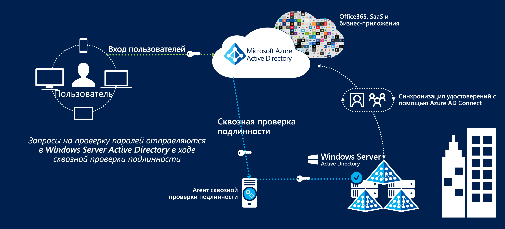
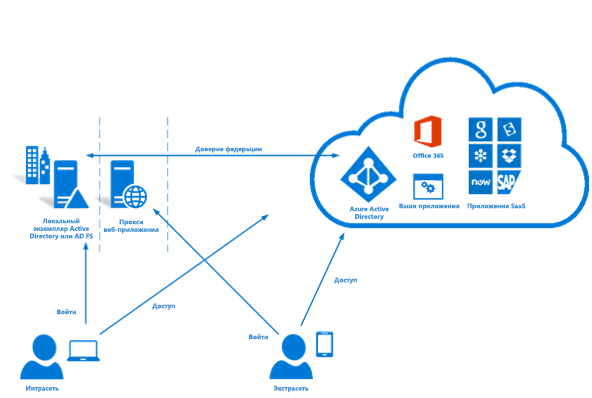

# Федерация удостоверений в Azure для Австралии

Управление удостоверениями и федерация с общедоступными облачными предложениями — это одни из важнейших аспектов организации работы в облаке. Служба Microsoft Azure Active Directory хранит сведения о пользователе, обеспечивая доступ к облачным службам, а регистрация в ней является предварительным условием для использования других служб Azure.

В этой статье рассматриваются ключевые аспекты реализации Azure Active Directory, синхронизации пользователей из домена доменных служб Active Directory и реализации безопасной проверки подлинности. Особое внимание уделяется рекомендациям из руководства по информационной безопасности Австралийского центра кибербезопасности (ACSC) и отчетов о сертификации Azure.

Классификация информации, хранящейся в Azure Active Directory, определяет способ организации данных. Ниже приводится выдержка из [Отчета ACSC о сертификации — Microsoft Azure](https://aka.ms/au-irap).

>**Отчет ACSC о сертификации — Microsoft Azure**. Azure Active Directory (Azure AD) необходимо настроить с помощью служб федерации Active Directory в случае, если австралийские организации регламентируют использование и классифицируют данные, хранимые в Active Directory, как относящиеся к уровню классификации PROTECTED (Защищено). Хотя данные, хранимые в Active Directory и классифицируемые как данные общего пользования (UNCLASSIFIED), не требуют создания федерации, австралийские организации могут реализовать модель федерации, чтобы снизить риски, связанные со службами, которые находятся за пределами Австралии.

Таким образом, двумя основными вопросами, рассматриваемыми в этой статье, являются данные, подлежащие синхронизации, и механизм проверки подлинности пользователей.

## Основные рекомендации по проектированию

### Синхронизация пользователей

При развертывании Azure AD Connect необходимо принять несколько решений о данных, которые будут синхронизироваться. Средство Azure AD Connect основано на решениях Microsoft Identity Manager. Оно предоставляет ряд полезных функций для [преобразования данных](https://docs.microsoft.com/azure/active-directory/hybrid/how-to-connect-sync-best-practices-changing-default-configuration) при их передаче между каталогами.

Консультационная служба корпорации Майкрософт может выполнить оценку рисков установленной у вас службы Windows Server Active Directory в рамках Программы оценки рисков Active Directory (ADRAP). Оценка ADRAP поможет обнаружить проблемы, которые, возможно, потребуется устранить, прежде чем выполнять синхронизацию с Azure Active Directory. Соглашения о поддержке Microsoft Premier, как правило, предусматривают эту услугу.

Перед синхронизацией с Azure AD локальный домен Active Directory сканируется на наличие возможных проблем помощью [средства IDFix](https://docs.microsoft.com/office365/enterprise/install-and-run-idfix). Сканирование средством IDFix — важный подготовительный этап перед реализацией Azure AD Connect. В ходе сканирования может быть обнаружено большое количество проблем, но многие из них можно устранить с помощью скриптов или преобразования данных в Azure AD Connect.

Для включения проверки подлинности в Azure AD требуется, чтобы у пользователей был внешний маршрутизируемый домен верхнего уровня. Если в домене есть суффикс имени участника-пользователя, который не допускает внешнюю маршрутизацию, необходимо задать [альтернативный идентификатор входа](https://docs.microsoft.com/azure/active-directory/hybrid/plan-connect-userprincipalname) в AD Connect для атрибута электронной почты пользователя. В результате пользователи выполняют вход в службы Azure с помощью адреса электронной почты, а не доменного имени участника-пользователя.

Суффикс имени участника-пользователя в учетных записях пользователей можно также изменить с помощью таких средств, как PowerShell, но при этом могут возникнуть непредвиденные последствия для других подключенных систем, поэтому такой способ больше не рекомендуется.

При принятии решения о том, какие атрибуты синхронизировать с Azure Active Directory, безопаснее всего сделать все атрибуты обязательными. В службе редко хранятся данные, классифицируемые как защищенные (PROTECTED), но провести аудит все же рекомендуется. Если в службе содержатся такие данные, оцените возможное влияние, связанное с неиспользованием или преобразованием определенного атрибута. См. руководство со списком атрибутов, [требуемых](https://docs.microsoft.com/azure/active-directory/hybrid/reference-connect-sync-attributes-synchronized) для Облачных служб Microsoft.

### Аутентификация

Важно понимать доступные варианты и способы их реализации для обеспечения безопасности пользователей.
Корпорация Майкрософт предлагает [три собственных решения](https://docs.microsoft.com/azure/active-directory/hybrid/plan-connect-user-signin) для аутентификации пользователей в Azure Active Directory:

* Синхронизация хэшей паролей. Хэшированные пароли из доменных служб Active Directory синхронизируются в Azure Active Directory с помощью Azure AD Connect.
* [Сквозная проверка подлинности](https://docs.microsoft.com/azure/active-directory/hybrid/how-to-connect-pta). Пароли хранятся в доменных службах Active Directory. Проверка подлинности выполняется по данным из доменных служб Active Directory с помощью агента. В Azure AD пароли не хранятся.
* [Федеративный единый вход](https://docs.microsoft.com/azure/active-directory/hybrid/how-to-connect-fed-whatis). Во время входа создается федерация Azure Active Directory со службами федерации Active Directory (AD FS) и Azure направляет пользователей в службы федерации Active Directory (AD FS) для проверки подлинности. В Azure AD пароли не хранятся.

Синхронизацию хэшей паролей можно использовать в сценариях с классификацией OFFICIAL: (Официально), когда конфиденциальные и не конфиденциальные данные хранятся в службе. Для сценариев с хранением защищенных данных необходимо использовать один из двух оставшихся вариантов.

Все три варианта поддерживают [обратную запись паролей](https://docs.microsoft.com/azure/active-directory/authentication/concept-sspr-writeback), которую в [рекомендациях ACSC для пользователей](https://aka.ms/au-irap) рекомендуется отключить. Но организациям следует оценить риск отключения компонента обратной записи паролей в контексте повышения производительности и сокращения поддержки самостоятельного сброса пароля.

#### Сквозная проверка подлинности (PTA)

Функция сквозной проверки подлинности была реализована уже после выхода правительственной программы по оценке рисков информационной безопасности (IRAP), поэтому нужно отдельно оценивать то, насколько это решение соответствует профилю риска вашей организации. Сквозная проверка подлинности предпочтительнее федерации корпорации Майкрософт из-за улучшенного подхода к безопасности.

При реализации сквозной проверки подлинности необходимо учесть ряд факторов:

* Агент сквозной проверки подлинности должен иметь возможность устанавливать исходящие подключения к Облачным службам Microsoft.
* Потребуется установка нескольких агентов, чтобы обеспечить высокий уровень доступности службы. Рекомендуется развернуть не менее 3 и не более 12 агентов.
* Рекомендуется избегать установки агента непосредственно на контроллерах домена Active Directory. При развертывании Azure AD Connect со сквозной проверкой подлинности агент по умолчанию устанавливается на сервер Azure AD Connect.
* Сквозная проверка подлинности не требует такого обслуживания, как службы федерации Active Directory (AD FS), так как для нее не нужны отдельная серверная инфраструктура, управление сертификатами или правила брандмауэра для входящих подключений.

#### Службы федерации Active Directory (AD FS)

Службы федерации Active Directory (AD FS) были добавлены в программу оценки IRAP и утверждены для использования в защищенных средах.

При реализации служб федерации Active Directory (AD FS) необходимо учесть ряд факторов:

* Для служб федерации требуется входящий трафик по протоколу HTTPS из Интернета или на минимальное число конечных точек службы Майкрософт.
* Службы федерации используют инфраструктуру открытых ключей (PKI) и сертификаты, что предполагает текущее управление и обновление.
* Службы федерации должны быть развернуты на выделенных серверах. Они требуют соответствующей сетевой инфраструктуры, обеспечивающей безопасный внешний доступ.

### Многофакторная идентификация (MFA)

В разделе руководства по информационной безопасности, посвященном многофакторной проверке подлинности, эту функцию рекомендуется реализовать в следующих сценариях на основе профиля риска:

* проверка подлинности обычных пользователей;
* проверка подлинности привилегированных учетных записей;
* проверка подлинности при удаленном доступе пользователей;
* пользователи, выполняющие привилегированные действия.

Azure Active Directory позволяет реализовать многофакторную проверку подлинности, которую можно включить для всех пользователей или группы пользователей (например, только для пользователей с привилегированными учетными записями). Корпорация Майкрософт также предоставляет решение под названием "Условный доступ", позволяющее избирательней контролировать использование многофакторной проверки подлинности (например, только при входе пользователей с удаленных IP-адресов определенных диапазонов).

Многофакторная идентификация Azure поддерживает следующие способы подтверждения, которые предусмотрены руководством по информационной безопасности:

* Телефонный звонок
* текстовое сообщение;
* приложение Microsoft Authenticator;
* поддерживаемые токены оборудования.

Azure Active Directory Privileged Identity Management — это компонент Azure Active Directory, позволяющий принудительно применять многофакторную проверку подлинности, когда пользователи повышают уровень своих разрешений, что обеспечивает соответствие четвертой рекомендации.

## Дополнительная информация

См. также об [управлении доступом на основе ролей и управлении привилегированными пользователями](role-privileged.md)
