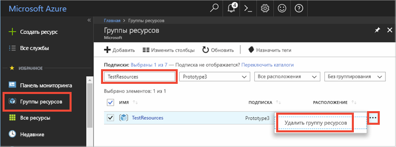

# <a name="quickstart-use-azure-cache-for-redis-with-java"></a>Краткое руководство. Использование кэша Azure для Redis с приложениями Java

Из этого краткого руководства вы узнаете, как реализовать кэш Azure для Redis в приложении Java с помощью клиента Redis [Jedis](https://github.com/xetorthio/jedis) для обеспечения доступа к защищенному выделенному кэшу, к которому может обращаться любое приложение в Azure.

## <a name="prerequisites"></a>Предварительные требования

- Подписка Azure — [создайте бесплатную учетную запись](https://azure.microsoft.com/free/).
- [Apache Maven](https://maven.apache.org/download.cgi)

## <a name="create-an-azure-cache-for-redis"></a>Создание экземпляра кэша Redis для Azure

[!INCLUDE [redis-cache-create](../../includes/redis-cache-create.md)]

[!INCLUDE [redis-cache-access-keys](../../includes/redis-cache-access-keys.md)]

Добавление переменных среды для **ИМЯ_УЗЛА** и **Основного** ключа доступа. Вместо включения конфиденциальных данных непосредственно в код использоваться будут эти переменные из вашего кода.

```CMD 
set REDISCACHEHOSTNAME=contosoCache.redis.cache.windows.net
set REDISCACHEKEY=XXXXXXXXXXXXXXXXXXXXXXXXXXXXXXXXXXXXXXXXXXXX
```

## <a name="create-a-new-java-app"></a>Создание нового приложения Java

Используя Maven, создайте новое приложение.

```CMD
mvn archetype:generate -DarchetypeGroupId=org.apache.maven.archetypes -DarchetypeArtifactId=maven-archetype-quickstart -DarchetypeVersion=1.3 -DgroupId=example.demo -DartifactId=redistest -Dversion=1.0
```

Перейдите к каталогу нового проекта *redistest*.

Откройте файл *pom.xml* и добавьте зависимость для [Jedis](https://github.com/xetorthio/jedis):

```xml
    <dependency>
        <groupId>redis.clients</groupId>
        <artifactId>jedis</artifactId>
        <version>2.9.0</version>
        <type>jar</type>
        <scope>compile</scope>
    </dependency>
```

Сохраните файл *pom.xml* .

Откройте файл *App.java* и замените существующий код представленным ниже:

```java
package example.demo;

import redis.clients.jedis.Jedis;
import redis.clients.jedis.JedisShardInfo;

/**
 * Redis test
 *
 */
public class App 
{
    public static void main( String[] args )
    {

        boolean useSsl = true;
        String cacheHostname = System.getenv("REDISCACHEHOSTNAME");
        String cachekey = System.getenv("REDISCACHEKEY");

        // Connect to the Azure Cache for Redis over the SSL port using the key.
        JedisShardInfo shardInfo = new JedisShardInfo(cacheHostname, 6380, useSsl);
        shardInfo.setPassword(cachekey); /* Use your access key. */
        Jedis jedis = new Jedis(shardInfo);      

        // Perform cache operations using the cache connection object...

        // Simple PING command        
        System.out.println( "\nCache Command  : Ping" );
        System.out.println( "Cache Response : " + jedis.ping());

        // Simple get and put of integral data types into the cache
        System.out.println( "\nCache Command  : GET Message" );
        System.out.println( "Cache Response : " + jedis.get("Message"));

        System.out.println( "\nCache Command  : SET Message" );
        System.out.println( "Cache Response : " + jedis.set("Message", "Hello! The cache is working from Java!"));

        // Demonstrate "SET Message" executed as expected...
        System.out.println( "\nCache Command  : GET Message" );
        System.out.println( "Cache Response : " + jedis.get("Message"));

        // Get the client list, useful to see if connection list is growing...
        System.out.println( "\nCache Command  : CLIENT LIST" );
        System.out.println( "Cache Response : " + jedis.clientList());

        jedis.close();
    }
}
```

Этот код показывает, как подключиться к экземпляру кэша Redis для Azure, используя имя узла кэша и переменные среды ключа. Код также хранит строковое значение в кэше и извлекает его. Также выполняются команды `PING` и `CLIENT LIST`. 

Сохраните *App.java*.

## <a name="build-and-run-the-app"></a>Создание и запуск приложения

Выполните следующую команду Maven для построения и запуска приложения:

```CMD
mvn compile
mvn exec:java -D exec.mainClass=example.demo.App
```

В приведенном ниже примере видно, что ключ `Message` ранее содержал кэшированное значение, установленное через консоль Redis на портале Azure. Приложение обновило кэшированное значение. Кроме того, оно выполнило команды `PING` и `CLIENT LIST`.


## <a name="clean-up-resources"></a>Очистка ресурсов

При переходе к следующему руководству в нем можно использовать ресурсы, созданные в этом руководстве.

В противном случае, если вы закончите работу с примером приложения из краткого руководства, вы можете удалить ресурсы Azure, созданные в текущем руководстве, чтобы избежать ненужных расходов. 

> [!IMPORTANT]
> Удаление группы ресурсов — необратимая операция, и все соответствующие ресурсы удаляются окончательно. Будьте внимательны, чтобы случайно не удалить не ту группу ресурсов или не те ресурсы. Если ресурсы для размещения этого примера созданы в имеющейся группе ресурсов, содержащей ресурсы, которые следует сохранить, можно удалить каждый ресурс отдельно в соответствующих колонках вместо удаления группы ресурсов.
>

1. Войдите в портал [Azure](https://portal.azure.com) и выберите**Группы ресурсов**.

1. Введите имя группы ресурсов в текстовое поле **Фильтровать по имени**. В инструкциях в этой статье использовалась группа ресурсов с именем *TestResources*. В своей группе ресурсов в списке результатов выберите **...** , а затем **Удалить группу ресурсов**.

   

1. Подтвердите операцию удаления группы ресурсов. Введите имя группы ресурсов, которую необходимо удалить, и нажмите **Удалить**.

Через некоторое время группа ресурсов и все ее ресурсы будут удалены.

## <a name="next-steps"></a>Дополнительная информация

Из этого краткого руководства вы узнали, как использовать кэш Redis для Azure в приложениях Java. Переходите к следующему краткому руководству по использованию кэша Redis для Azure в веб-приложении ASP.NET.

> [!div class="nextstepaction"]
> [Создание веб-приложения ASP.NET, в котором используется кэш Azure для Redis](./cache-web-app-howto.md)
